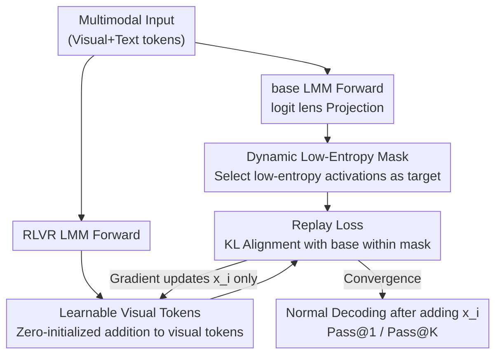

# Boosting Reasoning in Large Multimodal Models via Activation Replay

**Conference**: CVPR2026  
**arXiv**: [2511.19972](https://arxiv.org/abs/2511.19972)  
**Code**: https://github.com/latentcraft/replay.git  
**Area**: Multimodal VLM / LLM Reasoning / Reinforcement Learning  
**Keywords**: RLVR, Activation Replay, Low-entropy Activation, Logit Lens, Test-time Optimization

## TL;DR
The authors use logit lens to discover that RLVR post-training "excessively" perturbs low-entropy input activations of large multimodal models (LMMs). They propose Activation Replay, a training-free test-time method that optimizes a set of learnable visual tokens to pull the low-entropy activations of the RLVR model back to the base model's distribution, achieving consistent gains across mathematics, o3-style visual agents, and video reasoning.

## Background & Motivation

**Background**: Reinforcement Learning from Verifiable Rewards (RLVR) has become a mainstream post-training technique for eliciting reasoning capabilities in large multimodal models (LMMs). It strengthens models on difficult tasks like mathematics, agentic tasks, and video reasoning through rule-based rewards and long chains-of-thought. However, existing research primarily focuses on "data composition, reward design, and training stability," with almost no explanation of **what RLVR actually changes inside the model**.

**Limitations of Prior Work**: Reasoning in LMMs highly depends on **input activations**—the multimodal context composed of visual and text tokens serves as the "foundation" for subsequent long decoding. if RLVR silently distorts this foundation, further reward design is akin to building on a slanted base. Previously, no work has systematically characterized the impact of RLVR on input activations.

**Key Challenge**: Using the logit lens to project activations back to the vocabulary space, the authors observe that top predictions for the **same input** shift significantly before and after RLVR. By quantifying KL divergence across buckets of the base model's activation entropy, they discover an counter-intuitive phenomenon: **low-entropy activations (which should be stable) are perturbed more heavily by RLVR, while high-entropy activations are less affected**. Existing works emphasize that a few high-entropy tokens are responsible for "exploration/branching," while the role of low-entropy activations has been largely overlooked.

**Goal**: (1) Clarify the respective roles of low-entropy vs. high-entropy input activations in multimodal reasoning; (2) Determine if the harmful bias in low-entropy activations caused by RLVR can be corrected **without retraining**.

**Key Insight**: Through perturbation studies (adding noise to inputs and observing how PPL for correct/incorrect answers changes with low-entropy KL drift) and intervention studies (directly injecting base low-entropy activations into the RLVR forward pass), it is proven that "making RLVR low-entropy activations closer to the base" benefits reasoning.

**Core Idea**: Instead of rerunning expensive policy optimization, one can **manipulate only visual tokens** at test-time to indirectly force the low-entropy input activations of the RLVR model to "replay" (mimic) the distribution of the paired base model.

## Method

### Overall Architecture
Activation Replay is a **test-time, training-free** debiasing pipeline targeting a pair of models—an RLVR post-trained model and its corresponding base model. The intuition is that the base model's low-entropy activations serve as a "clean reference." If RLVR deviates from this, the RLVR low-entropy activations are pulled back to the reference distribution before normal decoding.

Specifically, the same multimodal input is fed to both base and RLVR models. On the base side, logit lens projects activations at low-entropy positions to the vocabulary space to serve as target distributions. On the RLVR side, a set of zero-initialized learnable tokens $x_i$ is added to the visual tokens. Through gradient descent, only these tokens are optimized so that the RLVR distribution at **positions selected by a low-entropy mask** matches the base target distribution. Once optimization converges, $x_i$ is added back to the input for standard greedy or sampled decoding. The model weights remain frozen throughout.

### Key Designs

**1. Insight on Selective Perturbation: RLVR Targets Low-Entropy Activations**

This is the foundation of the method. The authors first use the logit lens to project the $i$-th activation of layer $l$ into the vocabulary space $p_{l,i}=\mathrm{softmax}(\mathcal{V}(\mathcal{N}(h_{l,i})))$, defining activation entropy $e_{l,i}=-p_{l,i}\cdot \log(p_{l,i})$ as a proxy for uncertainty. When comparing differences between base and RLVR models on **identical inputs**, shifts in top predictions are observed, but top-prediction consistency does not imply distributional consistency. Thus, token-level KL divergence $D_{kl}(P_{base}\|P_{rlvr})=\sum p_{l,i}^{b}\log\frac{p_{l,i}^{b}}{p_{l,i}^{r}}$ is used and bucketed by base entropy quantiles. The conclusion is that KL drift in low-entropy activations is significantly larger than in high-entropy ones. Perturbation studies further show that smaller KL drift in low-entropy activations correlates with lower PPL for correct answers and higher PPL for incorrect ones—meaning pulling low-entropy activations back to base "rewards correctness and punishes errors." This discovery transforms "which activations to correct" from a blind search into a targeted operation.

**2. Learnable Visual Tokens: Indirect Correction at the Input Layer**

In intervention studies, the authors attempted the most direct approach—hard-coding base low-entropy activations into the RLVR forward pass. While effective in some cases (see table below), the representation spaces of base and RLVR models have diverged significantly. Hard injection "tears" the RLVR representation, limiting gains and making it an unreliable training-free solution. Activation Replay instead operates at the input layer: introducing zero-initialized learnable tokens $\{x_1,\dots,x_n\}$ added to visual inputs as $\hat{h}_{0,i}^{r}=h_{0,i}^{r}+x_i$. This allows all corrections to propagate naturally through the model's own forward pass rather than crudely replacing intermediate activations, respecting the RLVR representation structure while converging on a low-dimensional, optimizable small perturbation.

**3. Dynamic Low-Entropy Mask: Precision Targeting**

Since only low-entropy activations should be pulled back, a mechanism is needed to determine which activations are "low-entropy." The authors use a dynamic threshold: the maximum entropy of a layer's activations in the base model multiplied by a coefficient $\tau$, such that $M_{l,i}=1$ if $e_{l,i}^{b}<\max(h_l^{b})\cdot\tau$, else 0. Compared to fixed thresholds from a held-out validation set, the dynamic threshold adapts to the entropy scale of each layer and is simpler to implement. The authors found both achieved comparable results and chose the dynamic version. This mask ensures optimization only affects low-entropy positions without touching the high-entropy tokens responsible for exploration—as intervention studies showed that replacing high-entropy activations with base ones significantly degrades performance.

**4. Replay Loss: KL Alignment with Base Targets**

With the target (base low-entropy distribution), the mechanism (learnable tokens), and the scope (low-entropy mask), the three are combined into a test-time optimization objective: $\bm{x}_i\leftarrow\bm{x}_i-\alpha\nabla_{\bm{x}_i}(D_{kl}(P_{base}\|P_{rlvr})\cdot M_i)$, where $\alpha$ controls the alignment strength to the base. The loss only calculates KL at positions where $M_i=1$, and gradients only backpropagate to $x_i$ without touching model weights. After optimization converges, $x_i$ is added back to the input for decoding. Whether evaluating Pass@1 (greedy) or Pass@K (sampling), this debiasing step is performed first. Essentially, it implements "replaying base low-entropy activations" as a lightweight input-side gradient inner loop.

### Loss & Training
The sole optimization objective is the masked KL divergence mentioned above. Hyperparameters include the threshold coefficient $\gamma$ (i.e., $\tau$) and alignment strength $\alpha$, determined via a small grid search. As it introduces no additional training data or weight updates, it is a strictly training-free test-time method.

## Key Experimental Results

### Intervention Study (Motivation Validation, Table 1)
Injecting base low-entropy activations into RLVR (Low) vs. injecting base high-entropy activations (High) on MathVerse(ME)/MathVision(MN)/WeMath(WM):

| Model | Strategy | ME | MN | WM |
|------|------|----|----|----|
| MM-Eureka | RLVR | 45.1 | 30.6 | 36.8 |
| MM-Eureka | Low (Inject base low-entropy) | 45.1 | 31.6 ↑ | 36.6 |
| MM-Eureka | High (Inject base high-entropy) | 42.1 ↓ | 27.6 ↓ | 32.8 ↓ |
| VL-Rethinker | RLVR | 47.0 | 30.3 | 34.8 |
| VL-Rethinker | Low | 47.5 ↑ | 33.5 ↑ | 35.3 ↑ |
| VL-Rethinker | High | 44.4 ↓ | 29.7 ↓ | 34.3 ↓ |

Injecting low-entropy activations generally maintains or improves performance, while high-entropy injection causes universal decline, confirming that "low-entropy should be corrected, high-entropy should be preserved."

### Main Results: Mathematical Reasoning (Table 2, 7B/32B Selection)
Gains after adding `+ replay` to multiple RLVR models across 8 benchmarks (ME/MN/MA/DM/WM/LV/MU/MP):

| Model | ME | MN | MA | WM | LV | MU |
|------|----|----|----|----|----|----|
| MM-Eureka-Qwen-7B | 45.1 | 30.6 | 73.0 | 36.8 | 49.2 | 58.7 |
| + replay | 47.7 ↑2.6 | 31.5 ↑0.9 | 73.5 ↑0.5 | 38.0 ↑1.2 | 51.0 ↑1.8 | 62.0 ↑3.3 |
| VL-Rethinker-7B | 47.0 | 30.3 | 72.0 | 34.8 | 46.1 | 58.7 |
| + replay | 49.2 ↑2.2 | 33.2 ↑2.9 | 72.4 ↑0.4 | 36.7 ↑1.9 | 49.7 ↑3.8 | 60.0 ↑1.3 |
| MM-Eureka-Qwen-32B | 50.5 | 35.2 | 72.1 | 36.9 | 52.8 | 59.3 |
| + replay | 52.4 ↑1.9 | 35.5 ↑0.3 | 74.0 ↑1.9 | 37.6 ↑0.7 | 54.6 ↑1.8 | 63.2 ↑3.9 |

Gains range between 0.3~3.9, and the method remains effective for stronger 32B models, indicating that correction benefits are not limited to weak models.

### Agentic Reasoning (Table 3) and Video Reasoning (Table 4)
- DeepEyes-7B (o3-style multi-turn visual search) on HRBench/VisualProbe: H4 53.7→56.3 (↑2.6), VM 82.1→84.7 (↑2.6).
- Video-R1-7B (16-frame video reasoning): VideoMMMU 49.8→53.8 (↑4.0), VideoHolmes 36.5→40.9 (↑4.4).

### Ablation Study (Table 5, MathVerse Vision Only)
Grid search on threshold coefficient $\gamma$ and alignment strength $\alpha$ (Baseline is the respective RLVR model):

| Model | $\gamma$ | $\alpha$=10 | $\alpha$=20 | $\alpha$=40 |
|------|------|------|------|------|
| MMR1-Math | 0.4 | 43.3 ↑2.2 | 41.8 ↑0.7 | 42.1 ↑1.0 |
| MMR1-Math | 0.2 | 42.3 ↑1.2 | 42.5 ↑1.4 | 40.7 ↓0.4 |
| MM-Eureka | 0.2 | 45.4 ↑0.3 | 46.1 ↑1.0 | 47.7 ↑2.6 |
| MM-Eureka | 0.4 | 47.1 ↑2.0 | 47.5 ↑2.4 | 46.5 ↑1.4 |

### Key Findings
- The intervention study is the most persuasive part of the paper: the asymmetry in the roles of low-entropy vs. high-entropy activations directly determines the "correct only low-entropy" design.
- Activation Replay also improves Pass@K (Figure 6), alleviating the known issue where RLVR increases Pass@1 but often sacrifices Pass@K diversity by narrowing the reasoning coverage.
- Hyperparameters are relatively robust: most $\gamma/\alpha$ combinations yield positive gains, though excessively large $\alpha$ (e.g., 40 with small $\gamma$) occasionally causes drops, indicating that over-aggressive alignment can excessively squash the RLVR model's own distribution.

## Highlights & Insights
- **Quantifying "what RLVR changed" via logit lens**: Mapping abstract post-training impacts to token-level KL and entropy buckets yielding the counter-intuitive yet actionable conclusion that "low-entropy is perturbed more" is the cleverest aspect of this work.
- **Training-free + Input-only**: Improving performance just by adding a small gradient-optimized perturbation to visual tokens without touching weights or running RL involves minimal deployment costs and can be applied to any off-the-shelf RLVR model.
- **Transferable "Replay Reference Distribution" approach**: The base↔RLVR pairing of "original reference vs. post-fine-tuning shift" exists in many post-training scenarios. Using low-dimensional learnable perturbations to pull activations back to a reference instead of hard-replacing activations is a universal debiasing paradigm.
- **Addressing the RLVR coverage controversy**: Improving Pass@K alongside Pass@1 provides a means to mitigate the debate over whether RLVR is merely reranking existing capabilities.

## Limitations & Future Work
- **Strong dependence on paired base models**: The method requires access to the base model weights corresponding to the RLVR model for reference; closed-source or models released only in RLVR versions cannot utilize this.
- **Extra inference overhead**: Every sample requires a round of test-time gradient optimization (dual base + RLVR forward passes + inner loop) before decoding. The text acknowledges additional inference time costs (details in appendix), requiring a trade-off in high-throughput scenarios.
- **Correlation rather than causal explanation**: While perturbation/intervention studies show that pulling back low-entropy activations helps reasoning, the paper does not provide a training dynamics explanation for *why* RLVR specifically perturbs low-entropy activations. ⚠️ Optimal threshold/hyperparameter values vary across models; directly applying the same $\gamma/\alpha$ across models does not guarantee optimality.
- Future directions: Distill the test-time inner loop into a single-forward lightweight adapter, or integrate "low-entropy debiasing" directly into the RLVR training objective to eliminate test-time optimization.

## Related Work & Insights
- **vs. High-entropy fork-token studies (Qwen fork-token)**: They emphasize high-entropy tokens as responsible for exploration/branching reasoning paths. This paper completes the picture—low-entropy activations are also critical and are biased by RLVR. The conclusions are complementary, leading to the design "correct low-entropy, preserve high-entropy."
- **vs. Direct cross-model activation injection (Intervention study baseline)**: Directly injecting base activations into RLVR forward passes is occasionally effective but destabilizes the RLVR representation space; Activation Replay uses input-layer learnable tokens to achieve indirect alignment, which is more stable and general.
- **vs. Conventional RLVR post-training recipes (MM-Eureka / VL-Rethinker / Video-R1, etc.)**: These "train" reasoning through data + rewards + policy optimization. Ours does not train; it debiases at test-time, making it orthogonal and stackable on top of these models for further gains.

## Rating
- Novelty: ⭐⭐⭐⭐⭐ Reveals selective perturbation of low-entropy activations via logit lens and designs training-free debiasing accordingly.
- Experimental Thoroughness: ⭐⭐⭐⭐ Covers math/agent/video scenarios, multiple models/scales + Pass@K + intervention/ablations; extensive but somewhat empirical, lacking deeper causal analysis.
- Writing Quality: ⭐⭐⭐⭐ Clear progression from motivation to experiments to method; formulas and figures are well-integrated.
- Value: ⭐⭐⭐⭐ Training-free, plug-and-play, and stackable on existing RLVR models; high practical value (limited by base model requirement + inference overhead).

<!-- RELATED:START -->

## Related Papers

- [\[ICLR 2026\] ReWatch-R1: Boosting Complex Video Reasoning in Large Vision-Language Models through Agentic Data Synthesis](../../ICLR2026/vlm_reasoning/rewatch-r1_boosting_complex_video_reasoning_in_large_vision-language_models_thro.md)
- [\[AAAI 2026\] AStar: Boosting Multimodal Reasoning with Automated Structured Thinking](../../AAAI2026/vlm_reasoning/astar_boosting_multimodal_reasoning_with_automated_structure.md)
- [\[CVPR 2026\] Grounded Chain-of-Thought for Multimodal Large Language Models](grounded_chain-of-thought_for_multimodal_large_language_models.md)
- [\[CVPR 2026\] EduDiag: A Benchmark for Educational Diagnostic Reasoning with Error Tracing and Correction on Large Multimodal Models](edudiag_a_benchmark_for_educational_diagnostic_reasoning_with_error_tracing_and_.md)
- [\[CVPR 2026\] Breaking the Regional Perception Bottleneck of Multimodal Large Language Models via External Reasoning Framework](breaking_the_regional_perception_bottleneck_of_multimodal_large_language_models_.md)

<!-- RELATED:END -->
