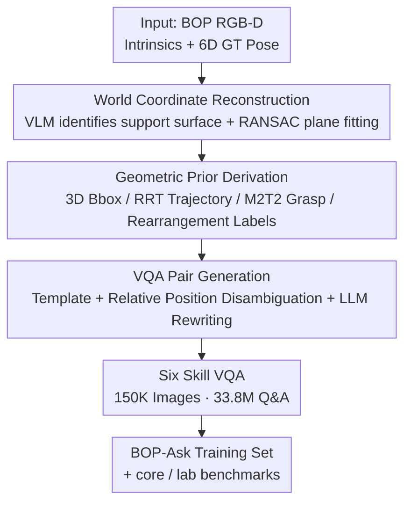

# BOP-Ask: Object-Interaction Reasoning for Vision-Language Models

**Conference**: CVPR 2026  
**arXiv**: [2511.16857](https://arxiv.org/abs/2511.16857)  
**Code**: https://bop-ask.github.io/ (Project Page)  
**Area**: Multimodal VLM / Embodied Spatial Reasoning / Robotics  
**Keywords**: Object Interaction Reasoning, 6D Pose, Grasping, Motion Planning, VQA Benchmark

## TL;DR
This paper automatically transforms the 6D object pose benchmark BOP into BOP-Ask, a large-scale object interaction reasoning dataset containing 150K images, 33.8M Q&A pairs, and covering six skill categories (pose/grasp/trajectory/rearrangement/spatial/depth). Fine-tuning open-source VLMs on this dataset significantly outperforms GPT-5 and Gemini on the in-house test set, generalizes to out-of-domain spatial reasoning benchmarks, and enables a real Franka robot to complete 10/15 pick-and-place tasks.

## Background & Motivation
**Background**: Current benchmarks for evaluating VLM spatial capabilities (EmbSpatial, RoboSpatial, SpatialRGPT, etc.) mostly focus on "high-level relationships"—whether A is to the left/behind B, or which is closer to the camera—and primarily consist of multiple-choice or yes/no questions. While scores on these benchmarks are impressive, they mask the fine-grained geometric understanding required for real-world robotic deployment.

**Limitations of Prior Work**: To utilize a VLM as a "perceptual interface" for embodied agents, knowing "the coffee can is on the left" is insufficient. The agent must know the **specific grasp points** (grasp pose), **how to move there while avoiding obstacles** (collision-free trajectory), and **which obstructing object to move first** (rearrangement order). Existing datasets either lack this executable information or use imprecise annotations like monocular depth estimation, which cannot support millimeter-level grasping or motion planning; large-scale datasets often lack object interaction tasks.

**Key Challenge**: It is difficult to simultaneously achieve precision, interaction completeness, and scale. Datasets with approximate annotations lack accuracy, precisely annotated datasets have narrow task coverage and small scales, and large-scale datasets lack interaction reasoning.

**Goal**: Construct a dataset that is "accurate (inheriting BOP ground truth 6D poses) + interaction-complete (from perception to execution) + large-scale and diverse," suitable for both training and evaluation, and upgrading answers from multiple-choice to **pixel-level coordinate outputs**.

**Key Insight**: BOP (Benchmark for Object Pose estimation) provides high-quality 3D ground truth poses and models but does not address object interactions. The authors observe that given precise 6D poses + 3D models + RGB-D, **interaction annotations such as grasping, trajectories, and rearrangement can all be geometrically derived automatically** without manual effort.

**Core Idea**: Treat the "pose benchmark" as a geometric gold mine. Use an automatic pipeline to derive fine-grained interaction labels (grasp, trajectory, rearrangement) from 6D poses, then utilize templates and LLMs to generate massive natural language VQA pairs, obtaining precise, large-scale interaction reasoning corpora with minimal human labor.

## Method

### Overall Architecture
BOP-Ask is an **automatic data generation pipeline: "pose data → geometric priors → VQA pairs."** The inputs are RGB-D images, camera intrinsics, and object 6D GT poses from the BOP series; the outputs are samples in the form $S=\langle I_k, Q_k, A_k, T_k \rangle$ (image, question, answer, task label). The pipeline aligns the scene to a unified world coordinate system, derives priors like grasping, trajectories, and rearrangement using geometric/planning algorithms, and finally translates these into linguistically diverse VQA pairs via templates and LLMs. Answers for pose/grasp/trajectory/rearrangement are unified as **ordered 2D keypoint lists** (pixel coordinates), while spatial/depth tasks use binary yes/no.

### Key Designs

**1. Six Object Interaction Skills: Decomposing "Perception → Execution" into a Task Spectrum**

Existing benchmarks primarily test relationship judgments (left/right/far/near), which is far from actual object manipulation. The authors define six skills covering the manipulation chain: ① **Object Pose Estimation**—predicting the 3D bounding cube (rather than the 2D box/point common in VLMs); ② **Grasp Estimation**—inferring stable 3D grasp poses; ③ **Inter-object Motion Prediction**—generating collision-free waypoints to move a source object toward a target; ④ **Object Rearrangement**—determining which obstructing objects to move first in cluttered scenes to reach a target; ⑤ **Spatial Reasoning** and ⑥ **Relative Depth Perception** (binary tasks). The value of this spectrum lies in unifying capabilities like grasp feasibility, collision-aware motion, and manipulation sequencing into automatically annotated, quantitatively evaluable VLM tasks.

**2. World Coordinate Reconstruction: Establishing a Reliable Gravity Direction**

Estimating the world Z-axis directly from cluttered objects is unreliable. The authors use a "pointing" VLM to locate planar support surfaces (e.g., table tops). For these 3D points, RANSAC is used to fit a plane, where the **plane normal $\mathbf{n}_p$ serves as the world-up direction**. Rodrigues' formula is then used to align the canonical up-axis $\mathbf{v}_z=[0,0,1]^\top$ to $\mathbf{n}_p$, and translation is solved to align the fitted plane with the world origin, yielding the camera-to-world transform ${}^{cam}T_{world}\in SE(3)$. This unified coordinate system ensures that subsequent grasping, trajectories, and bounding cubes are physically consistent.

**3. Automatic Derivation of Geometric Priors from 6D Poses: Zero Manual Annotation**

This is the core of leveraging poses for interaction labels. **Bounding cubes** are calculated from poses and model dimensions. **Motion trajectories** are generated using an RRT planner in 3D Cartesian space for every object pair ($\binom{n}{2}$ pairs) to create pick-and-place paths; paths intersecting with neighbor meshes are filtered, and redundant waypoints are smoothed via the Ramer–Douglas–Peucker algorithm. **Grasps** are calculated using the Transformer-based parallel-jaw model M2T2, retaining the top-5 grasps per object. Notably, **rearrangement labels** are generated by marking an object as "completely occluded/cluttered" if all predicted grasps collide with neighbors, defining the supervision for tasks requiring prior removal of other objects.

**4. Template + LLM VQA Generation and Instance Disambiguation**

To transform geometric priors into natural language, the authors render 3D models for VLMs to generate object descriptions (shape/color/utility, followed by human verification). Templates follow the structure `{TASK_TYPE} {OBJECT A} {OBJECT B}` with in-context examples for the LLM. To resolve multi-instance ambiguity where color/shape are insufficient, the authors calculate 3D box centers to assign relative position attributes (e.g., "leftmost"), which are injected into the template.

### Loss & Training
As this is a dataset paper, no new models or losses are introduced. Standard SFT is performed on Qwen-VL 2.5 and NVILA using official repositories. Key evaluation metrics: 3D IoU for poses; Success Rate (SR) for trajectories; Recall(%) for rearrangement; and Normalized Coordinate Error (NCE) for grasping:

$$\text{NCE}=\frac{1}{N}\sum_{i=1}^{N}\frac{\|p_i-\hat{p}_i\|_2}{d},$$

where $N=5$ (grasp center, left/right finger base, left/right fingertips) and $d$ is the gripper width.

## Key Experimental Results

### Main Results (BOP-Ask-core, 688 Human-Verified VQA pairs)
Fine-tuning significantly outperforms off-the-shelf VLMs, even surpassing human benchmarks in some categories:

| Model | Pose 3D IoU↑ | Trajectory SR↑ | Grasp NCE↓ | Spatial SR↑ | Depth SR↑ | Rearrange Recall%↑ |
|------|------|------|------|------|------|------|
| Human | 54.2 | 67.3 | 1.1 | 84.9 | 87.3 | 44.1 |
| GPT-5 | 9.0 | 0 | inf | 68.3 | 74.6 | 14.8 |
| Gemini Robotics-ER 1.5 | 24.4 | 43.0 | 4.2 | 84.2 | 88.0 | 48.9 |
| **NVILA (15B) - SFT** | **73.5** | **64.2** | **1.40** | **95.8** | 94.6 | **57.7** |
| **NVILA (2B) - SFT** | 77.4 | 50.8 | 1.69 | 94.2 | 94.6 | 56.4 |

Note: `inf` indicates no valid output. GPT-5 fails almost entirely on trajectory/grasping, highlighting that these skills are absent from general pre-training corpora.

### Ablation Study

**OOD Generalization (BOP-Ask-lab + Out-of-domain Spatial Benchmarks)**: Fine-tuning consistently provides gains. For example, NVILA + BOP-Ask improves scores on RS-H, CV-B, and SB.

**Data Recipe Ablation (NVILA incremental data)**:
- Adding each BOP sub-dataset (YCB-V, HANDAL, LineMOD) monotonically improves all six metrics, suggesting object geometry and layout diversity directly enhance fine-grained spatial generalization.
- Removing binary tasks (Spatial/Depth) reduces trajectory SR from 64.2 to 50.0, proving that these "simple" tasks strengthen interaction reasoning during multi-skill training.

## Key Findings
- **Data Diversity Gain**: Incorporating additional object subsets consistently boosts performance across the board.
- **Binary Task Synergy**: Simple spatial/depth questions serve as helpful auxiliary signals for complex trajectory tasks.
- **Rearrangement Hardness**: Even the best model achieves only ~57%, indicating that reasoning about object relationships in clutter remains a significant challenge.
- **Real-World Validation**: In 15 Franka pick-and-place tasks, the base NVILA achieved 0/15, while BOP-Ask SFT achieved 10/15.

## Highlights & Insights
- **Repurposing Precise Benchmarks is a Viable Methodology**: Instead of manual labeling, deriving interaction labels from 6D GT poses using geometric/planning tools (RRT, M2T2) allows for the generation of 33.8M precise samples with minimal labor.
- **Clever Rearrangement Signals**: Rearrangement labels are defined for free as a byproduct of collision detection—if all grasps collide, rearrangement is required.
- **Pixel Coordinates over Multi-choice**: Forcing the model to output executable geometric quantities (cubes, grasps, waypoints) aligns evaluation with actual robotic requirements.

## Limitations & Future Work
- Rearrangement reasoning (object-object relationship + 3D alignment) remains unresolved.
- **Domain Narrowness**: The data is restricted to indoor tabletop scenes (104 objects). Coverage of open-world, outdoor, or deformable objects is limited.
- **Heuristic Reliance**: The "ground truth" precision is bound by the quality of upstream tools like M2T2 and RRT.
- Future work could extend the pipeline to simulation environments for infinite pose generation or introduce articulated/deformable objects.

## Related Work & Insights
Compared to **SpatialVLM** and **RoboSpatial**, which often rely on approximate monocular depth or focus on high-level relationships, BOP-Ask provides millimeter-level GT precision and is the first to include executable **Motions + Poses + Grasping** at scale.

## Rating
- Novelty: ⭐⭐⭐⭐⭐ First large-scale interaction dataset combining poses, grasping, and motion; automated derivation concept is novel.
- Experimental Thoroughness: ⭐⭐⭐⭐⭐ Comprehensive coverage across 9 VLMs, humans, multiple OOD benchmarks, and real-robot validation.
- Writing Quality: ⭐⭐⭐⭐ Clear definitions, though some geometric parameters require looking up referenced tools.
- Value: ⭐⭐⭐⭐⭐ Directly addresses a core bottleneck in embodied VLMs with a plug-and-play dataset and benchmark.

<!-- RELATED:START -->

## Related Papers

- [\[ICLR 2026\] Agentic Jigsaw Interaction Learning for Enhancing Visual Perception and Reasoning in Vision-Language Models](../../ICLR2026/vlm_reasoning/agentic_jigsaw_interaction_learning_for_enhancing_visual_perception_and_reasonin.md)
- [\[CVPR 2026\] HandVQA: Diagnosing and Improving Fine-Grained Spatial Reasoning about Hands in Vision-Language Models](handvqa_diagnosing_and_improving_fine-grained_spatial_reasoning_about_hands_in_v.md)
- [\[CVPR 2026\] Improving Vision-language Models with Perception-centric Process Reward Models](improving_vision-language_models_with_perception-centric_process_reward_models.md)
- [\[CVPR 2026\] VOLD: Reasoning Transfer from LLMs to Vision-Language Models via On-Policy Distillation](vold_reasoning_transfer_from_llms_to_vision-language_models_via_on-policy_distil.md)
- [\[CVPR 2026\] Chain-of-Thought Guided Multi-Modal Object Re-Identification](chain-of-thought_guided_multi-modal_object_re-identification.md)

<!-- RELATED:END -->
