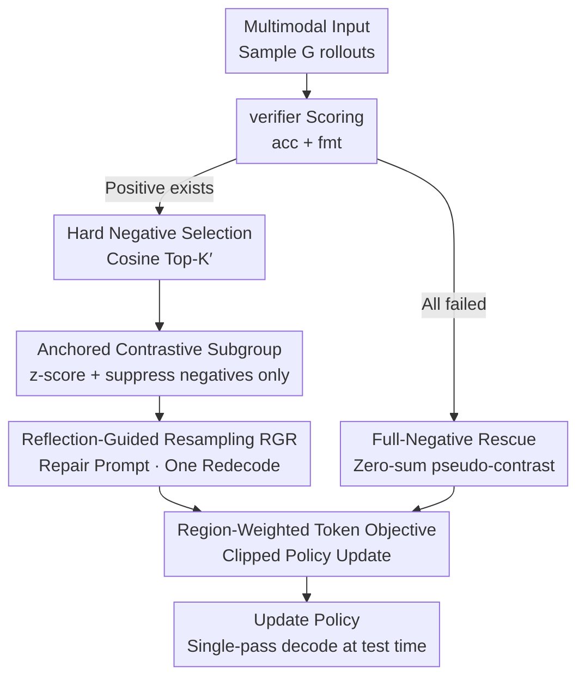

# CARE What Fails: Contrastive Anchored-REflection for Verifiable Multimodal Reasoning

**Conference**: CVPR 2026  
**Paper**: [CVF Open Access](https://openaccess.thecvf.com/content/CVPR2026/html/Wang_CARE_What_Fails_Contrastive_Anchored-REflection_for_Verifiable_Multimodal_Reasoning_CVPR_2026_paper.html)  
**Code**: Not public (No link provided in paper)  
**Area**: Multimodal VLM / Verifiable Multimodal Reasoning  
**Keywords**: RLVR, GRPO, Contrastive Advantage Normalization, Hard Negatives, Reflection Self-Correction  

## TL;DR
CARE is a "failure-centric" RLVR post-training framework for multimodal reasoning. It uses the best rollout in a group as an anchor, selects a small set of "near-miss" hard negatives for z-score normalization within a subgroup (only suppressing negatives), and performs structured reflection resampling on representative failures. By transforming "near-miss errors" into supervision signals, it achieves a macro average score 4.62 points higher than GRPO across six verifiable visual reasoning benchmarks using Qwen2.5-VL-7B.

## Background & Motivation
**Background**: The reasoning capabilities of Multimodal Large Language Models (MLLMs) are increasingly enhanced through RLVR (Reinforcement Learning from Verifiable Rewards). Proctogrammatic verifiers provide deterministic pass/fail rewards, and group-relative methods like GRPO sample multiple rollouts for a single query, replacing the critic with intra-group Monte Carlo advantages to update the policy. This path has been validated as effective in math and coding by models like DeepSeek-R1.

**Limitations of Prior Work**: When the rollout budget is small (the paper sets $G=8$), GRPO exhibits two chronic issues. First, **high gradient variance and training instability**: if all rollouts in a group fail, advantages become zero, causing gradients to stall. Second, **coarse credit assignment**: if one rollout happens to be correct by chance, the update rewards the entire chain indiscriminately while ignoring "where others failed and how close they were to the truth," often reinforcing a **spurious reasoning chain** that reached the correct answer by luck.

**Key Challenge**: RLVR actually possesses highly informative data—failure samples—but current objective functions discard them as noise. A "near-miss" hard negative and a "completely off-track" negative are treated equally in GRPO, diluting the contrastive signal.

**Goal**: To convert failures into usable learning signals and explicitly increase the "proportion of learning signals derived from failures" without **changing test-time decoding** (inference remains a single-pass decode without test-time reflection).

**Key Insight**: The authors observe that the most educational contrast comes from comparing the "best rollout in the group" with those that are "semantically closest to it but rejected by the verifier"—these are the near-misses, rather than mixing unrelated failure modes in a single normalization pool.

**Core Idea**: Replace the entire group with an **anchor + hard negative subgroup** for contrastive normalization (anchored-contrastive), and perform **one-time structured reflection resampling (RGR)** on selected representative failures to fix near-misses into positive or weakened negative examples on the fly.

## Method

### Overall Architecture
On top of the standard RLVR pipeline (sampling $G$ rollouts → verifier scoring → policy update), CARE re-engineers how advantages are calculated within a group and how failures are utilized. The data flow for an update is: sample a fixed number of rollouts for a multimodal input $x=\langle I, q\rangle$; the verifier parses the `<answer>` section to provide accuracy and format rewards; the **anchor** (the shortest correct reasoning chain) is selected; $K'$ hard negatives are chosen from the failure pool using **cosine nearest neighbors** to form a subgroup $S$; **z-score normalization + negative-only suppression** is performed within the subgroup to obtain advantages. When positive examples exist, **Reflection-Guided Resampling (RGR)** is triggered, inserting a repair prompt into a hard negative and re-decoding once—replacing the original failure if successful, or retaining it as a weakened negative if it fails. If the entire group fails, **Full-Negative Rescue** provides a zero-sum pseudo-contrast to prevent gradient freezing. Finally, a **Region-Weighted Token Objective** is used for clipped policy updates.

### Key Designs

**1. Anchored Contrastive Subgroups: Local normalization with "Best Rollout + Hard Negatives"**

To address GRPO's "coarse credit assignment" where near-misses and irrelevant failures are mixed, let $P=\{i: \text{acc}[x,y_i]=1\}$ be the set of correct rollouts. The anchor $y^+$ is chosen as the **shortest reasoning chain** among correct examples $y^+=\arg\min_{i\in P} T_i^{\text{think}}$ (preferring shorter answers on ties), based on the intuition of "using the most concise correct solution as a reference." Then, $K'$ negatives are taken from the hard negative selector to form a subgroup $S=\{y^+\}\cup\{y_1^-,\dots,y_{K'}^-\}$ (scaling down if negatives are insufficient $K'=\min(K, |\{\text{acc}=0\}|)$). z-score normalization is performed within the subgroup: with $\mu_S, \sigma_S$ as the subgroup mean and standard deviation, the raw advantage is $A_{\text{raw}}[y]=(r[y]-\mu_S)/\sigma_S$ (zeroed outside the subgroup).

The key "asymmetric" processing lies in **negative penalty scaling**: the anchor advantage is kept as $A[y^+]\leftarrow A_{\text{raw}}[y^+]$, while each negative is decayed by $s\in(0,1]$—$A[y_j^-]\leftarrow -s\,|A_{\text{raw}}[y_j^-]|$ (default $s=0.5$). The authors provide a mechanism signature: under the structure of "one positive + $K'$ negatives of similar reward level," z-score naturally yields:

$$A_{\text{raw}}[y^+]\approx \zeta\sqrt{K'},\qquad A_{\text{raw}}[y_j^-]\approx -\zeta\,\frac{1}{\sqrt{K'}}$$

(where $\zeta=1$ for binary rewards with a gap of 1). This means the anchor's positive push grows with $\sqrt{K'}$, while each negative's penalty decays by $1/\sqrt{K'}$. The "harder" the subgroup, the more the contrast focuses on pushing the correct solution away from near-misses without being skewed by a single negative sample. A global factor $\sqrt{K/K'}$ aligns update magnitudes across groups.

**2. Hard Negative Selection: Selecting "Near-Misses" via Cosine Similarity**

To ensure contrastive signals target near-misses rather than irrelevant failure modes, verifier outcomes serve only as a binary gate. Ranking is based on **semantic reasoning proximity**: for each entry in the failure pool $F=\{i:\text{acc}=0\}$, the last-layer hidden states of the `<think>` segment are mean-pooled and $\ell_2$-normalized to obtain reasoning embeddings $\tilde h_i$ (gradient detached). The cosine distance $d_{\cos}(i)=1-\tilde h_i^\top \tilde h^+$ to the anchor embedding $\tilde h^+$ is calculated. The $K'$ rollouts with the smallest $d_{\cos}$ are selected. To reduce redundancy, the $M>K'$ nearest neighbors are first retrieved, followed by a farthest-first traversal to return $K'$ samples. These negatives are "true near-misses" whose reasoning processes resemble the correct solution but yield wrong conclusions, teaching the policy to **discern subtle differences**. Ablations show COSINE-TopK′ converges to ~50.57, whereas random selection stays at ~43.06, with NEAREST > MIXED > FARTHEST confirming that distant negatives dilute the contrast.

**3. Reflection-Guided Resampling (RGR): Transforming Failures via Structured Self-Correction**

To utilize wasted failure samples, RGR is triggered only when **positive examples exist** in a group. One positive $y^+$ and one hard negative $y^-$ are selected. A brief repair prompt is inserted into the `<think>` section of $y^-$ ("Your previous reasoning had an error. Find the mistake, correct it, and re-derive. Keep it concise."), followed by a single re-decoding pass with **identical hyperparameters**. If the reflection sample **succeeds**, it **replaces** the original failure in the subgroup. If it still **fails**, it is kept as a negative but with a further reduced penalty scale $s_{\text{refl}}=s/2$ (default 0.25) to avoid over-sharpening. RGR occurs only during training and is never called during inference, incurring zero test-time cost. Ablations show gains stem from the "repair prompt" rather than additional sampling: RGR repair success rate is 76.6%, vs. 19.3% for promptless resampling and 12.8% for random resampling.

**4. Full-Negative Rescue + Region-Weighted Token Objective: Closing gaps in gradients and credit**

These two auxiliary components stabilize the mechanism. **Full-Negative Rescue**: when $\max_i r_i \approx 0$ (all fail), group-relative gradients vanish. Ours adds a **zero-sum pseudo-contrast** on subgroup $S=\{t\}\cup N$—the pseudo-anchor $t$ is the failure with the highest $\log\pi_{\text{old}}$, assigned $r'[t]=\gamma$, while pseudo-negatives $r'[j]=-\gamma/K'$ (default $\gamma=0.1$). This mimics the beneficial updates of the main mechanism without modifying true rewards, allowing "stuck hard batches" to produce incremental progress. **Region-Weighted Token Objective**: in the token advantage $a_{i,t}=A[y_i]\cdot w_{i,t}/(\sum_u w_{i,u}+\epsilon_w)$, the weight $w_{i,t}$ is set to 1 for answer spans. For reasoning spans, it is a minimal weight $\tau^+=0.005$ in positive samples and 0 in negative samples. This corrects GRPO's "dilution of answer credit by long reasoning" and avoids giving any gradient credit to failed `<think>` sequences (ablations show masking failed think segments reduces noise and speeds up learning). Finally, the clipped surrogate $L_{\text{PG}}$ with KL regularization is used.

### Loss & Training
The training data consists of approximately 49.3K multimodal prompts from ChartQA + Geometry3K + ViRL39K after deduplication. Cold-start SFT is performed on Vision-R1cold to stabilize `<think>/<answer>` formats and basic math capabilities, followed by RL post-training: subgroup size $K=4$, rollout budget $G=8$, negative scaling $s=0.5$, $s_{\text{refl}}=0.25$, $\tau^+=0.005$, and pseudo-contrast magnitude $\gamma=0.1$. Results are averaged over 5 random seeds.

## Key Experimental Results

### Main Results
Six verifiable visual reasoning benchmarks evaluated with single-pass decoding (LMMs-Eval).

| Model | MathVista | MathVerse | MATH-Vision | MMMU | MMMU-Pro(std) | MMMU-Pro(vis) |
|------|-----------|-----------|-------------|------|---------------|---------------|
| Qwen2.5-VL-7B (Instruct) | 68.6 | 49.2 | 22.4 | 61.3 | 36.3 | 32.8 |
| + GRPO | 68.9 | 50.8 | 25.7 | 61.1 | 36.4 | 32.8 |
| + DAPO | 72.6 | 54.2 | 29.4 | 61.6 | 37.3 | 34.7 |
| + GSPO | 74.1 | 56.0 | 31.6 | 62.2 | 38.9 | 36.4 |
| **+ CARE** | **74.7** | **56.8** | **32.6** | **62.5** | **39.7** | **37.1** |
| Qwen3-VL-8B (Instruct) | 77.2 | 62.1 | 53.9 | 69.6 | — | — |
| **+ CARE** | **82.1** | 69.7 | **61.7** | 71.0 | **46.7** | **41.7** |

Macro average for Qwen2.5-VL-7B: CARE 50.57 > GSPO 49.87 > DAPO 48.30 > GRPO 45.95, a **+4.62** gain over GRPO and +0.70 over GSPO. Qwen3-VL-8B + CARE achieves state-of-the-art results on MathVista (82.1) and both MMMU-Pro splits, surpassing MiMo-VL-7B-RL. Gains scale with model size: relative to Qwen3-VL-8B-Instruct, CARE provides +4.9 on MathVista and +7.8 on MATH-Vision.

### Ablation Study
Breakdown of major components (Avg. is the macro average across six benchmarks):

| Configuration | Qwen2.5-VL-3B Avg. | Gain | Qwen2.5-VL-7B Avg. | Gain |
|------|--------------------|-----|--------------------|-----|
| GRPO (baseline) | 38.83 | — | 45.95 | — |
| CARE w/o RGR (Anchor only) | 40.15 | +1.32 | 49.85 | +3.90 |
| CARE (Anchor + RGR) | 40.95 | +2.12 | 50.57 | +4.62 |

### Key Findings
- **Anchor is the primary driver, RGR is a stable bonus**: On the 7B model, Anchor contributes 84.4% of the +4.62 total gain, while RGR adds 15.6%. For the 3B model, Anchor is 62.3% and RGR is 37.7% (reflection is more critical for weaker models).
- **RGR gain comes from "Repair Prompt"**: Success rate is 76.6% with prompts vs. 19.3% without, reflected in a macro average of 40.95 vs. 39.94.
- **Hard negatives must be "Near"**: COSINE-TopK′ reaches ~50.57, while RANDOM stops at ~43.06; NEAREST outperformes MIXED and FARTHEST.
- **Negative scaling reduces variance on the negative side**: Reducing $s$ correlates with negative increments in clipping rates and variance ratios $R=\text{Var}(A[y^-])/\text{Var}(A[y^+])$, proving suppression is **selectively** applied to negatives.
- **Mechanism Signature verified**: By grouping by $K'\in\{2,\dots,7\}$, the mean advantages follow the linear $\sqrt{K'}$ and $1/\sqrt{K'}$ trends. Pearson correlation between $A_{\text{raw}}[y^+]/\sqrt{K'}$ and $\zeta$ is $r=0.998$. ⚠️ low $R^2$ (0.22/0.55) suggests residual spread comes from group-wise $\zeta$ fluctuations rather than scaling failure.
- **Region weighting saves tokens**: Under equal budgets, RW($\tau^+{=}0.005$) achieves higher accuracy (~50%) compared to Answer-only or unmasked variants (46-47%).

## Highlights & Insights
- **"Failure-centric" perspective is the right path**: While RLVR often treats failures as noise, CARE treats near-misses as the most informative supervision—this reframe is more valuable than the specific formulas.
- **Shortest correct rollout as anchor is a clever trick**: Using the most concise reasoning as the reference is stable and naturally penalizes verbosity.
- **Mechanism signature of z-score**: The authors didn't treat normalization as a black box but derived the analytical behavior of advantages relative to subgroup difficulty and verified it ($r=0.998$). This elevates the explanation of "why it works" to a falsifiable level.
- **Reflection during training, not inference**: Incorporating reflection gains into weights without paying test-time costs is a strategy applicable to any work seeking reflection benefits without latency penalties.
- **Transferability**: Anchored contrastive subgroups and hard negative selection are universal RL modifications for any scenario with a verifier (e.g., pure text RLVR, Code RL).

## Limitations & Future Work
- **Reliance on verifiable rewards**: Method is tied to programmatic verifiers (exact-match), making it hard to apply to open-ended generation without objective answers.
- **Hidden state mean-pooling dependency**: Semantic proximity depends on the quality of reasoning embeddings; if the model's representations are poor, "nearest neighbors" might be incorrect.
- ⚠️ **Fixed hyperparameters**: Many values ($K, s, \tau^+, \gamma$) are hardcoded. While the paper mentions details in the appendix, the main text lacks a full sensitivity scan across tasks.
- **Limited fitting for mechanism signature**: Low $R^2$ values indicate that real advantage distributions are much noisier than the ideal two-layer model.
- **Future Directions**: Replace verifiers with soft rewards/process rewards for open tasks, or make anchor/subgroup sizes dynamically adaptive.

## Related Work & Insights
- **vs GRPO**: GRPO uses group-wide normalization and treats all rollouts equally; CARE focuses on "anchor + hard negative" subgroups and suppresses negatives only, making credit assignment failure-aware (+4.62 macro gain).
- **vs DAPO / GSPO**: These focus on clipping/selective rollouts or sequence-level variants but remain "group-level." CARE's subgroup contrast and near-miss selection offer more focus on difficult distinctions.
- **vs VL-Rethinker / Process Reward Models**: These often require mandatory self-verification at inference or heavy training of independent reward models. CARE's RGR moves gains into weights for single-pass inference.
- **vs DARS**: DARS allocates more rollout budget to difficult prompts; CARE more effectively utilizes existing failure rollouts within a fixed budget.

## Rating
- Novelty: ⭐⭐⭐⭐ The combination of failure-centric subgroups and training-time reflection is novel, though built on the GRPO foundation.
- Experimental Thoroughness: ⭐⭐⭐⭐⭐ Three backbones across six benchmarks with extensive ablations and mechanism validation.
- Writing Quality: ⭐⭐⭐⭐ Clear derivation and logic, though notation is dense and heavily reliant on appendices for some hyperparameters.
- Value: ⭐⭐⭐⭐ Provides a stable, plug-and-play improvement for verifiable multimodal reasoning RL without increasing inference costs.

<!-- RELATED:START -->

## Related Papers

- [\[CVPR 2026\] Perceptual-Evidence Anchored Reinforced Learning for Multimodal Reasoning](perceptual-evidence_anchored_reinforced_learning_for_multimodal_reasoning.md)
- [\[CVPR 2026\] DPAD: Discriminative Perception via Anchored Description for Reasoning Segmentation](discriminative_perception_via_anchored_description_for_reasoning_segmentation.md)
- [\[CVPR 2026\] Beyond Multiple Choice: Verifiable OpenQA for Robust Vision-Language RFT](beyond_multiple_choice_verifiable_openqa_for_robust_vision-language_rft.md)
- [\[CVPR 2026\] REVISOR: Beyond Textual Reflection, Towards Multimodal Introspective Reasoning in Long-Form Video Understanding](revisor_beyond_textual_reflection_towards_multimodal_introspective_reasoning_in_.md)
- [\[CVPR 2026\] Seeing What Matters: A Training-Free Self-Guided Framework for Multimodal Detail Perception and Reasoning](seeing_what_matters_a_training-free_self-guided_framework_for_multimodal_detail_.md)

<!-- RELATED:END -->
