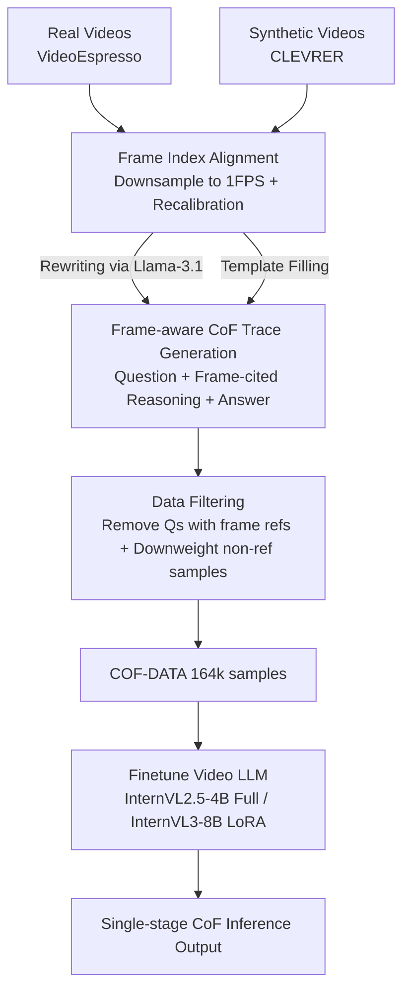

# Chain-of-Frames: Advancing Video Understanding in Multimodal LLMs via Frame-Aware Reasoning

**Conference**: CVPR 2026  
**Paper**: [CVF Open Access](https://openaccess.thecvf.com/content/CVPR2026/html/Ghazanfari_Chain-of-Frames_Advancing_Video_Understanding_in_Multimodal_LLMs_via_Frame_Aware_Reasoning_CVPR_2026_paper.html)  
**Code**: Not public (⚠️ Repository link not provided in the paper)  
**Area**: Multimodal VLM / Video Understanding  
**Keywords**: Chain-of-Frames, Video Reasoning, Temporal Grounding, Synthetic Data, InternVL  

## TL;DR
This paper proposes Chain-of-Frames (CoF), enabling video LLMs to directly reference keyframes using identifiers like "Frame-k" within single-stage reasoning, effectively embedding temporal grounding into the CoT text itself. Using a low-cost data pipeline to generate 164,000 training samples with frame citations to finetune InternVL, the method achieves an average performance gain of 3.8%–5.1% across five video understanding benchmarks. It further demonstrates that purely synthetic data can lead to significant improvements.

## Background & Motivation

**Background**: Extending Chain-of-Thought (CoT) from text-only LLMs to video understanding has become a recent focus—models first generate a reasoning trace regarding the video content before providing an answer. Video is inherently more challenging than single images because the model must simultaneously understand text queries and temporal/causal relationships between frames while performing holistic reasoning over the entire sequence.

**Limitations of Prior Work**: Existing video CoT methods fall into two categories, both with significant drawbacks. **Multi-stage pipelines** (e.g., VideoEspresso, Video-of-Thought, M-LLM) use auxiliary networks for keyframe retrieval, spatial-temporal scene graph construction, or caption generation before feeding data into the reasoning model. This results in high computational overhead and extreme specialization; furthermore, by sending only a **subset of frames** to the LLM, they lose the complete temporal context of the video. **Single-stage methods** (e.g., VideoCoT) generate reasoning text directly, but their training data is synthesized by "video descriptions + LLM rewriting + manual correction." Since these descriptions often lack frame-level temporal alignment, the resulting reasoning traces exhibit temporal confusion, requiring intensive human-in-the-loop correction, which limits data scale to approximately 11,000 samples.

**Key Challenge**: There is a fundamental trade-off between expensive data generation that lacks explicit temporal grounding and complex inference pipelines that rely on auxiliary models while sacrificing contextual integrity. More importantly, existing video LLM reasoning traces **fail to explicitly link specific video segments with reasoning steps**, making the reasoning "detached," uninterpretable, and difficult to learn.

**Goal**: To develop the first "single-stage + explicit keyframe citation" video LLM reasoning paradigm that preserves full-frame context, embeds temporal grounding directly into reasoning text, and allows for low-cost, large-scale training data generation.

**Key Insight**: The authors observe that models like InternVL naturally encode videos into an interleaved image-text format such as "Frame-1 [Image] Frame-2 [Image]...". These text identifiers are inherently attached to each frame. By reusing these frame numbers as "pointers" during reasoning, the model can clarify "what happened in Frame 7" within a sentence without any external retrieval modules.

**Core Idea**: Use the simplest possible mechanism—explicitly writing "Frame-k" identifiers in the reasoning text—to embed temporal grounding into single-stage CoT, replacing expensive multi-stage keyframe retrieval pipelines.

## Method

### Overall Architecture
The core proposition of CoF is: **no architectural changes and no auxiliary models**. It relies solely on "data + finetuning" to teach frame-aware reasoning to existing video LLMs. The workflow is divided into two parts: the left side is a two-step data pipeline that converts both real and synthetic videos into "Question / Frame-cited Reasoning Trace / Answer" triplets, forming COF-DATA (164k samples); the right side involves finetuning InternVL2.5-4B and InternVL3-8B with this data. During inference, the CoF model outputs a single-stage CoT containing "Frame-k" citations followed by the final answer.

The inference format is as follows: the model receives "Frame-1 [Image] ... Frame-30 [Image] + Question" and outputs reasoning like *"The video starts with two people on a rocky cliff (Frame 5)...the next scene shows a rescue (Frame 6)..."* before concluding with the answer. Frame indices are based on **positional sequence** (Frame 1, Frame 2...) rather than timestamps, which ensures consistency across different video lengths and sampling frequencies, making it easier to learn.

### Key Designs

**1. Chain-of-Frames: Using Frame Indices as Pointers in Single-stage CoT**

To address the issue of "detached reasoning" and reliance on external retrieval for temporal grounding, CoF adopts a straightforward approach: citing positional frame indices directly within the reasoning text. Assuming a video is uniformly sampled into $N$ frames $\{f_1, \dots, f_N\}$ (where $N=30$ in experiments), each frame is appended with a text identifier Frame-$k$. The reasoning trace is a natural language sequence where Frame-$k$ explicitly appears to identify the "keyframe required to answer the question." In this way, temporal grounding is **not** handled by a retrieval network selecting top-$k$ frames, but is **implicitly** completed by the model as it generates the reasoning trace.

This is effective due to three key differences from prior methods: (a) all 30 frames enter the LLM, **preserving context**, unlike multi-stage methods that only send subsets; (b) reasoning is pure natural language without complex intermediate formats (like bounding boxes/scene graphs), serving as a natural extension of standard NLP CoT with low latency; (c) positional indices are robust to sampling frequencies. Example: For a "temporal order" question, the model outputs *"purple cylinder appears in Frame 1, green cylinder in Frame 4, cyan cube in Frame 8..."*, locking reasoning steps to specific frames.

**2. Two-step Data Pipeline + Dual Sources: Low-cost Generation of Frame-cited Traces**

CoF is a data-driven paradigm, making generation efficiency and accuracy the main bottlenecks. The authors designed a two-step pipeline:

**Step 1: Frame Index Alignment**—Original annotations contain frame IDs, but due to context window limits, videos must be downsampled. Each frame is mapped to a timestamp, the video is cropped to the maximum duration allowed by the model (30s in experiments) while ensuring captioned frames remain, and frame IDs are **recalibrated** to reflect their new positions in the cropped video. This preserves "frame-caption" alignment.

**Step 2: CoF Triplet Generation**—Divided into two branches:
- **Real Videos (COF-DATA_real)**: Samples are taken from the VideoEspresso training set, which includes captions for keyframes. After recalibrating indices, these **frame-aligned** annotations are fed into Llama-3.1-8B-Instruct to generate the trace.
- **Synthetic Videos (COF-DATA_synth)**: Samples are taken from CLEVRER, where every object in every frame has fixed (shape/material/color) and situational (speed/position) attributes. These structured annotations allow for **direct template-based filling** to generate quantitative questions and CoF traces (e.g., object counting, order of appearance, relative distance) **without using an LLM**, enabling zero-cost scaling to 164k samples.

**3. Data Filtering Strategy: Matching Training Distribution to Inference Needs**

Two specific filters are applied. First, **questions containing frame citations are removed**, as test-time queries will not provide frame numbers. Second, the **proportion of samples without frame citations in the trace is reduced** to give higher weight to complex reasoning; however, some are kept to avoid forcing citations where unnecessary. In the final 164k set, the distribution is: 0 frames (22.5%), 1 frame (32.0%), 2 frames (25.3%), 3 frames (13.8%), and >3 frames (6.4%). This "calibrated mixture" teaches the model to use frame citations **on demand**.

### Loss & Training
Standard Supervised Finetuning (SFT) is used. For InternVL2.5-4B, the LLM and projection modules undergo **full finetuning** while the vision encoder is frozen. InternVL3-8B uses **LoRA** for memory efficiency. During inference, **30 frames are uniformly sampled** per video to ensure consistent temporal coverage.

## Key Experimental Results

### Main Results
Evaluation across 5 benchmarks (VSI-Bench for quantitative reasoning / Video-MME for long video / MVBench for 20 tasks / VidHal, EventHallusion for hallucinations) with accuracy (%):

| Model | VSI-Bench | Video-MME | MVBench | VidHal | EventHall | Average |
| :--- | :---: | :---: | :---: | :---: | :---: | :---: |
| GPT-4o (Closed) | 34.0 | 71.9 | - | 77.2 | 91.9 | - |
| Gemini-1.5-Pro (Closed) | 48.8 | 75.0 | - | 67.1 | 80.4 | - |
| Qwen2-VL-72B | 37.6 | 71.2 | 73.6 | 76.2 | 54.7 | 62.7 |
| InternVL2.5-4B (Baseline) | 33.5 | 54.7 | 71.5 | 77.0 | 67.4 | 60.8 |
| **CoF-InternVL2.5-4B** | 36.9 | 59.7 | 76.1 | 79.2 | 71.2 | **64.6** (+3.8) |
| InternVL3-8B (Baseline) | 41.0 | 66.5 | 74.4 | 80.9 | 72.1 | 67.0 |
| **CoF-InternVL3-8B** | 51.3 | 73.7 | 77.1 | 79.5 | 78.7 | **72.1** (+5.1) |

CoF-InternVL3-8B (8B params) achieves **state-of-the-art** results on VSI-Bench and MVBench (including closed-source models). Larger models (8B Gain 5.1% > 4B Gain 3.8%) show more significant improvements, suggesting stronger LLMs benefit more from CoF.

### Ablation Study
**CoF vs. Other CoT Variants** (using InternVL2.5-4B):

| Configuration | VSI-Bench | Video-MME | MVBench | VidHal | EventHall | Description |
| :--- | :---: | :---: | :---: | :---: | :---: | :--- |
| Original | 31.8 | 54.9 | 70.8 | 74.0 | 62.5 | Default prompting |
| + CoT Prompting | 33.5 | 54.7 | 71.5 | 77.0 | 67.4 | Reasoning prompt only |
| + SFT with QA only | 31.8 | 54.5 | 73.4 | 64.1 | 57.7 | QA only, no reasoning |
| + SFT with CoT | 34.3 | 58.6 | 73.7 | 77.9 | 53.1 | **No frame citations** |
| **+ SFT with CoF (ours)** | 36.9 | 59.7 | 76.1 | 79.2 | 71.2 | Full proposed method |

Replacing "In Frame 1..." with generalized "In the video..." phrases (SFT with CoT) causes EventHallusion performance to plummet to 53.1. Reinstating frame citations (CoF) achieves the best results across all benchmarks; **explicit frame citation is the causal variable**.

**Impact of Synthetic Data** (Total 164k samples):

| Training Data | VSI-Bench | Video-MME | MVBench | VidHal | EventHall |
| :--- | :---: | :---: | :---: | :---: | :---: |
| CoF-DATA-real | 35.3 | 59.0 | 74.8 | 73.2 | 73.6 |
| CoF-DATA-synth | 31.3 | 59.0 | 73.4 | 77.2 | 65.3 |
| CoF-DATA (combined) | 36.9 | 59.7 | 76.1 | 79.2 | 71.2 |

### Key Findings
- **Synthetic data is competitive with real data**: Despite the distribution gap between CLEVRER and real-world benchmarks, models trained only on synthetic data outperformed those trained only on real data in several benchmarks. This suggests models learn the **reasoning tasks** (counting, ordering) and transfer them effectively.
- **Combined data is optimal due to diversity**: The performance peak occurs when both sources are used, indicating diversity in reasoning traces is more important than a single high-fidelity source.
- **Models cite frames on demand**: During inference, 76.9% of responses contained at least one frame citation, with varying distributions across different tasks.

## Highlights & Insights
- **Replacing retrieval modules with text pointers**: Reducing complex multi-stage pipelines to simply "writing Frame-k in the CoT" is an elegant migration of NLP CoT concepts to the video domain, ensuring zero additional inference overhead.
- **OOD generalization of synthetic data**: Simple 3D objects in CLEVRER successfully taught the model quantitative temporal reasoning for real-world scenarios, suggesting that such capabilities can be injected via cheap, procedural data.
- **Leveraging existing backbone formats**: CoF cleverly utilizes the "Frame-k [Image]" interleaved format already present in InternVL, making the "image-to-text-identifier" binding nearly burden-free for the model to learn.

## Limitations & Future Work
- **Fixed FPS Dependency**: CoF requires reasoning traces to align with the frame indices provided to the LLM; adapting this to non-fixed FPS or dynamic sampling remains an open question.
- **Backbone Coupling**: While tested on Phi-3.5-Vision in the appendix, the method is "particularly well-suited" for InternVL's format. Performance on models without explicit frame identifiers in the input is not fully explored in the main text. ⚠️
- **Benchmark Overlap**: The authors honestly note that certain benchmarks (MVBench, VidHal) contain videos or tasks similar to the CLEVRER training set, though the gains still indicate generalized improvement.

## Related Work & Insights
- **vs. VideoCoT (Single-stage)**: VideoCoT lacks frame-level alignment, leading to temporal confusion and limited data scale (11k). CoF uses aligned annotations and synthetic templates to reach 164k samples with higher accuracy.
- **vs. Multi-stage Methods**: CoF is single-stage, preserves full context, and embeds grounding into the text. It outperforms multi-stage methods like M-LLM on benchmarks like NExT-QA (+4.9% vs +0.8%).
- **vs. Normal SFT-CoT**: Ablations show that reasoning without explicit frame citations fails to maintain performance on hallucination benchmarks, highlighting "explicit temporal grounding" as the core performance driver.

## Rating
- Novelty: ⭐⭐⭐⭐ Simple but effective paradigm shift for single-stage grounding.
- Experimental Thoroughness: ⭐⭐⭐⭐ Solid multi-benchmark/multi-backbone testing with clear ablations; honest about data overlap.
- Writing Quality: ⭐⭐⭐⭐ Clear logic, informative diagrams, and easy to follow.
- Value: ⭐⭐⭐⭐ The finding that synthetic data scales temporal reasoning is highly practical for the community.

<!-- RELATED:START -->

## Related Papers

- [\[CVPR 2026\] Reinforcing Structured Chain-of-Thought for Video Understanding](reinforcing_structured_chain-of-thought_for_video_understanding.md)
- [\[CVPR 2026\] Agentic Video Summarization via Self-Reflecting Multimodal Understanding](agentic_video_summarization_via_self-reflecting_multimodal_understanding.md)
- [\[CVPR 2026\] Towards Sparse Video Understanding and Reasoning](towards_sparse_video_understanding_and_reasoning.md)
- [\[CVPR 2026\] EmoThinker: Advancing Visual-Acoustic Emotion Analysis via Structural Token Selection and Chain-of-Thought Reasoning](emothinker_advancing_visual-acoustic_emotion_analysis_via_structural_token_selec.md)
- [\[CVPR 2026\] Graph-to-Frame RAG: Visual-Space Knowledge Fusion for Training-Free and Auditable Video Reasoning](graph-to-frame_rag_visual-space_knowledge_fusion_for_training-free_and_auditable.md)

<!-- RELATED:END -->
