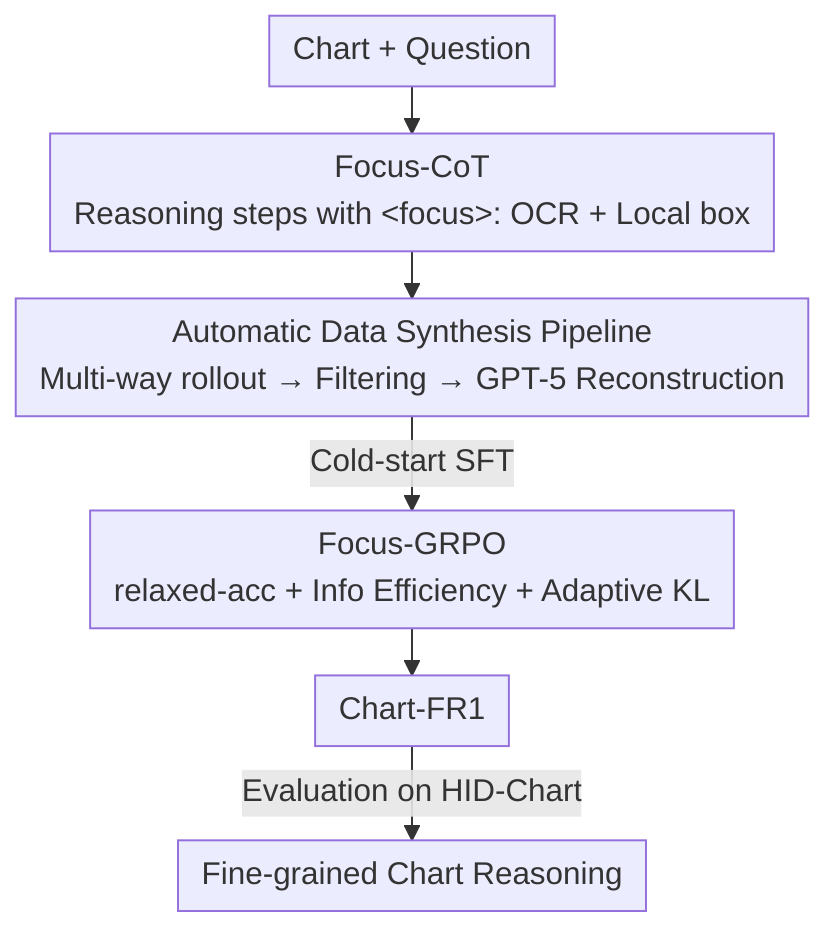

# Chart-FR1: Visual Focus-Driven Fine-Grained Reasoning on Dense Charts

**Conference**: CVPR 2026  
**Paper**: [CVF Open Access](https://openaccess.thecvf.com/content/CVPR2026/html/Pan_Chart-FR1_Visual_Focus-Driven_Fine-Grained_Reasoning_on_Dense_Charts_CVPR_2026_paper.html)  
**Code**: https://github.com/phkhub/Chart-FR1  
**Area**: Multimodal VLM  
**Keywords**: Chart Reasoning, Visual Focus, Reinforcement Learning, GRPO, Chain-of-Thought  

## TL;DR
Targeting "High Information Density (HID) charts" with dense subplots and numerous legend annotations, Chart-FR1 explicitly anchors reasoning steps to OCR text and local bounding boxes using a `<focus>` tag (Focus-CoT). By employing Focus-GRPO with "Information Efficiency Reward + Adaptive KL Penalty" for reinforcement learning, it improves Qwen2.5-VL-7B by an average of 6.1% across five chart benchmarks, surpassing GPT-4o.

## Background & Motivation
**Background**: Multimodal Large Language Models (MLLMs) have made rapid progress in chart understanding. These include general-purpose models like GPT-4o and Qwen2.5-VL, chart-specific models like ChartGemma and EvoChart, and recent models enhanced by Reinforcement Learning (GRPO) for reasoning, such as R1-VL and Vision-R1.

**Limitations of Prior Work**: This paper focuses on a neglected but challenging category—**High Information Density (HID) charts**, which contain multiple subplots, various legends, and dense annotations. On such charts, existing models exhibit three specific weaknesses: (1) **Insufficient fine-grained perception**—most models rely on global visual embeddings and fail to precisely extract key clues from cluttered information, leading to missed numerical values; (2) **Visual redundancy and noise**—inputting too many visual elements simultaneously can interfere with reasoning; (3) **Non-adaptive reasoning depth**—existing RL uses a fixed KL penalty coefficient, which "over-penalizes" longer outputs when certain problems require long-chain, multi-clue deep reasoning.

**Key Challenge**: Higher chart information density causes visual clutter that degrades both "perception" and "reasoning." Fig.2 in the paper shows that as information density increases from [0, 3.7) to [4.2, 5.0], the accuracy of GPT-4o / Qwen2.5-VL declines monotonically. Furthermore, while the exploration depth for reasoning chains should relax as clues increase, fixed KL penalty does the opposite.

**Goal**: To enable models to achieve "finer perception, more efficient focusing, and adaptive reasoning depth" on HID charts, and to provide a benchmark specifically for evaluating HID charts.

**Core Idea**: Explicitly integrate "focusing actions" into the reasoning chain—each reasoning step uses a `<focus>` tag to link its evidence to OCR text and local boxes, tightly coupling perception and reasoning. This behavior is then optimized using an RL reward centered on "focusing efficiency" and an **adaptive KL penalty** that dynamically adjusts based on the number of clues.

## Method

### Overall Architecture
Chart-FR1 is a **two-stage focus-driven reasoning training framework** based on Qwen2.5-VL-7B. Given a chart and a question, it outputs reasoning and an answer with a `<think>`/`<focus>`/`<answer>` structure.

- **Stage 1 (Cold-start SFT)**: High-quality "reasoning chains with focus tags" are generated using an **automatic Focus-CoT data synthesis pipeline**, followed by supervised fine-tuning to inject the "reasoning while focusing" behavior as a cold start.
- **Stage 2 (Focus-GRPO Reinforcement Learning)**: An improved GRPO is applied to the cold-started model, using three reward paths (relaxed-accuracy / format / information-efficiency) + adaptive KL penalty to refine focusing efficiency and reasoning depth.
- **Evaluation**: The authors established the HID-Chart benchmark and the Chart-ID information density metric to quantify fine-grained reasoning capabilities in HID scenarios.

### Key Designs

**1. Focus-CoT: Anchoring reasoning steps to visual evidence with an automated cold-start pipeline**

To address "insufficient fine-grained perception"—standard CoT primarily reasons at the linguistic level, lacking perception of specific values or local regions. Focus-CoT introduces a `<focus>` tag where each action includes two sub-actions: **OCR text extraction** (`<ocr>...</ocr>`) and **local image localization** (`<box>{"bbox_2d":[...], "label":...}</box>`). Subsequent reasoning occurs under the guidance of this focused information, tightly coupling "reasoning" with "perception". For example, the model may `<think>` about a potential peak, then use `<focus>` to box the subplot and OCR the coordinates, correcting a previous error (as shown in the paper's opening example where 2 peaks were corrected to 1).

Since RL only finds high-reward paths within the model's existing knowledge, this focusing behavior must be "taught" first. The authors designed an **automatic Focus-CoT generation pipeline**: ① Samples are filtered by difficulty and quality, and Qwen2.5-VL generates 8 reasoning paths per sample; ② Format filtering + LLM-based correctness checking to calculate pass@k, categorizing samples into easy/medium/hard; ③ **Conditional CoT Reconstruction**—a stronger teacher model (GPT-5) links original CoT to visual evidence. If the original reasoning is wrong, it localizes the error and inserts `<focus>` to fetch correct visual info. If correct, it inserts `<focus>` for "visual verification" without changing logic; ④ Dual quality filtering (rules + LLM) to remove redundant focus chains. The cold-start loss is a standard sequence NLL: $L_{\text{cold-start}} = -\mathbb{E}_{(x,q,r,a)\sim D}\sum_{t=1}^{T}\log \pi_\theta(y_t\mid x,q,y_{<t})$.

**2. Focus-GRPO: Efficiency-driven rewards + Clue-adaptive KL penalty**

To address "visual redundancy" and "non-adaptive reasoning depth," Focus-GRPO modifies standard GRPO in three ways.

**(a) Relaxed-Accuracy Reward**: Numerical answers in chart QA often fluctuate slightly. Defining $R_{\text{relaxed acc}}=1.0$ if $\text{correctness}(\hat y,y)$ holds, otherwise 0. For numerical answers, the criterion is relaxed to a relative error $\frac{|\hat y-y|}{\max(|y|,\mu)}\le 0.05$, while non-numerical answers require strict equality.

**(b) Information-Efficiency Reward**: This penalizes "focusing on redundant OCR/overlapping boxes" behaviors. It is an exponential decay of the redundancy penalty $P_{\text{redundancy}}$: $R_{\text{efficiency}}=\exp(-\alpha\cdot P_{\text{redundancy}})$. The redundancy penalty is averaged from three sub-metrics: OCR-OCR text similarity, Box-Box IoU overlap, and OCR-Box similarity. Higher similarity/overlap leads to a higher penalty. The format reward uses regex matching, providing 1.0 for Focus-CoT, 0.667 for standard CoT, and 0 otherwise. Total reward: $R = R_{\text{relaxed acc}} + w_1\cdot R_{\text{format}} + w_2\cdot R_{\text{efficiency}}$.

**(c) Adaptive KL Penalty**: This fixes the "fixed KL over-penalizing deep reasoning" issue. When the model focuses on rich clues and needs deep exploration, the KL constraint is relaxed; it is tightened when clues are scarce. Quantifying focused information as $N_{\text{info}}=(N_{\text{ocr}}+N_{\text{box}})/2$, the adaptive coefficient is $\beta'=\beta\cdot\frac{1}{1+\log(1+N_{\text{info}})}$. The optimization uses a clipped PPO-style objective with group-relative advantage $A'_i$ and the adaptive KL term $D'_{\text{KL}}(\pi_\theta\|\pi_{\text{ref}})$ using $\beta'$.

**3. HID-Chart Benchmark and Chart-ID Metric**

To address the limitations of existing benchmarks in diversity and density, the authors defined **Chart-ID**: GPT-5 scores four dimensions (richness $S_{\text{rich}}$, efficiency $S_{\text{eff}}$, clarity $S_{\text{clar}}$, interactivity $S_{\text{inter}}$) from 1-5, synthesized as $\text{Chart-ID}=\frac{S_{\text{rich}}}{2}+\frac{S_{\text{eff}}}{5}+\frac{S_{\text{clar}}}{5}+\frac{S_{\text{inter}}}{10}$. Following a human-in-the-loop process, ~2500 charts were collected from 2023-2025 publications, websites, and reports. High-density charts were kept, and GPT-5 generated candidate questions. Five graduate students refined these into multi-step questions and verified answers. The final set includes **734 charts and 1561 high-quality QA pairs**, with an average density of 3.94, covering 10 chart types and 8 domains.

### Loss & Training
Both stages use Qwen2.5-VL-7B on 8×H100. Cold-start set: 6.4k samples, 1 epoch, lr $2\times10^{-6}$, batch 256. Focus-GRPO stage: 30k samples, 3 epochs, lr $1\times10^{-6}$, batch 512, 8 rollouts, hyperparameters $\alpha=2$, $\tau=0.9$, $\beta=1\times10^{-2}$, $w_1=w_2=0.1$.

## Key Experimental Results

### Main Results
Comparison across five chart benchmarks (Avg is the mean of five items):

| Model | ChartQA | CharXiv | EvoChart | ChartBench | PlotQA | Avg |
|------|---------|---------|----------|------------|--------|-----|
| GPT-4o (Closed) | 85.7 | 47.1 | 63.9 | 72.3 | 51.0 | 64.0 |
| Qwen2.5-VL-7B (Base) | 87.3 | 42.5 | 53.5 | 66.4 | 55.5 | 61.0 |
| Vision-R1-7B (Reasoning) | 84.0 | 38.7 | 54.0 | 66.3 | 58.3 | 60.3 |
| ChartSketcher-72B (Chart) | 88.9 | 36.6 | 63.3 | 68.3 | 57.1 | 62.8 |
| **Chart-FR1-7B (Ours)** | **91.0** | **46.6** | 59.2 | **75.6** | **62.9** | **67.1** |

Chart-FR1-7B outperforms the base by **6.1%** and GPT-4o by **3.1%**. On the HID-Chart benchmark (Table 4), the Avg is 53.0, which is **10.0%** higher than base, surpassing both Qwen2.5-VL-72B (51.5) and GPT-4o (51.2). Accuracy for all models drops as density increases, confirming the difficulty of HID charts.

### Ablation Study
Ablation of Focus-GRPO components (on Avg of five benchmarks, Table 5):

| Configuration | Avg | Description |
|------|-----|------|
| Standard GRPO | 64.1 | RL baseline |
| **Focus-GRPO (Full)** | **67.1** | +3.0% over GRPO |
| w/o Adaptive KL Penalty | 65.8 | -1.3%, deep reasoning over-penalized |
| w/o Info Efficiency Reward | 65.8 | -1.3%, redundancy hurts accuracy |
| w/o Both | 65.5 | Still +1.4% over GRPO (due to relaxed-acc) |

Ablation of two-stage framework and focus clues (Table 6):

| Configuration | Avg | Description |
|------|-----|------|
| Chart-FR1-7B (Full) | 67.1 | — |
| w/o Focus-GRPO | 62.7 | -4.4%, RL contribution is primary |
| w/o Cold-Start | 64.7 | -2.4%, Cold-start activates focus ability |
| w/o OCR | 64.5 | -2.6%, OCR clues are most critical |
| w/o Box | 65.2 | -1.9% |

### Key Findings
- **Focus-GRPO RL stage is the top contributor**: Removing it drops Avg by 4.4%. Adaptive KL and efficiency rewards each contribute 1.3%. Even without them, relaxed-accuracy still beats standard GRPO by 1.4%.
- **OCR clues are more critical than boxes**: Removing OCR leads to a 2.6% drop compared to 1.9% for boxes, indicating that accurate text/value reading is the bottleneck for fine-grained reasoning.
- **Transferable across backbones**: After training with Qwen2.5-VL-3B / Qwen3-VL-8B, HID-Chart scores significantly improved, showing the method is not base-specific.
- **Stronger teacher models yield higher gains**: GPT-5-based CoT reconstruction (Avg 67.1) outperforms Qwen3-VL-32B (66.7) and Qwen2.5-VL-72B (65.5).

## Highlights & Insights
- **Structuring "Focusing" as a supervisable action**: The OCR + box in `<focus>` can be directly quantified for redundancy using SequenceMatcher/IoU. This turns "where to look and what to avoid" into an optimizable goal. This approach of making intermediate steps readable by reward functions can be transferred to any multimodal RL requiring tool calls or retrieval.
- **Adaptive KL as a simple yet effective fix**: Using a single formula $\beta'=\beta/(1+\log(1+N_{\text{info}}))$ encodes the intuition that "more clues → relax constraints → allow deeper exploration," solving the systematic suppression of long-chain reasoning by fixed KL.
- **Value of relaxed-accuracy reward**: Even with only relaxed numerical matching, it beats standard GRPO by 1.4%, suggesting that reward tolerance for numerical fluctuations is an underappreciated design point in chart QA.

## Limitations & Future Work
- **Heavy dependency on strong teacher models**: Focus labels are reconstructed by GPT-5; gains decrease with weaker teachers, making the cost and reproducibility dependent on closed-source models.
- **Subjectivity of Chart-ID**: Dimensions are scored by GPT-5, creating a potential "circular bias" where the benchmark scale is partially derived from models similar to those being evaluated.
- **Scalability and language**: Only verified on 7B/8B sizes and English charts. Failure modes of box localization in extremely dense subplots haven't been deeply analyzed.
- **Potential improvements**: Transforming focusing actions into an iterative "look-think-look again" dialogue or refining efficiency rewards to distinguish "redundancy" from "beneficial cross-verification."

## Related Work & Insights
- **vs Standard GRPO / R1-VL / Vision-R1**: These use fixed KL and sparse accuracy rewards, failing to link visual clues to reasoning. This paper uses three-path rewards and adaptive KL, yielding a >3% gain on HID charts.
- **vs ChartPoint / ChartSketcher**: While these associate local regions or use interactive code, they lack supervision for focusing redundancy. This paper explicitly labels local boxes + OCR and constrains redundancy via rewards.
- **vs EvoChart / ChartGemma**: These rely on SFT with synthetic data and lack an RL phase. In the two-stage paradigm here, RL contributes the primary gain of 4.4%.

## Rating
- Novelty: ⭐⭐⭐⭐ Structured focus tags + Efficiency reward + Adaptive KL provide a targeted solution for HID charts.
- Experimental Thoroughness: ⭐⭐⭐⭐⭐ Comprehensive evaluation across 5 benchmarks + own HID-Chart, including five types of ablation.
- Writing Quality: ⭐⭐⭐⭐ Clearly explained formulas and pipelines; design points align well with problems.
- Value: ⭐⭐⭐⭐ Surpassing GPT-4o at the 7B scale with a transferable method makes both the HID-Chart and Chart-ID metric valuable to the community.

<!-- RELATED:START -->

## Related Papers

- [\[CVPR 2026\] ReasonMap: Towards Fine-Grained Visual Reasoning from Transit Maps](reasonmap_towards_fine-grained_visual_reasoning_from_transit_maps.md)
- [\[CVPR 2026\] Thinking Beyond Labels: Vocabulary-Free Fine-Grained Recognition using Reasoning-Augmented LMMs](thinking_beyond_labels_vocabulary-free_fine-grained_recognition_using_reasoning-.md)
- [\[CVPR 2026\] HandVQA: Diagnosing and Improving Fine-Grained Spatial Reasoning about Hands in Vision-Language Models](handvqa_diagnosing_and_improving_fine-grained_spatial_reasoning_about_hands_in_v.md)
- [\[ICLR 2026\] VisuRiddles: Fine-Grained Perception is a Primary Bottleneck for Multimodal Large Language Models in Abstract Visual Reasoning](../../ICLR2026/vlm_reasoning/visuriddles_fine-grained_perception_is_a_primary_bottleneck_for_multimodal_large.md)
- [\[CVPR 2026\] Dr. Seg: Revisiting GRPO Training for Visual Large Language Models through Perception-Oriented Design](dr_seg_revisiting_grpo_training_for_visual_large_language_models_through_percept.md)

<!-- RELATED:END -->
