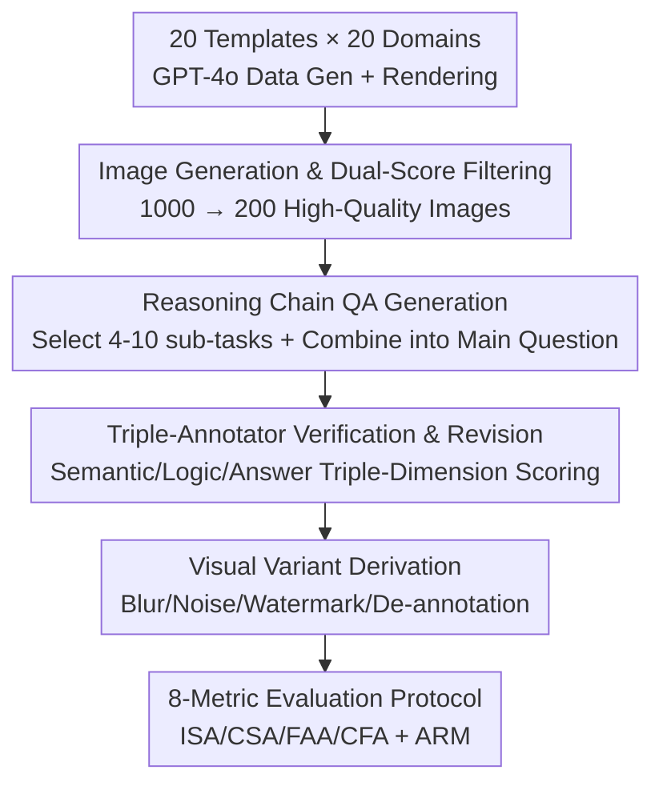

# ChartR: Evaluating Reasoning Accuracy and Robustness in Chart Question Answering

**Conference**: CVPR 2026  
**Paper**: [CVF Open Access](https://openaccess.thecvf.com/content/CVPR2026/html/Chen_ChartR_Evaluating_Reasoning_Accuracy_and_Robustness_in_Chart_Question_Answering_CVPR_2026_paper.html)  
**Code**: None (Not released)  
**Area**: Multimodal VLM  
**Keywords**: Chart Question Answering, Reasoning Chain Evaluation, Visual Robustness, MLLM, benchmark  

## TL;DR
ChartR decomposes each chart question into 4–10 dependent sub-questions and provides four visual perturbation variants for each image. Using eight metrics to simultaneously evaluate "step-by-step reasoning accuracy" and "robustness under perturbation," the study reveals that across 12 MLLMs, full-chain accuracy is generally below 10%, numerical value extraction is the primary bottleneck, and models rely heavily on text annotations rather than genuine visual understanding.

## Background & Motivation
**Background**: Chart Question Answering (CQA) is a core benchmark for measuring whether Multimodal Large Language Models (MLLMs) can "understand data visualizations and reason accordingly," supporting applications in automated analysis, business intelligence, and scientific reporting. Previous benchmarks like FigureQA, DVQA, OpenCQA, ChartQA, ChartX, and CharXiv have progressively increased chart types, domains, and visual complexity.

**Limitations of Prior Work**: Existing benchmarks almost exclusively use metrics like Exact Match, Accuracy, or ANLS to judge the **final answer**, treating the intermediate reasoning chain as a black box. This leads to two inherent defects: (1) models may arrive at the correct final label using incorrect reasoning, thus being counted as "correct" and overestimating true understanding—for instance, in Figure 1(a), Qwen2.5-VL misidentifies the "9th largest bar" but still answers the final yes/no question correctly; (2) when an answer is wrong, simple point deduction fails to locate where and why the reasoning pipeline collapsed, preventing targeted improvements.

**Key Challenge**: As MLLMs develop multi-step reasoning capabilities, the "final answer only" evaluation paradigm is increasingly inadequate. Correct final answers may stem from solid step-by-step reasoning or from shortcuts and coincidences, which are indistinguishable under current metrics.

**Goal**: The authors propose an evaluation that satisfies two complementary requirements—**Procedural accuracy**: whether every step in the reasoning chain is completed correctly; and **Process stability**: whether reasoning remains consistent under visual perturbations such as blur, noise, watermarks, and de-annotation.

**Core Idea**: By explicitly structuring complex questions into dependent "sub-question reasoning chains" and overlaying controlled visual perturbations, it becomes possible for the first time to diagnose "where errors occur, whether they propagate, and sensitivity to perturbations" at a **step-level granularity** rather than just looking at the final output.

## Method
ChartR is essentially a **dataset construction and evaluation protocol**. The methodology focuses on data generation, task definition, and metric calculation. It follows two main lines: ① a multi-stage pipeline that filters 1,000 candidate images down to 200 high-quality charts, generates a 4–10 step reasoning chain QA for each, and derives four perturbation variants; ② an evaluation protocol consisting of eight metrics across two categories to quantify reasoning chain accuracy and visual robustness.

### Overall Architecture
The input consists of various chart templates and domain topics, and the output includes 200 benchmark images + 800 perturbation variants + 1,652 main questions (including sub-questions) totaling 8,260 image-question pairs, alongside a suite of step-level and chain-level metrics. The data construction pipeline is as follows:

### Key Designs

**1. Reasoning Chain QA Construction: Decomposing Complex Problems into Dependent Sub-question Graphs**

This is the fundamental design of ChartR that differentiates it from existing benchmarks. The authors define two categories and eight fine-grained tasks: Information Extraction (Value Extraction VE, Color Identification CI, Position Recognition PR) and Reasoning (Value Comparison VC, Conditional Processing CP, Trend Identification TI, Sequence Ordering SO, Numerical Calculation NC). For each chart, 4–10 tasks are selected and linked into a logically coherent chain: each sub-task is a triplet $s_j=(q_j,p_j,a_j)$, where $q_j$ is the sub-question, $a_j$ is the answer, and $p_j$ is the set of preceding sub-tasks it depends on. $p_j$ can be empty or point to multiple tasks, allowing the chain to be linear or a complex dependency graph. Finally, GPT-4o combines all sub-questions $\{q_1,\dots,q_m\}$ into a complex main question $q_{m+1}$, whose answer $a_{m+1}$ requires aggregation or further reasoning. This allows precise localization of errors, such as whether a failure occurred in "reading" or "trend judgment."

**2. Four Visual Perturbation Variants: Distinguishing True Vision from Text Extraction**

To address "process stability," each original image generates four variants sharing the same QA set. This tests stability while visual quality is the only variable. Each perturbation targets a specific weakness: **Blur** (Gaussian smoothing) reduces overall clarity; **Noise** (random pixel perturbation) interferes locally; **Watermark** (overlapping text interference) creates textual visual pollution; **De-annotation** (removing numerical labels while retaining chart structure) tests if the model can interpret values from axes and bar heights without explicit labels. The latter two are critical—if a model relies on OCR of printed numbers rather than understanding visual layout, watermarks and de-annotation will cause significant performance drops.

**3. Multi-stage Quality Control: Auto-generation + Expert Refinement**

To ensure the quality of decomposed chains at scale, the authors employed serial gates. For images: 1,000 images were rendered using Matplotlib/Plotly based on GPT-4o data. Images were then filtered by three reviewers based on **Visual Readability** (clarity of axes/legends/values) and **Data Rationality** (e.g., whether pie charts sum to 100%). For QA: each pair was scored by three annotators on **Semantic Alignment**, **Reasoning Consistency**, and **Answer Correctness**. Pairs scoring below a threshold were revised and re-evaluated.

### Loss & Training
This work presents a benchmark and evaluation protocol and does not involve model training. The protocol defines eight metrics. There are four **Reasoning Accuracy** metrics: Individual Step Accuracy $\text{ISA}=\frac{1}{n}\sum_i \frac{1}{m_i+1}\sum_j \text{ACC}(f_\theta(\{\hat a_k\}_{k\in P_j},q_j),a_j^*)$, assessing each step independently; Chain Step Accuracy (CSA), which counts a step as correct only if it and all its predecessors are correct; Final Answer Accuracy (FAA), looking only at the final answer; and Chain Final Answer Accuracy (CFA), requiring the entire chain and final answer to be correct. The gaps are diagnostic: the **ISA–CSA gap** measures logical coherence (error propagation), while the **FAA–CFA gap** identifies cases where the final answer was guessed correctly without full understanding. **Robustness** is measured by the Average Robustness Measure $\text{ARM}=\frac{M_{\text{original}}-\frac{1}{|V|}\sum_{v\in V}M_v}{M_{\text{original}}}$, where a smaller $|\text{ARM}|$ indicates higher robustness.

## Key Experimental Results

### Main Results
Evaluation was conducted on 12 MLLMs (9 general, 3 chart-specific) using default configurations. The following table shows average performance across original and perturbed images:

| Model | Category | ISA | CSA | FAA | CFA |
|------|------|-----|-----|-----|-----|
| Gemini-2.0-flash | General | **83.01** | **63.29** | **78.20** | **50.60** |
| Qwen2.5-VL-7B | General | 72.00 | 46.80 | 53.60 | 27.60 |
| Qwen2.5-VL-3B | General | 61.11 | 30.95 | 41.90 | 9.70 |
| Phi-4-multimodal-5.6B | General | 59.52 | 28.39 | 34.30 | 6.80 |
| InternVL2.5-8B | General | 54.72 | 26.24 | 43.20 | 8.90 |
| Deepseek-VL-7B | General | 20.96 | 5.30 | 16.30 | 0.30 |
| ChartMoE-8B | Specialized | 44.74 | 17.66 | 32.80 | 2.80 |
| TinyChart-3B | Specialized | 28.29 | 9.16 | 10.20 | 0.30 |
| ChartGemma-2.4B | Specialized | 27.78 | 9.96 | 11.10 | 0.00 |

Key Observations: (1) Gemini-2.0-flash leads, yet its CFA is only 50.60%; **most models have a CFA below 10%**, suggesting that "full-chain correctness" is extremely difficult. (2) **Chart-specific models performed poorly** (TinyChart/ChartGemma CFA near 0), reflecting narrow training domains and poor generalization. (3) The ISA–CSA gap highlights error propagation: Gemini’s gap is 19.72 (relatively coherent), while Phi-4 (31.13) and Qwen2.5-VL-3B (30.16) collapse over the chain despite individual step competence. (4) The FAA–CFA gap reveals "guessing": InternVL2.5-8B drops from 43.20% FAA to 8.90% CFA, indicating many correct final answers come from partial reasoning.

### Robustness and Perturbation Analysis
Representative results for ARM metrics (higher values indicate more degradation):

| Model | ARISA | ARCSA | ARFAA | ARCFA |
|------|-------|-------|-------|-------|
| Phi-4-multimodal-5.6B | **0.0776** | **0.0882** | 0.0423 | 0.1167 |
| Gemini-2.0-flash | 0.0833 | 0.1115 | 0.0863 | 0.0894 |
| Qwen2.5-VL-7B | 0.0920 | 0.1541 | 0.0536 | 0.1719 |
| Janus-Pro-7B | 0.1287 | 0.3095 | 0.0054 | 0.8125 |
| Deepseek-VL-7B | 0.1586 | 0.2750 | 0.2798 | 0.8750 |

Findings: Most models show higher ARCSA/ARCFA than ARISA/ARFAA, meaning **visual perturbations primarily damage multi-step reasoning** rather than individual steps. Watermarks and de-annotation caused the sharpest declines, consistently proving that models rely on clear text and numerical annotations; once these are obscured, both step identification and high-level reasoning fail.

### Key Findings
- **Numerical Value Extraction (VE) is the primary bottleneck**: The first error ratio (FER) for VE is as high as 26.6%–82.7%, meaning reasoning chain failures most often start at the "reading numbers" step.
- **Early step errors drive multi-step failure**: Improving early-stage reasoning (reading data) is more effective than attempting to improve high-level logic alone.
- Models with ISA concentrated at the high end (e.g., Gemini) maintain CSA better than models with dispersed ISA distributions.

## Highlights & Insights
- **Structuring reasoning chains as dependent graphs**: Using $(q_j,p_j,a_j)$ triplets turns intermediate reasoning into a machine-scorable object, exposing "error propagation" and "shortcut guessing" through metric gaps.
- **De-annotation as a high-information probe**: Removing labels while keeping structure cleanly separates "OCR-based reading" from "visual understanding."
- **Poor performance of specialized models**: This serves as a reminder that narrow-domain fine-tuning may sacrifice multi-step reasoning generalization.

## Limitations & Future Work
- Small data scale (200 benchmark images) and reliance on synthetic data (GPT-4o + Matplotlib) may limit generalization to real-world financial reports or scientific papers.
- Evaluation relies on Exact Match, which may be too strict for numerical tolerances or synonymous expressions.
- Perturbation intensity was fixed; future work should perform intensity scanning and introduce in-the-wild charts.

## Related Work & Insights
- **vs ChartQA / OpenCQA**: While these use real charts, they only evaluate final answers. ChartR introduces structured intermediate chains for step-level diagnosis.
- **vs ChartX / CharXiv**: These focus on chart variety and domain breadth. ChartR focuses on "procedural depth and robustness."
- **vs FigureQA / DVQA**: These use simpler templates and limited vocabularies. ChartR increases reasoning depth via 4–10 step dependency chains.

## Rating
- Novelty: ⭐⭐⭐⭐⭐ 
- Experimental Thoroughness: ⭐⭐⭐⭐ 
- Writing Quality: ⭐⭐⭐⭐ 
- Value: ⭐⭐⭐⭐⭐ 

<!-- RELATED:START -->

## Related Papers

- [\[CVPR 2026\] StaR-KVQA: Structured Reasoning Traces for Implicit-Knowledge Visual Question Answering](star-kvqa_structured_reasoning_traces_for_implicit-knowledge_visual_question_ans.md)
- [\[CVPR 2026\] CaST-Bench: Benchmarking Causal Chain-Grounded Spatio-Temporal Reasoning for Video Question Answering](cast-bench_benchmarking_causal_chain-grounded_spatio-temporal_reasoning_for_vide.md)
- [\[ICCV 2025\] ReasonVQA: A Multi-hop Reasoning Benchmark with Structural Knowledge for Visual Question Answering](../../ICCV2025/vlm_reasoning/reasonvqa_a_multi-hop_reasoning_benchmark_with_structural_knowledge_for_visual_q.md)
- [\[CVPR 2026\] Think360: Evaluating the Width-centric Reasoning Capability of MLLMs Beyond Depth](think_360_evaluating_the_width-centric_reasoning_capability_of_mllms_beyond_dept.md)
- [\[CVPR 2026\] VideoAuto-R1: Video Auto Reasoning via Thinking Once, Answering Twice](videoauto-r1_video_auto_reasoning_via_thinking_once_answering_twice.md)

<!-- RELATED:END -->
