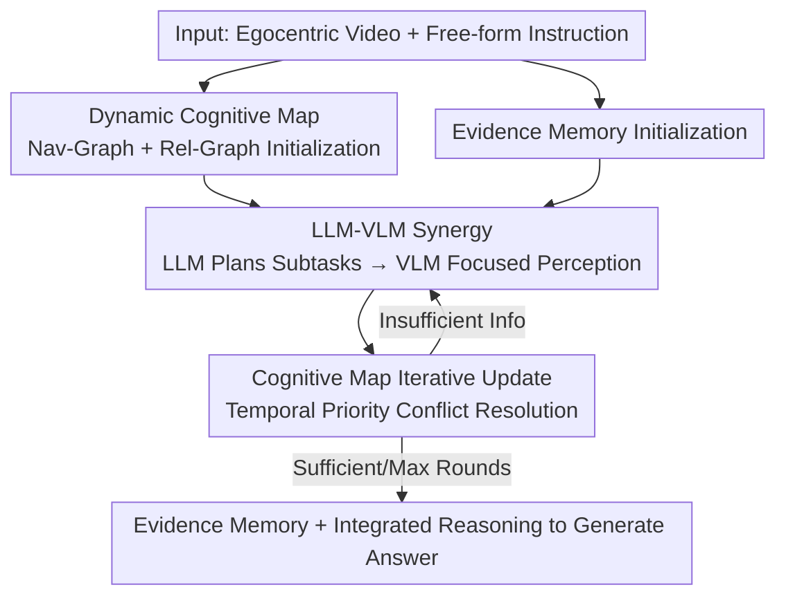

# CLiViS: Unleashing Cognitive Map through Linguistic-Visual Synergy for Embodied Visual Reasoning

**Conference**: CVPR 2026  
**Paper**: [CVF Open Access](https://openaccess.thecvf.com/content/CVPR2026/html/Li_CLiViS_Unleashing_Cognitive_Map_through_Linguistic-Visual_Synergy_for_Embodied_Visual_CVPR_2026_paper.html)  
**Code**: https://github.com/Teacher-Tom/CLiViS  
**Area**: Embodied Visual Reasoning / Agent  
**Keywords**: Embodied Visual Reasoning, LLM-VLM Synergy, Cognitive Map, Egocentric Video, Training-free Framework  

## TL;DR
CLiViS decomposes egocentric video question answering into a training-free loop where the "LLM acts as a planner and the VLM acts as a perceptual executor." Together, they maintain a **dynamic cognitive map** (navigation graph + relationship graph) that evolves during reasoning. This bridges fine-grained perception and high-level reasoning through structured scene representations, achieving SOTA results on OpenEQA, EgoTempo, and EgoSchema benchmarks.

## Background & Motivation
**Background**: Embodied Visual Reasoning (EVR, also known as EM-EQA) requires models to perform semantic understanding and spatial-temporal reasoning based on egocentric videos and free-form instructions. Existing approaches are divided into two categories: **Socratic strategies**, which translate videos into text using captioning models before feeding them to an LLM; and **end-to-end VLMs**, which fuse vision and language at the feature level to generate answers.

**Limitations of Prior Work**: In Socratic strategies, captions are fixed and instruction-agnostic, often missing fine-grained visual details relevant to the question. End-to-end VLMs, while strong in open-vocabulary perception, lack high-level logical planning and multi-step reasoning capabilities, failing to organize necessary steps like "event localization → object identification → relationship extraction" systematically. Later video reasoning methods (e.g., VideoAgent, VideoTree, Video-R1) either involve high training costs or relegate the LLM to a passive frame selector, failing to utilize its full planning potential.

**Key Challenge**: EVR simultaneously presents two difficulty dimensions: **spatial-temporal perception** challenges caused by long sequences and narrow fields of view, and **compositional reasoning** challenges arising from complex, diverse instructions. LLMs excel at reasoning but cannot "see" the video, while VLMs excel at perception but lack planning skills. Any single component fails in the other dimension.

**Goal**: To enable a strong LLM and a VLM to collaborate complementarily without additional training, preserving open-vocabulary perception while adding multi-step structured reasoning.

**Key Insight**: A **shared, evolvable intermediate representation** is missing between perception and reasoning. If a structured scene graph exists, the LLM can read "what has already been seen" to plan where to look next, and the VLM can supplement the graph based on instructions, forming a "hypothesis-verification" closed loop.

**Core Idea**: Use a **dynamic cognitive map** that refreshes iteratively during reasoning as a bridge. The LLM decomposes subtasks and drives focused perception by the VLM based on the map and instructions; the VLM's observations are then written back into the map until sufficient information is gathered to answer.

## Method
CLiViS is a training-free framework that reformulates EVR as a task where an LLM and VLM collaboratively build a dynamic cognitive map to support reasoning. Formally, the standard $R = f_\theta(V, I)$ (video $V$, instruction $I$, answer $R$) is rewritten as:

$$R = \text{LLM}\!\left(M, I \,\middle|\, M = \bigcup_{T_i \in \text{LLM}(I, M)} \text{VLM}(V, T_i)\right)$$

where $M$ is the cognitive map, and $T = \{T_i\}$ is a sequence of subtasks decomposed by the LLM based on known information $I$ and the current $M$. Compared to the Socratic $R = \text{LLM}(\text{Cap}(V), I)$ and end-to-end $R = \text{VLM}(V, I)$ paradigms, the key difference in CLiViS is that $M$ is not a one-time product but grows through repeated interaction between the LLM and VLM.

### Overall Architecture
The reasoning process consists of three phases: **(1) Cognition and Memory Initialization**: The video is segmented into fixed intervals (e.g., 30s), the VLM generates coarse descriptions, and the LLM extracts entities, actions, and relations to build an initial cognitive map while initializing an evidence memory buffer. **(2) Linguistic-Visual Synergy and Cognitive Update**: In an iterative loop, the LLM reads the current map and evidence memory to judge if information is sufficient. If not, it generates a focused sub-instruction (e.g., "Look at what is to the left of the hawthorn juice in the fridge") to drive VLM perception. The VLM's response is parsed into new entities/relations and written back. **(3) Integrated Reasoning and Answer Generation**: Once the LLM determines information is sufficient or the maximum number of rounds is reached, it integrates the map and memory to produce the final answer.

### Key Designs

**1. LLM-VLM Synergy Paradigm: LLM as Planner, VLM as Perceptual Executor**

To address the dilemma where Socratic methods miss details and end-to-end VLMs cannot plan, CLiViS separates roles: the LLM acts as a high-level planner, assigning subtasks (from key object recognition to relationship extraction) based on instructions and accumulated scene cognition. The VLM acts as a perceptual executor, extracting task-relevant visual cues from video segments. Unlike static pipelines like VideoTree or LVNet, CLiViS employs an active **hypothesis-verification loop**—the LLM proposes "it might be X," directs the VLM to verify it in a specific timeframe, and decides the next step based on the result. This loop is the root cause of its superiority over other training-free methods.

**2. Dynamic Cognitive Map: Structuring Space-Time and Entities via Dual Sub-graphs**

To bridge the gap between perception and reasoning, the scene is explicitly built as a graph $M = \{G_{nav}, G_{rel}\}$. The **Navigation Graph** $G_{nav} = (V_{nav}, E_{nav})$ captures the temporal structure: each node $v_i$ is a time segment (storing regions, entities, actions, and captions), and edges $e_{ij}$ represent temporal adjacency. The **Relationship Graph** $G_{rel} = (V_{rel}, E_{rel})$ models fine-grained entity-level relations: nodes are visual entities or actions, and edges are semantic relations (spatial, agent-object interaction, functional dependency, e.g., "corn ← left to → hawthorn juice"). This dual perspective allows the map to localize "when and where" while answering "who did what to whom," compressing scattered observations into structured grounding.

**3. Cognitive Map Iterative Update: Conflict Resolution via Temporal Priority**

The map is updated each round following the initial $M^{(0)}$:

$$M^{(i)} = \text{Update}\!\left(M^{(i-1)},\ \text{VLM}(V_{T_i}, T_i)\right)$$

The challenge of `Update` is avoiding conflicts between new and old information. Relevant temporal sub-graphs are extracted as context, and the LLM identifies new entities/relations from the VLM output. Conflict resolution follows a **temporal priority principle**: newer VLM observations overwrite older, contradictory information. All updates are handled **atomically** for consistency, and key entity management ensures the map remains focused on question-relevant parts.

**4. Evidence Memory and Integrated Reasoning: Accumulating Interpretable Rationales**

Supplementing the map, an **Evidence Memory** $E$ stores high-level semantic cues distilled from interactions. Each evidence atom is defined as:

$$E = (r, \tau, O)$$

where $r$ is a linguistic rationale regarding the query, $\tau$ is the timeframe, and $O$ is the set of involved objects/actions. This memory improves interpretability by explicitly recording the "chain of reasoning." In each round, the LLM generates a response $R_i = \text{LLM}(M^{(i)}, E^{(i)}, I)$ and decides whether to exit:

$$R_i = \begin{cases} R & \text{if } \text{Exit} = \text{True} \\ T_{i+1} & \text{if } \text{Exit} = \text{False} \end{cases}$$

The LLM output either serves as the final answer or the next subtask $T_{i+1}$, tightly coupling perception and reasoning.

## Key Experimental Results

### Main Results
Testing on three benchmarks: OpenEQA (1,079 QA), EgoTempo (500 QA, temporal-intensive), and EgoSchema (500 MCQs, 3-minute videos). Open-ended benchmarks are scored by Qwen2.5-Max on a 5-point Likert scale (score ≥ 4 is correct). All models are 7B–8B scale, with 30s segments and 10 max rounds.

| Method | Paradigm | OpenEQA | EgoTempo | EgoSchema | Avg. |
|------|------|---------|----------|-----------|------|
| Qwen2.5-VL + Qwen2.5-Max | Socratic | 23.0 | 5.8 | 58.6 | 29.1 |
| Qwen2.5-VL | End-to-end VLM | 40.7 | 16.2 | 64.8 | 40.6 |
| InternVL3 | End-to-end VLM | 53.6 | 17.0 | 66.6 | 45.7 |
| VideoLLaMA3 | End-to-end VLM | 57.1 | 19.8 | 62.2 | 46.4 |
| Video-R1 | Video Reasoning | 41.9 | 16.4 | 46.6 | 35.0 |
| VideoTree | Video Reasoning | 16.4 | 14.8 | 60.0 | 30.4 |
| **CLiViS (InternVL3)** | **Ours** | **55.4** | **23.0** | **69.4** | **49.3** |
| **CLiViS (VideoLLaMA3)** | **Ours** | 57.3 | 23.4 | 64.8 | 48.4 |

Ours achieves SOTA across all three benchmarks (OpenEQA 55.4%, EgoTempo 23.0%, EgoSchema 69.4%) with an average accuracy of 49.3%. Compared to the best in each category: +20.2% over Socratic, +2.9% over end-to-end VLM, and +14.3% over video reasoning methods. Gain increases with video length: on OpenEQA with Qwen2.5-VL, gain is +3.5% for <30s videos vs. +6.5% for ≥30s videos.

### Model-agnosticism
Using Qwen2.5-Max as the LLM with different VLM backbones:

| VLM Backbone | OpenEQA | EgoTempo | EgoSchema | Avg. |
|----------|---------|----------|-----------|------|
| Qwen2.5-VL baseline | 40.7 | 16.2 | 64.8 | 40.6 |
| + CLiViS | 46.9 (+6.2) | 19.6 (+3.4) | 68.2 (+3.4) | 44.9 (+4.3) |
| InternVL3 baseline | 53.6 | 17.0 | 66.6 | 45.7 |
| + CLiViS | 55.4 (+1.8) | 23.0 (+6.0) | 69.4 (+2.8) | 49.3 (+3.6) |

### Ablation Study
On EgoTempo (InternVL3 + Qwen2.5-Max):

| Configuration | Accuracy | Description |
|------|--------|------|
| full model (VLM + LLM) | 23.0 | Complete model |
| w/o Navigation Graph | 20.6 (-2.4) | Impaired temporal localization |
| w/o Relation Graph | 21.4 (-1.6) | Lost fine-grained spatial relations |
| w/o Evidence Memory | 22.4 (-0.6) | Weaker rationale tracking |
| w/o Multi-round (Single round) | 12.5 (-10.5) | Loop collapsed to one step |
| w/ VLM for high-level reasoning | 10.6 (-12.4) | InternVL3 replacing LLM for planning |
| baseline (VLM only) | 17.0 (-6.0) | Pure VLM |

### Key Findings
- **The most critical components are architectural, not map-based**: Collapsing multi-round synergy into a single round causes a 10.5% drop, and replacing the LLM planner with a VLM causes a 12.4% plunge. This proves iterative synergy and a dedicated strong LLM planner are fundamental.
- **Clear division of labor between sub-graphs**: The Navigation Graph handles temporal localization, while the Relationship Graph handles spatial relations. Both are necessary.
- **Competitive Latency-Accuracy Trade-off**: On EgoSchema, CLiViS (195s / 69.4%) is 9.4% more accurate than VideoTree (71s / 60.0%) and both faster and more accurate than VideoAgent (644s / 62.0%).

## Highlights & Insights
- **Dynamic Cognitive Map as an evolvable intermediary**: It is neither a fixed caption nor a black-box feature, but a structured graph that the LLM can read, write, and refresh. This enables "on-demand perception."
- **Conflict Resolution via Temporal Priority**: This ensures the map stays updated and focused during long videos without exploding in size, a critical engineering detail for handling long-range dependencies.
- **LLM Planning is Indispensable**: The significant drop when using a VLM for planning confirms that a strong LLM's planning capability is irreplaceable for embodied reasoning.
- **Training-free and Model-agnostic**: The framework works out-of-the-box with various VLM backbones, providing consistent gains and high practical value.

## Limitations & Future Work
- **High Latency**: 195s per question is heavy for real-time embodied applications; multi-round LLM-VLM turnarounds are the primary overhead.
- **Dependency on Strong LLMs**: Gains are tied to high-tier LLMs like Qwen2.5-Max. The sensitivity of planning quality to weaker LLMs or the API costs involved requires more discussion.
- **Offline EM-EQA Focus**: Currently limited to pre-recorded videos; applicability to Active EQA (A-EQA) involving navigation and interaction remains to be verified.
- **Prompt Engineering Dependency**: Map updates rely heavily on carefully designed prompts, which may affect robustness across different domains.

## Related Work & Insights
- **vs. Socratic Strategies**: Socratic methods use instruction-agnostic captions; CLiViS uses "on-demand perception" via LLM queries, outperforming them by ~20%.
- **vs. End-to-end VLMs**: While VLMs have strong perception, they lack planning; CLiViS builds a planning loop on top of existing VLMs to provide stable gains.
- **vs. Video Reasoning Methods**: Static pipelines like VideoTree fail on complex verification; Video-R1 requires expensive training. CLiViS is training-free and uses an iterative loop to消解 ambiguity, outperforming VideoTree by 9.4% on EgoSchema while being faster than VideoAgent.

## Rating
- Novelty: ⭐⭐⭐⭐ Uses a dynamic cognitive map and hypothesis-verification loop as a synergy medium; clear, training-free approach, though individual components have precedents.
- Experimental Thoroughness: ⭐⭐⭐⭐ Three benchmarks, multiple VLM backbones, extensive ablations, and latency analysis; lacks systematic testing across LLM capability levels.
- Writing Quality: ⭐⭐⭐⭐ Clear formalization, intuitive diagrams, and well-explained three-phase process.
- Value: ⭐⭐⭐⭐ Training-free and model-agnostic; highly relevant for long-range embodied reasoning, though latency remains a deployment hurdle.

<!-- RELATED:START -->

## Related Papers

- [\[CVPR 2026\] EgoMind: Activating Spatial Cognition through Linguistic Reasoning in MLLMs](egomind_activating_spatial_cognition_through_linguistic_reasoning_in_mllms.md)
- [\[CVPR 2026\] Dr. Seg: Revisiting GRPO Training for Visual Large Language Models through Perception-Oriented Design](dr_seg_revisiting_grpo_training_for_visual_large_language_models_through_percept.md)
- [\[CVPR 2026\] Think Visually, Reason Textually: Vision-Language Synergy in Abstract Reasoning](think_visually_reason_textually_vision-language_synergy_in_abstract_reasoning.md)
- [\[CVPR 2026\] MindPower: Enabling Theory-of-Mind Reasoning in VLM-based Embodied Agents](mindpower_enabling_theoryofmind_reasoning_in_vlmba.md)
- [\[ICML 2026\] CSMR (Look on Demand): A Cognitive Scheduling Framework for Visual Evidence Acquisition in Multimodal Reasoning](../../ICML2026/vlm_reasoning/look_on_demand_a_cognitive_scheduling_framework_for_visual_evidence_acquisition_.md)

<!-- RELATED:END -->
