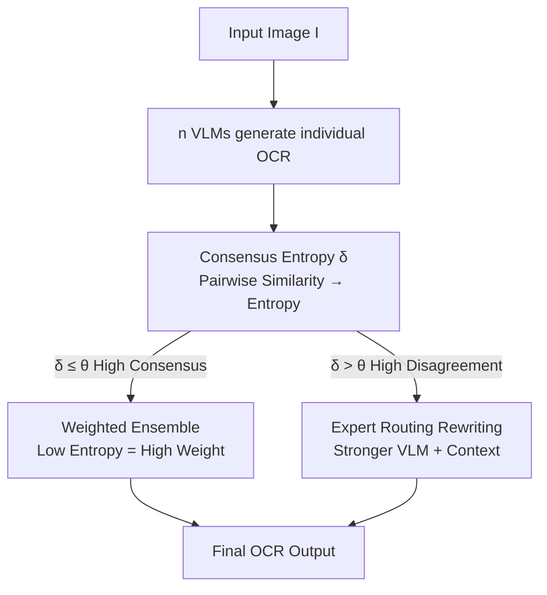

# Consensus Entropy: Harnessing Multi-VLM Agreement for Self-Verifying and Self-Improving OCR

**Conference**: CVPR 2026  
**Paper**: [CVF Open Access](https://openaccess.thecvf.com/content/CVPR2026/html/Zhang_Consensus_Entropy_Harnessing_Multi-VLM_Agreement_for_Self-Verifying_and_Self-Improving_OCR_CVPR_2026_paper.html)  
**Code**: https://github.com/Aslanyulong/consensus-entropy  
**Area**: Multimodal VLM  
**Keywords**: OCR quality verification, multi-model consensus, entropy, unsupervised, adaptive routing

## TL;DR
This paper proposes Consensus Entropy (CE), a training-free and model-agnostic metric that judges output reliability in an unsupervised manner by measuring whether OCR results from multiple VLMs converge. Based on this, the CE-OCR framework is built (consensus entropy-weighted ensemble + entropy threshold routing to a stronger model), improving quality verification F1 by 42.1% compared to VLM-as-Judge and increasing OCR accuracy by 8.2% on datasets like OCRBench, while routing only 7.3% of samples.

## Background & Motivation
**Background**: OCR has evolved from specialized algorithms into a core capability of VLMs. OCR accuracy has become a key metric for measuring the vision-language understanding of multimodal models, and extracted text serves as a critical data source for training LLMs. However, evaluation remains limited to average scores on standard benchmarks.

**Limitations of Prior Work**: High average scores do not guarantee single-sample reliability. The authors observed that even top-tier models like Qwen2.5-VL-72B and GPT-4o frequently produce semantic errors and formatting inconsistencies. These errors are often missed by traditional metrics—sometimes models with higher benchmark rankings perform worse in practical scenarios. Existing remedies fall into two categories, both ineffective: multimodal re-evaluation is hindered by the evaluator's own uncertainty, introducing secondary noise; VLM-as-Judge only assesses text quality and cannot verify whether the "visual input matches the textual output."

**Key Challenge**: OCR lacks high-quality labels, and manual annotation is expensive. Consequently, there has long been a lack of reliable unsupervised methods to determine if an OCR output is correct. Since even SOTA models cannot achieve zero error, relying on a single model's self-assessment is inherently biased.

**Goal**: To enable models to **verify** (distinguish correct from incorrect) and **improve** (correcting the errors) OCR results without human supervision or retraining.

**Key Insight**: The authors observed 210 VLMs on OCRBench and identified three simple but useful patterns: (1) OCR tasks usually have a unique semantic ground truth; (2) when models are correct, their outputs tend to cluster tightly in the semantic space; (3) when they are wrong, the outputs are scattered with high entropy. This cross-model behavior—"convergence when correct, divergence when wrong"—serves as a reliable, label-free signal for reliability.

**Core Idea**: Use the "entropy of the pairwise similarity distribution among multiple independent VLM outputs" to measure the degree of consensus (Consensus Entropy). Low entropy indicates high consensus and a high probability of correctness; high entropy indicates disagreement and a likelihood of error. This entropy then drives both ensemble weighting and routing decisions.

## Method

### Overall Architecture
CE-OCR is a training-free "generate → evaluate → decide" pipeline. Given an image, $n$ independent VLMs first generate individual OCR results. These results are compared pairwise, similarities are converted into a probability distribution, and a scalar Consensus Entropy $\delta$ is calculated. Finally, a threshold gate $\theta$ decides the processing path: if $\delta \le \theta$ (high consensus), the consensus entropy-weighted ensemble output is used; if $\delta > \theta$ (high disagreement/potential error), the image, individual model outputs, and the ensemble result are routed to a stronger VLM for rewriting. The entire process requires no labels or fine-tuning and is performed entirely at inference time.

### Key Designs

**1. Consensus Entropy (CE): Unsupervised correctness measurement via "entropy of pairwise output similarity"**

This addresses the pain point of "being unable to judge single OCR correctness without labels" by shifting quality assessment from "supervised scoring" to "unsupervised consistency analysis." For a single image, $n$ model outputs $\{O_1, \dots, O_n\}$ are collected, and pairwise similarities are calculated using task-relevant metrics: Edit Distance for character-level precision tasks (standard OCR, math) and Cosine Similarity of text encoder embeddings for semantic tasks. For character-level tasks, normalized similarity is calculated at each position $k$:

$$s_{ij}(k) = 1 - \frac{\text{EditDist}(o_i^k, o_j^k)}{\max(|o_i^k|, |o_j^k|)}$$

This is normalized into a probability $p_{ij}(k) = s_{ij}(k)/\sum_{j'} s_{ij'}(k)$, and entropy is calculated for each pair:

$$E_{ij} = -\sum_k p_{ij}(k)\log p_{ij}(k)$$

The key lies in using entropy (distributional uncertainty) rather than a single scalar to characterize the difference between two outputs. The paper provides an example: three VLMs read an invoice number as "Invoice", "1nvoice", and "Invoice". The similarities relative to the first are $(1.0, 0.86, 1.0)$, normalized to $p=(0.35, 0.30, 0.35)$, with an entropy $H=1.09$ (near uniform = disagreement). If all three were identical, $H=0$ (perfect consensus). The average entropy distance for each output is $E_i = \frac{1}{n-1}\sum_{j\ne i} E_{ij}$. The scalar $\delta$ is derived by modeling the distribution: for semantic tasks, Kernel Density Estimation (KDE) is used with weights inversely proportional to $E_i$; for character tasks, entropy is calculated directly from the pairwise distance distribution. The authors found **Mean Distance** (average of $E$ values) to be "grid-independent" and "order-preserving," making it the most stable default.

**2. CE-Ensemble: Token-level ensemble using inverse consensus entropy as weights**

This addresses the issue where "simple averaging or voting is biased by outlier errors." CE-Ensemble reuses the entropy framework for weighting—lower $E_i$ (closer to consensus) results in higher weight:

$$w_i = \frac{1/E_i}{\sum_{j=1}^{n} 1/E_j}$$

Since text cannot be directly averaged, dynamic programming aligns all outputs to find corresponding tokens. For each position $k$, the token with the highest weighted consensus is selected: $t^*_k = \arg\max_{t\in T_k}\sum_{i:\,t\in O_i} w_i$. This automatically downweights outliers and allows reliable models to dominate the result.

**3. Threshold Gate Routing + Expert Rewriting: Allocating compute only to difficult samples**

This addresses the cost of "feeding all samples to Large VLMs" vs the failure of "small ensembles on hard samples." A threshold gate $\theta$ is introduced for binary routing:

$$R(\delta,\theta) = \begin{cases} 0, & \delta \le \theta \\ 1, & \delta > \theta \end{cases}$$

If $R=0$, the CE-Ensemble output is used. If $R=1$ (entropy exceeds threshold, indicating high probability of error), the task is routed to a stronger VLM $M_{\text{exp}}$, using the image and previous outputs as context: $O_{\text{final}} = M_{\text{exp}}(I, \{O_1,\dots,O_n\}, O_{\text{ens}})$. $\theta \approx 0.5$ was found to be optimal for most tasks, requiring only 7.3% of samples to be rewritten to achieve major gains.

## Key Experimental Results

### Main Results

Unsupervised quality verification (1000-page human-annotated PDF, F1 score): CE significantly outperforms VLM-as-Judge across most difficulty levels, with an average F1 improvement of 15.2 (+42.1%).

| Reference Model | VLM-as-Judge F1 | CE (Ours) F1 | Gain |
|----------|-----------------|--------------|------|
| GPT-4o | 40.0 | 48.0 | +20.0% |
| Qwen2-VL-7B | 36.1 | 51.3 | +42.1% |
| Qwen2-VL-72B | 39.8 | 51.0 | +28.1% |

CE-OCR Self-Improvement (OCRBench-V2 components, threshold 0.5): Compared to the base ensemble, there are relative improvements of +5~6.5% in English OCR/Math/Chinese, with math showing particularly strong performance.

| Method | En | Math | Elem | Cn All |
|------|----|----|----|----|
| GPT-4o | 61.2 | 43.4 | 29.8 | 32.2 |
| InternVL2.5-26B | 65.6 | 37.4 | 32.6 | 44.2 |
| Gemini Pro | 61.2 | 47.7 | 30.9 | 43.1 |
| CE-Ensemble | 67.2 | 50.1 | 34.0 | 45.7 |
| CE-OCR (GPT-4o Rewrite) | **71.6** | **53.1** | 33.8 | **48.0** |
| Rel. Best Single Model | +9.1% | +11.3% | +3.7% | +8.6% |

CE-Ensemble also allows an ensemble of small models to outperform single SOTA models: e.g., an ensemble of Ovis2-1B, Qwen2.5VL-7B, Step1V, and Step1o reaches **955** (exceeding the SOTA single model at 926).

### Ablation Study

Component removal on OCRBench (Total 1000, Rel. Perf. indicates relative to full framework):

| Configuration | Score↑ | % Routed | Rel. Perf. |
|------|--------|--------|----------|
| w/o CE (Max of single models) | 888 | 0% | 97.9% |
| w/o Ensemble (Mean of single models) | 852 | 0% | 93.9% |
| w/o Routing (All ensemble) | 902 | 0% | 99.4% |
| Full CE-OCR | **907** | 7.3% | 100% |

Comparison with classic ensemble methods (3-VLM, average $\Delta$): ROVER's discrete word-level voting fails on open-ended VLM outputs (Math-VQA -92.0%) due to alignment issues. VL-Uncertainty uses semantic clustering, which improves structured OCR (+3.3%) but drops in semantic VQA as character differences are invisible to semantic embeddings. CE-Ensemble gains across all four task categories, averaging +8.2%.

### Key Findings
- **Ensemble is the skeleton, Routing is the efficiency king**: Removing the ensemble leads to the largest drop (−7.2%), showing that model diversity is the foundation of CE calculation. Removing routing only loses 0.6%, meaning 7.3% additional compute nearly matches "full expert" rewriting.
- **Ensemble scale ensures a stable lower bound**: Increasing from 3 to 5 models, the ensemble always outperforms the worst single model. The ratio of ensembles outperforming the best single model rose from 66.2% to 91.1%.
- **$\theta$ is a continuous knob**: On OCRBench-V2, GPT-4o achieves +8.8% accuracy with 91.2% routing at $\theta=0.2$, allowing for a smooth trade-off between accuracy and compute.
- **Effective even for the same architecture**: Using diversity from the same model series or multiple samplings (T=0.7) also yields gains (+1.83% for QwenVL).
- **Extensible beyond OCR**: By switching between edit and cosine distance, CE also improves non-OCR VQA tasks like Math-VQA (+14.0%) and Knowledge-Reasoning (+10.0%).

## Highlights & Insights
- **Quantizing "convergence if correct, divergence if wrong" as a scalar**: This simple insight is quantified into a training-free, model-agnostic, plug-and-play reliability signal that works for black-box/closed-source APIs.
- **A single entropy value drives three functions**: It serves verification (filter), ensemble (weight), and routing (decision), creating a highly self-consistent design.
- **Distributional entropy vs. single scalar**: Capturing distribution-level uncertainty allows CE to be more robust for diverse generation tasks (code, translation, structured extraction).
- **Engineering robustness of Mean Distance**: The properties of being "grid-independent" and "order-preserving" ensure it is stable across different discrete resolutions, which is crucial for deployment.

## Limitations & Future Work
- **Dependency on model diversity**: Gains are weaker when using only a single model with multiple samplings compared to heterogeneous ensembles.
- **Expert model upper bound**: The final quality for high-entropy samples depends on the expert model $M_{\text{exp}}$. If the expert is also wrong, the framework cannot correct it.
- **Threshold calibration required**: The optimal $\theta$ may shift across different datasets or languages and requires calibration before deployment.
- **Consistent errors**: High consensus on an incorrect answer (e.g., shared bias or data contamination) remains an inherent blind spot for all consensus-based methods.

## Related Work & Insights
- **vs VLM-as-Judge**: The latter is limited by prompt sensitivity, bias, and inability to verify visual-text consistency. CE relies on spatial consistency, yielding 42.1% higher F1.
- **vs VL-Uncertainty**: CE addresses character-level differences through edit distance, whereas semantic clustering fails for structured OCR.
- **vs ROVER**: Discrete voting fails on open-ended VLM phrasing; CE operates in a continuous similarity space and is more robust.
- **vs Self-Consistency**: SC relies on multiple samplings of the same model. CE-OCR leverages cross-model consensus and dynamic routing, which is more effective (avg +8.2% vs SC avg -2.8%).

## Rating
- Novelty: ⭐⭐⭐⭐⭐ The quantification of consensus into a unified entropy metric for verification/ensemble/routing is elegant.
- Experimental Thoroughness: ⭐⭐⭐⭐⭐ Massive model scale and extensive ablation across diverse benchmarks.
- Writing Quality: ⭐⭐⭐⭐ Clear motivation and examples; some technical details are pushed to the appendix.
- Value: ⭐⭐⭐⭐⭐ Practical solution for unsupervised OCR quality control and data cleaning.

<!-- RELATED:START -->

## Related Papers

- [\[ICLR 2026\] Through the Lens of Contrast: Self-Improving Visual Reasoning in VLMs](../../ICLR2026/vlm_reasoning/through_the_lens_of_contrast_self-improving_visual_reasoning_in_vlms.md)
- [\[ICLR 2026\] Let's Think in Two Steps: Mitigating Agreement Bias in MLLMs with Self-Grounded Verification](../../ICLR2026/vlm_reasoning/lets_think_in_two_steps_mitigating_agreement_bias_in_mllms_with_self-grounded_ve.md)
- [\[CVPR 2026\] Evolving Contextual Safety in Multi-Modal Large Language Models via Inference-Time Self-Reflective Memory](evolving_contextual_safety_in_multi-modal_large_language_models_via_inference-ti.md)
- [\[CVPR 2026\] dMLLM-TTS: Self-Verified and Efficient Test-Time Scaling for Diffusion Multi-Modal Large Language Models](dmllm-tts_self-verified_and_efficient_test-time_scaling_for_diffusion_multi-moda.md)
- [\[CVPR 2026\] Self-Critical Distillation Network for Video-based Commonsense Captioning](self-critical_distillation_network_for_video-based_commonsense_captioning.md)

<!-- RELATED:END -->
