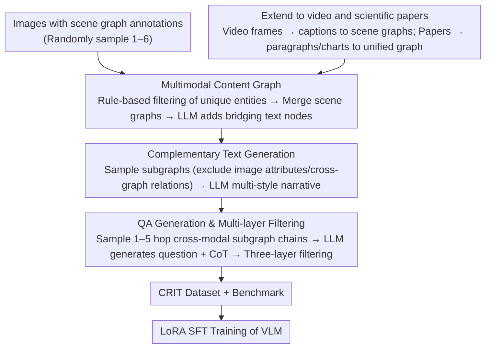

# CRIT: Graph-Based Automatic Data Synthesis to Enhance Cross-Modal Multi-Hop Reasoning

**Conference**: CVPR 2026  
**arXiv**: [2604.01634](https://arxiv.org/abs/2604.01634)  
**Code**: None  
**Area**: Multimodal VLM  
**Keywords**: Cross-Modal Reasoning, Multi-Hop Reasoning, Data Synthesis, Graph-Based Pipeline, VLM Benchmark

## TL;DR

A graph-based automatic data generation pipeline is proposed to construct the CRIT dataset and benchmark. It is designed to train and evaluate the cross-modal multi-hop reasoning capabilities of VLMs on interleaved image-text content. Models trained with this data achieve significant improvements on multiple benchmarks, including SPIQA.

## Background & Motivation

Real-world reasoning often requires integrating information across modalities: for example, reading a DIY tutorial requires constant cross-referencing between text instructions and accompanying images. However, existing multimodal benchmarks have serious flaws:

**Background**: Most benchmarks involve only a single image or a set of images where answers can often be inferred from a single modality, failing to test true cross-modal reasoning.

**Limitations of Prior Work**: Although large amounts of interleaved image-text data are used for pre-training, very little of it actually requires complementary cross-modal reasoning.

**Key Challenge**: Even SOTA models (e.g., GPT-4o) frequently produce hallucinations disconnected from visual/textual evidence when CoT reasoning is required.

Directly using VLMs to generate complex reasoning data introduces circular bias (generating and evaluating with the same type of model) and hallucination issues. This paper uses a graph structure as an intermediate representation, allowing for the generation of QA pairs using **only LLMs (no VLM required)** throughout the process, thereby avoiding these issues.

## Method

### Overall Architecture

CRIT addresses the dual shortage of both training data and evaluation benchmarks for cross-modal multi-hop reasoning. Directly using VLMs for such data generation leads to circular bias and hallucinations. The core idea is to introduce a **graph structure as an intermediate representation**, enabling an LLM-only pipeline (without VLMs) to create QA pairs that truly require complementary information from both images and text. First, images with scene graph annotations are constructed into a unified multimodal content graph. Then, complementary text is generated based on subgraphs. Finally, multi-hop QA pairs are generated by sampling cross-modal subgraph chains. By adapting the "graph construction" step, the data source can be expanded from natural images to video frames and scientific papers. The resulting CRIT dataset serves as both a training set (LoRA SFT) and an evaluation benchmark.

### Key Designs

**1. Multimodal Content Graph: Using Programmable Graph Structures to Enforce "Cross-Modal Multi-Hop" Constraints**

Directly prompting a VLM to generate data makes it difficult to ensure that questions truly require cross-image and cross-modal reasoning. CRIT organizes content into a directed graph $G=(\mathcal{V}, \mathcal{E})$, where nodes are entities (visual objects or text entities) and edges are relations. After sampling 1-6 annotated images, rule-based filtering retains only entities uniquely identifiable by attributes or relations to avoid ambiguity. LLMs then generate new text entities and relations as bridging nodes across images. In this way, multi-hop and cross-modal constraints are programmatically encoded into the graph rather than relying on chance.

**2. Complementary Text Generation: Ensuring Text Only Supplements What Images Omit to Force True Cross-Modal Dependency**

If the text redundantly describes information present in the images, the problem degenerates into a single-modality task. CRIT extracts associated subgraphs for each image but **excludes image node attributes and cross-graph relations** (which the model must infer from the images during reasoning). LLMs then generate text in various narrative styles (stories, diaries, documentaries), describing only the enhanced text nodes and their connections to image nodes without leaking visual information. Thus, text and images become strictly complementary.

**3. QA Generation and Multi-layer Filtering: Ensuring Every Question is "Not Answerable Without Cross-Modality"**

Cross-modal subgraph chains with 1-5 edges are sampled, with terminal nodes required to be from images. The LLM generates questions based on serialized subgraph JSONs and target answers (with constraints preventing direct mention of intermediate entities), while also producing CoT reasoning chains. Three layers of filtering are applied: (a) removing samples that explicitly mention intermediate entities in the question; (b) using three different LLMs to verify if the question is answerable via a single modality and deleting those that are; (c) pruning excessively long CoTs. Multi-stage oversight ensures the remaining questions depend on cross-modal multi-hop reasoning.

**4. Extension to Video and Scientific Papers: Migrating the Same Graph Paradigm to New Modalities**

The entire pipeline can be extended by simply adapting the "graph construction" step. For video, dense caption datasets are used to select frames with high CLIP similarity to captions, which LLMs then convert into scene graphs. For scientific papers, paragraphs, charts, and tables are converted into a unified graph structure, where visual entities are marked and corresponding descriptions are removed from the text. This allows the method to cover domains from natural images to video and scientific papers.

### Loss & Training

- SFT is performed on Qwen2.5-VL-7B and Idefics2-8B using LoRA.
- Each training sample includes both direct answers and CoT formats.
- Data Generation LLM: Qwen3-30B-A3B-Instruct-2507.
- Filtering LLMs: Qwen3-30B + Gemma-3-27b-it + Mistral-Small-3.2-24B.

## Key Experimental Results

### Main Results

CRIT Benchmark Results (CoT evaluation, EM/F1):

| Model | NI-EM | NI-F1 | VF-EM | VF-F1 | SP-EM | SP-F1 |
|------|-------|-------|-------|-------|-------|-------|
| GPT-4o | 35.1 | 37.7 | 32.0 | 38.9 | 8.4 | 14.0 |
| Qwen2.5-VL-7B | 28.3 | 29.1 | 24.0 | 27.8 | 6.8 | 9.6 |
| Qwen2.5-VL-72B | 38.0 | 39.4 | 30.1 | 33.9 | 9.4 | 12.3 |
| **Qwen2.5-VL_CRIT** | **58.6** | **59.5** | **38.8** | **42.2** | **15.9** | **22.5** |
| **Idefics2_CRIT** | **54.1** | **54.9** | **31.2** | **33.9** | **12.3** | **20.2** |

The trained 7B models significantly outperform GPT-4o and the 72B model.

Cross-benchmark transfer effects (Idefics2 + Mantis-Instruct + CRIT vs. Mantis-Instruct only):

| Benchmark | Metric | +CRIT | Mantis only | Gain |
|-----------|--------|-------|-------------|------|
| SPIQA | METEOR | 10.53 | 3.60 | +192% |
| SPIQA | CIDEr | 67.93 | 23.83 | +185% |
| VEGA | ROUGE-L | 35.1 | 29.5 | +19% |
| MMQA | EM | 30.0 | 27.3 | +10% |
| FCMR | F1 | 50.5 | 44.9 | +12% |

### Ablation Study

| Configuration | NI-EM | VF-EM | SP-EM | Description |
|---------------|-------|-------|-------|-------------|
| No Fine-tuning | 28.3 | 24.0 | 6.8 | Baseline |
| CRIT (84k) | 58.6 | 38.8 | 15.9 | Standard training set |
| CRIT Augmented (210k) | 62.6 | 45.6 | 16.7 | Extended training set, largest gain in video domain |

Using model-generated augmented data further improves performance, and the scientific paper domain also benefits from data expansion in natural image/video domains (cross-domain transfer).

### Key Findings

- **SOTA models perform poorly on cross-modal multi-hop reasoning**: GPT-4o achieves only 35.1% EM in the natural image domain and 8.4% in the scientific paper domain.
- **Error Analysis** (75 GPT-4o error samples): 55% are evidence localization errors (the model identifies the wrong image or text paragraph); visual perception errors are 4 times more frequent than text understanding errors.
- **Training does not damage general capabilities**: Adding CRIT maintains or even improves performance on general benchmarks such as MME and SeedBench.

## Highlights & Insights

1. **Design of graph structure as an intermediate representation is ingenious**: Programmable multi-hop and cross-modal constraints via subgraph sampling yield much higher data quality than direct VLM prompting.
2. **LLM-only process without VLMs**: This avoids the circular bias of using VLMs to generate data for VLM evaluation.
3. **Clever single-modality filtering**: Using three different LLMs to independently verify text and visual modalities ensure questions strictly require cross-modal reasoning.
4. **Highly scalable pipeline**: The transition from annotated images to video frames and scientific papers only requires adapting the graph construction stage.

## Limitations & Future Work

- Performance in the scientific paper domain remains low (15.9% EM); precise cross-modal alignment of long text and complex charts remains a challenge.
- Graph construction depends on existing scene graph annotations (GQA) or dense caption annotations (ActivityNet); applicability to completely unannotated scenarios remains to be validated.
- Currently, only 1,446 manually verified test samples were evaluated, which is a relatively limited scale.
- The impact of CoT reasoning chain quality on training effects has not been explored.

## Related Work & Insights

- The paradigm of "Graph intermediate representation → LLM generated QA" can be generalized to other data synthesis tasks requiring structured reasoning.
- "Complementary" constraints (preventing leakage of image attributes and cross-graph relations through text) are key to ensuring cross-modal reasoning quality.
- Error analysis reveals that "evidence localization" is the primary bottleneck for current VLMs, rather than reasoning capability itself.

## Rating

- Novelty: ⭐⭐⭐⭐⭐ — The graph-based data generation pipeline is elegantly designed and solves circular bias in data synthesis.
- Experimental Thoroughness: ⭐⭐⭐⭐ — Includes multi-model comparisons, multi-benchmark transfers, data augmentation, and error analysis.
- Writing Quality: ⭐⭐⭐⭐ — The three-stage pipeline is clearly described, and the flowchart in Fig. 2 is highly informative.
- Value: ⭐⭐⭐⭐⭐ — Conceptually defines and addresses the data and evaluation bottlenecks for cross-modal multi-hop reasoning.

<!-- RELATED:START -->

## Related Papers

- [\[ACL 2025\] FCMR: Robust Evaluation of Financial Cross-Modal Multi-Hop Reasoning](../../ACL2025/vlm_reasoning/fcmr_robust_evaluation_of_financial_cross-modal_multi-hop_reasoning.md)
- [\[ICLR 2026\] Composition-Grounded Data Synthesis for Visual Reasoning](../../ICLR2026/vlm_reasoning/composition-grounded_data_synthesis_for_visual_reasoning.md)
- [\[ACL 2026\] OMHBench: Benchmarking Balanced and Grounded Omni-Modal Multi-Hop Reasoning](../../ACL2026/vlm_reasoning/omhbench_benchmarking_balanced_and_grounded_omni-modal_multi-hop_reasoning.md)
- [\[CVPR 2026\] Can a Second-View Image Be a Language? Geometric and Semantic Cross-Modal Reasoning for X-ray Prohibited Item Detection](can_a_second-view_image_be_a_language_geometric_and_semantic_cross-modal_reasoni.md)
- [\[CVPR 2026\] Chain-of-Thought Guided Multi-Modal Object Re-Identification](chain-of-thought_guided_multi-modal_object_re-identification.md)

<!-- RELATED:END -->
