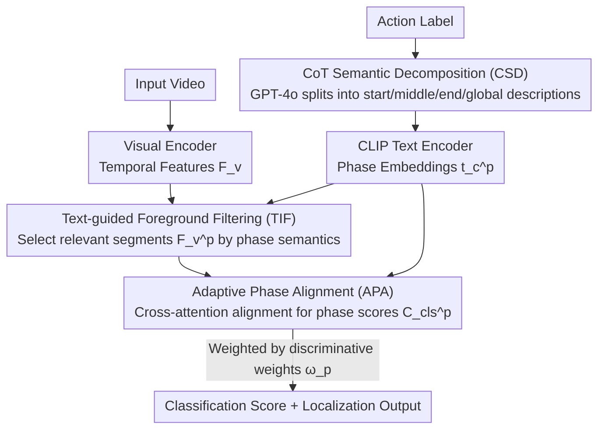

# Decompose and Transfer: CoT-Prompting Enhanced Alignment for Open-Vocabulary Temporal Action Detection

**Conference**: CVPR 2026  
**arXiv**: [2603.24030](https://arxiv.org/abs/2603.24030)  
**Code**: None  
**Area**: Video Understanding  
**Keywords**: Open-Vocabulary Temporal Action Detection, Chain-of-Thought Prompting, Action Phase Decomposition, Cross-modal Alignment, Knowledge Transfer

## TL;DR
The Phase-wise Decomposition and Alignment (PDA) framework is proposed, utilizing the Chain-of-Thought (CoT) reasoning capabilities of LLMs to decompose action labels into "start-middle-end" phase descriptions. Through text-guided foreground filtering and adaptive phase alignment, it achieves fine-grained action pattern transfer. On THUMOS14 OV-TAD, it reaches an Avg mAP of 46.9 (surpassing the Prev. SOTA Ti-FAD's 41.2).

## Background & Motivation
**Background**: Open-Vocabulary Temporal Action Detection (OV-TAD) requires locating and classifying unseen action categories, where the core challenge is transferring knowledge from seen categories.

**Limitations of Prior Work**: Existing methods typically perform global text-visual alignment at the label level, making it difficult to capture fine-grained temporal patterns shared between different actions. For example, the labels "LongJump" and "PoleVault" have low semantic similarity, but their run-up and takeoff phases are visually highly similar.

**Key Challenge**: Label-level semantic alignment cannot discover transferable visual patterns across categories, leading to limited generalization capabilities for unseen classes.

**Goal**: Extract and transfer shared phase-level visual priors across different actions to achieve better open-vocabulary generalization.

**Key Insight**: Simulating human cognition—understanding that an action unfolds progressively (start → execution → completion)—and utilizing the CoT capability of LLMs to automatically decompose actions into multiple phases.

**Core Idea**: Decompose action labels into phase descriptions → Perform text-visual alignment for each phase independently → Adaptively aggregate the alignment results from each phase.

## Method

### Overall Architecture
PDA aims to address the limitation of label-level alignment in OV-TAD where transferring knowledge between dissimilar labels (e.g., "LongJump" to "PoleVault") is difficult. The approach explicitly models actions as unfolding processes. An input video first has its features extracted via a visual encoder. Action labels are processed by GPT-4o using CoT reasoning to be decomposed into {start, middle, end, global} phase descriptions. Each phase then undergoes "text-guided foreground segment selection → cross-modal alignment → classification scoring," followed by an adaptive weighting mechanism to aggregate results. The pipeline consists of CSD (Decomposition), TIF (Segment Selection), and APA (Alignment & Aggregation).

### Key Designs

**1. CoT Semantic Decomposition (CSD): Decomposing labels into "start-middle-end" to reveal cross-category shared patterns**

The bottleneck of label-level alignment is that "LongJump" and "PoleVault" are semantically distant as wholes, yet their run-up acceleration and takeoff phases are visually almost identical. These transferable priors are obscured when compressed into a single label. CSD uses GPT-4o with CoT to decompose each action into four descriptions following natural temporal order. For example, "LongJump" is split into start="runway acceleration", mid="ground takeoff", and end="landing in sandpit". These are encoded into phase embeddings $t_c^p = \Phi_{txt}(s_c^p)$ via a CLIP text encoder. Once decomposed, shared phases become explicit independent alignment units, allowing unseen categories to borrow discriminative priors from seen categories with matching phases.

**2. Text-guided Foreground Filtering (TIF): Selecting relevant segments based on phase semantics instead of fixed temporal splitting**

Uniformly splitting a video into three segments is problematic because a video may contain multiple actions or varying action durations. TIF uses text to select segments: for each phase $p$, the similarity between the phase text embedding and temporal video features is calculated. Phase-level foreground confidence $S_{fg}^p$ is obtained via max-pooling over the category dimension followed by Softmax. Using the mean similarity as a threshold for binarization, the model filters segments that semantically match the phase: $F_v^p = \hat{S}_{fg}^p \cdot F_v$. This ensures each phase receives semantically relevant video content rather than a fixed mechanical window.

**3. Adaptive Phase Alignment (APA): Weighted aggregation based on discriminativeness**

Informational value varies across phases—some actions are recognizable at the start (unique takeoff posture), while others require the landing to be certain. APA first performs independent cross-attention fusion $\bar{F}_v^p = \text{CrossAttn}(F_v^p, F_t^p)$ to obtain phase classification scores $C_{cls}^p = \bar{F}_v^p \cdot F_t^{p\top}$. A Sigmoid network then predicts weights from visual features $\omega_p = \text{Sigmoid}(W_p(F_v^p))$, and the final classification is aggregated:

$$C_{cls} = \sum_{p} \omega_p \cdot C_{cls}^p$$

Learning weights from data allows the model to decide which phases to prioritize for a specific action, providing more flexibility than simple averaging.

### A Complete Example: Cross-category Transfer from LongJump to PoleVault
Assume PoleVault is an unseen category at test time. CSD decomposes it into start="runway acceleration with pole", mid="planting pole and takeoff", and end="clearing bar and landing". During the start phase, TIF uses the "runway acceleration" text to filter the initial approach segments $F_v^{start}$. Since the seen category LongJump also contains "runway acceleration" and "takeoff" phases in its training, these segments for PoleVault align with the pre-learned shared priors in the embedding space. Even though the "PoleVault" label as a whole is new, the start and middle phases yield high scores. APA assigns higher weights to the more discriminative start/mid phases, correctly classifying the sample as PoleVault.

### Loss & Training
- Total Loss $\mathcal{L} = \mathcal{L}_{cls} + \mathcal{L}_{fg} + \mathcal{L}_{loc}$: Includes classification (Cross-Entropy), foreground perception, and DIoU localization loss.
- During inference, test categories are similarly decomposed using the LLM, followed by SoftNMS for redundancy removal.

## Key Experimental Results

### Main Results (THUMOS14, 50% Seen / 50% Unseen)

| Method | 0.3 | 0.5 | 0.7 | Avg mAP |
|------|-----|-----|-----|---------|
| Ti-FAD (NeurIPS'24) | 57.0 | 43.3 | 21.2 | 41.2 |
| STOV (WACV'25) | 56.3 | 34.4 | 11.3 | 34.0 |
| **PDA (Ours)** | **65.4** | **49.7** | **24.3** | **46.9** |

**ActivityNet v1.3**

| Method | 0.5 | 0.75 | Avg mAP |
|------|-----|------|---------|
| Ti-FAD | 50.6 | 32.2 | 32.0 |
| **PDA (Ours)** | **53.1** | **35.3** | **34.6** |

### Ablation Study

| Configuration | Avg mAP | Description |
|------|---------|------|
| Global Alignment Baseline | ~41.2 | Label-level alignment only |
| + CSD | Gain | Decomposition exposes transferable patterns |
| + CSD + TIF | Further Gain | Adaptive filtering replaces static splitting |
| + CSD + TIF + APA | **46.9** | Adaptive weights outperform average aggregation |

### Key Findings
- Under the THUMOS14 50/50 split, Avg mAP improves by 5.7 points compared to the strong baseline Ti-FAD.
- In the LongJump→PoleVault case, phase decomposition allows the model to recognize shared "runway acceleration" and "takeoff" patterns, significantly boosting unseen category performance.
- Adaptive aggregation demonstrates greater flexibility compared to simple mean pooling.

## Highlights & Insights
- Extends CoT reasoning from NLP to action understanding: This is not just text augmentation, but structured temporal decomposition aligned with the human cognitive process.
- Phase decomposition naturally exposes cross-category transferable knowledge, which is impossible for label-level methods.
- Text-guided foreground filtering in TIF is superior to static temporal segmentation, handling multi-action and variable-duration scenarios effectively.
- On THUMOS14, mAP at IoU@0.5 improved from 43.3 to 49.7 (+6.4%), indicating that fine-grained alignment also enhances localization precision.
- Robustness verified across different seen/unseen ratios (e.g., 75/25 split).

## Limitations & Future Work
- Dependency on GPT-4o for decomposition is costly, and quality is limited by the LLM's internal action knowledge.
- Fixed three-phase decomposition (start/mid/end) might be inflexible for certain actions (e.g., periodic actions).
- Adaptive determination of the number of phases remains unexplored.
- The quality of phase descriptions from the CLIP text encoder might be a bottleneck.
- Has not yet been validated on larger-scale video datasets like Kinetics.

## Related Work & Insights
- Comparison with DeTAL and Ti-FAD: While they use global alignment or simple text augmentation, this work achieves fine-grained transfer via structured phase decomposition.
- The application of CoT prompting in vision tasks is an emerging direction; this work demonstrates its potential in temporal understanding.
- The adaptive phase weight design can be generalized to other multi-granularity alignment tasks.

## Technical Details
- **GPT-4o Prompt**: "Decompose the action of ⟨Action⟩ into coherent three phases based on the natural temporal progression"
- **Text Template**: 'a video of people's motion that [Description]'
- **Cross-Attention Fusion**: $\bar{F}_v^p = \text{Softmax}(\frac{Q(F_v^p)K(F_t^p)^\top}{\sqrt{D}})V(F_t^p)$
- **Adaptive Weights**: $\omega_p = \text{Sigmoid}(W_p(F_v^p))$, allowing different importance for different phases per action.
- **Localization Branch**: Concatenates visual features from all phases → MLP projection → Foreground head + Regression head.
- **Phase Set**: $\mathcal{P} = \{start, middle, end, glob\}$, totaling 4 phases.
- **75/25 Split Results**: THUMOS14 Avg mAP 47.3 (vs Ti-FAD 42.9), ActivityNet Avg mAP 36.6 (vs DeTAL 25.5).

## Rating
- Novelty: ⭐⭐⭐⭐ CoT + Phase decomposition is a novel and cognitively sound approach.
- Experimental Thoroughness: ⭐⭐⭐⭐ Extensive benchmarks on THUMOS14 and ActivityNet with various splits.
- Writing Quality: ⭐⭐⭐⭐ Intuitive motivation and diagrams, though formula-heavy.
- Value: ⭐⭐⭐⭐ Significant improvement for OV-TAD, though the task scope is relatively specialized.

<!-- RELATED:START -->

## Related Papers

- [\[CVPR 2026\] Prototypical Action Reasoning Facilitated by Vision-Language Alignment for Egocentric Action Anticipation](prototypical_action_reasoning_facilitated_by_vision-language_alignment_for_egoce.md)
- [\[CVPR 2026\] SegCompass: Exploring Interpretable Alignment with Sparse Autoencoders for Enhanced Reasoning Segmentation](segcompass_exploring_interpretable_alignment_with_sparse_autoencoders_for_enhanc.md)
- [\[CVPR 2026\] Mimic Human Cognition, Master Multi-Image Reasoning: A Meta-Action Framework for Enhanced Visual Understanding](mimic_human_cognition_master_multi-image_reasoning_a_meta-action_framework_for_e.md)
- [\[CVPR 2026\] VOLD: Reasoning Transfer from LLMs to Vision-Language Models via On-Policy Distillation](vold_reasoning_transfer_from_llms_to_vision-language_models_via_on-policy_distil.md)
- [\[CVPR 2026\] Thinking Beyond Labels: Vocabulary-Free Fine-Grained Recognition using Reasoning-Augmented LMMs](thinking_beyond_labels_vocabulary-free_fine-grained_recognition_using_reasoning-.md)

<!-- RELATED:END -->
