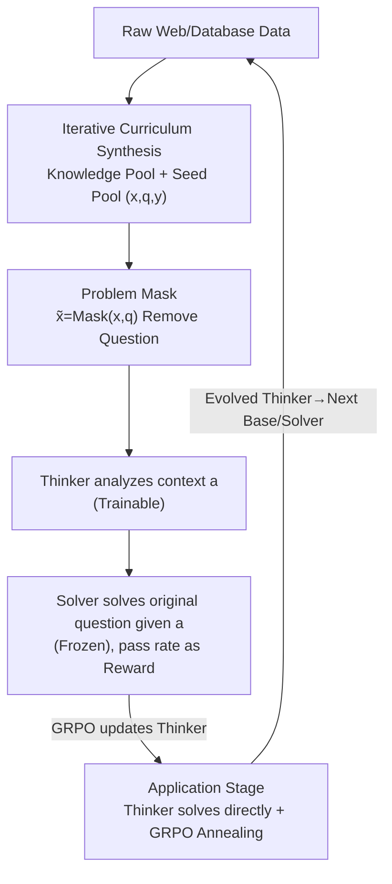

# Decouple to Generalize: Context-First Self-Evolving Learning for Data-Scarce Vision-Language Reasoning

**Conference**: CVPR 2026  
**Paper**: [CVF Open Access](https://openaccess.thecvf.com/content/CVPR2026/html/Li_Decouple_to_Generalize_Context-First_Self-Evolving_Learning_for_Data-Scarce_Vision-Language_Reasoning_CVPR_2026_paper.html)  
**Code**: None (Repository not disclosed)  
**Area**: Multimodal VLM  
**Keywords**: Visual-Language Reasoning, Reinforcement Learning, Self-Evolving LVLM, Data Scarcity, Curriculum Learning  

## TL;DR
Targeting professional fields lacking high-quality annotations such as chemistry, earth sciences, and multimodal mathematics, DoGe decouples the RL self-evolution of VLMs into "Cognitive Process Decoupling" (forcing the Thinker to analyze context first without seeing the question) and "Data Decoupling" (iterative curriculum synthesis of Knowledge Pools and Seed Problem Pools). By using a two-stage RL cycle to avoid reward hacking and entropy collapse caused by synthetic data, the 3B/7B models achieve average improvements of 5.7% / 2.3% across 7 benchmarks.

## Background & Motivation
**Background**: Using RL post-training (such as GRPO) to enable VLMs to generate long-chain reasoning has become the mainstream path for achieving self-evolving large models in the "empirical era"—models generate their own data, receive rewards, and iteratively improve.

**Limitations of Prior Work**: This path is strictly tied to the prerequisite of having "large amounts of high-quality multimodal data." In high-value professional fields like chemistry and earth sciences, the cost of manually annotating domain-specific knowledge and designing high-quality reasoning problems is extremely high. Consequently, researchers resort to **synthetic data** and **self-reward mechanisms**, but synthetic multimodal problems often converge to narrow, repetitive distributions. Furthermore, self-reward mechanisms mostly operate at the level of visual perception, failing to align training objectives with professional reasoning tasks.

**Key Challenge**: The authors point out a deeper root cause—most methods only use "Q&A pairs + rule-based correctness" for supervision. This "Solve-Reward" paradigm **completely ignores the rich contextual information in the prompt**. When the distribution of synthetic problems is already limited, models lack the incentive to truly understand domain knowledge and are instead encouraged to exploit reward-associated shortcuts. This results in classic **reward hacking**: policy entropy collapses, exploration capabilities vanish, and generalization becomes impossible.

**Goal**: To enable VLMs to achieve stable self-evolution in data-scarce professional domains without being stuck in narrow synthetic distributions or falling into reward hacking.

**Key Insight**: The authors draw logic from human cognition in psychology—humans "learn" (understand context and knowledge) before "applying" (solving problems), rather than just practicing problems from the start. Translated to RL, the model should be forced to digest the ignored **context** before solving the problem.

**Core Idea**: "Decouple to Generalize"—using dual decoupling to achieve generalization: ① Decouple the policy model into a Thinker (analyzing context) and a Solver (solving based on analysis), using the Solver's success rate as a quantitative reward for the Thinker's analysis; ② Decouple data production into an iterative curriculum of "Knowledge Pools + Seed Problem Pools" to continuously expand the diversity of the training distribution.

## Method

### Overall Architecture
DoGe (Decouple to Generalize) is built upon multimodal GRPO. To address the reward hacking issue in RL self-evolution within data-scarce domains, the core strategy is **dual decoupling**: one line decouples the **cognitive process** (splitting one training round into a two-stage RL: learning context first, then application), while the other line decouples **data production** (a knowledge pool generating knowledge and a seed pool iteratively generating difficult problems).

At the start of each round $t$, both the Thinker and Solver are initialized from the previous round's base model: $\pi_T^{(t)} = \pi_S^{(t)} \leftarrow \pi^{(t)}$. Training samples consist of triples $(x, q, y)$—multimodal context $x$, question $q$, and answer $y$. After a full training round, the evolved Thinker becomes the base model/Solver for the next round, forming a "Learning-Application-Internalization" closed loop. On the data side, the Knowledge Pool and Seed Problem Pool continuously feed diverse training problems into this loop.

### Key Designs

**1. Thinker–Solver Decoupling + Problem Masking: Isolating Context Understanding Rewards**

To address the "Solve-Reward" paradigm's failure to utilize context, DoGe derives two roles from the same base VLM: the Thinker $\pi_T(a|\tilde{x})$ for context analysis, and the Solver $\pi_S(\hat{y}|x,q,a)$ for solving based on that analysis. The key technique is **Problem Masking** $\tilde{x} = \mathrm{Mask}(x, q)$—removing the question and direct answer clues, leaving only situational information (e.g., only the molecular structure for a chemistry problem or just the chart for a data problem). Without the specific question, the Thinker is forced to **mine the domain knowledge within the image/context**, producing a textual analysis $a$ rather than searching for answer patterns.

A brilliant aspect is **how to score "context understanding" without ground truth answers**: The authors use a frozen identical model as the Solver. The Solver attempts to solve the original question using the Thinker's analysis $a$, and the success rate is used as the numerical reward for $a$. A more accurate solution from the Solver indicates a more valuable and deeper analysis $a$. This anchors the abstract "analysis quality" to the concrete "downstream solve rate," creating a self-supervised feedback loop.

**2. Two-Stage RL: Annealing from "Context Exploration" to "Application", and Self-Bootstrap**

Analyzing context is useless without solving problems, so each training round is split. **Stage 1: Learning from Context**: The Solver is fixed while only the Thinker is trained. The Thinker samples a set of candidate analyses $a_k \sim \pi_T^{(t)}(\cdot|\tilde{x})$ for the masked input. The reward is:
$$r_{\text{context}} = \mathbb{E}_{\hat{y}\sim\pi_S^{(t)}(\cdot|x,q,a_k)}\big[\mathbb{1}[\hat{y}=y] + \beta\cdot r_{\text{format}}(\hat{y})\big]$$
where $\mathbb{1}[\hat{y}=y]$ is the 0/1 correctness of the Solver, $r_{\text{format}}$ checks if the output follows the `<think>...</think>` + final answer format, and $\beta$ is the weight. In practice, for each question, the Thinker samples 4 analyses, and the Solver generates 4 answers per analysis to estimate the reward.

**Stage 2: Learning from Application**: The trained Thinker $\pi_T^{(t+1)}$ solves the original question directly (without masking), internalizing the high-level thinking from the previous stage. The reward is based on correctness and format:
$$r_{\text{app}} = \mathbb{E}_{\hat{y}\sim\pi_T^{(t+1)}(\cdot|x,q)}\big[\mathbb{1}[\hat{y}=y] + \beta\cdot r_{\text{format}}(\hat{y})\big]$$
The authors call this **GRPO annealing**—Stage 1 raises policy entropy and exploration, while Stage 2 converges it to problem-solving. Both stages are optimized via GRPO. Finally, the parameters updated in Stage 2 $\pi_T^{(t+1)\prime}$ initialize the next round's Solver, creating a **self-bootstrap** system. A stronger Thinker provides better context understanding, which supports a stronger Solver, snowballing generalization capabilities. This mechanism combats reward hacking by raising entropy before annealing, avoiding the premature entropy collapse common in baselines.

**3. Iterative Curriculum Data Synthesis: Knowledge Pool + Seed Pool for Diversity**

Cognitive decoupling alone cannot prevent overfitting if the data distribution is too narrow. **Multimodal Knowledge Pool**: Raw data is crawled and categorized by information density. For "information poor" samples, Gemini-2.5-Flash generates expert-level reports to complete the information, and tools generate images where missing. These are then used by SOTA LVLMs to synthesize reasoning Q&A pairs.

**Seed Problem Pool**: Stores problems that the model "occasionally gets right." After each iteration, the current policy $\pi_\theta$ calculates the pass rate on the training set. Problems with $0.1 \le \text{pass rate} \le 0.3$—those with **moderate difficulty and high learning value**—are selected to update the seed pool, from which more challenging variants are synthesized for the next round. This cycle of "Knowledge Pool $\rightarrow$ Synthetic Problems $\rightarrow$ Seed Filtering $\rightarrow$ Variant Synthesis" mimics the human process of learning from the world, designing hard problems, and internalizing skills.

### Loss & Training
Both stages use GRPO, modified from the `verl` framework, on 8×A100 GPUs. Base models are Qwen2.5VL-3B / 7B-Instruct. The Thinker (Stage 1) is trained for 100 steps, and annealing (Stage 2) for 150 steps (150 steps for both on 7B). Train batch sizes are 64 / 48 respectively, with a max response length of 4096. Stage 2 samples 8 responses per question; Stage 1 samples 4 analyses × 4 answers each. Clipping $\epsilon$ is decoupled as in DAPO. Three iterations are performed. An initial 15-step RL with only format rewards is applied to improve instruction following.

## Key Experimental Results

### Main Results
Evaluation covers 7 benchmarks across two categories: Professional/Scarce domains (MathVision, MathVista, ChemBench, MSEarthMCQ) and General Reasoning/Hallucination (MMMU, MMStar, HallBench). The best result from Iter 1–3 is reported.

| Model | MMMU | MMStar | HallBench | MathVision | MathVista | ChemBench | MSEarthMCQ | Avg. |
|------|------|--------|-----------|------------|-----------|-----------|------------|------|
| Qwen2.5VL-3B* (Baseline) | 41.0 | 49.3 | 60.6 | 18.7 | 48.8 | 43.4 | 40.8 | 43.2 |
| Visionary-3B | 40.7 | 50.5 | 59.8 | 17.1 | 54.7 | 40.8 | 38.2 | 43.1 |
| **Ours-3B (Iter3)** | **50.2** | 54.7 | 61.8 | 24.2 | 57.0 | 46.9 | 47.3 | **48.9** |
| Δmax vs Baseline | +9.2 | +5.4 | +1.9 | +5.5 | +9.1 | +4.3 | +7.5 | **+5.7** |
| Qwen2.5VL-7B* (Baseline) | 49.9 | 60.7 | 66.3 | 23.6 | 64.1 | 48.6 | 43.3 | 50.9 |
| Vision-R1-7B | 46.9 | 60.8 | 66.7 | 29.0 | 68.5 | 46.0 | 44.1 | 51.7 |
| **Ours-7B (Iter3)** | 53.6 | 63.0 | 68.0 | 25.2 | 68.3 | 48.5 | 45.8 | **53.2** |
| Δmax vs Baseline | +3.7 | +2.5 | +2.0 | +1.7 | +4.7 | +0.4 | +3.2 | **+2.3** |

The 3B series gains +5.7% on average, and the 7B series gains +2.3%, with improvements across all 7 benchmarks. Notably, HallBench (hallucination) improves by 2.0%, which the authors attribute to Stage 1's masking of the question, forcing the model to analyze visual context and mitigating "answer-by-text-prior" behavior. DoGe does not regress on the text-only ChemBench, indicating no damage to linguistic reasoning.

### Ablation Study
Comparing "Full DoGe" vs "w/o DoGe (naive GRPO)" using the 3B model:

| Config | Iter1 Avg. | Iter2 Avg. | Iter3 Avg. | Description |
|------|-----------|-----------|-----------|------|
| Ours (DoGe) | **48.0** | **47.9** | **48.9** | Full two-stage decoupled RL |
| ⊢ w/o DoGe (naive GRPO) | 47.2 | 47.8 | 48.6 | No stages, direct GRPO |

DoGe consistently outperforms the baseline in each round, with the gap being most evident in reasoning-intensive tasks. More crucially, regarding **multi-round stability**: naive GRPO is prone to reward hacking in Iter 2 due to low-quality data, leading to entropy drops and performance loss. DoGe, by harmlessly expanding policy entropy, climbs stably even with data fluctuations.

### Key Findings
- **Policy Entropy as Core Evidence**: Training the Thinker before annealing significantly raises the initial policy entropy for subsequent RL and maintains higher entropy throughout (Figure 4). The baseline suffers from low entropy and exploration collapse, preventing the learning of generalizable reasoning. This explains "why decoupling prevents reward hacking."
- **Reduced Sensitivity to Data Quality**: DoGe lowers the model's sensitivity to training data quality, which is critical for scarce domains relying on synthetic data.
- **Verifiable Thinker Output**: Using Gemini-3.0-Flash-Thinking (as per text) as an evaluator, Thinker(Iter1)'s analyses show lower hallucination and are more data-driven than the baseline (Qualitative cases in Figure 5/6).

## Highlights & Insights
- **"Problem Masking" is the Stroke of Genius**: Masking the question forces a switch from "pattern matching" to "knowledge understanding," simultaneously addressing reward hacking and text-prior hallucinations.
- **Solver Pass Rate for Scoring Unstructured Analysis**: Context understanding is hard to evaluate directly. Using downstream success as a proxy reward anchors abstract capability to verifiable signals—a strategy transferable to any scenario with hard-to-score intermediate representations (like query rewriting).
- **Raise Entropy then Anneal**: Stage 1's exploration naturally boosts policy entropy, providing a "warm-up" against collapse. This is valuable for any RLVR training prone to entropy collapse.
- **Mapping "Learning-Application-Internalization"**: Directly structuring cognitive cycles into RL stages provides a scientifically explainable design template.

## Limitations & Future Work
- **Solver Frozen at Iteration Start**: Stage 1 rewards depend on the frozen Solver. If the base model is weak in a domain, the Solver provides noisy rewards, potentially misguiding the Thinker.
- **Diminishing Returns on Larger Models**: Gains for 7B (+2.3%) are much smaller than 3B (+5.7%), and 7B nearly plateaus on MathVision and ChemBench. Its effectiveness on even larger models remains unproven.
- **Heavy Reliance on External SOTA Models**: Knowledge completion uses Gemini-2.5-Flash, evaluation uses Gemini-3.0-Flash, and synthesis relies on SOTA LVLMs. True "self-evolution" without external distillation is not yet achieved.
- **Pipeline Complexity**: Dual decoupling + two stages + curriculum iterations + DAPO-style clipping leads to high engineering complexity and many hyperparameters, making reproduction difficult.

## Related Work & Insights
- **vs Vision-R1 / OpenVLThinker**: These follow the "synthetic CoT cold start + GRPO solving" paradigm. DoGe argues this ignores context and leads to reward hacking, opting for learn-context-then-solve. DoGe-7B outperforms Vision-R1-7B on average (53.2 vs 51.7), though Vision-R1 is stronger in specific math benchmarks.
- **vs Vision-SR1 (Self-Reward RL)**: Self-reward often focuses on visual perception; DoGe's Solver-pass-rate is directly anchored to downstream reasoning correctness.
- **vs Training-Free GRPO**: The latter moves learning to the context space using external experience; DoGe remains in the parameter-update school but shares the emphasis on the value of context.

## Rating
- Novelty: ⭐⭐⭐⭐ "Context-first + dual decoupling" identifies the root of reward hacking as the "neglected prompt context." Problem masking + Solver-as-reward is highly innovative.
- Experimental Thoroughness: ⭐⭐⭐⭐ 7 benchmarks, dual scales, 3 iterations + entropy analysis; however, lacks comparison with more self-evolution SOTAs on 7B.
- Writing Quality: ⭐⭐⭐ Clear cognitive narrative, but small flaws in formula numbering and some evaluator names likely contain typos.
- Value: ⭐⭐⭐⭐ Provides an actionable, anti-collapse training paradigm for VLM self-evolution in data-scarce domains.

<!-- RELATED:START -->

## Related Papers

- [\[CVPR 2026\] HoneyBee: Data Recipes for Vision-Language Reasoners](honeybee_data_recipes_for_vision-language_reasoners.md)
- [\[CVPR 2026\] Incentivizing Versatile Video Reasoning in MLLMs via Data-Efficient Reinforcement Learning](incentivizing_versatile_video_reasoning_in_mllms_via_data-efficient_reinforcemen.md)
- [\[ICLR 2026\] Play to Generalize: Learning to Reason Through Game Play](../../ICLR2026/vlm_reasoning/play_to_generalize_learning_to_reason_through_game_play.md)
- [\[CVPR 2026\] Evolving Contextual Safety in Multi-Modal Large Language Models via Inference-Time Self-Reflective Memory](evolving_contextual_safety_in_multi-modal_large_language_models_via_inference-ti.md)
- [\[CVPR 2026\] MoE-GRPO: Optimizing Mixture-of-Experts via Reinforcement Learning in Vision-Language Models](moe-grpo_optimizing_mixture-of-experts_via_reinforcement_learning_in_vision-lang.md)

<!-- RELATED:END -->
