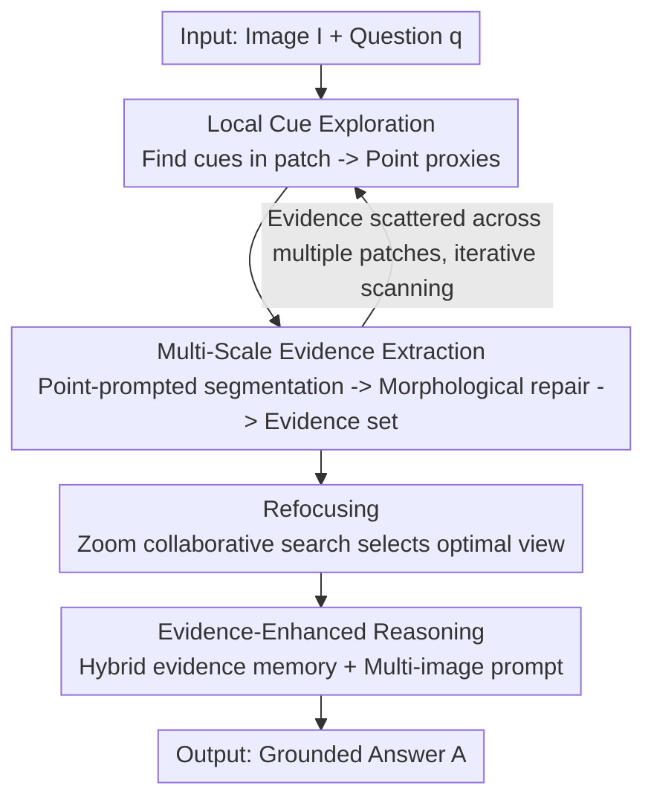

# DeepScan: A Training-Free Framework for Visually Grounded Reasoning in Large Vision-Language Models

**Conference**: CVPR 2026  
**Paper**: [CVF Open Access](https://openaccess.thecvf.com/content/CVPR2026/html/Li_DeepScan_A_Training-Free_Framework_for_Visually_Grounded_Reasoning_in_Large_CVPR_2026_paper.html)  
**Code**: https://github.com/YChenL/DeepScan  
**Area**: Multimodal VLM / LLM Reasoning  
**Keywords**: Visually Grounded Reasoning, Training-Free, Bottom-Up Grounding, Visual Expert, Evidence Memory

## TL;DR
DeepScan is a training-free framework that mimics the human visual reasoning process of "capturing local cues first and then aggregating evidence bottom-up." By wrapping the LVLM in a three-stage pipeline consisting of Hierarchical Scanning, Refocusing, and Evidence-Enhanced Reasoning, it achieves 90.6% accuracy on the V\* benchmark using Qwen2.5-VL-7B (+16.3% relative to the base model). It can be seamlessly transferred to different architectures and parameter scales without any fine-tuning.

## Background & Motivation
**Background**: Prompting Large Vision-Language Models (LVLMs) to "observe details before answering" is currently a major research focus. The mainstream approaches fall into two categories: (1) training models to actively locate evidence during inference using reinforcement learning (with visual rewards such as IoU) or in-context engineering; (2) leveraging training-free plug-and-play visual experts (e.g., GroundingDINO, LangSAM) to locate evidence regions through consensus between the expert and the LVLM, significantly improving fine-grained understanding.

**Limitations of Prior Work**: Regardless of whether they are training-based or training-free, almost all existing methods follow a **top-down (coarse-to-fine)** grounding paradigm. They typically search for coarse-grained proxies (region proposals, bounding boxes, or textual descriptions) across the entire image in a single pass, and then refine them to obtain precise evidence. This "one-shot localization of the complete evidence region" is highly fragile in scenarios with high resolutions, extremely small targets, or semantically similar distractors.

**Key Challenge**: One-shot localization from the entire image is easily misled by noisy contexts. The paper identifies two failure modes: attention sink and attention drift (where attention is attracted by semantically similar objects). Once the initial localization fails, the LVLM either refuses to answer or makes wild guesses based on false evidence. In benchmarks like V\*, where the average target area is < 0.05%, the top-down paradigm is almost completely ineffective.

**Key Insight**: The authors draw inspiration from human cognition—when playing "spot the difference," humans do not lock onto the target in a single glance. Instead, they **scan local patches to find subtle differences, and then bring these cues back to the global image level to verify and reconstruct the target while suppressing distractors**. This is a bottom-up process of evidence gathering.

**Core Idea**: Replace "top-down one-shot localization" with "bottom-up grounding." First explore discriminative cues at the patch level, representing them as **point-based proxies**. Then, lift these points into image-level evidence via point-prompted segmentation to progressively reconstruct the target. Finally, store multi-granularity evidence in memory and feed it to the LVLM for reasoning. The entire process requires no training of the LVLM and is completed by external search and visual experts.

## Method

### Overall Architecture
DeepScan equips the LVLM with two plug-and-play models: a **search expert** (BLIP-ITM) that uses GradCAM to generate intra-patch attention maps $S=\mathrm{SEARCH}(p,q)\in\mathbb{R}^{h\times w}$ to highlight potential cues, and a **visual expert** (LangSAM) that exposes two primitives—point-prompted segmentation $m=\mathrm{SEGMENT}(I,c)$ and question-driven detection $B=\mathrm{DETECT}(I,q)$. Given an image $I\in\mathbb{R}^{H\times W\times 3}$ and a question $q$, the pipeline consists of three stages:

1. **Hierarchical Scanning**: The image is partitioned into patches. Within each patch, **local cue exploration** is performed to discover cues and represent them as point-based proxies, followed by **multi-scale evidence extraction** to lift the point proxies back to image-level evidence masks, progressively constructing an evidence set $\mathcal{E}$. This stage is the core of the bottom-up approach and is responsible for noise-resistant localization.
2. **Refocusing**: The evidence views produced by hierarchical scanning may contain too much or too little context (especially when multiple objects are adjacent). This stage enables a collaborative, small-scale search between the LVLM and the visual expert to select the optimal view $V^\*$—defined as the most compact view that still contains all necessary evidence.
3. **Evidence-Enhanced Reasoning**: It stores the fine-grained evidence from hierarchical scanning and the coarse-grained view from refocusing in the **hybrid evidence memory $\mathcal{H}$**, which is then materialized into an ordered multi-image prompt $[e_1,\dots,V^\*]$ and fed to the LVLM to generate the final answer $A=\mathrm{REASON}(\mathcal{H},q)$.

### Key Designs

**1. Local Cue Exploration: Bridging Fragmented Evidence Across Patches with Point Proxies**

Since the top-down paradigm is highly susceptible to noise, a natural alternative is to partition the image into patches and extract evidence block-by-block. However, this immediately encounters a fundamental challenge: when evidence spans across multiple patches, traditional proxies (region proposals, bounding boxes, or textual descriptions) fail to represent such "fragmented, cut-up evidence." DeepScan resolves this using **point-based proxies**—even if the proof is fragmented, a single point landing inside the evidence is sufficient to serve as a seed for subsequent point-prompted segmentation to reconstruct the entire evidence region.

Specifically, for patch $p$, the search expert produces an attention map $S_p$, which is then binarized using Otsu's adaptive threshold $T_p^\star=\mathrm{OTSU}(S_p)$ to obtain a high-response mask $S_p^+=\mathbb{I}(S_p\ge T_p^\star)$. The connected components within this mask are treated as cues $\{G_p^k\}$. The key question is **how to select the proxy point within each cue**: relying solely on the "maximal distance to the boundary" (geometric center, similar to the Chebyshev center) can generate multiple ambiguous candidates in complex, U-shaped cues; relying solely on attention peaks can lead to off-center drift. The paper fuses both, selecting the point for cue $G_p^k$ via:

$$c_p^k=\arg\max_{c\in G_p^k}\ \tilde S_p(c)\,\tilde d(c,\partial G_p^k),\quad |G_p^k|\ge\tau$$

where $\tilde d(c,\partial G)=\inf_{\gamma\in\partial G}\|c-\gamma\|_2$ is the normalized distance to the boundary (ensuring the point falls inside and far from edges), $\tilde S_p(c)$ is the normalized attention score (biasing the point toward semantically salient regions), and $\tau$ is the area threshold to filter out tiny pseudo-cues. Finally, the patch-level coordinates of proxy $C_p$ are projected back to global image coordinates $C_p'$. Ablation studies (Table 5, Left) demonstrate that this "semantic $\times$ topology" fused proxy (Att 93.0 / Spa 86.8) significantly outperforms individual options like Centroid (84.3 / 80.3), Chebyshev Center (91.3 / 82.9), and Attention Peak (87.8 / 85.5).

**2. Multi-Scale Evidence Extraction: Point-Prompted Segmentation + Morphological Repair + Heuristic Acceleration**

After obtaining the proxy points, a visual expert performs point-prompted segmentation $m=\mathrm{SEGMENT}(I,c_p')$ to restore the point back to an image-level mask. However, single-point prompts have limited expressiveness, often leading to masks with internal holes or missing local contexts. The paper employs **morphological post-processing** to obtain an enhanced mask:

$$m^+=(m\bullet K)\oplus S_r$$

where $\bullet$ denotes the closing operation using a flat kernel $K$ to seal internal holes, and $\oplus$ denotes dilation with a disk-shaped kernel $S_r$ to pad some surrounding context. This step not only boosts performance (Table 4: removing post-processing drops accuracy from 90.6 to 87.4), but also **accelerates inference** by natively enabling deduplication: using a global visited mask $I\leftarrow I\odot(1-m^+)$ to skip already processed regions, and filtering out proxies that fall into the same evidence mask: $C_p'\leftarrow\{c\mid m^+(c)=0\}$, avoiding redundant extraction of the same evidence. The evidence candidate $e$ is cropped from the minimum bounding box $b$ of $m^+$, and is then subjected to a binary verification by the LVLM (to check if the evidence is valid). If it passes, the evidence set is updated: $\mathcal{E}\leftarrow\mathcal{E}\cup\{(b,e)\}$.

Additionally, a highly practical **heuristic acceleration** is introduced: Figure 5 shows that **the less salient (smaller area) the evidence is, the larger the performance gain it brings**—this is because larger evidence chunks are already visible to the LVLM and do not require explicit grounding. Thus, candidates are pre-filtered by area, and only the smallest top-$k$ candidates are evaluated, bounding the number of LVLM evaluations to $k$ and saving visual tokens. Empirically, even with $k=1$, the model retains roughly 96% of the peak performance and achieves about a 2$\times$ speedup; in practice, $k=10$ is used to balance accuracy and latency.

**3. Refocusing: Depth-2 Scale Search Coordinated by LVLM and Visual Experts**

Although hierarchical scanning can reconstruct evidence, the locations of proxy points can be imprecise when multiple visual elements are spatially adjacent, leading to final views with insufficient or redundant context (Figure 6). Refocusing orchestrates a **collaborative search** between the LVLM and the visual expert: initializing with the minimum bounding box of the evidence set $V_1=\mathrm{CROP}(I,b_m)$, and defining two actions—**Zoom-In** $\mathrm{IN}(V,q)=\mathrm{CROP}(V,\mathrm{DETECT}(V,q))$ to contract the context, and **Zoom-Out** $\mathrm{OUT}(V,s)=\mathrm{CROP}(I,\mathrm{SCALEBBOX}(V,s))$ to isotropically expand the context from its center. The selection strategy utilizes an LVLM-based reward:

$$R(V)=\mathbb{I}_{V;q}\cdot HW/hw$$

where $\mathbb{I}_{V;q}$ is a one-shot binary evaluation by the LVLM of "whether $V$ contains all necessary evidence to answer $q$," and $HW/hw$ is a size regularization term—**biasing the selection toward the smallest view that still contains all necessary evidence** to prevent both missing evidence and over-cropping (Figure 11 demonstrates that over-zooming-in removes necessary context, leading to a performance drop).

The key elegant formulation lies in **search space pruning**: unlike methods that search across the entire image, $V_1$ is already a highly optimized initialization. Based on this, the authors prove that Zoom-In is idempotent on $V_1$, and Zoom-Out will not result in out-of-boundary cropping. They further prove that the state $\mathrm{OUT}(\mathrm{IN}(V_1,q),s)$ can be safely pruned from the search space without losing global optimality. Consequently, the search only needs a depth-2 expansion on $V_1$, yielding a behavior-complete view set $\mathcal{V}=\{V_1,V_2,V_3,V_4\}$, where $V_2=\mathrm{IN}(V_1,q)$, $V_3=\mathrm{OUT}(V_1,s)$, and $V_4=\mathrm{IN}(V_3,q)$, with $s=1.5$ (obtained via grid search). A depth-first greedy search is then applied to select the optimal view. As shown in Table 6 (Right), under the same expansion budget, the search length of Refocusing (1.87) is significantly shorter than MCTS (2.24) and A\* (3.07), achieving both completeness and high efficiency.

**4. Evidence-Enhanced Reasoning: Feeding Multi-Granularity Views to LVLM via Hybrid Evidence Memory**

The previous two stages respectively produce **fine-grained evidence** ($e$ from hierarchical scanning) and **coarse-grained views** ($V^\*$ from refocusing). Evidence-Enhanced Reasoning collects them into a hybrid evidence memory:

$$\mathcal{H}=\{\,e,V^\*\mid (b,e)\in\mathcal{E},\ V^\*=\arg\max_{V\in\mathcal{V}}R(V)\,\}$$

and then materializes them into an ordered multi-image prompt $[e_1,\dots,V^\*]$. This enables the LVLM to extract object attributes (colors, text, etc.) from fine-grained evidence, while inferring spatial relationships from the coarse-grained views, thereby producing answers that are both precise and comprehensive. Ablation studies (Figure 7) verify that this step achieves incremental gains on top of Hierarchical Scanning and Refocusing with negligible overhead, demonstrating the "integrity" of the three-stage pipeline.

> Self-Check: The four contributing components highlighted in the overall architecture (Local Cue Exploration, Multi-Scale Evidence Extraction, Refocusing, Evidence-Enhanced Reasoning) map one-to-one to the Mermaid nodes and Key Designs 1–4. The two plug-and-play experts (search expert / visual expert) act as scaffolding throughout Designs 1–3 and are not listed separately.

### A Complete Example
Taking Figure 9(a) "What is the color of the cyclist's box?" as an example: The top-down localization of GPT-4o and DyFo is misled by attention drift to a semantically similar "box sign," answering "light green" or describing the wrong location. In contrast, DeepScan begins by exploring cues within local patches—although the search expert's attention might still drift, the local patch constraint suppresses most distractors. It converts the cue into a point proxy $\rightarrow$ applies point-prompted segmentation $\rightarrow$ performs morphological repair to obtain the evidence mask for "cyclist's box," and appends it to the evidence set. Refocusing then selects the most compact view surrounding this evidence, and the hybrid memory is finally fed to the LVLM, yielding the correct answer "yellow." Quantitative analysis in Figure 10 demonstrates that shifting from "image-level one-shot exploration" to "patch-level bottom-up search" successfully realigns attention from distracting objects back to the correct target (Table 7: bottom-up 90.6 vs. one-shot 83.8).

## Key Experimental Results

### Main Results
All baselines are based on Qwen2.5-VL-7B; DeepScan uses BLIP-ITM base as the search expert and LangSAM as the visual expert, with $k=10$. Single/multi-object scenes dynamically configure the patch size to 576/768, evaluated on 4$\times$ L20 GPUs.

| Benchmark | Metric | Qwen2.5-VL-7B | DyFo (Training-Free SOTA) | DeepEyes (RL SOTA) | DeepScan |
|---|---|---|---|---|---|
| V\* | Overall | 74.3 | 84.3 | 90.0 | **90.6** |
| V\* | Attribute | 77.4 | 82.6 | 92.1 | **93.0** |
| V\* | Spatial | 69.7 | 86.8 | 86.8 | 86.8 |
| HR-Bench-4K | Overall | 72.1 | 71.3 | 75.1 | 75.0 |
| HR-Bench-8K | Overall | 68.8 | 69.8 | 72.6 | 72.4 |

DeepScan improves upon the base Qwen2.5-VL-7B by 16.3% on V\*, outperforming all training-free baselines (+6.3% / +3.6% / +2.6% over DyFo on V\*, HR-4K, and HR-8K respectively). On perception tasks, it matches or exceeds the RL-based method DeepEyes without any fine-tuning, even surpassing several 70B general-purpose large models on certain subsets (e.g., V\* Attribute, HR single-instance).

TreeBench (emphasizing "thinking-with-images", including localization mIoU):

| Method | Overall | mIoU | Perception | Reasoning |
|---|---|---|---|---|
| Qwen2.5-VL-7B | 37.0 | – | 44.8 | 43.2 |
| DeepEyes (RL) | 37.5 | 30.0 | 51.7 | 47.7 |
| TreeVGR (RL) | 41.0 | 31.8 | 44.8 | 40.9 |
| DyFo (Training-Free) | 39.3 | – | 44.8 | 40.9 |
| **DeepScan** | **42.5** | **37.3** | 48.3 | 43.2 |

On TreeBench, DeepScan outperforms the base model by +5.5%, and achieves mIoU scores 7.3, 1.6, and 5.5 points higher than RL-based methods DeepEyes, Pixel-Reasoner, and TreeVGR, respectively, outperforming all training-free and RL-based baselines. Based on this, the authors speculate that RL does not truly strengthen the visual reasoning of LVLMs but instead biases them toward perceptual behaviors (as RL gains are marginal on second-order reasoning tasks).

### Ablation Study

| Configuration | V\* Overall | Attribute | Spatial | Description |
|---|---|---|---|---|
| Detection (DyFo-style top-down) | 82.2 | 81.7 | 82.9 | Bounding box grounding |
| Hierarchical Scanning (Full) | **90.6** | **93.0** | 86.8 | Bottom-up hierarchical scanning |
| w/o Morphological post-processing | 87.4 | 89.6 | 85.5 | Drops 3.2% and runs slower (redundant extraction) |
| One-shot Localization (Image-level one-shot exploration) | 83.8 | 83.5 | 84.2 | Validates the fundamental advantage of bottom-up approach |

Ablation on proxy types (Table 5, Left): Centroid (84.3/80.3), Chebyshev Center (91.3/82.9), Attention Peak (87.8/85.5), and the proposed "semantic $\times$ topology" fusion (93.0/86.8). Ablation on refocusing actions (Table 6, Left): Zoom-In only (89.6/73.7), Zoom-Out only (87.8/72.4), and both combined (93.0/86.8). Search space (Table 6, Right): search length of Ours (1.87) < MCTS (2.24) < A\* (3.07).

### Key Findings
- **Morphological post-processing "improves both accuracy and speed," which is counter-intuitive yet reasonable**: It seals mask holes to enable effective deduplication, preventing redundant extraction of the same evidence. Consequently, discarding it leads to longer processing times (32.1s vs. 24.5s) and lower accuracy.
- **Less salient evidence is more valuable**: Large objects are already visible to the LVLM, meaning the benefits of explicit grounding primarily come from small targets. Thus, pre-filtering and evaluating only the top-$k$ smallest candidates by area captures ~96% of peak performance and yields a 2$\times$ speedup at $k=1$.
- **More aggressive grounding is not always better**: Shrinking the IoU from 1/10 to 1 (over-zooming-in) eliminates necessary context, causing performance drops. Thus, the reward incorporates a size regularization term alongside LVLM feedback to prevent over-cropping.
- **Scaling effect is more pronounced on second-order reasoning than perception**: Under precise grounding, perception performance converges across model scales, but the gap in spatial reasoning persists—suggesting that one can use lightweight LVLMs for evidence verification and reserve large-scale models strictly for evidence-enhanced reasoning to reduce latency.
- **Insensitive to expert scale** (Table 3): Switching between BLIP-ITM base/large and LangSAM small/base+/large yields similar accuracy, memory footprint, and latency.

## Highlights & Insights
- **Reformulating "grounding" from one-shot localization to bottom-up, progressive reconstruction**: The core innovation is the point-based proxy. Even if evidence is sliced by patches, a single interior point is sufficient to act as a segmentation seed to reconstruct the whole object, bypassing the bottleneck where fragmented evidence cannot be effectively represented by bounding boxes or text descriptions. This is the most brilliant "aha!" moment of the paper.
- **Trading search-space proofs for efficiency**: Instead of blindly applying computationally heavy MCTS or A\* algorithms, Refocusing proves that under a well-initialized $V_1$, certain states are idempotent or prunable. This collapses the search space into 4 views at depth-2, remaining complete while being faster than general search algorithms. This method of converting "prior structures" into "pruning theorems" can be generalized to other visual search tasks.
- **Training-Free + Plug-and-Play**: Without modifying LVLM weights, the approach relies entirely on external expert collaboration. It is naturally compatible across architectures and scales (improving both 7B and 72B models), which is highly favorable for industrial deployment as it avoids model-specific retraining.
- **Multi-granularity memory powering reasoning**: Extracting attributes from fine-grained evidence while deriving relationships from coarse-grained views provides a structured, "division-of-labor" context. This is highly instructive for tasks requiring both fine-grained observation and global relational understanding.

## Limitations & Future Work
- **Bounded by the performance ceiling of external experts**: The search expert's (BLIP-ITM) attention is also prone to drift; patch partitioning only suppresses rather than eliminates this issue. In certain failure cases, both DyFo and the one-shot variant failed because the expert's attention drifted to the same distractor. While DeepScan mitigates this via localization, the search expert can still fail under extreme distraction ("Search Failed").
- **High inference latency**: The full pipeline takes roughly 24.5s per sample (Table 3), which is noticeably slower than detection-only baselines (13s). The serialized overhead from multiple rounds of binary LVLM evaluations, segmentations, and searches limits its applicability in real-time scenarios.
- **Limited gains in second-order reasoning**: On the Reasoning sub-task of TreeBench, the gain over the base model is ±0.0%. The framework's strength lies mainly in perception and localization; spatial reasoning bottlenecks reside in the LVLM itself rather than visual grounding precision, which is a gap a training-free framework can hardly bridge.
- **Heuristic-dependent hyperparameters**: Parameters such as patch sizes (576/768), $k=10$, zoom-out scale $s=1.5$, and $\tau$ are mostly determined via empirical grid searches, which may require re-tuning when generalizing across different datasets.
- **Potential improvements**: The number of binary LVLM calls for evidence verification grows with the candidate pool. Future work could explore more efficient batch-wise verification or learnable proxy point selection to replace handcrafted rules like Otsu thresholding and Eq. 5.

## Related Work & Insights
- **vs RL-based methods (DeepEyes / Pixel-Reasoner / TreeVGR / Thyme-VL)**: These methods fine-tune the LVLM using visual rewards to teach it to "think-with-images," which is costly and struggles with cross-architecture generalization. DeepScan is training-free and plug-and-play while yielding superior perception/localization (mIoU) results. Furthermore, the authors point out that RL primarily shifts models toward perceptual behaviors, offering minor gains for second-order reasoning.
- **vs Training-free top-down methods (DyFo / ZoomRefine)**: These follow a coarse-to-fine paradigm, relying on bounding boxes or self-refinement for one-shot localization, which is susceptible to attention sink and drift. DeepScan utilizes a bottom-up approach paired with point-based proxies to reconstruct evidence from local cues, proving significantly more accurate at a comparable speed (90.6% vs. 83.8% in Table 7).
- **vs Tree-search/Global-search methods**: These search for states across the entire image, leading to long search trajectories. DeepScan leverages the high-quality initialization from Hierarchical Scanning to prune the search space to a depth of 2, leading to much shorter search paths (1.87 vs. MCTS 2.24 / A\* 3.07).
- **vs SEAL (Explicit Evidence Localization + Visual Memory)**: While similar in concept, SEAL requires training. DeepScan achieves a comparable "evidence-memorize-then-reason" flow via its hybrid evidence memory without incurring any adaptation costs.

## Rating
- Novelty: ⭐⭐⭐⭐⭐ Reconstructs the mainstream top-down paradigm systematically through bottom-up grounding + point-based proxies + search space pruning theorems.
- Experimental Thoroughness: ⭐⭐⭐⭐⭐ Tested on three benchmarks with 5 different LVLMs (ranging from 7B to 72B) along with multi-dimensional ablations (proxies, actions, searches, and expert scales), providing exceptionally solid conclusions.
- Writing Quality: ⭐⭐⭐⭐ Clear motivation, methodology, and evidence chain. The mathematical notation can be somewhat dense, requiring reference to the figures.
- Value: ⭐⭐⭐⭐⭐ Training-free, cross-architecture, and plug-and-play, holding high practical value for deploying fine-grained LVLM understanding.

<!-- RELATED:START -->

## Related Papers

- [\[CVPR 2026\] Seeing What Matters: A Training-Free Self-Guided Framework for Multimodal Detail Perception and Reasoning](seeing_what_matters_a_training-free_self-guided_framework_for_multimodal_detail_.md)
- [\[CVPR 2026\] Grounded Chain-of-Thought for Multimodal Large Language Models](grounded_chain-of-thought_for_multimodal_large_language_models.md)
- [\[CVPR 2026\] Generate, Analyze, and Refine: Training-Free Sound Source Localization via MLLM Meta-Reasoning](generate_analyze_and_refine_training-free_sound_source_localization_via_mllm_met.md)
- [\[CVPR 2026\] Breaking the Regional Perception Bottleneck of Multimodal Large Language Models via External Reasoning Framework](breaking_the_regional_perception_bottleneck_of_multimodal_large_language_models_.md)
- [\[CVPR 2026\] Think Visually, Reason Textually: Vision-Language Synergy in Abstract Reasoning](think_visually_reason_textually_vision-language_synergy_in_abstract_reasoning.md)

<!-- RELATED:END -->
