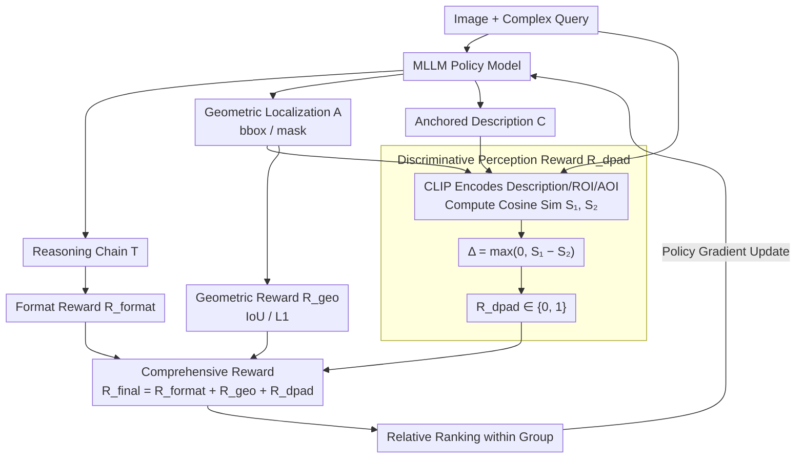

# DPAD: Discriminative Perception via Anchored Description for Reasoning Segmentation

**Conference**: CVPR 2026  
**arXiv**: [2603.04002](https://arxiv.org/abs/2603.04002)  
**Code**: [https://github.com/mrazhou/DPAD](https://github.com/mrazhou/DPAD)  
**Area**: Reasoning Segmentation  
**Keywords**: [Reasoning Segmentation, Reinforcement Learning, GRPO, Discriminative Perception, CLIP, Anchored Description, Reward Design]  

## TL;DR
Aiming at the issue where geometric rewards in RL+GRPO training for Reasoning Segmentation (RS) fail to constrain whether the reasoning chain focuses on unique attributes of the target, the DPAD method is proposed. It generates a reasoning chain + geometric localization + anchored description. By introducing a CLIP-based Discriminative Perception Reward to compare similarity differences between the description and ROI/AOI, it forces descriptions to be more discriminative, thereby indirectly constraining the reasoning chain to focus on the target. On ReasonSeg, cIoU improves by 3.09%, and reasoning chain length is reduced by 42%.

## Background & Motivation
Reasoning Segmentation (RS) requires models to segment targets based on complex natural language queries involving reasoning, common sense, and world knowledge. Unlike traditional referring segmentation that only requires understanding referring expressions, RS requires multi-step reasoning to determine the target object. Recent works adopt RL+GRPO training strategies from the LLM field to enhance the reasoning capabilities of MLLMs, using geometric rewards (such as IoU and L1 distance) to guide the generation of accurate segmentation results. However, geometric rewards only measure the geometric accuracy of the final segmentation and cannot judge the quality of the reasoning chain—the model may arrive at the correct answer by chance through a lengthy, divergent reasoning chain, or the reasoning may focus on irrelevant context rather than the target itself.

## Core Problem
Geometric rewards (IoU/L1) in RL+GRPO only evaluate the geometric correctness of the segmentation result and cannot judge whether the reasoning chain truly focuses on the target object versus irrelevant context. This leads to the "divergent verbose chain" phenomenon: reasoning chains become increasingly long and divergent, while geometric quality fails to improve further. A reward signal is needed to explicitly constrain the discriminativeness of the reasoning process—ensuring the model focuses on unique attributes that distinguish the target from other objects.

## Method

### Overall Architecture
DPAD addresses the blind spot of geometric rewards (IoU/L1) during RL+GRPO training for reasoning segmentation, which only assess the final segmentation accuracy without regulating if the reasoning chain is truly focused on the target. This leads to increasingly long and divergent reasoning chains without geometric gains. DPAD extends the GRPO framework in two ways: at the output side, the MLLM produces an **anchored description** $C$ in addition to the reasoning chain $T$ and geometric localization $A$; at the reward side, a CLIP-based **Discriminative Perception Reward** $R_{dpad}$ is added alongside geometric rewards. This reward forces descriptions to be discriminative, thereby indirectly steering the reasoning chain back to the unique attributes of the target.

### Key Designs

**1. Anchored Description: Externalizing internal understanding into evaluable text**

Since the reasoning process itself cannot be directly scored, DPAD requires the MLLM to expand its output into a triplet: the reasoning chain $T$ (multi-step reasoning), geometric localization $A$ (bbox or mask coordinates), and an anchored description $C$ (descriptive text anchored to the visual attributes of the target). It is termed "anchored" because this description is required to describe the target specifically localized by the model in $A$. It serves as the bridge between the reasoning chain and the discriminative reward—explicitly writing out "what I understood" so that CLIP can measure if the reasoning correctly captured the target.

**2. Discriminative Perception Reward: Using ROI vs. AOI similarity difference to force discriminativeness**

The core Idea is that a good description should closely fit the target region rather than describe the entire image—as it should mention the unique attributes of the target rather than general features of the whole image. Specifically, the CLIP text encoder extracts features $V_C$ for the description $C$, and the vision encoder extracts features $V_{ROI}$ for the target region (Region of Interest, cropped via ground truth box) and $V_{AOI}$ for the full image (Area of Interest). Two cosine similarities are computed, and their positive difference is taken:

$$S_1 = \text{Sim}(V_C, V_{ROI}), \quad S_2 = \text{Sim}(V_C, V_{AOI}), \quad \Delta = \max(0, S_1 - S_2)$$

$$R_{dpad} = \begin{cases} 1 & \Delta > 0 \\ 0 & \text{otherwise} \end{cases}$$

If the description only says "there is an object in the image," $V_C$ will be similar to both ROI and AOI, resulting in $\Delta \approx 0$ and reward=0. If it describes unique attributes like "a chair with red stripes," $V_C$ will align better with the ROI, resulting in $\Delta > 0$ and reward=1. To obtain this reward, the reasoning chain must focus on unique attributes, thus indirectly constraining reasoning quality. Using the relative difference $S_1 - S_2$ instead of an absolute threshold avoids the need for calibrating absolute similarity values and is more robust.

**3. Comprehensive Reward and GRPO Optimization**

Three types of rewards are combined into the final signal $R_{final} = R_{format} + R_{geo} + R_{dpad}$. $R_{format}$ ensures the output follows the "reasoning + localization + description" format (validated via regex for `<think>/<answer>/<caption>` tags and JSON fields; otherwise, formatting fails and other rewards cannot be computed). $R_{geo}$ evaluates geometric accuracy based on IoU/L1, and $R_{dpad}$ evaluates the discriminativeness of the description. Optimization is performed using GRPO—sampling $G$ candidates for the same query and updating the MLLM via policy gradients based on relative rankings within the group. CLIP remains frozen as part of the reward model.

### Loss & Training
Training follows a standard RL pipeline, using a GRPO sampling group size of $G$ for relative ranking. CLIP is frozen as the reward model, and training data utilizes the ReasonSeg training set.

## Key Experimental Results

| Method | cIoU | gIoU | Reasoning Chain Length |
|------|------|------|-----------|
| Baseline (only R_geo) | baseline | baseline | 1.0× |
| DPAD (R_geo + R_dpad) | **+3.09%** | Gain | **0.58×(-42%)** |

- cIoU increased by 3.09% on the ReasonSeg validation set, while the reasoning chain length decreased by 42%.
- Descriptions provide additional interpretability—allowing for visual inspection of "what the model sees."
- Compared to other RL-based RS methods, DPAD significantly improves reasoning efficiency while maintaining competitive geometric performance.

### Ablation Study
- $R_{dpad}$ is the key: Removing $R_{dpad}$ causes performance to regress to the baseline level of pure geometric rewards, with reasoning chains becoming lengthy and divergent again.
- Anchored description is essential: Without descriptions, $R_{dpad}$ cannot be computed, and descriptions themselves constrain the model's output structure.
- ROI vs. AOI contrastive design is superior to using only ROI similarity: Using only $S_1 > threshold$ as a reward is less effective than the contrastive design of $\Delta = S_1 - S_2$, as the latter measures relative discriminativeness.
- $R_{format}$ is critical for training stability: Its removal leads to chaotic output formats, preventing other rewards from being calculated correctly.
- The choice of CLIP as a reward model is reasonable: Replacing it with other VL models yields similar results.

## Highlights & Insights
- Precisely diagnoses the blind spot of geometric rewards in RL+GRPO training for RS models—the failure to constrain reasoning quality leading to divergent verbose chains.
- $R_{dpad}$ architecture is ingenious and economical: It utilizes existing CLIP models, adds no training parameters, and has extremely low computational overhead.
- The contrastive discriminativeness design of $S_1 - S_2$ is more robust than absolute thresholds—it eliminates the need to calibrate absolute similarity values.
- Anchored description serves two purposes: (1) acting as a medium for $R_{dpad}$ calculation; (2) providing interpretable output for users to understand model reasoning.
- A 42% reduction in reasoning chain length implies a corresponding reduction in inference time, providing high practical value.

## Limitations & Future Work
- $R_{dpad}$ is a binary reward (0/1), losing continuous signals of discriminative degree; smooth rewards like $R_{dpad} = \sigma(\alpha \cdot \Delta)$ could be explored.
- GT boxes are used to compute $V_{ROI}$; during deployment, predicted boxes must be used, which may introduce noise.
- The vision-language alignment capability of CLIP limits the upper bound of $R_{dpad}$—the reward may fail for fine-grained differences that CLIP cannot distinguish well.
- Validated only on ReasonSeg; not yet extended to other RS benchmarks (e.g., GranDf).
- The impact of richer description structures (e.g., multi-attribute descriptions) on $R_{dpad}$ has not been explored.

## Related Work & Insights
- **vs. directly trained RS models like PixelLM/LISA**: These methods use SFT (Supervised Fine-Tuning). While they generate reasoning chains, they lack RL optimization, and reasoning quality depends on training data. DPAD uses RL+GRPO and explicitly constrains reasoning quality via $R_{dpad}$.
- **vs. RL-based methods like R1-Seg/Seg-Zero**: These methods also use GRPO but rely solely on geometric rewards, suffering from the divergent verbose chain problem. DPAD supplements the reward signal from the perspective of reasoning process quality.
- **vs. general RL reward designs (outcome-based vs. process-based)**: $R_{dpad}$ can be viewed as a lightweight process reward—while it does not directly evaluate each reasoning step, it indirectly constrains the focus of the reasoning process through descriptions.

## Rating
- Novelty: ⭐⭐⭐⭐⭐ Precisely diagnoses the blind spot of geometric rewards; $R_{dpad}$ design is simple and effective.
- Experimental Thoroughness: ⭐⭐⭐ Only one benchmark (ReasonSeg); could be extended.
- Writing Quality: ⭐⭐⭐⭐ Problem motivation is clearly articulated; methodological logic chain is complete.
- Value: ⭐⭐⭐⭐⭐ The RL reward design paradigm has broad transfer value; the anchored description idea is reusable.

<!-- RELATED:START -->

## Related Papers

- [\[CVPR 2026\] Fast Reasoning Segmentation for Images and Videos](fast_reasoning_segmentation_for_images_and_videos.md)
- [\[CVPR 2026\] Dr. Seg: Revisiting GRPO Training for Visual Large Language Models through Perception-Oriented Design](dr_seg_revisiting_grpo_training_for_visual_large_language_models_through_percept.md)
- [\[CVPR 2026\] SegCompass: Exploring Interpretable Alignment with Sparse Autoencoders for Enhanced Reasoning Segmentation](segcompass_exploring_interpretable_alignment_with_sparse_autoencoders_for_enhanc.md)
- [\[CVPR 2026\] CARE What Fails: Contrastive Anchored-REflection for Verifiable Multimodal Reasoning](care_what_fails_contrastive_anchored-reflection_for_verifiable_multimodal_reason.md)
- [\[CVPR 2026\] Perceptual-Evidence Anchored Reinforced Learning for Multimodal Reasoning](perceptual-evidence_anchored_reinforced_learning_for_multimodal_reasoning.md)

<!-- RELATED:END -->
## Related Papers

- [\[CVPR 2026\] Fast Reasoning Segmentation for Images and Videos](fast_reasoning_segmentation_for_images_and_videos.md)
- [\[CVPR 2026\] Beyond Text: Visual Description Assembly by Probabilistic Model for CLIP-based Weakly Supervised Semantic Segmentation](beyond_text_visual_description_assembly_by_probabilistic_model_for_clip-based_we.md)
- [\[CVPR 2026\] SegCompass: Exploring Interpretable Alignment with Sparse Autoencoders for Enhanced Reasoning Segmentation](segcompass_exploring_interpretable_alignment_with_sparse_autoencoders_for_enhanc.md)
- [\[CVPR 2026\] VIRST: Video-Instructed Reasoning Assistant for SpatioTemporal Segmentation](virst_video-instructed_reasoning_assistant_for_spatiotemporal_segmentation.md)
- [\[CVPR 2026\] Towards Context-Aware Image Anonymization with Multi-Agent Reasoning](towards_context-aware_image_anonymization_with_multi-agent_reasoning.md)

<!-- RELATED:END -->
