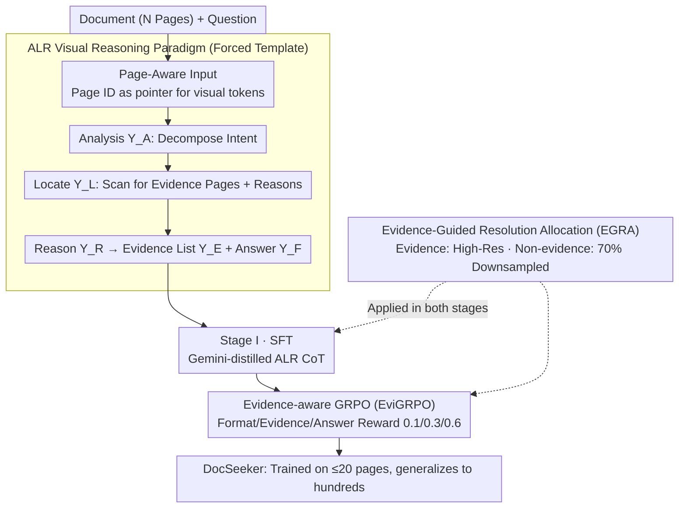

# DocSeeker: Structured Visual Reasoning with Evidence Grounding for Long Document Understanding

**Conference**: CVPR 2026 Highlight  
**arXiv**: [2604.12812](https://arxiv.org/abs/2604.12812)  
**Code**: [https://github.com/yh-hust/DocSeeker](https://github.com/yh-hust/DocSeeker)  
**Area**: Multimodal VLM / Document Understanding  
**Keywords**: Long document understanding, evidence grounding, structured reasoning, reinforcement learning, visual RAG

## TL;DR

DocSeeker is proposed to achieve structured reasoning and evidence grounding in long document understanding through an ALR (Analyze-Locate-Reason) visual reasoning paradigm and a two-stage training process (SFT + EviGRPO). It matures robustly from training on short documents to generalizing to ultra-long documents.

## Background & Motivation

**Background**: MLLMs suffer from severe performance degradation in long document VQA as document length increases. Pure visual methods treat each page as an image input to avoid the propagation of OCR errors.

**Limitations of Prior Work**: (1) Low Signal-to-Noise Ratio: key evidence is buried within a large number of irrelevant pages; (2) Scarcity of Supervision: datasets only provide the final short answer, lacking intermediate reasoning steps. The Top-k dilemma in visual RAG occurs where a large k introduces noise while a small k misses evidence.

**Key Challenge**: Models learn fragile shortcuts (memorization) instead of true reasoning capabilities, leading to poor explainability and weak OOD generalization.

**Goal**: To enable models to learn a "locate then reason" structured workflow rather than directly predicting answers.

**Key Insight**: This work is inspired by human cognitive processes—analyzing intent first, then locating evidence, and finally reasoning.

**Core Idea**: The ALR paradigm requires the model to explicitly output a structured thinking process of "Analyze $\rightarrow$ Locate $\rightarrow$ Reason," combined with a two-stage training involving SFT and Evidence-aware GRPO.

## Method

### Overall Architecture

The difficulty of long-document VQA lies in the fact that answers are often hidden in only one or two pages out of hundreds. If a model directly consumes all pages to predict a short answer, it can easily memorize "question-answer" shortcuts rather than truly seeking evidence in the document. DocSeeker externalizes this implicit process into a supervisable workflow—clarifying the question's intent first, then retrieving relevant pages from the document, and finally reasoning while focusing only on those pages. Based on Qwen-2.5-VL-7B, it prefixes each page's visual tokens with a Page ID as a pointer, allowing the model to reference specific pages. The output is forced into a fixed ALR structure $\mathbf{Y} = (\mathbf{Y}_A \oplus \mathbf{Y}_L \oplus \mathbf{Y}_R) \oplus (\mathbf{Y}_E \oplus \mathbf{Y}_F)$: Question Analysis $\mathbf{Y}_A$, Evidence Location (with page numbers and justifications) $\mathbf{Y}_L$, Reasoning Process $\mathbf{Y}_R$, supplemented by a structured evidence page list $\mathbf{Y}_E$ and the final answer $\mathbf{Y}_F$. This ALR paradigm (Design 1) defines the model's reasoning structure, while a two-stage training process teaches the model this behavior: first using SFT with distilled data to imitate the structure, then using Evidence-aware GRPO (Design 2) to align both localization and answers with result signals. To fit documents hundreds of pages long into VRAM, Evidence-Guided Resolution Allocation (Design 3) is employed to assign different resolutions to different pages.

### Key Designs

**1. ALR Visual Reasoning Paradigm: Enforcing a "Locate then Reason" Output Template**

When predicting answers directly, models struggle to distinguish critical evidence from interference, and long inputs exacerbate noise degradation. The ALR approach forces the model through an explicit "Analyze $\rightarrow$ Locate $\rightarrow$ Reason" cycle: reconstructing and decomposing the user's intent, scanning the full text to select relevant pages with justifications, and synthesizing the answer only from the selected evidence. Page IDs on the input side allow direct referencing during the localization phase. This localization is explicitly required and supervisable, ensuring the model learns to differentiate visual tokens across pages rather than treating the entire document as a single undifferentiated input, providing an alignment anchor against interference.

**2. Evidence-aware GRPO (EviGRPO): Aligning Localization and Answers via Result Rewards**

SFT alone often results in the imitation of suboptimal reasoning paths where the template is followed but the specific evidence is mislocated. EviGRPO addresses this by learning directly from outcome signals with a weighted reward:

$$R = \lambda_1 R_{format} + \lambda_2 R_{evidence} + \lambda_3 R_{answer}$$

The format reward $R_{format}$ ensures adherence to the ALR template. The evidence reward $R_{evidence}$ utilizes a weighted F1 score comparing model-provided evidence pages to ground truth, with a weight $\beta > 1$ to favor recall (preferring over-inclusion to missing critical evidence). The answer reward $R_{answer}$ uses ANLS to measure string matching for the final answer. With weights set at 0.1 / 0.3 / 0.6, the focus is placed on the answer while explicitly anchoring the intermediate localization step. This allows RL to optimize for both finding the evidence and answering correctly, avoiding the pitfalls of imitation learning.

**3. Evidence-Guided Resolution Allocation (EGRA): Differentiated Downsampling for Efficiency and Signal Purity**

Training on $\le 20$ pages while generalizing to hundreds requires strict VRAM management. EGRA avoids simple page deletion by allocating resolution based on evidence: evidence pages maintain high resolution, while 70% of non-evidence pages are downsampled (1024 $\rightarrow$ 256), with the remaining 30% kept at high resolution. At inference, all pages remain high resolution. This strategy reduces VRAM consumption and increases the signal-to-noise ratio in training data; since critical pages are clear and interference pages are blurred, the model's focus is naturally guided. This is superior to removing pages entirely as it allows the model to see the full document distribution and learn to extract evidence from noise.

### An Example: Single-Point Query in a 468-Page Report

Suppose the question asks "In which year was the experiment in Appendix B completed?" In the **Analyze** phase, the model decomposes the intent—it seeks a specific time point, and evidence should appear near "Appendix B." In the **Locate** phase, it scans the full text with page IDs and selects pages 412 and 413 (noting "Appendix B Header + Experimental Table") to populate $\mathbf{Y}_L$ and $\mathbf{Y}_E$. In the **Reason** phase, the model reads only the high-resolution content of those pages, finds the year in the table footnote, and writes it to $\mathbf{Y}_F$. Throughout this process, the model never "reads" all 468 pages in full detail; it applies a transferable "zoom-in" workflow learned from much shorter training documents.

### Loss & Training

Stage I utilizes standard cross-entropy SFT with 13,986 samples distilled from Gemini-2.5-Flash to teach the ALR format. Stage II runs EviGRPO with a rollout group size of 16 and reward weights of 0.1 / 0.3 / 0.6. Training is conducted exclusively on documents with $\le 20$ pages.

## Key Experimental Results

### Main Results

| Method | Params | DUDE↑ | MPDocVQA↑ | MMLong↑ | LongDocURL↑ |
| :--- | :--- | :--- | :--- | :--- | :--- |
| Baseline | 7B | 35.2 | 70.1 | 25.4 | 37.8 |
| InternVL3 | 8B | 47.4 | 80.8 | 24.1 | 38.7 |
| GPT-4o | - | 54.1 | 67.4 | 42.8 | 64.5 |
| **Ours** | **7B** | **56.8** | **87.2** | **48.5** | **58.3** |

### Ablation Study

| Configuration | DUDE | MPDocVQA | Gain |
| :--- | :--- | :--- | :--- |
| Full DocSeeker | 56.8 | 87.2 | Baseline |
| SFT only | 52.1 | 84.5 | -4.7 |
| SFT + GRPO (w/o Evidence Reward) | 54.3 | 85.8 | -2.5 |
| w/o EGRA | 50.8 | 82.1 | -6.0 |

### Key Findings

- Performance improves by 30-60% compared to the baseline, proving the effectiveness of the ALR paradigm.
- Robust generalization to ultra-long documents of up to 468 pages is achieved despite training only on documents with $\le 20$ pages.
- DocSeeker's localization capability works synergistically with visual RAG and can serve as a base model for RAG systems.

## Highlights & Insights

- The "short-to-long" generalization is a significant finding: the ALR paradigm learns transferable reasoning capabilities rather than memorization.
- The EGRA strategy is simple yet efficient; differentiated resolution reduces memory overhead and improves the signal-to-noise ratio, proving more effective than page deletion.
- The design of the evidence-aware reward makes the RL phase specifically targeted toward the intermediate grounding step.

## Limitations & Future Work

- Training data is limited to MP-DocVQA and DUDE, resulting in restricted domain coverage.
- Dependency on Gemini-2.5-Flash for distillation means data quality is capped by the teacher model.
- Purely visual approaches still face limitations in extremely dense text pages.
- Future work may include scaling to multi-document and cross-document reasoning.

## Related Work & Insights

- **vs VisRAG/SV-RAG**: These are retrieval-augmented methods; the ALR paradigm in DocSeeker provides end-to-end models with inherent localization capabilities.
- **vs mPLUG-DocOwl2**: While DocOwl2 uses visual token compression, DocSeeker utilizes EGRA for differentiated resolution.

## Rating

- **Novelty**: ⭐⭐⭐⭐⭐ The ALR paradigm and EviGRPO are significant innovations.
- **Experimental Thoroughness**: ⭐⭐⭐⭐⭐ Comprehensive in-domain and OOD evaluations with detailed ablations.
- **Writing Quality**: ⭐⭐⭐⭐⭐ Clear articulation of both methodology and experiments.
- **Value**: ⭐⭐⭐⭐⭐ Provides a major advancement for long document understanding.

<!-- RELATED:START -->

## Related Papers

- [\[CVPR 2026\] Reinforcing Structured Chain-of-Thought for Video Understanding](reinforcing_structured_chain-of-thought_for_video_understanding.md)
- [\[ACL 2025\] LongDocURL: a Comprehensive Multimodal Long Document Benchmark Integrating Understanding, Reasoning, and Locating](../../ACL2025/vlm_reasoning/longdocurl_multimodal_long_doc.md)
- [\[CVPR 2026\] Thinking with Drafts: Speculative Temporal Reasoning for Efficient Long Video Understanding](thinking_with_drafts_speculative_temporal_reasoning_for_efficient_long_video_und.md)
- [\[CVPR 2026\] REVISOR: Beyond Textual Reflection, Towards Multimodal Introspective Reasoning in Long-Form Video Understanding](revisor_beyond_textual_reflection_towards_multimodal_introspective_reasoning_in_.md)
- [\[CVPR 2026\] VideoARM: Agentic Reasoning over Hierarchical Memory for Long-Form Video Understanding](videoarm_agentic_reasoning_over_hierarchical_memory_for_long-form_video_understa.md)

<!-- RELATED:END -->
