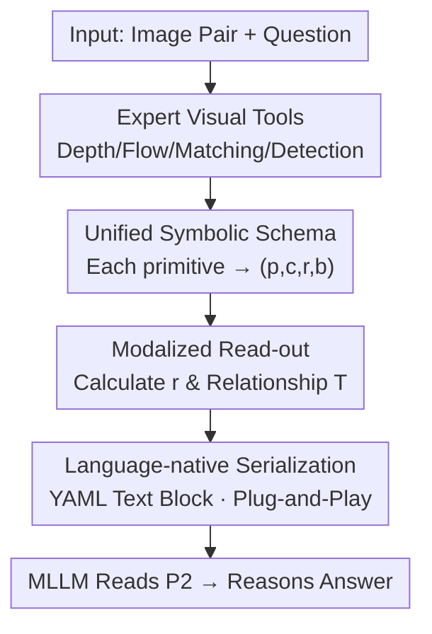

# Don't Show Pixels, Show Cues: Unlocking Visual Tool Reasoning in Language Models via Perception Programs

**Conference**: CVPR 2026  
**Paper**: [CVF Open Access](https://openaccess.thecvf.com/content/CVPR2026/html/Janjua_Dont_Show_Pixels_Show_Cues_Unlocking_Visual_Tool_Reasoning_in_CVPR_2026_paper.html)  
**Code**: https://github.com/AISmartPerception/perception-programs  
**Area**: Multimodal VLM  
**Keywords**: Visual Tool Reasoning, Perception Program, Training-free, Multimodal LLM, Representation Alignment  

## TL;DR
When connecting MLLMs to visual tools like depth, optical flow, or matching, the bottleneck is not the number of tool calls or model size, but "how the tool output is fed." This paper proposes Perception Program (P2), which **rewrites raw dense pixel-level tool outputs into compact, structured, language-native symbolic summaries**. It can be inserted into any MLLM without training or architectural changes. It achieves an average improvement of 19.66% across six BLINK perception tasks, with multi-view reasoning in GPT-5 Mini soaring from 41.35% to 86.47%.

## Background & Motivation
**Background**: The current mainstream approach is to equip MLLMs with visual tools (monocular depth, optical flow, visual correspondence, object detection, etc.) to help models perform visual reasoning that cannot be read directly from pixels (e.g., relative depth, camera movement). The standard method is to serialize tool outputs and feed them directly to the model as auxiliary input.

**Limitations of Prior Work**: Even with accurate tool outputs, MLLMs often fail to utilize them. Raw tool outputs are dense, pixel-level low-level tensors (entire depth maps, full optical flow fields). Once serialized, they become a massive number of numerical tokens, which are misaligned with the "language-native" reasoning substrate that LLMs excel at. Consequently, models either ignore these signals and revert to guessing based on language priors or are misled by noise. Experiments show that providing Raw Tools can even be **harmful** (Gemini 2.5 Pro's performance on multi-view reasoning dropped by 14.29% after receiving raw optical flow).

**Key Challenge**: There is a fundamental mismatch between the **representation format** of visual tool outputs (dense pixel values) and the reasoning capabilities of LLMs (linguistic symbols). Previous remedies—such as program synthesis (VisProg/ViperGPT generating code), Chain-of-Thought tool invocation (Aurora/Mirage), SFT/RL fine-tuning, or dedicated perception modules—either increase computational cost or require training, and **still remain at the pixel-level granularity**, failing to solve the representation mismatch itself.

**Key Insight**: The authors draw an analogy to human "cue extraction." Humans reason about depth based on surface distance perception, orientation based on leftward/rightward movement, and correspondence based on local similarity, rather than pixel-by-pixel processing. **Transcribing key cues in each problem category into text** significantly reduces the model's burden of processing pixel details, as text is the representation most aligned with native LLM reasoning.

**Core Idea**: Replace "raw pixel tool outputs" with "language-native symbolic summaries." Instead of feeding tool outputs directly, they are first digested into a standardized structure (explaining "what is there / where it is / what the relationships are"), allowing the MLLM to truly "read" the modality rather than guessing from dense numbers.

## Method

### Overall Architecture
P2 (Perception Program) is a **training-free, model-agnostic, and plug-and-play** intermediate representation layer. It does not modify any MLLM parameters or architecture, nor does it increase extra tool calls during inference. Its sole function is to translate the "raw output of expert tools" into "language-native symbolic programs," which are then handed to an off-the-shelf MLLM along with the image and the question. The pipeline is: Input image pair + question → Expert tools produce raw modalities (depth map/optical flow/correspondence...) → **P2 Generator** transcribes it into unified schema symbolic items + relationships → Serialized into YAML-style text blocks → MLLM reads P2 and reasons the answer.

The difference from baseline settings lies in the "what to feed" step: the Standard setting provides only image + question (under-utilizing visual signals); the Tool setting provides **raw pixel-level** outputs (exposing the modality but staying at the pixel level); and the P2 setting provides **digested language-native structures**. With the same tool signal but a different representation, the model shifts from "guessing" to "reading."

### Key Designs

**1. Unified Symbolic Schema: Normalizing any tool output into "quadruplets + relationship triplets"**

A major pain point is that tool outputs across different modalities vary (depth is a scalar field, flow is a vector field, correspondence consists of point pairs, detection consists of boxes). P2 unifies them using a **cross-modal invariant item schema**: discretizing the pixel domain $\Omega=\{0,\dots,W{-}1\}\times\{0,\dots,H{-}1\}$ into a set of primitives $p\in P$. Each primitive is associated with a spatial support $S_p\subseteq\Omega$ (a patch, a point, or the whole image) and **normalized coordinates** $c_p\in\{0,\dots,1000\}^2$. Any pixel $(x,y)$ is mapped to $(\lfloor 1000x/W\rfloor,\lfloor 1000y/H\rfloor)$. Each primitive outputs a structured item:

$$I_p = (p,\, c_p,\, r_p,\, b_p),$$

where $p$ is the identifier, $c_p$ represents normalized coordinates, $r_p$ is the **reading** of the modality on $S_p$, and $b_p$ is an optional label. Additionally, P2 can carry sparse **symbolic relationship triplets** $(p_a,\pi,p_b)$ (where $\pi$ is a predicate like "darker than", "adjacent to", "in-front of"), generated by comparing statistics between primitives.

**2. Modalized Read-out: Translating each visual modality into "readable language"**

The core of P2 is how it compresses "pixel evidence" into "linguistic cues" for each modality:

- **Depth**: The tool provides a scalar field $D:\Omega\to[0,1]$. This is sliced into a $P\times P$ grid. Each cell's reading is the extreme value pair $r_p=(\min_{(x,y)\in S_p}D,\ \max_{(x,y)\in S_p}D)$. Within a 4-neighborhood, an "in-front of" relationship is issued if the mean depth difference exceeds a margin $\tau$.
- **Optical Flow**: Vector field $F=(u,v)$. The horizontal component is averaged as $\bar u_p$, and the reading is binarized into direction words $r_p=\text{'left'}$ or $\text{'right'}$.
- **Visual Correspondence**: Instead of a grid, each match is represented as $c_i$ for the reference point and $r_i$ for the target point, meaning "connected from this point to that point."
- **Jigsaw**: Primitives are combinations of candidate patches and edges. The reading $r_p\in[0,1]$ is the mean similarity of structure/edge/color between the gap edge and the candidate edge.
- **Object Detection**: Each detection is a primitive, $c_p$ is the normalized box, $r_p$ is confidence, and $b_p$ is the class label.

**3. Language-native Serialization + Training-free Plug-and-Play**

P2 serializes the schema into a **YAML-style text block**, presenting what exists, where it is, and the relationships in a single pass. This is the format best aligned with the LLM reasoning substrate. The process requires no updates to parameters or architecture, making it true plug-and-play.

## Key Experimental Results

### Main Results
Evaluation was conducted on six perception-centric sub-tasks in **BLINK**. P2 pushed GPT-5 Mini to new SOTA across all tasks, with an average relative improvement of **+19.66%** over the prior best.

Comparison for GPT-5 Mini (Accuracy %):

| Task | Standard | Raw Tool | P2 (Ours) | Prior SOTA |
|------|---------|----------|-----------|-----------|
| Multi-view Reasoning | 41.35 | 45.11 | **86.47** | 60.20 |
| HardBLINK Depth | 52.42 | 65.05 | **81.45** | 61.56 |
| Visual Correspondence | 76.74 | 75.58 | **94.19** | 85.50 |
| Jigsaw | 76.00 | 66.00 | **91.33** | 88.00 |
| Object Localization | 58.20 | 59.02 | **93.44** | 65.40 |
| Semantic Correspondence | 53.24 | 53.24 | **64.03** | 58.30 |

### Ablation Study (Small Models)
P2 also scales well for small models. 4B-class models with P2 can match or exceed base versions of larger models like GPT-5 Mini or Gemini 2.5 Pro.

| Model | Setting | Multi-view | Depth | Localization | Semantic Corr. |
|------|------|-------|------|---------|---------|
| Qwen3VL-4B | Standard | 45.90 | 47.04 | 54.92 | 61.87 |
| Qwen3VL-4B | **P2** | **93.98** | **61.02** | **85.25** | **64.03** |
| InternVL3.5-4B | Standard | 45.86 | 40.59 | 56.56 | 45.32 |
| InternVL3.5-4B | **P2** | **94.73** | **69.89** | **90.16** | **62.59** |

### Key Findings
- **Bottleneck is representation, not compute**: The same tool output, when converted to language-native representation, changes from "guessing" to "reading."
- **MLLMs cannot read dense maps**: Experiments reconstructing depth from grids show that Kendall's $\tau$ drops to near 0 as resolution increases, proving models lose relative ranking.
- **Copying behavior in correspondence**: Models often copy coordinates from the reference field to the target field instead of reasoning.
- **CoT can be detrimental**: Explicit linguistic descriptions often introduce noise, further suggesting the problem lies in the representation format.

## Highlights & Insights
- **Bottleneck Identification**: Pinpointing the issue as a representation mismatch rather than tool availability or model size is a sharp and effective insight.
- **Unified Schema Transferability**: The $(p,c_p,r_p,b_p)$ plus relationship triplets structure provides a portable skeleton for discretizing any visual evidence into symbolic terms.
- **Coordinate Normalization**: Mapping spatial positions to a [0, 1000] integer grid ensures consistent spatial semantics for the LLM regardless of image resolution.
- **Engineering Value**: Being training-free and model-agnostic makes P2 highly practical for real-world deployment in agent frameworks.

## Limitations & Future Work
- **Scope**: Evaluation was limited to six perception tasks with clear expert tool counterparts.
- **Scheduling**: P2 currently does not perform dynamic tool selection or orchestration.
- **Error Propagation**: P2 faithfully transmits tool outputs; if the upstream tool is incorrect, P2 will propagate that error.
- **Heuristics**: Some read-out rules (e.g., depth grid size) are currently task-specific and may benefit from automated tuning in the future.

## Related Work & Insights
- **Comparison to Program Synthesis**: Unlike VisProg or ViperGPT, P2 does not require code generation or execution sandboxes, offering a zero-execution alternative.
- **Comparison to CoT Tools**: Unlike frameworks that embed pixel-level tokens into the reasoning chain, P2 elevates the granularity to linguistic symbols, solving the under-utilization of vision encoders.
- **Value of Representation**: The contrast where Raw Tools are neutral or harmful while P2 is highly beneficial provides definitive proof that representation determines the efficacy of tool-augmented MLLMs.

## Rating
- Novelty: ⭐⭐⭐⭐⭐ Redefines the tool-augmented MLLM bottleneck as a representation issue with a sharp, training-free solution.
- Experimental Thoroughness: ⭐⭐⭐⭐⭐ Comprehensive coverage across 6 tasks and 5 models, including insightful diagnostic experiments.
- Writing Quality: ⭐⭐⭐⭐ Formalized schema is clear; specific read-out details for each modality are intricate but detailed.
- Value: ⭐⭐⭐⭐⭐ High feasibility for deployment with zero training cost and significant gains for small models.

<!-- RELATED:START -->

## Related Papers

- [\[CVPR 2026\] VRR-QA: Visual Relational Reasoning in Videos Beyond Explicit Cues](vrr-qa_visual_relational_reasoning_in_videos_beyond_explicit_cues.md)
- [\[CVPR 2026\] Proof-of-Perception: Certified Tool-Using Multimodal Reasoning with Compositional Conformal Guarantees](pop_proof_of_perception_conformal_reasoning.md)
- [\[CVPR 2026\] ARM-Thinker: Reinforcing Multimodal Generative Reward Models with Agentic Tool Use and Visual Reasoning](arm-thinker_reinforcing_multimodal_generative_reward_models_with_agentic_tool_us.md)
- [\[CVPR 2026\] Improving Vision-language Models with Perception-centric Process Reward Models](improving_vision-language_models_with_perception-centric_process_reward_models.md)
- [\[CVPR 2026\] Dr. Seg: Revisiting GRPO Training for Visual Large Language Models through Perception-Oriented Design](dr_seg_revisiting_grpo_training_for_visual_large_language_models_through_percept.md)

<!-- RELATED:END -->
