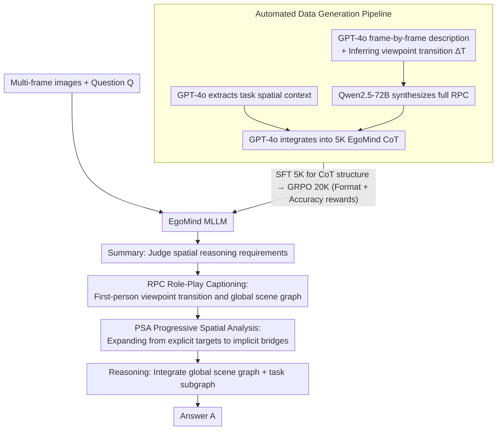

# EgoMind: Activating Spatial Cognition through Linguistic Reasoning in MLLMs

**Conference**: CVPR 2026  
**arXiv**: [2604.03318](https://arxiv.org/abs/2604.03318)  
**Code**: [GitHub](https://github.com/Hyggge/EgoMind)  
**Area**: Multimodal / VLM  
**Keywords**: Spatial Reasoning, Chain-of-Thought, Multi-frame Understanding, MLLM, Linguistic Reasoning

## TL;DR

EgoMind is proposed as a CoT framework that requires no geometric priors. Through two core components—Role-Play Captioning (RPC) and Progressive Spatial Analysis (PSA)—it achieves competitive multi-frame spatial reasoning capabilities using only 5K SFT and 20K RL samples.

## Background & Motivation

The application of Multimodal Large Language Models (MLLMs) in spatial cognition tasks is increasing, yet faces two core challenges:

**High Cost of 3D Prior Methods**: Most existing methods enhance spatial reasoning by introducing explicit 3D inputs such as point clouds, depth maps, BEV representations, or camera parameters. These require expensive data collection, alignment, and training. For instance, SpaceVista requires 1M training samples, and Struct-2D requires 200K.

**Limitations of Prior Work (Pure 2D)**: Methods independent of 3D priors perform poorly in multi-frame spatial reasoning because: (a) models process inputs frame-by-frame without modeling continuous spatio-temporal transformations, leading to fragmented spatial understanding; (b) models focus only on objects explicitly mentioned in the query, ignoring implicit "spatial bridge" objects needed to connect observations across frames.

**Key Insight**: The authors argue that spatial reasoning does not necessarily require explicit 3D geometric priors. Through carefully designed linguistic reasoning signals, MLLMs can be guided to bridge discontinuities in cross-frame perspectives, achieving strong spatial reasoning at minimal data cost.

## Method

### Overall Architecture

EgoMind posits that multi-frame spatial reasoning does not strictly require expensive 3D priors like point clouds or BEV; instead, well-designed linguistic signals can bridge cross-frame perspective gaps. It organizes reasoning into a four-stage CoT: Summary Field → RPC Field → PSA Field → Reasoning Field. It first determines the type of spatial reasoning required, uses RPC to assemble multiple frames into a global spatial context, extracts query-related local context via PSA, and finally integrates these for an answer. Summary and Reasoning serve as the CoT scaffolding, while RPC and PSA are the core components. The model learns this CoT via an automated data generation pipeline (GPT-4o / Qwen2.5-72B synthesizing 5K samples) followed by a two-stage SFT/GRPO training process.

### Key Designs

**1. Role-Play Caption (RPC): Position the model as a first-person navigator to补 fill viewpoint transitions**

Pure 2D methods process inputs frame-by-frame without modeling how the camera moves. RPC requires the model to act as a first-person navigator, generating scene descriptions $\mathcal{D}_i$ for each frame and viewpoint transition descriptions $\Delta\mathcal{T}_{i \to i+1}$ between adjacent frames (e.g., "I move forward and turn right to observe the table from the other side"). This explicitly describes camera motion to ensure cross-frame spatial consistency and stitches overlapping observations via anchor object identification into a unified global scene graph $\hat{\mathcal{G}}_{\mathrm{RPC}} = (\hat{\mathcal{O}}, \hat{\mathcal{R}}, \hat{\mathcal{V}})$. Ablations show RPC provides the largest gain during the RL phase.

**2. Progressive Spatial Analysis (PSA): Recovering implicit "spatial bridge" objects via the scene graph**

Models often focus solely on objects explicitly named in a query, missing intermediate objects necessary for cross-frame connection. PSA performs progressive expansion: it first identifies the explicit target set $\mathcal{O}_{\mathrm{exp}}$, then expands the spatial neighborhood for each object $o_i$ in the scene graph $\mathcal{N}(o_i) = \{o_j \in \hat{\mathcal{O}} \mid (o_i, o_j) \in \hat{\mathcal{R}}\}$, aggregating them into an expanded candidate set $\hat{\mathcal{O}}_{\mathrm{rel}}$ to cover implicit but critical spatial anchors.

**3. Automated Data Generation Pipeline: Zero human annotation, reducing data cost to 5K**

Explicit 3D prior methods are expensive due to data requirements. EgoMind's CoT data is fully synthesized: GPT-4o generates frame-by-frame descriptions and infers viewpoint transitions $\Delta\mathcal{T}$; Qwen2.5-72B acts as $f_{\mathrm{RPC}}^{\mathrm{lang}}$ to synthesize the full RPC. Separately, GPT-4o extracts task-relevant spatial context. Finally, GPT-4o merges these into the full EgoMind CoT. This eliminates human labeling, using only 5K SFT samples.

### Loss & Training

Two-stage training:

- **SFT Phase**: 5K automated CoT samples, 3 epochs, learning rate $5 \times 10^{-6}$.
- **GRPO Reinforcement Learning Phase**: 20K samples, combining format and accuracy rewards:

$$R_i = w_f R_{\mathrm{format}}(y|x) + w_a R_{\mathrm{accuracy}}(y|x)$$

## Key Experimental Results

### Main Results

| Benchmark | Metric | EgoMind | Qwen2.5-VL-7B (base) | SpaceR (151K) | Spatial-MLLM (120K) |
|------|------|---------|----------------------|---------------|----------------------|
| VSI-Bench | Overall | **50.16** | 30.02 | 45.76 | 48.40 |
| SPAR-Bench | Overall | **39.03** | 33.19 | 38.26 | 35.10 |
| SPBench | Overall | **55.02** | 41.65 | 53.39 | 48.40 |
| SITE-Bench | Overall | **58.03** | 53.74 | 56.48 | 43.99 |

### Ablation Study

| Configuration | VSI-Bench (SFT) | VSI-Bench (+RL) | Description |
|------|-----------------|-----------------|------|
| Full CoT (RPC+PSA) | 42.33 | **50.16** | Full Framework |
| w/o RPC | 41.52 | 47.69 | Remove global scene modeling |
| w/o PSA | 41.23 | 45.15 | Remove progressive analysis |
| RPC → MFC+CVP | 41.84 | 47.12 | Numerical viewpoint prediction is harmful |
| PSA → DSA | 41.54 | 47.24 | Direct analysis is inferior to progressive |

### Key Findings

- Using only 25K training samples (2.5% of SpaceVista), EgoMind outperforms SpaceVista on VSI-Bench (50.16 vs 48.60).
- The RL phase significantly benefits RPC (RL gain drops from +7.83 to +6.17 without RPC), indicating the importance of global context for RL exploration.
- Increasing the number of RPC input frames leads to sustained improvements in metric-sensitive tasks like room size estimation.

## Highlights & Insights

- The path of **replacing 3D priors with linguistic reasoning** is elegant—no extra modalities like depth or point clouds are needed, lowering deployment barriers.
- **High data efficiency**—5K CoT + 20K RL achieves performance comparable to methods using millions of samples.
- Under-noising and viewpoint transition descriptions in CoT represent a strong paradigm for linguistic spatial reasoning.

## Limitations & Future Work

- Temporal reasoning remains limited; understanding long-axis videos is insufficient.
- The diversity of CoT data synthesis needs improvement.
- Scaling effects have not yet been verified on larger models (e.g., 72B).

## Related Work & Insights

- Could be complementary to SpaceR’s 2D grid intermediate supervision.
- EgoMind's approach can be generalized to downstream tasks like embodied navigation and robotic spatial cognition.
- The paradigm of driving spatial understanding through linguistic reasoning could be combined with video reasoning methods like Video-R1.

## Rating

- **Novelty**: ⭐⭐⭐⭐ Replacing 3D priors with linguistic reasoning is novel, though CoT frameworks follow established patterns.
- **Experimental Thoroughness**: ⭐⭐⭐⭐⭐ Four benchmarks + detailed ablations + component variants.
- **Writing Quality**: ⭐⭐⭐⭐ Rigorous formulation and clear framework description.
- **Value**: ⭐⭐⭐⭐⭐ High data efficiency and independence from 3D priors provide significant practical value.

<!-- RELATED:START -->

## Related Papers

- [\[CVPR 2026\] Eliciting Complex Spatial Reasoning in MLLMs through Wide-Baseline Matching](eliciting_complex_spatial_reasoning_in_mllms_through_wide-baseline_matching.md)
- [\[CVPR 2026\] CLiViS: Unleashing Cognitive Map through Linguistic-Visual Synergy for Embodied Visual Reasoning](clivis_unleashing_cognitive_map_through_linguistic-visual_synergy_for_embodied_v.md)
- [\[CVPR 2026\] From Indoor to Open World: Revealing the Spatial Reasoning Gap in MLLMs](from_indoor_to_open_world_revealing_the_spatial_reasoning_gap_in_mllms.md)
- [\[ICLR 2026\] Unfolding Spatial Cognition: Evaluating Multimodal Models on Visual Simulations](../../ICLR2026/vlm_reasoning/unfolding_spatial_cognition_evaluating_multimodal_models_on_visual_simulations.md)
- [\[CVPR 2026\] MMTIT-Bench: A Multilingual and Multi-Scenario Benchmark with Cognition-Perception-Reasoning Guided Text-Image Machine Translation](mmtit-bench_a_multilingual_and_multi-scenario_benchmark_with_cognition-perceptio.md)

<!-- RELATED:END -->
