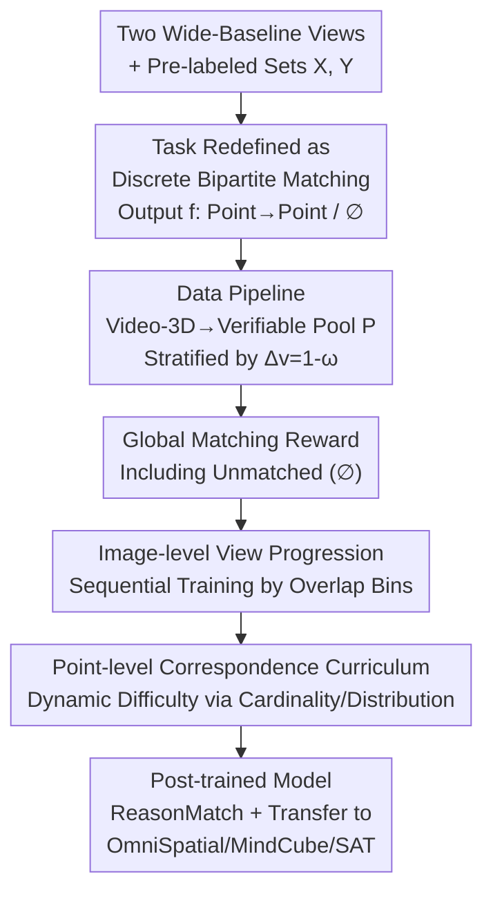

# Eliciting Complex Spatial Reasoning in MLLMs through Wide-Baseline Matching

**Conference**: CVPR 2026  
**arXiv**: [2606.03577](https://arxiv.org/abs/2606.03577)  
**Code**: None (Not provided in the paper)  
**Area**: Multimodal VLM / Spatial Reasoning  
**Keywords**: Wide-baseline matching, Cross-view correspondence, Verifiable reward reinforcement learning, Curriculum learning, Spatial reasoning benchmark

## TL;DR
This paper proposes using "wide-baseline matching" (WBM) as a touchstone for probing and training spatial reasoning in MLLMs. It introduces ReasonMatch-Bench, stratified by viewpoint difference and matching granularity (where the strongest baseline achieves only 37.2 F1 compared to human 84.0). Utilizing an automated data pipeline that extracts verifiable correspondences from video-3D corpora and DCRL (Verifiable Reward RL with Dual-level Dynamic Curriculum), the authors improved Qwen3-VL-8B from 27.5 to 70.5 F1 on this benchmark. The model also successfully transfers to multiple spatial intelligence benchmarks without compromising general vision capabilities.

## Background & Motivation
**Background**: To deploy MLLMs in the physical world, recognizing objects and describing images is insufficient. The key lies in spatial reasoning across "vastly different viewpoints"—requiring geometric understanding, perspective imagination, fine-grained perception, occlusion and topological reasoning, and scale/depth estimation. Existing benchmarks (OmniSpatial, VSI-Bench) mostly test isolated abilities per sample (e.g., relative position, viewpoint prediction). Training methods (SAT, RoboSpatial, RoboRefer) also tend toward visual grounding or simple relational reasoning, often limited to text-based reasoning and multiple-choice formats.

**Limitations of Prior Work**: Supervised data that truly "elicits" spatial reasoning is both expensive and brittle. Manual annotation struggle to cover geometry, semantics, and context simultaneously in a single sample; synthetic data fails to balance realism, diversity, and large-scale verifiability. Existing attempts at cross-view correspondence (Multi-SpatialMLLM) are limited to small viewpoint changes, constrained task formats (multiple choice), and rely solely on SFT, failing to evoke deeper reasoning.

**Key Challenge**: Classic feature matching pipelines (SIFT/SURF/ORB + RANSAC + Epipolar Geometry) are effective under small viewpoints and dense sampling but frequently fail under "extreme wide-baselines" (large baselines, strong perspective/appearance changes, repetitive structures, lighting variations, semantic occlusions). Conversely, humans can make judgments by integrating geometric laws, semantic knowledge, and contextual cues. It remains unknown where MLLMs stand in this regard and what data or training paradigms can reliably improve them.

**Goal**: (1) Systematically evaluate MLLM capabilities in WBM; (2) Identify a large-scale, verifiable, and low-manual training paradigm to enhance such cross-view spatial reasoning.

**Key Insight**: The WBM task is "naturally verifiable"—whether two points correspond to the same 3D point can be strictly validated using geometric re-projection or SfM landmarks. This implies that CoT supervision can be bypassed, and RLVR (Verifiable Reward Reinforcement Learning) can be used to let the model explore its own reasoning strategies.

**Core Idea**: Reformulate WBM as a language task of "discrete symbolic association (partial bipartite graph matching) between two sets of pre-labeled points." Use verifiable correspondences automatically extracted from video-3D corpora as rewards, and stabilize training using a dynamic curriculum that progresses through both "viewpoint difference" and "point configuration."

## Method

### Overall Architecture
The method aims to enable MLLMs to determine which labeled points in two images correspond to the same 3D object point under extreme viewpoint differences. The architecture consists of three parts: first, re-formulating the matching task into a discrete language task (outputting a mapping from point index to point index); second, extracting a verifiable correspondence pool with ground-truth from RGB-D videos and SfM reconstructions; and finally, training the model using DCRL (RL with a dual-level dynamic curriculum) to progress from simple configurations to extreme scenarios.

### Key Designs

**1. Redefining WBM as "Language-Mediated Discrete Bipartite Matching"**

Classic matchers output continuous similarity matrices $S\in\mathbb{R}^{n\times m}$, but MLLMs cannot directly produce such dense scores, and forcing them would cause a mismatch between the task and model capabilities. This paper proposes a different query: given two images each with a set of pre-labeled indexed points $\mathcal{X}=\{\mathbf{x}_i\}_{i=1}^n$ and $\mathcal{Y}=\{\mathbf{y}_j\}_{j=1}^m$, the model takes $(I_1,\mathcal{X};I_2,\mathcal{Y})$ (with visual prompts marking point numbers) and outputs a text mapping $\hat f:\{1,\dots,n\}\to\{1,\dots,m\}\cup\{\varnothing\}$. Here $\hat f(i)=j$ indicates $\mathbf{x}_i$ corresponds to $\mathbf{y}_j$, while $\hat f(i)=\varnothing$ denotes no credible match due to occlusion or lack of overlap. This is essentially "partial bipartite matching" between two sets. This approach treats the MLLM as a "reasoning engine for symbolic association between visual entities" rather than a continuous feature comparator, allowing it to integrate geometric, semantic, and contextual cues; furthermore, discrete outputs are naturally suited for point-by-point comparison with ground-truth for verifiable rewards.

**2. Automated Video-3D Data Pipeline: Verifiable, Stratified, and Re-samplable Pool**

The scarcity and brittleness of supervised data are major bottlenecks. This paper automatically generates supervision from existing large-scale video-3D corpora. Sources include: RGB-D data (CO3D, uCO3D, ScanNet) using geometric re-projection—pixels with valid depth in $I_1$ are back-projected to 3D and then projected onto $I_2$, verified by depth and photometric consistency; and SfM data (RealEstate10K, DL3DV) using shared 3D landmarks from COLMAP reconstructions. Each image pair yields thousands of dense matches $\mathcal{M}$. For difficulty quantification, an overlap score $\omega\in[0,1]$ is defined (ratio of matched pixels for RGB-D, ratio of shared landmarks for SfM). Viewpoint change magnitude $\Delta_v=1-\omega$ increases with baseline and occlusion, allowing for difficulty stratification. To avoid visual clutter and MLLM input limits, spatial filtering based on clustering is applied to obtain $N_p\in[10,50]$ well-distributed verified correspondence pools $\mathcal{P}$. $\mathcal{P}$ is a key intermediate: matchable and distractor points are flexibly sampled from it to support task construction in the dynamic curriculum.

**3. Global Matching Reward: Accounting for "Unmatched Points"**

Traditional partial bipartite matching often only evaluates matched pairs and ignores unmatched points, leading models to pick obvious matches while avoiding occluded regions. This paper explicitly assigns a dummy target $\varnothing$ to unmatched points and rewards correct "no-match" predictions. Matching accuracy is defined over all $n$ query regions as:
$$r_{\text{match}}=\frac{1}{n}\sum_{i=1}^{n}\mathbb{1}\big[\hat f(i)=f^*(i)\big],$$
supplemented by a format compliance term. The final reward is $r=w_f\cdot r_{\text{format}}+w_m\cdot r_{\text{match}}$ (with $w_f=w_m=1.0$). This $r_{\text{match}}$ serves dual roles: a training signal for policy optimization and a control signal for dynamic difficulty adjustment. Including $\varnothing$ eliminates target ambiguity and forces the model to perform "deliberate reasoning" about viewpoint-dependent visibility and geometric constraints rather than just betting on salient features.

**4. Dual-level Dynamic Curriculum: Image-level Progression and Point Configuration**

Directly training on extreme matching scenarios leads to inefficient exploration and poor convergence. DCRL decomposes difficulty across two complementary dimensions. The outer loop is Image-level View Progression: data is split into $S=10$ overlap bins by $\omega$, where Bin 1 is high-overlap/small-viewpoint and Bin $S$ is extreme. Training proceeds sequentially; when the moving average accuracy (20 steps) on a bin exceeds 0.8, it progresses to the next bin, permanently removing mastered simple bins to maintain efficiency and focus on high-information-gain samples. The inner loop is Point-level Correspondence Curriculum: the point sets $\mathcal{X},\mathcal{Y}=g(\mathcal{P})$ are sampled online from the pool, with sampling strategy $g$ dynamically adjusting difficulty. This involves two sub-dimensions: (a) Cardinality Adaptation, progressing through L1 Unambiguous Matching (no distractors, 1-to-1) → L2 Selective Matching (distractors on $\mathcal{Y}$ side) → L3 Partial Matching (distractors on both sides); and (b) Spatial Distribution Refinement, progressing from "sparsest (one point per cluster, global distribution, requiring object-level reasoning)" → Moderate Clustering → Dense Random Sampling, gradually removing spatial cues that allow "mindless alignment" to force fine-grained geometry learning.

### Loss & Training
The model uses GRPO on Qwen3-VL-8B-Instruct for RLVR: group size $G=32$, effective batch size of $16\times32$ trajectories per update, KL coefficient $\beta=0.005$, max 5120 tokens per prediction, rollout temperature $T=1.0$, AdamW with 10-step linear warmup, and a constant learning rate of $10^{-6}$. The reward is $r=w_f r_{\text{format}}+w_m r_{\text{match}}$ (weights 1.0 each), with no explicit CoT or process supervision—the model explores reasoning strategies autonomously via verifiable rewards.

## Key Experimental Results

### Main Results
The ReasonMatch-Bench test set includes 2,810 image pairs (sampled from a 220k pair corpus), balanced across data sources, task levels, and scenes (e.g., ScanNet 27.7%, uCO3D 28.0%, DL3DV 27.0%, RE10K 17.2%; L1 32.5% / L2 36.8% / L3 30.7%; Indoor 55.1% / Object 28.0% / Outdoor 16.9%).

| Model | ReasonMatch F1 | Precision | Recall |
|------|------|------|------|
| GPT-5-mini | 57.9 | 56.9 | 59.4 |
| GPT-5-Chat | 51.5 | 50.6 | 52.8 |
| Gemini-2.5-Pro | 42.8 | 42.4 | 43.4 |
| Claude-4.5-Sonnet | 41.7 | 43.7 | 41.1 |
| Qwen3-VL-235B | 49.2 | 50.7 | 48.7 |
| Qwen3-VL-8B-Instruct (base) | 27.5 | 27.1 | 29.1 |
| **Qwen3-VL-8B + DCRL** | **70.5** | **70.3** | **71.1** |
| Gain vs. base | +43.0 | +43.2 | +42.0 |

The 8B model with DCRL (70.5) outperforms all open and closed-source baselines, including GPT-5-mini (57.9) and the 235B Qwen3-VL (49.2). Difficulty analysis: Outdoor L1 is easiest, indoor is moderate, and object-centric is hardest—isolated objects lack environment context, causing baselines to collapse on L3 (most < 30 F1), while DCRL remains relatively stable.

Human control (Subset of 90 largest viewpoint differences, F1 only):

| Method | Overall | DL3DV | RE10K | uCO3D |
|------|------|------|------|------|
| GPT-5-mini | 37.2 | 35.9 | 49.7 | 25.8 |
| Gemini-2.5-Pro | 29.5 | 26.5 | 44.1 | 18.0 |
| Qwen3-VL-235B | 29.9 | 25.3 | 45.7 | 18.7 |
| **Ours (DCRL)** | **52.0** | 57.7 | 70.6 | 27.8 |
| Human | 84.0 | 93.5 | 94.7 | 62.1 |

DCRL improves the strongest baseline from 37.2 to 52.0, yet a significant gap remains compared to human performance (84.0), especially in object-centric uCO3D (27.8 vs 62.1), indicating WBM is far from solved.

Transfer to spatial intelligence benchmarks: OmniSpatial Overall 43.60 → 48.87 (+5.27), MindCube 40.01 → 43.52 (+3.51), SAT Real 70.0 → 75.3 (+5.3). General vision capabilities remained stable or slightly improved: MME-RealWorld 62.8 → 63.8, MMStar 59.8 → 62.5, RealWorldQA 69.5 → 70.5, V*Bench 84.8 → 85.9.

### Ablation Study

| Configuration | OmniSpatial | MindCube | SAT | ReasonMatch |
|------|------|------|------|------|
| Base (Qwen3-VL-8B) | 43.6 | 40.0 | 70.0 | 27.5 |
| SFT (CoT on WBM data) | 42.6 | 45.1 | 41.3 | 51.0 |
| **DCRL (RLVR)** | **48.9** | 43.5 | **75.3** | **70.5** |

| Curriculum Config | ReasonMatch Rel. | Description |
|------|------|------|
| easy-only / hard-only | Lower | Training on easy/hard subsets only |
| Uniform Sampling RL | Moderate | Already better than easy/hard-only |
| **Dynamic Curriculum (DCRL)** | **+5.2** | Better than uniform sampling by +5.2 points |

### Key Findings
- RL is more transferable than SFT: SFT with CoT labels improved in-domain ReasonMatch to 51.0 but caused SAT performance to drop to 41.3 (worse than base 70.0), suggesting teacher-forcing leads to overfitting on correspondence patterns; DCRL is +19.5 higher on ReasonMatch and +34.0 higher on SAT than SFT, showing spatial reasoning from verifiable rewards is more general.
- Dynamic curriculum is effective: Uniform sampling outperforms single-difficulty subsets, and DCRL adds another +5.2 points with stable convergence.
- Heterogeneous Transfer: In OmniSpatial, Dynamic Reasoning (+9.6%) and Complex Logic (+8.38%) saw the largest gains, while Perspective Taking was nearly unchanged. This is attributed to training data consisting largely of indoor navigation videos with camera rotation/ego-motion, which aligns well with 3D mental rotation and motion prediction.
- Failure Modes: Gemini-2.5-Pro provides accurate local descriptions ("white wall area", "wooden surface") but lacks global distinctiveness, degrading into vague local feature matching. Qwen3-VL series show geometric intuition for viewpoint change but often exhibit "visual label misidentification + reasoning-answer inconsistency" (correct CoT logic but self-contradictory final output).

## Highlights & Insights
- **Task as Reward**: Choosing WBM is not just "another hard task" but reflects its "geometric verifiability"—whether two points are homologous can be strictly determined by re-projection/SfM. This allows for clean reward signals without CoT supervision, which is the foundation of RLVR. This approach of "finding a naturally verifiable proxy task to elicit specific reasoning" is transferable to other spatial/geometric training.
- **Rewarding ∅**: Explicitly rewarding "correctly identifying no match" is a small but critical design—it prevents the model from taking shortcuts by only picking easy matches and forces it to reason about visibility and occlusion. This "rewarding for abstention" strategy is applicable to retrieval, grounding, and hallucination suppression.
- **Online Re-sampling of Pool $\mathcal{P}$ + Dual-layer Curriculum**: Point sets are not fixed offline but sampled online from the verification pool, allowing a "single image pair" to dynamically generate L1/L2/L3 or sparse/dense configurations. This "intermediate product re-samplability → free curriculum orchestration" pattern is very clever.
- **8B Outperforming 235B and GPT-5-mini**: This demonstrates that for specialized spatial tasks, the right training paradigm is more effective than simply increasing parameter count.

## Limitations & Future Work
- There is still a large gap compared to humans (52.0 vs 84.0), particularly in object-centric scenes (27.8 vs 62.1).
- The difficulty metric $\omega$ is used for "intra-source stratification"; it cannot be directly compared across different sources (e.g., RGB-D vs. SfM), so absolute difficulty scales across data sources are not perfectly comparable.
- Data depends entirely on the quality of geometric/SfM validation in existing corpora; depth noise and COLMAP reconstruction errors can pollute ground-truth. Furthermore, the scene distribution is biased toward indoor navigation, which might explain the weak transfer to Perspective Taking.
- The task setup is "pre-labeled points + select index," bypassing the harder step of "detecting matchable points from scratch." Real-world downstream applications (relocalization, 3D reconstruction) still require dense, self-discovered correspondences.

## Related Work & Insights
- **vs. Multi-SpatialMLLM**: It also explores cross-view correspondence but is limited to small viewpoints, constrained formats (multiple choice), and SFT. This paper tackles extreme wide-baselines via discrete bipartite matching + RLVR to elicit deeper, transferable spatial reasoning.
- **vs. Classic Feature Matching (SIFT/SURF/ORB + RANSAC + Epipolar Geometry)**: Classic methods are efficient for small viewpoints but fail under extreme baselines due to perspective/lighting/occlusion changes and lack semantic context. This paper integrates geometry, semantics, and context using MLLMs to fill this gap.
- **vs. OmniSpatial / VSI-Bench**: These benchmarks mostly test isolated abilities per sample. ReasonMatch-Bench requires integrated geometry + semantic + context reasoning in a single task, with controlled difficulty levels.
- **vs. DeepSeek-R1 Style RLVR**: Inherits the idea of "verifiable rewards for autonomous reasoning exploration" but migrates it from math/code to visual spatial matching, adding a dual-level dynamic curriculum to stabilize exploration under extreme difficulty.

## Rating
- Novelty: ⭐⭐⭐⭐⭐ Formulating wide-baseline matching as a verifiable language task with a dual-level dynamic curriculum RLVR is a unique perspective that integrates benchmark, data, and training.
- Experimental Thoroughness: ⭐⭐⭐⭐ Covers 3 scenes × 3 difficulties, human comparison, 3 transfer benchmarks, 4 general benchmarks, and SFT/curriculum ablations. However, some key hyper-parameters/formulas are in the supplement and no code is provided.
- Writing Quality: ⭐⭐⭐⭐ Motivation is clear and task formalization is strong. Better visual diagrams for the "cardinality/spatial distribution" sub-dimensions of the curriculum would improve readability.
- Value: ⭐⭐⭐⭐⭐ Provides a verifiable, scalable, and low-manual paradigm for evaluating and training cross-view spatial reasoning in MLLMs. Proves specialized training can beat sheer scale, offering direct value to embodied AI and robotics.

<!-- RELATED:START -->

## Related Papers

- [\[CVPR 2026\] EgoMind: Activating Spatial Cognition through Linguistic Reasoning in MLLMs](egomind_activating_spatial_cognition_through_linguistic_reasoning_in_mllms.md)
- [\[CVPR 2026\] ReMatch: Boosting Representation through Matching for Multimodal Retrieval](rematch_boosting_representation_through_matching_for_multimodal_retrieval.md)
- [\[CVPR 2026\] From Indoor to Open World: Revealing the Spatial Reasoning Gap in MLLMs](from_indoor_to_open_world_revealing_the_spatial_reasoning_gap_in_mllms.md)
- [\[CVPR 2026\] STAR-R1: Multi-View Spatial TrAnsformation Reasoning by Reinforcing Multimodal LLMs](star-r1_multi-view_spatial_transformation_reasoning_by_reinforcing_multimodal_ll.md)
- [\[CVPR 2026\] SpatialTree: How Spatial Intelligence Branches Out in MLLMs](spatialtree_how_spatial_intelligence_branches_out_in_mllms.md)

<!-- RELATED:END -->
