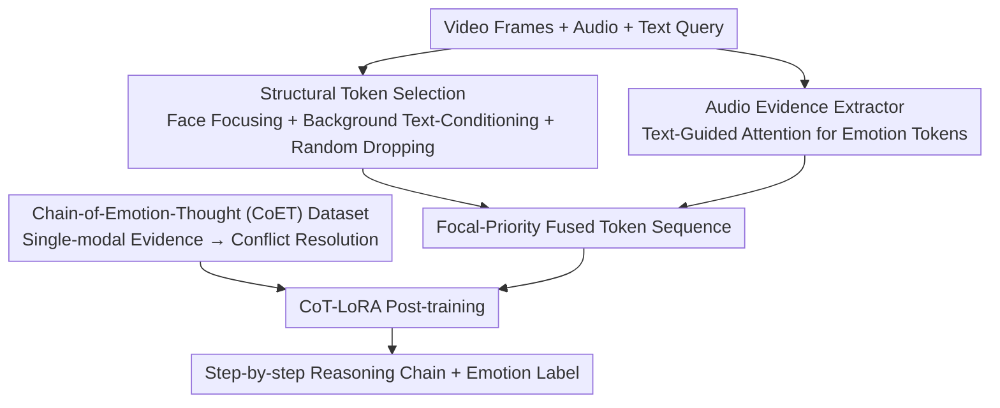

# EmoThinker: Advancing Visual-Acoustic Emotion Analysis via Structural Token Selection and Chain-of-Thought Reasoning

**Conference**: CVPR 2026  
**Paper**: [CVF Open Access](https://openaccess.thecvf.com/content/CVPR2026/html/Xu_EmoThinker_Advancing_Visual-Acoustic_Emotion_Analysis_via_Structural_Token_Selection_and_CVPR_2026_paper.html)  
**Code**: Yes (The paper claims the code and dataset are open-sourced; no explicit link is provided in the main text ⚠️ Refer to the original text)  
**Area**: Multi-modal VLM  
**Keywords**: Multi-modal Emotion Analysis, Structural Token Selection, Chain-of-Emotion-Thought, Visual-Acoustic Alignment, Cross-modal Reasoning

## TL;DR
EmoThinker transforms visual-acoustic emotion analysis from "implicit fusion" to "explicit step-by-step reasoning": the visual end uses structural token selection to separate facial focal regions from text-conditioned backgrounds, while the audio end utilizes text-guided attention to refine paralinguistic features. Combined with the first CoET dataset featuring step-by-step reasoning chains for LoRA post-training, it achieves new SOTA on five benchmarks such as DFEW (with a 10.5% Gain in zero-shot WAR on DFEW).

## Background & Motivation

**Background**: Multi-modal Emotion Analysis (MEA) aims to judge human emotional states from coordinated signals in video, audio, and text, serving as a cornerstone of human-centric AI. Recent mainstream approaches treat Large Visual Language Models (LVLMs) as powerful encoders and reasoners, achieving favorable results in coarse-grained emotion classification.

**Limitations of Prior Work**: The authors identify two neglected fundamental challenges. First, **emotional evidence is naturally sparse and local**—only a few facial Action Units (AUs) or brief prosodic bursts in a frame carry discriminative signals, while the vast majority of pixels and audio segments are emotionally neutral. However, existing methods (e.g., Emotion-LLaMA, Omni-Emotion) treat all spatio-temporal tokens equally, allocating the same computational power to a critical micro-expression as to static background pixels. Consequently, salient cues are diluted by neutral data, introducing noise and wasting computation. Second, **multi-modal emotional cues are temporally asynchronous**—psychological studies show that physiological vocal changes often precede conscious facial expressions, while linguistic emotion appears last. Implicit fusion (concatenation or cross-modal attention) assumes temporal alignment, compressing these misaligned cues into a single representation. This entangles "causes (physiological reactions)" with "consequences (conscious expressions)," disrupting the causal chain and making complex emotions like irony or contradiction difficult to recover.

**Key Challenge**: Sparse discriminative signals vs. uniform treatment; asynchronous emotional cues vs. implicit fusion assuming alignment. Both cause salient cues to be submerged and render the reasoning process uninterpretable.

**Goal**: To restructure emotion analysis from a "monolithic fusion task" into an "explicit step-by-step reasoning process," simultaneously addressing evidence sparsity (requiring focus) and temporal asynchrony (requiring modal-specific, sequential, and interpretable reasoning).

**Key Insight**: Utilize **structural token selection + audio evidence extractors** to first extract high-SNR multi-modal evidence, then use the **Chain-of-Emotion-Thought (CoET) dataset** to decouple "evidence acquisition" from "reasoning judgment," allowing the model to perform independent modal evidence collection followed by explicit cross-modal conflict resolution, similar to human reasoning.

## Method

### Overall Architecture

EmoThinker is built upon Qwen2.5-Omni, freezing pre-trained vision/audio/text encoders and integrating "structural token selection" and "audio evidence extractors" as trainable plugins. The pipeline consists of two layers: the **evidence layer** compresses raw video frames and audio into high-emotion-density token sequences, and the **reasoning layer** uses the CoET dataset for LoRA post-training, enabling the LLM to output step-by-step emotional reasoning chains and final labels.

Specifically, the visual side has two branches—the focal branch uses face detection to crop facial patches as "focal tokens," and the background branch uses text queries for cross-attention to refine the background before randomly dropping a portion. The audio side uses the same set of emotional text queries to guide attention, clustering the entire audio segment into emotion-rich "audio tokens." These three sets of tokens are concatenated into a "focal-priority" fused sequence for the LLM. The CoET dataset is generated externally via a three-stage annotation pipeline (single-modal description → QA pair generation → multi-modal thought annotation) to produce training data with explicit reasoning chains, specifically teaching the model to collect modal evidence first and then resolve conflicts from coarse to fine.

### Key Designs

**1. Structural token selection: Separating facial focal zones and text-conditioned background zones to address "salient cues submerged by neutral pixels"**

Addressing the pain point of "uniform treatment of all visual patches," the authors explicitly split each frame $Z_v \in \mathbb{R}^{T\times H\times W\times 3}$ into focal and background zones. Face detection tools identify all face boxes $b_t^k=(x_1,y_1,x_2,y_2)$, which are then dilated by a factor $\lambda$ relative to the patch size $r$ and clipped to frame boundaries:

$$\hat{b}_t^k = \mathrm{clip}\big(c_k + \lambda\cdot(b_t^k - c_k),\, r,\,(H,W)\big)$$

The union of all $\hat{b}_t^k$ forms the binary face mask $M_t^f$, while the background mask is $M_t^b = 1 - M_t^f$, yielding focal patches $P_t^f$ and background patches $P_t^b$. Focal patches are directly encoded into salient emotion tokens $E_t^f = \mathrm{Proj}_v(F_v(P_t^f))$. To prevent background noise, background tokens are conditioned using human text queries $E^q$ via cross-attention (where queries come from the background, and keys/values from text): $E_t^b \leftarrow E_t^b + \epsilon_b\cdot\mathrm{softmax}(Q_tK_t^\top/\sqrt{d_b})\cdot V_t$. Finally, background tokens are **randomly dropped** with a ratio $\delta$ to obtain a subset $\tilde{E}_t^b$. The focal and retained background tokens are then concatenated into structural tokens $E_t^v = (E_t^f \oplus \tilde{E}_t^b)$. A larger dilation ratio $\lambda$ includes more face-related patches, improving performance; random dropping is more direct and effective than attention-score-based selection in eliminating background influence, fostering more robust representations.

**2. Audio evidence extractor: Using the same emotional text queries to cluster audio into emotion-rich tokens**

Conventional methods lack mechanisms to distill salient paralinguistic features from long audio. EmoThinker creates a dedicated audio path: encoding log-Mel spectrogram segments $S_t$ into the shared multi-modal space $E^a = \mathrm{Proj}_a(F_a(S_t))$, and then applying cross-attention with the **same set** of emotion-guided text queries $E^q$ used in the visual branch—this time with audio as the query and text as key/value: $\tilde{E}^a \leftarrow E^a + \epsilon_a\cdot\mathrm{softmax}(Q_aK_a^\top/\sqrt{d_a})\cdot V_a$. Unlike visual background tokens, **all audio tokens are retained**, as acoustic features like prosody and rhythm densely carry emotional information (an ablation removing random dropping highlights this choice). The final multi-modal tokens concatenate the visual structural tokens and conditioned audio tokens: $E^m = [\{E_t^v\}_{t=1}^T \oplus \tilde{E}^a]$ for the LLM. Using a shared query set ensures both visual and acoustic paths align toward the same emotional semantics.

**3. Chain-of-Emotion-Thought (CoET) dataset: Decoupling "evidence acquisition" from "reasoning judgment" to explicitly resolve cross-modal conflicts**

This is the core solution for "temporal asynchrony" and the first dataset to provide structured step-by-step reasoning for MEA. CoET follows two human reasoning principles: first, **generating modal-specific descriptions** so that cues from each modality are assessed independently and fairly, rather than being implicitly mixed. Second, it incorporates a **conflict resolution mechanism** using a "coarse-to-fine" two-stage process for cross-modal contradictions. The coarse stage determines the global emotional tendency and reliability of each modality; the fine stage revisits ambiguous samples to refine emotion categories and intensities through explicit cross-modal argumentation. The data is produced via a three-stage automated pipeline: ① **Single-modal descriptions** use Qwen3-VL for frame-by-frame captioning and Qwen3-Omni-Captioner with emotional prompts to extract tone and rhythm. ② **QA pair generation** uses GPT-oss for a "cross-modal comparison → integration and mediation" hierarchical QA chain, mitigating modal bias. ③ **Multi-modal thought annotation** decomposes vision into focal emotion (DeepFace + OpenFace AUs), character context (pose/gesture), and background atmosphere (brightness/saturation), then synthesizes these cues to resolve semantic conflicts, forming the reasoning trajectory. This "evidence first, sequential mediation second" annotation teaches the model to respect the natural temporal order of emotional cues.

### Loss & Training
Two-stage training: First, **warm up** the video and audio adaptive modules to align them from random initialization to the cross-modal emotional semantic space. Then, keep the LLM backbone frozen and use **CoT-LoRA** on the CoET instruction dataset for fine-grained alignment, leveraging Qwen2.5-Omni's video reasoning capabilities. Key hyperparameters: 1 FPS sampling, dilation ratio $\lambda=8$, initial background drop ratio $\delta=0.2$, AdamW (initial lr $2\times10^{-5}$, merger lr $5\times10^{-6}$), LoRA rank/alpha = 32/64, 1 epoch, weight decay 0.1, warm-up ratio 0.05, trained on 8×NVIDIA 3090.

## Key Experimental Results

### Main Results
Evaluation on DFEW, IEMOCAP, MELD, MUStARD, and UR-FUNNY for classification, and EMER for reasoning quality. Comparison of DFEW (UAR/WAR) and IEMOCAP/MELD (w-F1):

| Dataset | Metric | EmoThinker | Prev. SOTA | Note |
|--------|------|-----------|----------------|------|
| DFEW (0rd-shot) | WAR | 65.63 | 59.37 (Emotion-LLaMA) | ~10.5% Gain (relative) |
| DFEW (Fine-tuned) | WAR | 78.13 | 77.06 (Emotion-LLaMA) | ~1.4% Gain |
| DFEW (0rd-shot) | UAR | 51.08 | 48.45 (Qwen2.5-VL) | New SOTA |
| IEMOCAP | w-F1 | 72.93 | 72.89 (Emotion-LLaMA) | Slightly better |
| MELD | w-F1 | 68.97 | 67.11 (Emotion-LLaMA) | New SOTA |
| MUStARD | Acc | 67.84 | 67.15 (Emotion-LLaMA) | Sarcasm detection |
| UR-FUNNY | Acc | 66.61 | 66.19 (Qwen2.5-VL) | Humor detection |

Reasoning tasks (EMER dataset, ChatGPT-evaluated Clue/Label overlap, 0–10):

| Method | Clue | Label |
|------|------|-------|
| Emotion-LLaMA | 8.22 | 6.25 |
| EmoThinker | **8.67** | **7.53** |

The significant increase in Label overlap (+1.28) indicates that CoET post-training contributes most to correctly identifying final emotion categories.

### Ablation Study
F/B/A denote Focal, Background, and Audio tokens respectively (WAR for DFEW, w-F1 for MELD):

| Configuration | DFEW WAR | MELD w-F1 | Note |
|------|----------|-----------|------|
| A only (Audio) | 43.71 | 50.29 | Without vision, worst |
| F only (Focal) | 60.37 | 56.49 | Face only |
| F+B | 66.57 | 62.36 | Without audio |
| F+A | 74.10 | 64.74 | Without background |
| F+B+A (Full) | **78.13** | **68.97** | Full model |

Comparison of background token selection strategies (DFEW WAR / MELD w-F1):

| Strategy | DFEW WAR | MELD w-F1 |
|------|----------|-----------|
| Attention Selection | 78.76 | 65.84 |
| Random Dropping | 78.13 | **68.97** |

### Key Findings
- **Visual fine-grained pixels are key to multi-modal emotional association**: Audio-only (A) performed worst on both datasets, and removing the visual branch caused the largest drop, proving facial details are irreplaceable.
- **Background is redundant but cannot be entirely discarded**: Removing the background (F+A) dropped 4 points compared to the full model on DFEW (74.10 vs 78.13), showing the background provides atmospheric information needed for spatial awareness—explaining why text-conditioning and partial retention are used instead of total removal.
- **Random Dropping > Attention Selection**: Random dropping outperformed the attention method by 3 w-F1 points on MELD. The authors explain this as a more direct and stochastic elimination of background influence, leading to more robust representations.
- **Hyperparameter trends**: A larger dilation ratio $\lambda$ (including more face-related patches) improved performance across all three datasets; a higher background drop ratio $\delta$ saved computation but degraded performance significantly—the authors selected a compromise value ($\delta=0.2$) based on Occam's razor.

## Highlights & Insights
- **"Decoupling evidence acquisition from reasoning judgment" is the most core paradigm shift**: Moving from an end-to-end black box to "first extracting high-SNR evidence, then explicit step-by-step reasoning" improves performance and grants interpretability. Case studies showed EmoThinker's GPT-4o score of 8.4 is higher than MiniGPT-v2's 7.6, with the ability to clarify how visual and acoustic cues interact.
- **Sharing the same emotional text query set for vision and audio** is a simple but effective alignment trick: It avoids extra alignment losses by pulling both attention paths towards the same emotional semantics, transferable to any task requiring "textual intent-guided multi-modal focus."
- **Random dropping beating attention selection** is a counter-intuitive "Aha!" moment: For background signals that are redundant yet useful, deterministic attention filtering may be less robust than random regularization, suggesting that one should not rely excessively on attention for "low-discriminative yet non-useless" tokens.
- **The three-layer visual decoupling of CoET (Focal/Context/Atmosphere) + coarse-to-fine conflict resolution** provides a reusable multi-modal reasoning data construction paradigm, valuable for any task requiring modal conflict resolution.

## Limitations & Future Work
- **Limitations acknowledged by authors**: Mediocre results on minority classes (Sad, Fear) in IEMOCAP/MELD due to long-tail dataset distributions causing classifier bias towards majority emotions; extremely rare classes like Disgust saw near-zero performance across multiple methods.
- **Identified limitations**: ① Heavy reliance on an external toolchain (DeepFace, OpenFace, Qwen3, GPT-oss); any error in these steps could pollute CoET annotation quality, though the impact of noise is not quantified ⚠️. ② The method is tightly coupled with the Qwen2.5-Omni base; cross-backbone generalization is unverified. ③ 1 FPS sampling and fixed dilation are engineering compromises for efficiency, potentially missing fast micro-expressions.
- **Future directions**: Adaptive token selection (dynamic retention based on content) and stronger fusion mechanisms; mitigating the long-tail problem via minority class resampling or reweighting.

## Related Work & Insights
- **vs Emotion-LLaMA**: Both use LLMs for emotion classification and reasoning. However, Emotion-LLaMA uses implicit, vague fusion and processes all tokens uniformly. EmoThinker explicitly splits Focal/Background/Audio and uses CoET for forced evidence-based mediation, leading by 6 points in DFEW 0-shot WAR and 1.28 in reasoning Label overlap, with better interpretability.
- **vs Omni-Emotion / Uniform LVLM methods**: These methods allocate equal computation to micro-expressions and static backgrounds, diluting salient cues. EmoThinker tilts computation toward facial focal zones using structural selection and background conditioning, improving emotional saliency and efficiency.
- **vs Graph methods (AdaIGN/MultiEMO) & Implicit Fusion (UniMSE/i-Code)**: These methods assume temporal alignment and mix modalities in hidden space. EmoThinker addresses temporal asynchrony directly through CoET's coarse-to-fine conflict resolution, respecting the natural sequence of "voice first, expression second, language last."

## Rating
- Novelty: ⭐⭐⭐⭐ The combination of structural token selection and CoET explicit reasoning is relatively new, and it provides the first step-by-step reasoning dataset for MEA, though individual components build on existing mechanisms.
- Experimental Thoroughness: ⭐⭐⭐⭐ Five classification benchmarks + one reasoning benchmark, with ablation studies on token types and hyperparameter sensitivity; the long-tail issue is honestly acknowledged though not deeply resolved.
- Writing Quality: ⭐⭐⭐⭐ Clear motivation (sparsity + asynchrony), well-coordinated formulas and diagrams; some symbols (e.g., $\tilde{N}_b$) and toolchain details are slightly simplified.
- Value: ⭐⭐⭐⭐ A practical framework for interpretable MEA + a reusable CoET data construction paradigm, offering direct value to human-centric AI and affective computing.

<!-- RELATED:START -->

## Related Papers

- [\[CVPR 2026\] When Visualizing is the First Step to Reasoning: MIRA, a Benchmark for Visual Chain-of-Thought](when_visualizing_is_the_first_step_to_reasoning_mira_a_benchmark_for_visual_chai.md)
- [\[CVPR 2026\] Reinforcing Structured Chain-of-Thought for Video Understanding](reinforcing_structured_chain-of-thought_for_video_understanding.md)
- [\[CVPR 2026\] Grounded Chain-of-Thought for Multimodal Large Language Models](grounded_chain-of-thought_for_multimodal_large_language_models.md)
- [\[CVPR 2026\] Chain-of-Frames: Advancing Video Understanding in Multimodal LLMs via Frame-Aware Reasoning](chain-of-frames_advancing_video_understanding_in_multimodal_llms_via_frame-aware.md)
- [\[CVPR 2026\] Chain-of-Thought Guided Multi-Modal Object Re-Identification](chain-of-thought_guided_multi-modal_object_re-identification.md)

<!-- RELATED:END -->
