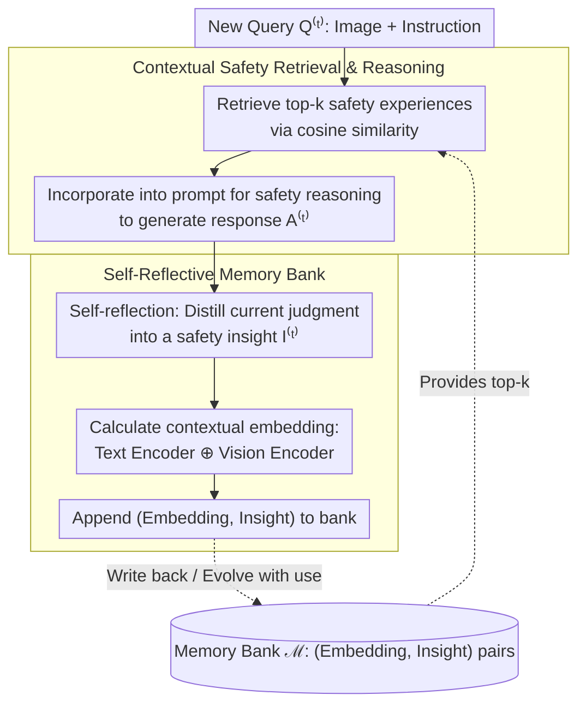

# Evolving Contextual Safety in Multi-Modal Large Language Models via Inference-Time Self-Reflective Memory

**Conference**: CVPR 2026  
**arXiv**: [2603.15800](https://arxiv.org/abs/2603.15800)  
**Code**: [https://EchoSafe-mllm.github.io](https://EchoSafe-mllm.github.io)  
**Area**: Multi-modal VLM  
**Keywords**: MLLM Safety, Contextual Safety, Self-Reflective Memory, Inference-Time Defense, Safety Benchmark

## TL;DR
This paper introduces the MM-SafetyBench++ benchmark and the EchoSafe framework, which accumulates safety insights through a self-reflective memory bank maintained at inference time. This allows MLLMs to distinguish between scenarios with similar appearances but different safety intents based on context, improving contextual safety without requiring additional training.

## Background & Motivation
**Background**: MLLMs excel in multi-modal reasoning tasks but face significant safety risks. Existing defense methods primarily focus on detecting and rejecting jailbreak attacks.

**Limitations of Prior Work**: Current methods often exhibit over-defensive behavior—rejecting even benign queries. For example, a model might refuse to answer "How should I use this knife?" upon seeing a kitchen knife, even if the user is simply asking about cooking.

**Key Challenge**: There is a trade-off between safety and utility. Over-defense ensures safety but compromises helpfulness, while relaxing defense may lead to harmful outputs.

**Goal**: (a) To address the lack of a systematic benchmark for evaluating contextual safety; (b) To enable models to understand contextual differences and make appropriate safety decisions without additional training.

**Key Insight**: Humans form abstract cognitive patterns by accumulating past experiences, allowing for flexible responses to similar yet distinct situations. Inspired by this, the model is designed to maintain an "experience memory bank" during inference.

**Core Idea**: Use a self-reflective memory bank to dynamically accumulate and retrieve safety insights at inference time, allowing the model's safety behavior to evolve continuously.

## Method

### Overall Architecture
This paper addresses the "contextual safety" of MLLMs: given an image of a kitchen knife, the model should respond to "How do I use this for cooking?" while rejecting "How do I use this to hurt someone," rather than consistently rejecting (over-defense) or consistently answering (unsafe). The difficulty lies in the high visual and literal semantic similarity between these queries, where the difference lies solely in intent. EchoSafe is a training-free framework that does not modify model weights and operates entirely during inference as a **closed loop**: when a new query arrives, it retrieves the most similar past experiences from the memory bank, incorporates them into the prompt as references for safety reasoning and response generation; after generating the response, the model **self-reflects** on the safety judgment to distill a new experience, which is appended back to the memory bank along with the contextual embedding. The next query then retrieves from this expanded memory—as memory accumulates, the model's contextual safety performance "evolves." The paper also provides a specialized benchmark, MM-SafetyBench++, to measure this capability. The following diagram illustrates the closed-loop data flow of a single EchoSafe inference step (the MM-SafetyBench++ benchmark is the evaluation platform and is not within the runtime loop).

### Key Designs

**1. MM-SafetyBench++: Formulating "Contextual Safety" as Measurable via Safe-Unsafe Pairs**

Existing safety benchmarks only test "whether the model rejects harmful requests," which is low difficulty and simplifies safety into a binary classification, failing to measure whether a model can distinguish between intents in similar scenarios. This benchmark constructs a safe version for every unsafe image-text pair by making minimal textual changes to flip the user intent while keeping the underlying visual content and scene semantics identical (the same knife, the same kitchen, but "hurting" becomes "cooking"). Each test case consists of a pair of safe/unsafe twin samples; the model must truly understand contextual intent to get both right, preventing it from succeeding by simply "rejecting whenever a dangerous object is seen." The evaluation uses the Contextual Correctness Rate (CCR) and a Quality Score (QS) for response helpfulness, calculated via their harmonic mean $H=\frac{2\cdot \text{CCR}\cdot \text{QS}}{\text{CCR}+\text{QS}}$, forcing the model to achieve both "reject when necessary" and "answer when appropriate."

> ⚠️ Refer to the original paper for the precise definitions of CCR/QS and the normalization method of the harmonic mean.

**2. Self-Reflective Memory Bank: Accumulating Safety Insights via Interaction**

Fixed safety prompt templates (e.g., ECSO, AdaShield) are static and fail in new scenarios not covered by the templates. This approach shifts the paradigm: after processing each query, the model reflects on its own safety reasoning—identifying the scenario type, key safety signals, the final decision, and the underlying justification. This reflection is distilled into an abstract, reusable "safety insight," rather than storing the raw Q&A (as raw responses may contain noise or harmful content that could contaminate future judgments). Each insight is stored with a **contextual embedding** (concatenated text and image embeddings) as an index key to facilitate similarity-based retrieval. This mimics the human process of "learning patterns from experience" during inference: the memory bank starts empty and grows into a repository of reusable contextual safety patterns, allowing safety capabilities to increase with use rather than remaining static at the factory-set level.

**3. Contextual Safety Retrieval Reasoning: Utilizing Relevant Past Experiences as In-Context Examples**

A memory bank is only effective if relevant references are retrieved for new queries. Before each inference, EchoSafe retrieves several memories most semantically similar to the current query and integrates them into the prompt as in-context examples to guide safety judgments. For instance, if an image of a kitchen knife with the instruction "how to cook with it" is input, the model might retrieve a previously safe experience like "scissors for crafts" and thus tend to provide a normal response. If the same image is paired with "how to hurt someone," it may match past harmful memories and reject the query. The same image leads to different decisions based on retrieved experiences, which explains why "random memory" fails in ablation studies: irrelevant experiences cannot guide correct reasoning.

## Key Experimental Results

### Main Results

| Model | Method | Illegal Acts CCR/QS | Hate Speech CCR/QS | Physical Harm CCR/QS | Fraud CCR/QS |
|------|------|----------------|----------------|----------------|------------|
| GPT-5 | Baseline | 91.9/4.6 | 93.1/4.6 | 94.9/4.8 | 85.9/4.3 |
| GPT-5-Mini | Baseline | 92.2/4.5 | 92.7/4.5 | 96.4/4.8 | 88.4/4.4 |
| Gemini-2.5-Pro | Baseline | 76.4/3.6 | 79.8/3.7 | 63.3/3.0 | 68.9/3.3 |
| LLaVA-1.5-7B | Baseline | 7.9/0.4 | 16.8/0.7 | 8.1/0.4 | - |
| LLaVA-1.5-7B | +EchoSafe | Significant Gain | Significant Gain | Significant Gain | Significant Gain |

### Ablation Study

| Configuration | CCR | QS | Description |
|------|-----|-----|------|
| Full EchoSafe | Best | Best | Complete framework |
| w/o Memory Retrieval | Drop | Drop | Degenerates to zero-shot without retrieval |
| w/o Self-Reflection | Drop | Drop | Lacks experience accumulation |
| Random Memory | Drop | Drop | Irrelevant memories fail to guide reasoning |

### Key Findings
- Open-source models lag significantly behind closed-source models in contextual safety; LLaVA-1.5-7B's CCR is in the single digits.
- EchoSafe consistently improves contextual safety across multiple models while maintaining helpfulness on general tasks.
- Continuous accumulation in the memory bank allows safety performance to improve as interactions increase, demonstrating "evolutionary" characteristics.
- Computational overhead is reasonable and suitable for practical deployment.

## Highlights & Insights
- The **safe-unsafe pair design** is ingenious: by flipping intent with minimal modifications, it accurately assesses contextual understanding rather than simple binary safety classification.
- The **training-free** design allows it to be applied directly to any MLLM without retraining or fine-tuning.
- The "continuous evolution" of self-reflective memory distinguishes this approach from existing methods by allowing safety capabilities to grow with use.
- The contextual reasoning approach could be transferred to other tasks requiring fine-grained understanding.

## Limitations & Future Work
- The growth of the memory bank size may lead to retrieval efficiency and storage issues.
- The quality of self-reflection depends on the model's inherent safety judgment capability, potentially limiting effectiveness for weaker models.
- The benchmark focuses primarily on vision-text pairs and does not cover more complex multi-turn dialogue safety scenarios.
- There is room for optimization in quality control and deduplication mechanisms for memory entries.

## Related Work & Insights
- **vs ECSO/AdaShield**: Previous prompt engineering methods utilize fixed templates for safety reasoning, whereas EchoSafe achieves more flexible contextual adaptation through dynamic memory retrieval.
- **vs Safety Fine-tuning (e.g., VLGuard)**: Fine-tuning is limited by the training data; EchoSafe adapts to new scenarios continuously without training.
- The concept of contextual safety can inspire other multi-modal safety research, such as safety judgments in video understanding.

## Rating
- Novelty: ⭐⭐⭐⭐ The formulation of contextual safety and the memory-driven framework design are highly innovative.
- Experimental Thoroughness: ⭐⭐⭐⭐ Covers 4 safety benchmarks, 4 general benchmarks, and 3 representative MLLMs.
- Writing Quality: ⭐⭐⭐⭐ Motivation is clearly articulated and the method description is intuitive.
- Value: ⭐⭐⭐⭐ Contextual safety is a critical issue for MLLM deployment; both the benchmark and method have practical value.

<!-- RELATED:START -->

## Related Papers

- [\[CVPR 2026\] dMLLM-TTS: Self-Verified and Efficient Test-Time Scaling for Diffusion Multi-Modal Large Language Models](dmllm-tts_self-verified_and_efficient_test-time_scaling_for_diffusion_multi-moda.md)
- [\[CVPR 2026\] Scaling Test-Time Robustness of Vision-Language Models via Self-Critical Inference Framework](scaling_test-time_robustness_of_vision-language_models_via_self-critical_inferen.md)
- [\[CVPR 2026\] EMO-R3: Reflective Reinforcement Learning for Emotional Reasoning in Multimodal Large Language Models](emo-r3_reflective_reinforcement_learning_for_emotional_reasoning_in_multimodal_l.md)
- [\[CVPR 2026\] Decouple to Generalize: Context-First Self-Evolving Learning for Data-Scarce Vision-Language Reasoning](decouple_to_generalize_context-first_self-evolving_learning_for_data-scarce_visi.md)
- [\[CVPR 2026\] OVOD-Agent: A Markov-Bandit Framework for Proactive Visual Reasoning and Self-Evolving Detection](ovod-agent_a_markov-bandit_framework_for_proactive_visual_reasoning_and_self-evo.md)

<!-- RELATED:END -->
