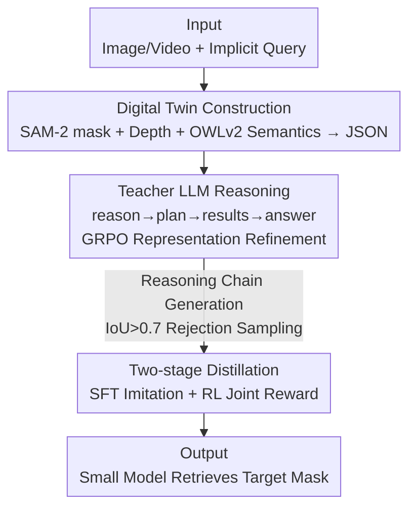

# Fast Reasoning Segmentation for Images and Videos

**Conference**: CVPR 2026  
**Paper**: [CVF Open Access](https://openaccess.thecvf.com/content/CVPR2026/html/Shen_Fast_Reasoning_Segmentation_for_Images_and_Videos_CVPR_2026_paper.html)  
**Code**: Not open-sourced (No repository link provided in the paper)  
**Area**: Reasoning Segmentation / Semantic Segmentation  
**Keywords**: Reasoning Segmentation, Digital Twin Representation, Knowledge Distillation, Reinforcement Learning, Edge Deployment  

## TL;DR
FastReasonSeg completely decouples "visual perception" from "reasoning"—first compressing scenes into structured digital twin JSONs using SAM-2, depth estimation, and detection; then enabling a small LLM to perform multi-step reasoning over this JSON to retrieve target masks. By employing a "Teacher-generated reasoning chain → Student SFT + RL two-stage distillation" pipeline, a 0.6B model outperforms competitors 20× its size across four image/video reasoning benchmarks while achieving 7.79 FPS with only 2.1GB VRAM usage.

## Background & Motivation
**Background**: Reasoning segmentation requires models to respond to implicit text queries—such as "segment the object used for hot drinks" instead of a fixed "cup" category—which is a fundamental capability for embodied agents in open environments. Prevailing methods like LISA and VISA fuse Multimodal Large Language Models (MLLMs) with segmentation decoders using special `<SEG>` tokens to trigger mask generation.

**Limitations of Prior Work**: Such end-to-end approaches often involve billions of parameters, exceeding the memory and compute limits of edge devices used in embodied agents. Alternatively, JiT utilizes "Digital Twin Representations" with LLM API planning for zero-shot reasoning but relies on external API calls, where network latency and connectivity issues negate real-time performance. Directly training small models is also ineffective, as multi-step reasoning typically only "emerges" after LLMs cross certain parameter thresholds.

**Key Challenge**: While distillation is a standard model compression technique, existing distillation methods only align "output predictions" and "intermediate features," **failing to transfer the reasoning chain itself**. Furthermore, perception and reasoning are coupled in end-to-end architectures; visual tokenization cuts continuous spatio-temporal relationships into discrete tokens, creating information bottlenecks and fracturing geometric and temporal dependencies, making reasoning capabilities even harder to distill.

**Key Insight**: The authors observe that "reasoning over digital twin representations" decouples perception from reasoning. By transforming scenes into structured intermediate representations that preserve semantic, spatial, and temporal relationships, the reasoning process becomes **explicit and transferable**. Small models can then access the same rich information as large models without having to process high-dimensional visual inputs directly.

**Core Idea**: Use digital twin representations as a structured intermediate layer between perception and reasoning, allowing small LLMs to reason solely on structured JSON data. Then, utilize "Teacher-generated reasoning chains → Student two-stage distillation" to transfer complete multi-step reasoning capabilities to small models.

## Method

### Overall Architecture
FastReasonSeg aims to reduce the compute requirements of reasoning segmentation via distillation. The pipeline consists of three parts: first, imagery/video (static images are treated as single-frame videos with $T=1$) is converted by visual foundation models into a **Digital Twin Representation**—a structured JSON recording masks, depth statistics, and semantic labels for each instance. Then, an 8B **Teacher LLM** is trained to perform explicit reasoning on this JSON, calling tools to refine the representation dynamically when necessary, and finally retrieving target masks. Finally, **Two-stage Distillation** (SFT + RL) transfers the teacher's multi-step reasoning ability to 1.7B / 0.6B student models. Crucially, student models **never touch raw visual tokens**, reasoning only on the digital twin JSON.

### Key Designs

**1. Digital Twin Representation: Compressing High-Dim Vision into Reason-able JSON**

To address the issue where visual tokenization breaks spatio-temporal dependencies, the LLM does not ingest visual tokens. Instead, three complementary visual foundation models extract a structured JSON. SAM-2 generates instance masks $M^{(t)} = \{m_i^{(t)}\}_{i=1}^{N(t)}$ for spatial info; DepthAnything2 produces dense depth maps $Z^{(t)}$, providing mean depth $\mu_i^{(t)} = \frac{1}{|m_i^{(t)}|}\sum_{p \in m_i^{(t)}} Z^{(t)}(p)$ and variance for spatial reasoning (e.g., "what is in front"); and OWLv2 provides semantic labels $l_i^{(t)}$ and bounding boxes to link observations to concepts. These merge into a digital twin at time $t$:

$$D^{(t)} = \Big\{\, i : \{\,\text{mask}: m_i^{(t)},\ \text{depth\_stats}: d_i^{(t)},\ \text{mean\_depth}: \mu_i^{(t)},\ \text{semantic\_label}: l_i^{(t)}\,\}\ \text{for } i=1,\dots,N^{(t)} \,\Big\}$$

The video is represented as $D = \{D^{(1)}, \dots, D^{(T)}\}$. Reasoning is thus performed on symbols rather than fragmented tokens. In ablations, replacing this with direct visual tokens caused the mean J to plummet from 0.760 to 0.588.

**2. Teacher LLM: Explicit Reasoning Chains + Dynamic Tool Refinement**

The pre-built digital twin might lack specific info, requiring a reasoner capable of "on-demand compute." The Teacher LLM (Qwen3-8B) produces a structured rollout: reasoning in `<reason>` to analyze the query; generating a revision plan $P = \{(tool_i, args_i)\}_{i=1}^K$ in `<plan>` if more info is needed; pausing to execute the plan and receive refined representation $D'$ in `<results>`; and finally identifying the mask in `<answer>`. The rollout $Y$ is:

$$Y = \begin{cases} [R]_{\text{think}} \,\|\, [S]_{\text{answer}} & \text{if } P = \varnothing \\ [R]_{\text{think}} \,\|\, [P]_{\text{revise}} \,\|\, [D']_{\text{results}} \,\|\, [S]_{\text{answer}} & \text{if } P \neq \varnothing \end{cases}$$

The teacher is trained via GRPO reinforcement learning with the reward $R(Y) = R_{\text{format}}(Y) + R_{\text{accuracy}}(Y)$, ensuring proper tag sequences and mask IoU accuracy. Without dynamic tool refinement (static DT), J dropped from 0.760 to 0.699.

**3. Two-stage Distillation: SFT for Structure + RL for Reasoning Quality**

Since small LLMs struggle to generalize reasoning from scratch, distillation follows two stages. **Stage 1 (SFT)**: The teacher generates reasoning chains $\{Y_j^{teacher}\}$ for training samples, applying **rejection sampling** (keeping only IoU > 0.7) so the student learns the structured format and reasoning patterns. **Stage 2 (RL)**: The student generates rollouts $Y^{student}$ trained with a joint reward:

$$R_{\text{total}}(Y^{student}) = R_{\text{format}}(Y^{student}) + R_{\text{accuracy}}(Y^{student}) + \gamma \cdot R_{\text{reasoning}}(Y^{student}, Y^{teacher})$$

The **reasoning reward** $R_{\text{reasoning}}$ employs LLM-as-judge (GPT-4o) to compare the student's chain against the teacher's for logic, completeness, and accuracy ($\gamma=0.5$). Without SFT, J was 0.669; without RL, it was 0.716; removing teacher guidance entirely dropped it to 0.677.

### Loss & Training
The model is trained using LoRA ($r=64$, $\alpha=128$) on 8×RTX 4090 with a batch size of 512. Teacher GRPO learning rate is $4\times10^{-5}$ with cosine annealing. Distillation SFT uses AdamW with $5\times10^{-5}$ for 3 epochs. RL distillation uses the same GRPO config with the reasoning reward. Training data includes RefCOCOg, ReasonSeg, and ReVOS teams. Teacher: Qwen3-8B; students: Qwen3-1.7B / 0.6B.

## Key Experimental Results

### Main Results
Evaluation spans four benchmarks: video (JiTBench, RVTBench) using J and F metrics, and image (ReasonSeg, LLM-Seg40K) using gIoU / cIoU.

JiTBench Video Reasoning Segmentation (Region Similarity J, averaged across difficulty):

| Method | Parameters | Level 1 | Level 2 | Level 3 |
|------|------|---------|---------|---------|
| VISA-13B | 13B | 0.507 | 0.431 | 0.384 |
| CoReS-13B | 13B | 0.509 | 0.429 | 0.391 |
| JiT (GPT-4o, API) | API | 0.792 | 0.766 | 0.747 |
| **Ours-8B** | 8B | **0.809** | **0.782** | **0.761** |
| Ours-1.7B-Distill | 1.7B | 0.784 | 0.758 | 0.738 |
| Ours-0.6B-Distill | 0.6B | 0.760 | 0.733 | 0.714 |

Image Reasoning Segmentation (ReasonSeg + LLM-Seg40K, gIoU / cIoU):

| Method | Params | ReasonSeg Short gIoU | ReasonSeg Long gIoU | LLM-Seg40K gIoU |
|------|------|----------------------|----------------------|-----------------|
| CoReS-13B | 13B | 0.565 | 0.621 | 0.474 |
| JiT (GPT-4o, API) | API | 0.618 | 0.683 | 0.485 |
| **Ours-8B** | 8B | **0.746** | **0.812** | **0.641** |
| Ours-1.7B-Distill | 1.7B | 0.721 | 0.787 | 0.618 |
| Ours-0.6B-Distill | 0.6B | 0.696 | 0.762 | 0.595 |

Key takeaway: The 0.6B distilled version **outperforms VISA-13B and CoReS-13B (models 20× larger)** on JiTBench. The 8B teacher outperforms JiT (GPT-4o) by 0.129 in gIoU on long queries.

Efficiency Comparison (Per Frame):

| Method | Total Params(B) | VRAM(GB) | Latency(ms) | Throughput(FPS) |
|------|-----------|----------|----------|-----------|
| LISA-13B | 14.0 | 28.0 | 1128.9 | 0.89 |
| JiT-7B | 8.6 | 17.2 | 39914.7 | 0.03 |
| Ours-8B | 8.2 | 18.5 | 892.5 | 1.12 |
| Ours-1.7B-Distill | 1.9 | 4.2 | 245.7 | 4.07 |
| **Ours-0.6B-Distill** | **0.8** | **2.1** | **128.4** | **7.79** |

### Ablation Study
On JiTBench for Ours-1.7B-Distill (Mean J):

| Configuration | Mean J | Note |
|------|--------|------|
| Full Model | 0.760 | Complete model |
| w/o DT (Direct visual tokens) | 0.588 | Removing DT representation causes a 0.172 drop |
| w/o DT Refinement (Static) | 0.699 | No dynamic tool calls |
| w/o Two-Stage (RL only) | 0.669 | Skipping SFT |
| w/o RL (SFT only) | 0.716 | Skipping RL stage |
| w/o Reasoning Reward | 0.736 | Removing $R_{\text{reasoning}}$ |
| w/o Format Reward | 0.691 | Removing $R_{\text{format}}$ |
| w/o Teacher Guidance | 0.677 | Removing both reasoning and format rewards |
| Teacher 3B | 0.702 | Insufficient teacher capacity weakens student |
| Teacher w/o RL | 0.709 | Teacher SFT-only lowers student ceiling |

### Key Findings
- **Digital Twin is the absolute core**: Switching back to direct visual tokens dropped Mean J by 0.172, the largest drop, validating the "decoupling" approach.
- **Format rewards are more critical than reasoning rewards**: Removing format rewards dropped J to 0.691, compared to 0.736 for reasoning rewards—suggesting the structured rollout framework itself constrains the reasoning path.
- **Teacher quality dictates the student ceiling**: Results using a 3B teacher or a non-RL teacher lowered distilled student performance, justifying the "train-large-then-distill" pipeline.

## Highlights & Insights
- **Reasoning chains as first-class citizens in distillation**: Unlike traditional distillation aligning logits, this work treats explicit `<reason>/<plan>` chains as targets, with LLM-as-judge providing feedback on "how to reason."
- **Structured intermediate representations bypass visual complexity**: Offloading perception to frozen foundation models allows the LLM to focus on symbolic reasoning—a strategy transferable to other spatial reasoning tasks.
- **Tool-calling + Autoregressive pauses**: Using "on-the-fly computation" via plan-pause-update is more efficient than feeding all possible information at once.

## Limitations & Future Work
- The current implementation relies on **pre-built** DT representations. Real-time scenarios require online construction of these structured representations.
- (Observer's Note): DT quality is bottlenecked by SAM-2/DepthAnything2/OWLv2. Semantic errors in OWLv2 cannot be corrected by the LLM reasoning downstream.
- Dependence on GPT-4o as a judge introduces a training-time dependency on closed-source APIs and lacks transparency in "reasoning quality" criteria.
- **Note**: Code is not released, requiring manual construction of the vision models and two-stage distillation.

## Related Work & Insights
- **vs LISA / VISA (End-to-end `<SEG>` token)**: These couple perception and reasoning; this work decouples them via JSON, allowing 0.6B parameters to outperform 13B versions.
- **vs JiT (Agent + Digital Twin)**: JiT relies on API calls with ~40,000ms/frame latency; this work brings intelligence to a local model for 7.79 FPS edge deployment.
- **vs SegZero / CoReS (Decoupled RL Segmentation)**: Inherits SegZero's IoU rewards but adds teacher-guided reasoning chain distillation and reasoning quality rewards.

## Rating
- Novelty: ⭐⭐⭐⭐⭐ Decoupling perception/reasoning via reasoning chain distillation is clear and effective.
- Experimental Thoroughness: ⭐⭐⭐⭐⭐ Comprehensive benchmarks and detailed ablations provided.
- Writing Quality: ⭐⭐⭐⭐ Clear motivation and methodology; rollout designs are well-defined.
- Value: ⭐⭐⭐⭐⭐ Moves reasoning segmentation from "cloud-based LLMs" to "edge-ready real-time deployment."

<!-- RELATED:START -->

## Related Papers

- [\[CVPR 2026\] DPAD: Discriminative Perception via Anchored Description for Reasoning Segmentation](discriminative_perception_via_anchored_description_for_reasoning_segmentation.md)
- [\[CVPR 2026\] SegCompass: Exploring Interpretable Alignment with Sparse Autoencoders for Enhanced Reasoning Segmentation](segcompass_exploring_interpretable_alignment_with_sparse_autoencoders_for_enhanc.md)
- [\[CVPR 2026\] Thinking with Programming Vision: Towards a Unified View for Thinking with Images](thinking_with_programming_vision_towards_a_unified_view_for_thinking_with_images.md)
- [\[CVPR 2026\] Reinforcing Video Object Segmentation to Think before it Segments](reinforcing_video_object_segmentation_to_think_before_it_segments.md)
- [\[ICLR 2026\] Thyme: Think Beyond Images](../../ICLR2026/vlm_reasoning/thyme_think_beyond_images.md)

<!-- RELATED:END -->
