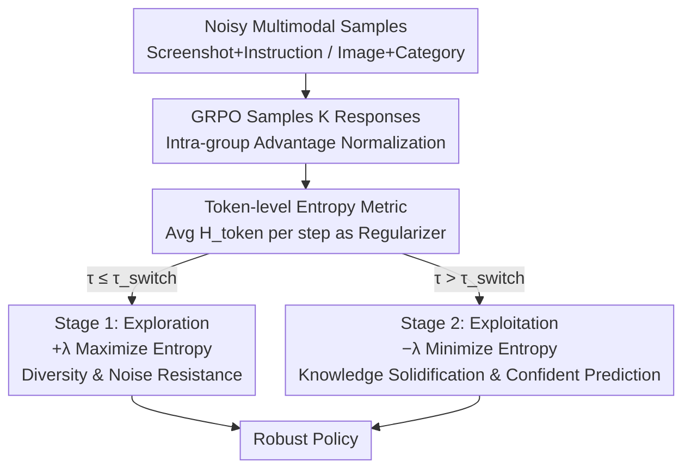

# From Exploration to Exploitation: A Two-Stage Entropy RLVR Approach for Noise-Tolerant MLLM Training

**Conference**: CVPR 2026  
**Paper**: [CVF Open Access](https://openaccess.thecvf.com/content/CVPR2026/html/Xu_From_Exploration_to_Exploitation_A_Two-Stage_Entropy_RLVR_Approach_for_CVPR_2026_paper.html)  
**Code**: To be confirmed (No repository link in paper)  
**Area**: Multimodal VLM / Alignment RLHF  
**Keywords**: RLVR, GRPO, token-level entropy, noisy labels, exploration-exploitation  

## TL;DR
Addressing severe annotation noise in Multimodal Large Models during Reinforcement Learning with Verifiable Rewards (RLVR), this paper proposes a **two-stage token-level entropy scheduling** method. In the early training stage, entropy is maximized to encourage exploration, resist overfitting to incorrect labels, and maintain intra-group diversity for GRPO; in the later stage, entropy is minimized to exploit and solidify knowledge into confident predictions. Ours is more robust than single-direction entropy methods across GUI grounding, fine-grained classification, and open-vocabulary detection under various noise ratios.

## Background & Motivation

**Background**: RLVR (Reinforcement Learning with Verifiable Rewards) bypasses the bias of "learning a reward model" by using rule-based, verifiable rewards (e.g., exact matches, IoU). It has shown stronger generalization than SFT in mathematical reasoning and code generation. Its representative algorithm, GRPO, reduces variance through **intra-group advantage normalization** and has been extended to multimodal tasks like image classification, object localization, and GUI grounding.

**Limitations of Prior Work**: Verifiable rewards in RLVR heavily depend on **clean annotations**, yet real-world multimodal data often contains noise. If rewards derive from incorrect labels, the model overfits to wrong targets. Current solutions fall into three categories with specific drawbacks: ① **External signal-based** (compilers, LLM-as-Judge, TTRL majority voting for pseudo-labels) are limited by the capabilities of the labeling LLM; ② **Internal signal-based** (spurious rewards like format rewards) often misalign with task goals; ③ **Entropy-based** (EMPO, one-shot RL) utilize entropy as a signal but focus only on a **single direction** (either maximization or minimization).

**Key Challenge**: Static entropy directions cause issues. **Pure entropy minimization** leads to premature overconfident convergence—locking onto wrong answers under noise and reducing output diversity, which is essential for GRPO's advantage estimation (if all rollouts in a group are identical, the advantage becomes zero, providing no learning signal). **Pure entropy maximization** maintains diversity and noise resistance but struggles to **converge** as probability mass is never encouraged to concentrate. A trade-off exists between exploration (diversity) and exploitation (certainty) that a single direction cannot resolve.

**Goal**: Under noisy supervision, the goal is to preserve diversity early on to resist false labels and provide valid advantage estimation for GRPO, while solidifying knowledge into a confident policy in the later stages.

**Key Insight**: Entropy plays dual roles in learning ("exploration vs. exploitation"): RL literature encourages high entropy for exploration, while semi-supervised classification encourages low entropy to solidify decision boundaries. Since both roles are needed at different times, the coefficient should **not be statically selected but rather scheduled across the training process**.

**Core Idea**: The coefficient of the token-level entropy regularization term is designed to **change signs across training stages**. In the early stage, `+λ` maximizes entropy (exploration); after a switching point, it flips to `−λ` to minimize entropy (exploitation), creating an "exploration → exploitation" trajectory that smoothly transitions from noise resistance to knowledge solidification.

## Method

### Overall Architecture

The method overlays a token-level entropy regularization term onto standard GRPO training. The total loss is $L_{total} = L_{GRPO} + \lambda(\tau)\, L_{entropy}$, where the coefficient $\lambda(\tau)$ changes sign based on training step $\tau$. Input consists of noisy multimodal samples (screenshots + instructions, images + categories, etc.). GRPO samples $K$ responses per input and calculates intra-group advantages using verifiable rewards. Simultaneously, the average token-level entropy of these $K$ responses is calculated as a regularization term. Training is split by a switching point $\tau_{switch}$: **Stage 1 (Exploration)** uses a positive coefficient to maximize entropy, encouraging diverse sampling and maintaining GRPO's required intra-group diversity; **Stage 2 (Exploitation)** flips the coefficient to negative to minimize entropy, forcing the model to output confident predictions and solidify high-reward behaviors found earlier.

### Key Designs

**1. Token-level Entropy as Fine-grained Uncertainty Metric and Regularizer**

Using "sequence-level entropy" as a signal is too coarse; it only reflects overall uncertainty and fails to capture the predictability of each generation step. Ours uses **token-level entropy**. For each generation step $t$, the model provides a conditional distribution $\pi_\theta(v\mid x, y_{<t})$ over vocabulary $V$. The per-token entropy is:

$$H_t(x,y) = -\sum_{v\in V}\pi_\theta(v\mid x,y_{<t})\log \pi_\theta(v\mid x,y_{<t}).$$

Averaging across all $T$ tokens gives the token-level entropy $H_{token}(x,y)=\frac{1}{T}\sum_{t=1}^{T}H_t(x,y)$, and averaging across $K$ sampled responses gives the entropy loss $L_{entropy}=-\mathbb{E}_{x}\big[\frac{1}{K}\sum_{i=1}^{K}H_{token}(x,y_i)\big]$. This term is the sole lever for scheduling: a positive coefficient "increases entropy" (encouraging diversity), while a negative coefficient "decreases entropy" (encouraging sharp distributions). Token-level metrics are chosen because reasoning trajectory (`<think>...</think>`) diversity accumulates step-by-step; per-token measurement provides more sensitive control.

**2. Two-Stage Entropy Scheduling (Segmented Coefficient Sign Flip)**

This is the core design addressing the contradiction where "single entropy directions fail." The entropy regularization coefficient is defined as a piecewise function of training step $\tau$:

$$\lambda(\tau)=\begin{cases}\lambda_{max}, & \tau\le \tau_{switch}\ \text{(Stage 1: Exploration)}\\ -\lambda_{min}, & \text{otherwise (Stage 2: Exploitation)}\end{cases}$$

where $\lambda_{max},\lambda_{min}>0$. Stage 1 uses a positive coefficient for "GRPO + Entropy Maximization," forcing diverse reasoning paths. Even if rewards come from noisy labels, a diverse set of rollouts is more likely to hit the true label at least once, diluting misleading rewards. Stage 2 flips to $-\lambda_{min}$ for "GRPO + Entropy Minimization," guiding the model to converge the high-reward behaviors explored earlier into certain outputs. The authors demonstrate that the **order cannot be reversed**: "Min then Max" leads to premature convergence and locks onto initial noise, killing the diversity needed for GRPO (Ablation shows this drops 5.6% vs "Max then Min" under 100% noise).

**3. Synergy with GRPO Intra-group Advantage (Why Exploration Resists Noise)**

Why is "preserving diversity" critical for noisy RLVR? GRPO advantages are **normalized within groups**: $A_i=\frac{r_i-\text{mean}(r_{1:K})}{\text{std}(r_{1:K})}$. If entropy minimization makes $K$ responses nearly identical, reward variance drops to zero, and normalized advantages become zero, leaving **no learning signal**. Initial entropy maximization provides the intra-group variance GRPO needs to make advantage estimation informative. Additionally, GRPO itself has inherent noise resistance—if the model prior consistently produces correct answers but hits a wrong label, the entire group receives zero reward and zero advantage, naturally filtering some noise. Two-stage scheduling builds upon this robust baseline.

### Loss & Training

The total loss is $L_{total}=L_{GRPO}+\lambda(\tau)L_{entropy}$, where $L_{GRPO}$ uses a clipped surrogate objective to constrain policy shifts. Key hyperparameters include the switching point $\tau_{switch}$ (ablation suggests 80% of total steps) and the coefficients $\lambda_{max},\lambda_{min}$. Training setup: Qwen-VL series uses UI-R1 for GUI grounding and Visual-RFT for fine-grained classification; InternVL uses verl-internvl.

## Key Experimental Results

### Main Results

Qwen2.5-VL-3B performance on GUI grounding (ScreenSpot) and fine-grained classification (Pets37 4-shot), comparing Base, standard GRPO, GRPO+Min, GRPO+Max, and Ours (Two-stage). GUI grounding accuracy (%):

| Noise Ratio | Base | GRPO | GRPO w. Min. | GRPO w. Max. | **GRPO w. Two.** |
|--------|------|------|------|------|------|
| 100% | 70.6 | 71.0 | 73.2 | 73.6 | **75.8** |
| 50% | 70.6 | 76.2 | 77.4 | 77.8 | **80.2** |
| 0% | 70.6 | 82.2 | 79.0 | 83.0 | **83.6** |

Ours reaches 80.2% under 50% noise, only 2% lower than GRPO trained on clean labels, showing significant noise resistance. At 100% noise, it achieves an absolute gain of 4.8% over standard GRPO. Entropy minimization performs best at 100% noise (classification), while maximization performs best at 0% noise; the two-stage approach achieves the **most robust overall balance**.

Cross-backbone validation (ScreenSpot, GRPO vs. Two-stage, Accuracy %):

| Noise | Qwen2-VL-7B GRPO | 7B Ours | Qwen2.5-VL-3B GRPO | 3B Ours | InternVL-3.5-2B GRPO | 2B Ours |
|------|------|------|------|------|------|------|
| 50% | 61.2 | **69.8** (+8.6) | 76.2 | **80.2** (+4.0) | 56.8 | **59.2** |
| 0% | 75.4 | **78.0** | 82.2 | **83.6** | 66.8 | **69.8** |

Larger backbones benefit more (Qwen2-VL-7B gains 8.6% at 50% noise), suggesting scalability; however, Qwen2-VL-2B shows a reverse trend under high noise, indicating exploration gains are less stable on small models ⚠️.

### Ablation Study

Ablation of switching point $\tau_{switch}$ and "Two-stage Order" (Qwen2.5-VL-3B, ScreenSpot, Accuracy %):

| Configuration | 100% Noise | 50% Noise | 0% Noise | Description |
|------|------|------|------|------|
| Max. then Min. (Ours) | **75.8** | **80.2** | **83.6** | Explore then Exploit |
| Min. then Max. | 70.2 | 76.8 | 79.8 | Wrong order, premature convergence |
| LF. Max. LT. Min. | 73.6 | 78.0 | 79.0 | Explore only on noise subset |
| LT. Max. LF. Min. | 73.2 | 76.8 | 83.0 | Explore only on clean subset |
| Switch at Step 800 | 75.8 | 80.2 | 83.6 | 80% of steps, optimal |
| Switch Steps 500/700/900 | 73.6/75.0/73.6 | 79.6/79.8/79.0| 80.4/81.8/82.0| Generally insensitive |

### Key Findings
- **Order is more important than using entropy itself**: "Max then Min" consistently outperforms "Min then Max" (5.6% lead at 100% noise). Early minimization locks the policy into noise; early maximization preserves diversity.
- **Unified scheduling vs. subset scheduling**: Limiting maximization to "known noise subsets" (LF. Max.) restricts global exploration. Since noise labels are usually unknown in reality, time-based scheduling is more practical.
- **Entropy Dynamics**: At 100% noise, token-level entropy rises to ~400% of the initial value in Stage 1 (effective exploration) and drops rapidly to ~20% of the peak in Stage 2. This smooth phase transition is the key to stability.
- **Generalization**: In open-vocabulary detection (COCO OVOD), Qwen2-VL-2B improves from 15.94 to 19.47 mAP (+3.53) at 50% noise. It also performs best on OOD benchmarks (ScreenSpot-Pro / OS-World-G / MMBench-GUI L2).
- **Inherent GRPO Robustness**: Intra-group normalization filters learning signals when a group consistently answers correctly but hits a wrong label, acting as a "self-gating" mechanism.

## Highlights & Insights
- **Low-cost robustness**: The core modification is a simple sign-flip of the entropy coefficient $\lambda(\tau)$. It requires no additional models or tools and is easy to integrate into existing RLVR frameworks.
- **Entropy direction as Exploration vs. Exploitation**: By recognizing the opposing roles of entropy in RL (exploration) and semi-supervised learning (boundary solidification), the authors provide a clean temporal scheduling solution.
- **Diversity as noise resistance**: The insight that entropy minimization causes rewards to homogenize and advantages to vanish explains "why exploration is needed early" and is transferable to other RL methods relying on contrastive signals.

## Limitations & Future Work
- **Instability on small models**: Qwen2-VL-2B's performance under high noise is slightly worse than standard GRPO, suggesting the benefits of exploration depend on the model's base prior ⚠️.
- **Hard scheduling**: $\lambda(\tau)$ is a piecewise constant with a fixed switch step. It is not adaptive based on real-time entropy dynamics.
- **Simulated noise**: Noise in experiments (random non-overlapping bboxes/random labels) may differ from real-world systematic biases or "near-correct" noise.
- **Future directions**: Replacing hard switching with adaptive scheduling based on token-level entropy feedback or developing soft weighting for noisy samples.

## Related Work & Insights
- **vs. EMPO / one-shot RL (Minimization)**: These use pure minimization to exploit priors; ours argues this locks into noise and kills GRPO diversity, thus placing minimization only in the later stage.
- **vs. CLIP-Cov (Maximization)**: These prevent entropy collapse to promote exploration; ours agrees on early exploration but notes maximization alone fails to converge.
- **vs. TTRL / LLM-as-Judge (External)**: These rely on external model quality; ours is model-agnostic and relies on entropy scheduling.
- **vs. Spurious Rewards (Internal)**: Internal rewards often misalign with goals; ours maintains verifiable rewards while using entropy scheduling for stability.

## Rating
- Novelty: ⭐⭐⭐⭐ Clean perspective on entropy roles, though "composed of existing elements."
- Experimental Thoroughness: ⭐⭐⭐⭐⭐ Covers multiple backbones, noise ratios, and OOD tasks with rich ablations.
- Writing Quality: ⭐⭐⭐⭐ Clear motivation and mechanism; some counter-results on small models are less explored in text.
- Value: ⭐⭐⭐⭐ One line of loss modification for robust performance with low implementation cost.

<!-- RELATED:START -->

## Related Papers

- [\[CVPR 2026\] Generate, Analyze, and Refine: Training-Free Sound Source Localization via MLLM Meta-Reasoning](generate_analyze_and_refine_training-free_sound_source_localization_via_mllm_met.md)
- [\[CVPR 2026\] VisionLeaf: Entropy-Guided Leaf-First Reasoning for Efficient and Accurate Think-with-Image](visionleaf_entropy-guided_leaf-first_reasoning_for_efficient_and_accurate_think-.md)
- [\[CVPR 2026\] Let VLMs Grade Their Own Thoughts: A Self-Quantification Approach to Reasoning-Aware Reward Modeling](let_vlms_grade_their_own_thoughts_a_self-quantification_approach_to_reasoning-aw.md)
- [\[CVPR 2026\] Consensus Entropy: Harnessing Multi-VLM Agreement for Self-Verifying and Self-Improving OCR](consensus_entropy_harnessing_multi-vlm_agreement_for_self-verifying_and_self-imp.md)
- [\[CVPR 2026\] Dr. Seg: Revisiting GRPO Training for Visual Large Language Models through Perception-Oriented Design](dr_seg_revisiting_grpo_training_for_visual_large_language_models_through_percept.md)

<!-- RELATED:END -->
