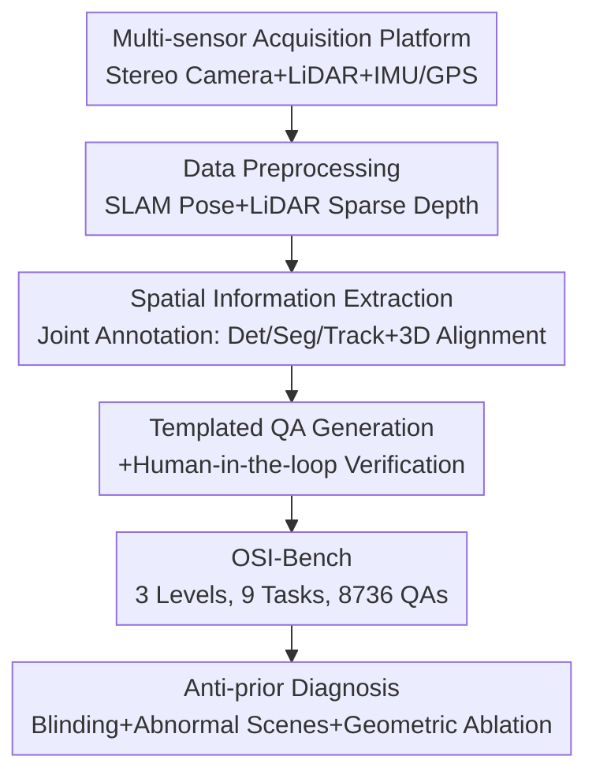

# From Indoor to Open World: Revealing the Spatial Reasoning Gap in MLLMs

**Conference**: CVPR 2026  
**Paper**: [CVF Open Access](https://openaccess.thecvf.com/content/CVPR2026/html/Wu_From_Indoor_to_Open_World_Revealing_the_Spatial_Reasoning_Gap_CVPR_2026_paper.html)  
**Code**: https://mingrui-wu.github.io/osi-bench/ (Project page, benchmark to be open-sourced)  
**Area**: Multimodal VLM  
**Keywords**: Spatial Intelligence Benchmark, MLLM, Metric Reasoning, Open World, Language Prior Diagnosis  

## TL;DR
The authors collected pedestrian-perspective outdoor videos using stereo cameras + LiDAR + IMU/GPS to construct OSI-Bench, the first three-layer (Relational/Metric/Kinematics) outdoor spatial intelligence benchmark with precise metric ground truth (8736 QAs). Through three diagnostic experiments—blinding tests, abnormal scenes, and geometric information ablation—they demonstrate that current MLLM "spatial intelligence" on indoor benchmarks is primarily supported by language priors, which fails in the open world, particularly in dynamic reasoning.

## Background & Motivation
**Background**: MLLMs have reached high performance in semantic tasks (VQA, captioning). The industry is now pushing them toward "spatial intelligence"—the ability to understand distance, orientation, size, and motion like humans. This is fundamental for systems requiring "physical grounding," such as autonomous driving and embodied AI. To quantify this, several spatial reasoning benchmarks (VSI-Bench, STI-Bench, All-Angles-Bench) have emerged.

**Limitations of Prior Work**: Existing benchmarks suffer from two main issues. First, they **only measure qualitative relational reasoning** (left/right, front/behind), avoiding the challenging metric (absolute distance, size) and kinematic (velocity, displacement) estimation. Second, **data is confined to indoor environments** because indoor 3D meshes (e.g., ScanNet) provide easy ground truth, whereas outdoor data with verifiable metric truth is scarce. The few outdoor attempts (e.g., SpatialRGPT) rely on monocular depth estimation as pseudo-ground truth, which suffers from scale ambiguity and unreliable supervision.

**Key Challenge**: Crucially, most MLLMs are pre-trained on indoor or web images. **Models might not be "looking at the image" but rather memorizing indoor statistical regularities.** For instance, a bathtub and toilet are usually ~1 meter apart in a standard bathroom—such priors allow models to "guess" correctly without visual grounding. Thus, high scores on indoor benchmarks mask actual visual perception deficits. This raises a sharp question: have current models truly generalized spatial knowledge to the open world?

**Goal**: To create a "diagnostic" benchmark that satisfies four criteria: ① covers the full spectrum of Relation → Metric → Kinematics; ② features outdoor, large-scale, unstructured layouts; ③ provides metric-level precise ground truth; ④ quantitatively diagnoses whether models rely on vision.

**Key Insight**: Since indoor meshes are the primary obstacle for outdoor benchmarks, the authors **carried a multi-sensor suite (stereo camera + LiDAR + IMU/GPS) outdoors for data collection**. They used sensor fusion to obtain metric-precise 3D information and automatically generated verifiable QAs.

**Core Idea**: Construct the open-world spatial intelligence benchmark OSI-Bench using "multi-sensor metric truth + three-layer task spectrum + anti-prior diagnostic experiments" to expose the "illusory spatial intelligence" of MLLMs.

## Method
As this is a benchmark/analytical paper, the "Method" refers to transforming raw multi-sensor data into a high-quality benchmark and designing diagnostic experiments to reveal the root causes of failure.

### Overall Architecture
The construction of OSI-Bench follows a "Acquisition → Extraction → Generation → Diagnosis" pipeline. First, 20 hours of pedestrian-perspective data were collected across 200+ outdoor sites using a sensor platform on a cart. Next, a three-stage automated pipeline distilled raw data into structured spatiotemporal information for templated QA generation with human oversight. Finally, 31 open-source and proprietary MLLMs were evaluated with three diagnostic experiments (blinding, abnormal scenes, and geometric ablation) to trace failure causes. The tasks are organized into a three-level hierarchy (Relational → Metric → Kinematics) across 9 sub-tasks and 8736 QAs.

### Key Designs

**1. Three-layer Spatial Intelligence Spectrum: Decomposing "Spatial Intelligence" into Diagnostic Difficulty Levels**

To address the lack of metric and kinematic testing, the authors formalized spatial intelligence into three difficulty levels. Level 1: **Relational Reasoning**, involving qualitative understanding of spatial layout (relative distance, direction, qualitative ego-motion) evaluated via Multiple Choice Questions (MCAs). Level 2: **Metric Reasoning**, anchoring visual perception to absolute scales (object localization in meters, absolute distance, depth-aware counting), requiring numerical answers. Level 3: **Kinematic Reasoning**, the hardest level, requiring spatiotemporal consistency for tracking entities and calculating dynamics (absolute displacement, velocity, quantitative ego-motion). Nine tasks are balanced across these layers, with approximately 1,000 QAs each. This hierarchical design allows fine-grained identification of "relational intuition deficit," "metric perception deficit," or "motion understanding deficit."

**2. Multi-sensor Metric Ground Truth Acquisition: Overcoming the Outdoor Ground Truth Barrier with Hardware**

To solve the lack of quantifiable outdoor truth, the authors built a custom platform: stereo RGB cameras + 32-line LiDAR + IMU/GPS, all timestamp-synchronized. The platform was pushed by a walking operator to ensure smooth motion and a **strict pedestrian perspective (not a vehicle-on-road perspective)**. This is crucial as pedestrian-perspective open-world scenes are rare in MLLM evaluations. Data was collected across 200+ venues (campuses, parks, squares) totaling terabytes of raw data, resulting in 20 hours of high-quality data after calibration, LiDAR projection, and QC. Stereo vision provides scale, LiDAR provides precise depth, and IMU/GPS provides ego-motion—their fusion makes "absolute distance/velocity" truth reliable.

**3. Three-stage Automated QA Construction Pipeline: From Raw Streams to Structured Spatiotemporal Profiles**

To scale QA production, the authors designed a three-stage pipeline. **Stage 1 (Data Preprocessing)**: Slicing data into short clips, aligning streams, and using ORB-SLAM3 to estimate **metric-scale camera poses** from stereo+IMU. LiDAR points are projected to generate **sparse depth maps**. Keyframes are sampled with associated poses and depth. **Stage 2 (Spatial Information Extraction)**: A joint annotation module links expert models—a local MLLM identifies objects for textual descriptions, guiding detection/segmentation models for pixel-level masks, followed by point-tracking (e.g., CoTracker) for temporal consistency. The 3D point cloud of each object is reconstructed and aligned to the **world coordinate system** using camera poses, creating a structured "detailed caption + continuous 3D trajectory" profile for every object. **Stage 3 (QA Generation and Verification)**: Each queried object is assigned a **unique numerical ID as a visual tag that tracks through the video** (resolving outdoor reference ambiguity like multiple identical lamps). Metric values are calculated from 3D coordinates, and QAs are generated via templates and refined by "MLLM-assisted + human-in-the-loop" review.

**4. Anti-prior Diagnostic Experiments: Proving "Priors over Perception"**

The authors designed three diagnostic controls. **Blinding Test**: Removing visual input to see how much the score drops—low drops indicate the model ignores vision. **Synthetic Abnormal Scenes**: Creating two sets of indoor scenes—"Normal" with standard object proportions and "Abnormal" with intentionally tampered object scales but identical layouts. If a model fails the abnormal set, it proves reliance on category-level priors (e.g., "how wide a door is"). **Geometric Information Ablation**: For absolute distance tasks where truth is calculated as $d = \|(R \cdot p_2 + T) - p_1\|$ ($p_1, p_2$ are camera-frame 3D positions; $R, T$ are relative rotation/translation), the authors gradually provided ground-truth values to pinpoint the bottleneck. This proves whether the failure lies in visual extraction of metric info or arithmetic ability.

### Loss & Training
This work is a benchmark, not a training paper. Evaluation follows the VLMEvalKit protocol. MCA tasks report Accuracy (25.0 random baseline); Numerical (NA) tasks report Mean Relative Accuracy (MRA, continuous accuracy averaged across relative error thresholds); Human performance was evaluated on a 270-question subset for fair comparison.

## Key Experimental Results

### Main Results (OSI-Bench Model Ranking, Excerpt)
All 31 models performed significantly below human levels. Rank Avg. is the comprehensive ranking; the three layers report Relational (MCA), Static Metric (NA), and Dynamic Metric (NA).

| Model | Rank Avg. | Rel. Direction | Abs. Distance | Depth Count | Abs. Displacement | Abs. Velocity |
|------|-----------|----------|----------|----------|----------|----------|
| **Human** (tiny subset) | 60.3 | 83.3 | 43.9 | 39.2 | 67.5 | 42.9 |
| Gemini-2.5-Pro (Strongest Proprietary) | 37.2 | 28.1 | 37.4 | 28.1 | 37.9 | 26.8 |
| GPT-5 | 29.7 | 33.1 | 32.5 | 23.7 | 20.9 | 10.5 |
| GPT-4o | 25.9 | 29.1 | 22.9 | 27.0 | 21.6 | 17.5 |
| Qwen3VL-32B (Strongest Open-source) | 32.2 | 28.8 | 25.3 | 11.5 | 30.2 | 18.6 |
| InternVL3.5-38B | 26.9 | 34.0 | 11.6 | 7.7 | 42.7 | 20.3 |

Key insight: Humans crush models in **Relative Direction** (83.3 vs ~30), but the human-model gap narrows in metric tasks (Abs. Distance, Depth Count)—suggesting that relational layout, which is "intuitive" to humans, is extremely difficult for models. All models collapsed on dynamic metrics (displacement/velocity).

### Ablation Study

**Blinding Test: Removing vision results in minimal score drops (Tab. 3, Gain of Vision On vs Off)**

| Object | Mean Gain | Interpretation |
|------|----------|------|
| Human | +22.6 | Strongly vision-dependent |
| Gemini | +12.4 | Moderately vision-dependent |
| GPT | +2.2 | Almost no vision reliance |
| Qwen3-VL | +5.3 | Almost no vision reliance |
| InternVL3.5 | +6.3 | Almost no vision reliance |

While humans improve by 22.6 with vision, models only improve by 2.2~6.3, despite the benchmark being designed for visual reasoning.

**Geometric Information Ablation (Abs. Distance Task, MRA, Tab. 4)**

| Setting | Qwen3VL-32B | Gemini-2.5-Pro | Explanation |
|------|-------------|----------------|------|
| Vanilla | 17.5 | 19.2 | Original; structured multi-step is harder |
| + Object Localization $p_1,p_2$ | 33.8 | 40.0 | Improvement requires localization |
| + Ego-motion $R,T$ | 32.5 | 22.9 | Limited help from ego-motion alone |
| + Full $p_1,p_2,R,T$ | 98.8 | 98.8 | Near-perfect with all geometric variables |
| + Full (no formula) | 59.2 | 85.4 | Drop without formula suggests lack of 3D knowledge |

The bottleneck is the extraction of metric information from vision, not arithmetic. Without the formula, models struggle to derive distance relations independently.

### Key Findings
- **Indoor spatial intelligence is a mirage**: InternVL3.5-38B improved +24.1 over its predecessor on indoor VSI-Bench but barely improved on OSI-Bench, with the newer version even underperforming in absolute distance—proving these models overfit indoor statistics rather than gaining generalized spatial intelligence.
- **Dynamic reasoning is a universal blind spot**: Even Gemini-2.5-Pro, which is closer to human performance in static metrics, fails at displacement and velocity estimation, exposing a fundamental lack of spatiotemporal representation.
- **Size estimation is easily hijacked by priors**: In abnormal scenes, Gemini's performance on size tasks dropped from 54.7 to 28.3 (while humans stayed stable) because models use common sizes (e.g., "door width") as references.
- **Capability is weakly correlated with scale**: Qwen3VL-32B is the top open-source model overall but ranked 18th in relative direction and 15th in absolute distance.

## Highlights & Insights
- The **"Blinding + Abnormal Scenes + Geometric Ablation"** triple diagnosis is the most elegant part of the paper: it transforms the soft suspicion of "prior-dependency" into hard evidence.
- The **formula decomposition** (splitting distance into $p_1,p_2,R,T$) is ingenious—it turns a black-box failure into a locatable attribution of localization vs. ego-motion errors.
- **Unique numerical ID tags** solve the ambiguity of identical objects in complex outdoor scenes, a technique reusable for any grounded QA benchmark.
- Biggest "Aha!" moment: The models that improve most on indoor benchmarks are often those most overfitted to indoor statistics.

## Limitations & Future Work
- **Ours acknowledges**: Increasing vision encoder size or training data isn't enough; mechanisms to "infer, store, and manipulate 3D geometric variables" are needed. Metric depth perception is the primary bottleneck.
- **Acquisition Cost and Scale**: 20 hours of data across 200 sites is limited compared to web-scale data, and pedestrian-perspective coverage excludes vehicle or indoor-outdoor transitions.
- **Diagnostic Depth**: The abnormal scene experiments were only conducted in synthetic indoor environments primarily on Gemini; future work could extend this to more models and real-world abnormal scenarios.
- **Improvements**: Integrating explicit geometric representations (3D-aware architectures, multi-view consistency) and dynamic reasoning modules that utilize ego-motion sensors.

## Related Work & Insights
- **vs VSI-Bench**: Both use video for spatial testing, but VSI-Bench is indoor-only, uses pre-existing mesh truth, and focuses on semantic reasoning. Ours uses outdoor pedestrian data with multi-sensor ground truth and proves that VSI-Bench scores are inflated by language priors.
- **vs STI-Bench**: STI-Bench introduced dynamic metrics (velocity/displacement) but remains confined to indoor or autonomous driving datasets. Ours is the first to provide reliable metric truth for all three layers in an open-world pedestrian context.
- **vs SpatialRGPT-Bench**: It attempted outdoor evaluation but used monocular depth pseudo-truth; Ours uses sensor fusion (Stereo+LiDAR+IMU) for trustworthy supervision.

## Rating
- Novelty: ⭐⭐⭐⭐⭐ First three-layer metric-truth outdoor benchmark with a novel anti-prior diagnostic paradigm.
- Experimental Thoroughness: ⭐⭐⭐⭐⭐ Evaluated 31 models + human baseline + three diagnostic ablations.
- Writing Quality: ⭐⭐⭐⭐⭐ Clear logic from identifying the "indoor mirage" to pinpointing visual extraction bottlenecks.
- Value: ⭐⭐⭐⭐⭐ Provides a platform for grounding spatial intelligence and challenges the efficacy of training on indoor spatial QAs.

<!-- RELATED:START -->

## Related Papers

- [\[CVPR 2026\] EgoMind: Activating Spatial Cognition through Linguistic Reasoning in MLLMs](egomind_activating_spatial_cognition_through_linguistic_reasoning_in_mllms.md)
- [\[ACL 2026\] GeoArena: Evaluating Open-World Geographic Reasoning in Large Vision-Language Models](../../ACL2026/vlm_reasoning/geoarena_evaluating_open-world_geographic_reasoning_in_large_vision-language_mod.md)
- [\[CVPR 2026\] Eliciting Complex Spatial Reasoning in MLLMs through Wide-Baseline Matching](eliciting_complex_spatial_reasoning_in_mllms_through_wide-baseline_matching.md)
- [\[CVPR 2026\] OpenMMReasoner: Pushing the Frontiers in Multimodal Reasoning with an Open and General Recipe](openmmreasoner_pushing_the_frontiers_in_multimodal_reasoning_with_an_open_and_ge.md)
- [\[CVPR 2026\] TableMix: Enhancing Multimodal Table Reasoning in MLLMs from a Data-Centric Perspective](tablemix_enhancing_multimodal_table_reasoning_in_mllms_from_a_data-centric_persp.md)

<!-- RELATED:END -->
