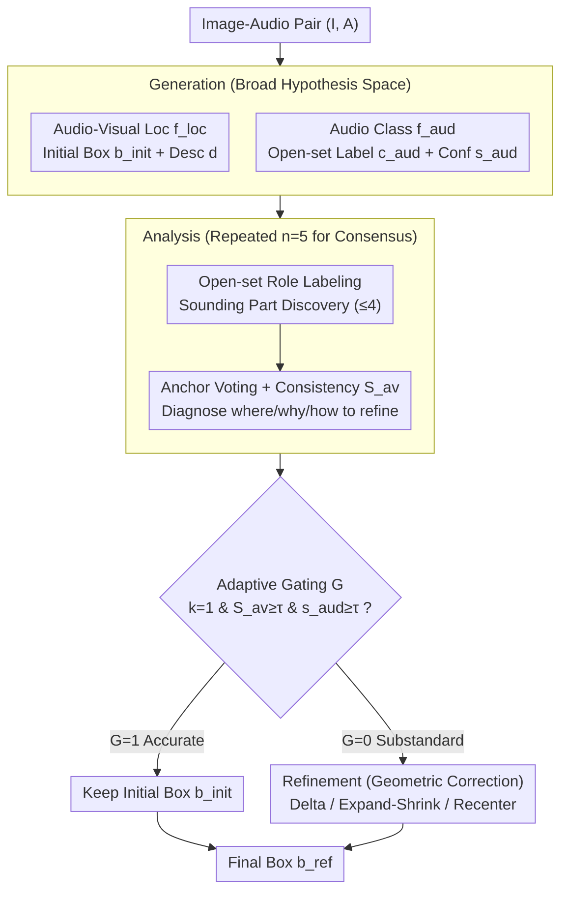

# Generate, Analyze, and Refine: Training-Free Sound Source Localization via MLLM Meta-Reasoning

**Conference**: CVPR 2026  
**arXiv**: [2604.06824](https://arxiv.org/abs/2604.06824)  
**Code**: [https://github.com/VisualAIKHU/GAR-SSL](https://github.com/VisualAIKHU/GAR-SSL)  
**Area**: Multimodal VLM  
**Keywords**: Sound source localization, Multimodal Large Language Model, Training-free, Meta-reasoning, Audio-visual consistency

## TL;DR

This work proposes GAR-SSL, a training-free sound source localization (SSL) framework that remodels the task as a three-stage "Generate-Analyze-Refine" metacognitive reasoning process. By directly leveraging the intrinsic reasoning capabilities of Multimodal Large Language Models (MLLMs) for audio-visual localization, it achieves performance comparable to or superior to trained methods on single-source and multi-source benchmarks.

## Background & Motivation

1. **Background**: Sound Source Localization (SSL) aims to identify the position of a sound source in an image by associating audio and visual information. Existing methods are primarily categorized into contrastive learning-based single-source methods and pseudo-label/graph relationship-based multi-source methods, both centered on feature matching.
2. **Limitations of Prior Work**: All these methods treat SSL simply as a feature matching problem, focusing only on aligning audio and visual embeddings while lacking verification and causal reasoning regarding whether the matching region actually corresponds to the sound source. This limits performance in complex acoustic scenarios involving silent objects, off-screen sounds, or multiple sources.
3. **Key Challenge**: Human sound localization involves a multi-step reasoning process—first perceiving signal features, then systematically analyzing candidate objects, and finally refining the conclusion. This meaningful process of interpretation and verification goes far beyond simple matching, yet existing methods completely ignore this aspect.
4. **Goal**: How can MLLM reasoning capabilities be utilized for interpretable sound source localization without any prior training? Specifically: (a) How to generate candidate sources; (b) How to verify candidate rationality; (c) How to refine localization results.
5. **Key Insight**: Inspired by human metacognitive processes, the authors observe that MLLMs already possess powerful cross-modal understanding, structured reasoning, and instruction-following capabilities. They can serve directly as reasoning engines rather than just auxiliary encoders.
6. **Core Idea**: Remodel SSL as a coarse-to-fine three-stage cognitive reasoning procedure (Generation → Analysis → Refinement), driven entirely through prompt engineering of the MLLM without requiring any training.

## Method

### Overall Architecture

The core problem GAR-SSL addresses is that existing SSL methods treat the task as feature matching between audio and visual embeddings, assuming any matched region is the source without verifying its acoustic properties. Instead, given an image-audio pair $(I, A)$, this method treats the MLLM as a reasoning engine to perform a "hypothesize, verify, and correct" procedure. The process consists of three stages: **Generation** provides an initial bounding box $b^{\text{init}}$ and an audio label; **Analysis** critiques this box against audio-visual evidence to calculate its credibility; **Refinement** performs geometric corrections only when the box is deemed unreliable. All stages are driven by prompts to the MLLM, outputting structured JSON, where outcomes of earlier stages serve as inputs for subsequent ones to tighten the localization.

### Key Designs

**1. Generation: Using a "Broad Hypothesis Space" Instead of Single-Point Matching**

Traditional methods directly match audio features to the most similar region; if the initial guess is wrong, there is no recovery. The generation stage deliberately broadens the hypothesis by running two independent sub-tasks: the audio-visual localization sub-task $f_{\text{loc}}(I,A) = (b^{\text{init}}, d)$ produces an initial box and a natural language description, while the audio classification sub-task $f_{\text{aud}}(A) = (c_{\text{aud}}, s_{\text{aud}})$ independently predicts an open-vocabulary label and confidence. They are intentionally unconstrained because a "tapping" sound could be a drum, a table, or hands—this stage ensures all potential sources are considered, leaving validation to the next stage. The consistency between these tasks is exactly what the Analysis stage evaluates.

**2. Analysis I: Open-Set Role Labeling to Deconstruct "Source" into Sounding Parts**

Identifying "drum sound" is insufficient; the specific part producing the sound must be identified. The role discovery function $\mathcal{T}_{\text{role}} = f_{\text{role}}(I, A, c_{\text{aud}})$ allows the MLLM to freely identify roles/parts directly related to sound production (e.g., "drumstick," "striking hand") under the context of the audio label, with a visibility constraint $\text{vis}(t|I) = 1$. This step does not rely on predefined category lists. These discovered parts serve as semantic anchors for refinement—guiding where to move or shrink the box toward "true sounding components" rather than adjusting aimlessly.

**3. Analysis II: Anchor Voting for Audio-Visual Consistency Scores with Consensus Denoising**

To quantify the accuracy of the box, an anchor voting function $\mathcal{A}_{\text{anchor}} = f_{\text{anchor}}(I,A,c_{\text{aud}},b^{\text{init}})$ identifies specific semantic anchors (e.g., "drumstick hitting the drumhead") and provides confidence scores. The consistency score $\mathcal{S}_{\text{av}} = f_{\text{con}}(\cdot) \in [0,1]$ assesses the alignment between the box and this evidence. Since MLLM decoding is stochastic, the process is repeated $n=5$ times to reach a consensus: scores are averaged, roles are selected by frequency, anchors are aggregated by confidence, and a majority vote determines whether to keep the original box. Unlike binary "correct/incorrect" judgments, this stage provides structured diagnostics on "what to change, why, and how."

**4. Refinement: Adaptive Gating to Prevent Over-Adjustment**

The refinement stage focuses on deciding *whether* to adjust rather than just *how* to adjust, as forcing changes on already accurate predictions can degrade performance. The gating decision outputs $G=1$ (keep) only if three conditions are met: the "keep" flag $k=1$, the consistency score $\mathcal{S}_{\text{av}} \geq \tau_{\text{av}}$, and the audio confidence $s_{\text{aud}} \geq \tau_{\text{aud}}$. If any condition fails, $G=0$, triggering geometric corrections. Corrections apply the Analysis diagnostics using four operations: **Delta** translates the box using anchor-weighted centroids, **Expand/Shrink** rescales based on external anchor ratios, and **Recenter** shifts the center while maintaining size.

### An Illustrative Example

Consider an audio of "drumming" with a band photo:

- **Generation**: The localization sub-task provides an initial box $b^{\text{init}}$ (covering the drum but also parts of the drummer). The audio sub-task outputs the label `drum` with $s_{\text{aud}}=0.82$.
- **Analysis**: Role discovery identifies `{drumstick, hitting hand, drum surface}`. Anchor voting finds anchors like "stick hitting drum" with high confidence, but the box center deviates. Consensus yields $\mathcal{S}_{\text{av}}=0.46$ and a majority vote for $k=0$.
- **Refinement**: Since $\mathcal{S}_{\text{av}}=0.46 < \tau_{\text{av}}=0.5$, the gate triggers $G=0$. The box is shifted via **Delta** toward the drum surface and **Shrink**ed to remove the drummer's body, resulting in the final corrected box.

### Loss & Training

The proposed method is training-free and implemented via prompt engineering of the MLLM (Qwen2.5-Omni-7B). The gating mechanism uses fixed thresholds: $\tau_{\text{aud}} = 0.75$ and $\tau_{\text{av}} = 0.5$.

## Key Experimental Results

### Main Results

**Multi-Source Sound Localization (VGGSound-Duet / MUSIC-Duet):**

| Method | VGGSound-Duet CIoU@0.3 | MUSIC-Duet CIoU@0.3 | MUSIC-Duet AUC |
|------|------------------------|---------------------|----------------|
| OA-SSL (CVPR'25, trained) | 55.2% | 45.9% | 36.1% |
| Qwen2.5-Omni (Direct MLLM) | 42.6% | 50.6% | 40.8% |
| **GAR-SSL (N=5) (Ours)** | **77.6%** | **82.7%** | **53.2%** |

**Single-Source Sound Localization (VGGSound-Single / MUSIC-Solo):**

| Method | VGGSound-Single AP | VGGSound IoU@0.5 | MUSIC-Solo IoU@0.5 |
|------|-------------------|-----------------|-------------------|
| OA-SSL (CVPR'25) | 51.7% | 47.3% | 71.1% |
| **GAR-SSL (N=5) (Ours)** | **60.5%** | **60.2%** | **98.5%** |

### Ablation Study

| Configuration | VGGSound-Duet CIoU@0.3 | AUC | Description |
|------|------------------------|-----|------|
| Stage 1 Only | 42.6% | 28.3% | Generation only |
| Stage 1+2+3 (N=3) | 59.5% | 38.2% | Full pipeline |
| Stage 1+2+3 (N=5) | 77.6% | 45.8% | Increased analysis iterations |

| MLLM Backbone | CAP | CIoU@0.3 | AUC |
|-----------|-----|----------|-----|
| Qwen2.5-Omni-3B | 39.9% | 49.8% | 33.0% |
| Qwen2.5-Omni-7B | 43.5% | 59.5% | 38.2% |

### Key Findings

- The Analysis+Refinement stages contribute a +16.9 percentage point gain in CIoU@0.3 for multi-source scenarios, highlighting the importance of iterative analysis and refinement.
- Increasing analysis iterations $N$ from 1 to 5 consistently improves performance; at $N=5$, CIoU on MUSIC-Duet rises from 80.7% to 82.7%.
- Larger MLLMs (7B vs 3B) improve across all metrics, indicating that MLLM reasoning capacity is a key performance bottleneck.
- In MUSIC-Duet CIoU@0.3, GAR-SSL outperforms the state-of-the-art training-based method OA-SSL by 36.8 percentage points.

## Highlights & Insights

- **SSL as a Cognitive Reasoning Process**: Moving away from SSL as simple feature matching, this method simulates human "coarse-to-fine" reasoning, allowing MLLM capabilities to be fully utilized through a paradigm shift.
- **Open-set Role Labeling and Anchor Voting**: Instead of relying on predefined categories, the framework lets the MLLM freely discover parts and evidence related to sound generation, providing an interpretable reasoning path.
- **Adaptive Gating Mechanism**: A simple but effective design where refinement is only executed when initial predictions are insufficient, preventing the performance degradation often caused by "over-tuning." This can be generalized to any multi-stage reasoning system.
- The framework demonstrates the potential of MLLMs as zero-shot reasoning engines for complex multimodal perception tasks, surpassing many specialized, trained methods without any additional training.

## Limitations & Future Work

- **Inference Efficiency**: Each sample requires approximately 4 seconds of inference, and repeated iterations in the Analysis stage further increase temporal overhead.
- **Dependency on MLLM Capacity**: Significant gains are seen from 3B to 7B, but larger models entail higher computational costs.
- **Lack of Temporal Reasoning**: The current method processes single frames and does not utilize temporal information from video, limiting performance in dynamic scenes.
- **Limited Evaluation**: Only verified on VGGSound and MUSIC datasets; generalization to more real-world contexts (e.g., noisy environments, overlapping sources) remains to be tested.

## Related Work & Insights

- **vs OA-SSL (CVPR'25)**: While OA-SSL uses MLLMs as auxiliary encoders to train visual models, this work uses MLLMs directly as reasoning engines without training. This approach significantly leads in multi-source scenarios, suggesting that the reasoning potential of MLLMs was previously underestimated.
- **vs Direct MLLM (Qwen2.5-Omni)**: Direct application for SSL yields mediocre results (42.6% CIoU), but the structured reasoning process improves this to 77.6%, underscoring the vital role of prompt design and structured reasoning.
- The "Generate-Analyze-Refine" paradigm is a generalizable multi-stage reasoning pattern applicable to other multimodal tasks requiring spatial localization.

## Rating

- Novelty: ⭐⭐⭐⭐ The reconstruction of SSL as a metacognitive process is novel, though the core relies on prompt engineering.
- Experimental Thoroughness: ⭐⭐⭐⭐ Validated across multiple benchmarks with comprehensive ablations, though more real-world testing is needed.
- Writing Quality: ⭐⭐⭐⭐ Clear structure and formal mathematical framework, though somewhat over-formalized in some sections.
- Value: ⭐⭐⭐⭐ Demonstrates the potential of zero-shot MLLMs in multimodal localization and prompts a rethink of current training paradigms.

<!-- RELATED:START -->

## Related Papers

- [\[CVPR 2026\] DeepScan: A Training-Free Framework for Visually Grounded Reasoning in Large Vision-Language Models](deepscan_a_training-free_framework_for_visually_grounded_reasoning_in_large_visi.md)
- [\[CVPR 2026\] Hear you are: Teaching LLMs Spatial Reasoning with Vision and Spatial Sound](hear_you_are_teaching_llms_spatial_reasoning_with_vision_and_spatial_sound.md)
- [\[CVPR 2026\] Seeing What Matters: A Training-Free Self-Guided Framework for Multimodal Detail Perception and Reasoning](seeing_what_matters_a_training-free_self-guided_framework_for_multimodal_detail_.md)
- [\[CVPR 2026\] Graph-to-Frame RAG: Visual-Space Knowledge Fusion for Training-Free and Auditable Video Reasoning](graph-to-frame_rag_visual-space_knowledge_fusion_for_training-free_and_auditable.md)
- [\[CVPR 2026\] From Exploration to Exploitation: A Two-Stage Entropy RLVR Approach for Noise-Tolerant MLLM Training](from_exploration_to_exploitation_a_two-stage_entropy_rlvr_approach_for_noise-tol.md)

<!-- RELATED:END -->
