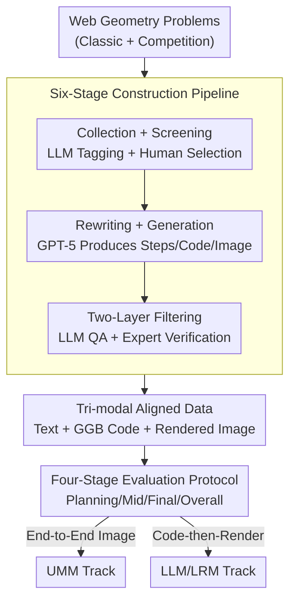

# GGBench: A Geometric Generative Reasoning Benchmark for Unified Multimodal Models

**Conference**: CVPR 2026  
**Paper**: [CVF Open Access](https://openaccess.thecvf.com/content/CVPR2026/html/Wei_GGBench_A_Geometric_Generative_Reasoning_Benchmark_for_Unified_Multimodal_Models_CVPR_2026_paper.html)  
**Code**: Official repository link not public (TBD)  
**Area**: Multimodal VLM  
**Keywords**: Geometric generative reasoning, unified multimodal models, GeoGebra, tri-modal alignment, verifiable evaluation  

## TL;DR
GGBench introduces a "geometric generative reasoning" benchmark for Unified Multimodal Models (UMMs): 1,411 geometric construction problems, each strictly aligned with "natural language steps + executable GeoGebra code + rendered images." Combined with a four-stage evaluation protocol, experiments reveal that "end-to-end image generation" UMMs significantly lag behind "code-then-render" LLMs, highlighting a gap where models "can solve problems but cannot construct diagrams."

## Background & Motivation
**Background**: Unified Multimodal Models (UMMs, such as GPT-4o, Nano Banana, BAGEL) are compressing "understanding" and "generation" into a single framework, capable of both comprehending image-text inputs and directly generating images. Benchmarks range from text-only math (GSM8K, MATH) to multimodal reasoning with images (ScienceQA, MathVista, MathVerse).

**Limitations of Prior Work**: The authors note a common gap—these benchmarks either test **discriminative understanding** (selecting answers/classification) or **unconstrained generation** (free-form drawing), with the two being **evaluated separately**. Even comprehensive benchmarks like MME, MM-Vet, and MMBench treat "understanding" and "generation" as independent modules, failing to examine the **integrated cognitive process** of "reasoning while understanding to generate complex results."

**Key Challenge**: True intelligence requires models to satisfy formal constraints during generation. Existing evaluations cannot verify whether "the model's reasoning actually maps to the image it drew." Geometric construction is the sharpest scenario for this: understanding the problem and multi-step planning to satisfy all constraints are inseparable, yet freely generated images lack **deterministic, verifiable** correctness criteria (pixel similarity $\neq$ geometric correctness).

**Goal**: Construct a benchmark that jointly examines "Understanding—Reasoning—Generation," where the correctness of each problem can be objectively, automatically, and interpretably verified.

**Key Insight**: Geometric construction is a natural vehicle. A successful construction must (1) parse domain-constrained language, (2) form multi-step plans based on formal geometry, and (3) generate precise figures satisfying all constraints. Success can be checked objectively via "objects and relationships" rather than subjective judgment.

**Core Idea**: Use "executable GeoGebra code" as an anchor to strictly align the **textual steps, code, and rendered image** for each problem. This upgrades "understand and reason" to "understand, reason, and construct," shifting evaluation from "choosing answers" to "generating evidence."

## Method

### Overall Architecture
GGBench is not a model but a **dataset + evaluation protocol**. Its core is a **tri-modally aligned** data structure: each sample contains (i) natural language reasoning steps, (ii) executable GeoGebra (GGB) code, and (iii) images rendered from the code—all 100% aligned. Code serves as the "unambiguous ground truth," allowing any generated figure's geometric correctness to be verified deterministically.

The benchmark is supported by three components: the **tri-modal data structure** defines the content; a **six-stage construction pipeline** (LLM-assisted creation + twond-layer filtering) processes web geometry problems into 1,411 high-quality samples; and a **four-stage evaluation protocol** scores across two tracks (end-to-end UMM generation vs. LLM code-then-render).

### Key Designs

**1. Tri-modal Aligned Data Structure: Deterministic Verification of Geometric Correctness**
Existing multimodal math benchmarks (MathVista, MathVerse, etc.) only provide "text + image," making it impossible to verify if the reasoning chain corresponds to the final image. GGBench solves this by adding **executable code**: natural language steps (plan), GeoGebra code (executable construction), and rendered images (result) correspond one-to-one. Code is the "unambiguous ground truth"—running it yields the standard image. Correctness of a generated image is transformed into an objective check of **objects and relationships** (e.g., whether an intersection lies on a specific circle), rather than pixel similarity.

**2. Six-Stage Construction Pipeline: LLM-Assisted Creation + Two-Layer Filtering**
The pipeline involves: (a) **Collection**: Gathering classic and competition problems; (b) **Screening**: Using LLM tagging followed by human review to keep only constructible problems; (c) **Composite Prompting**: Designing prompts to induce end-to-end construction using only GeoGebra; (d) **Problem Rewriting**: Using GPT-5 to rewrite problems into constructive statements with explicit dependencies, ensuring reasoning steps align with GGB operations; (e) **Solution Generation**: GPT-5 outputs aligned steps, code, and images; (f) **Final Cleanup**: Quality checks on code executability, logical consistency, and expert verification. This results in **1,411** high-quality problems.

**3. Four-Stage Tri-modal Evaluation Protocol: Decoupling Planning and Construction**
Evaluation is split into four phases using VLM judges (GPT-4o):
- **Planning (VLM-T)**: Scores text reasoning ($1-5$, scaled to $[0,100]$) based on logic, completeness, and correctness.
- **Middle Process (VLM-I-Mid)**: Evaluates step accuracy and process consistency using intermediate construction frames.
- **Final Result (VLM-I-Res)**: Assesses geometric correctness of the final image against the reference, supplemented by LPIPS, PSNR, and SSIM.
- **Overall (VLM-I)**: The mean of mid and final scores: $\text{VLM-I}=\frac{1}{2}(\text{VLM-I-Mid}+\text{VLM-I-Res})$.
The Pearson correlation between VLM and human judges is $r=0.9295$.

**4. Dual-Track Evaluation: Comparing Paradigm Differences**
Models are split into: **Track A (End-to-end UMM)** generating images directly from prompts (e.g., Janus, BAGEL, Nano Banana), and **Track B (LLM/LRM)** generating code first. This puts "immediate visual generation" and "code-driven geometric construction" on the same scale.

## Key Experimental Results

### Main Results
Thirteen models were evaluated. Core conclusion: **End-to-end UMMs significantly lag behind code-driven LLMs**.

| Track | Model | Planning (VLM-T) | Mid (VLM-I-Mid) | Final (VLM-I-Res) | Overall (VLM-I) | Human |
|------|------|------|------|------|------|------|
| UMM | Nano Banana | 58.54 | 44.83 | 22.81 | 33.82 | 45.75 |
| UMM | Janus | 33.85 | 21.69 | 19.76 | 20.73 | 19.46 |
| LLM | GPT-5 | 62.01 | 76.79 | **37.36** | **57.08** | **83.06** |
| LLM | Claude Sonnet 4.5 | 61.19 | 77.92 | 30.29 | 54.11 | 72.12 |
| LLM | GPT-4o | 59.73 | 26.19 | 2.66 | 14.43 | 23.04 |

> Even GPT-5 scores only 37.36/100 on final correctness, indicating geometric construction remains largely unsolved.

### Key Findings
- **High Planning $\neq$ Correct Drawing**: GPT-4o and GLM-4.5V write coherent plans but fail to generate executable code, leading to functional collapse in the final image (VLM-I-Res $\approx 2.66$).
- **Pixel Metrics Mask Structural Errors**: High PSNR/SSIM does not imply geometric correctness. Structural errors like misaligned intersections are often invisible to pixel-level metrics.
- **Bottlenecks in Theorem Application**: Models struggle most with "Geometric Theorem Application" and "Measurement & Proportion."
- **Consistency Issues**: Models often produce correct text steps but conflicting images (e.g., misplacing center $O$ or drawing perpendicular bisectors incorrectly).

## Highlights & Insights
- **Code as an Anchor**: Using executable code converts subjective geometric judgment into deterministic relationship checks. This approach is transferable to other structured generation tasks (charts, circuit diagrams, UI layouts).
- **Decoupled Scoring**: The "Planning/Middle/Final" split allows for precise diagnosis—identifying whether a model fails at planning, execution, or consistency.
- **Paradigm Insight**: Currently, "LLM writing GeoGebra code" is more robust than "UMM direct image generation," suggesting that geometry/CAD applications should favor "reasoning $\rightarrow$ executable construction."

## Limitations & Future Work
- **Ground Truth Bias**: Reliance on GPT-5 for initial drafts and GPT-4o for evaluation may introduce model-specific biases.
- **Scope**: Focused on 2D plane geometry; 3D geometry and dynamic constructions (Loci) have limited coverage.
- **Evaluation Automation**: While code-driven, some scoring still relies on VLM judgment. Future work should integrate full symbolic verification via geometric engines.

## Related Work & Insights
- **vs MathVista/MathVerse**: GGBench provides 100% coverage for generation and multi-step reasoning, whereas existing benchmarks focus more on discriminative tasks.
- **vs Code-based Evaluation (MATP-BENCH)**: GGBench inherits the "verifiability via code" philosophy but applies it specifically to the integrated "Understanding-Reasoning-Generation" cycle in geometry.

## Rating
- Novelty: ⭐⭐⭐⭐⭐ 
- Experimental Thoroughness: ⭐⭐⭐⭐ 
- Writing Quality: ⭐⭐⭐⭐ 
- Value: ⭐⭐⭐⭐⭐ 

<!-- RELATED:START -->

## Related Papers

- [\[CVPR 2026\] ARM-Thinker: Reinforcing Multimodal Generative Reward Models with Agentic Tool Use and Visual Reasoning](arm-thinker_reinforcing_multimodal_generative_reward_models_with_agentic_tool_us.md)
- [\[CVPR 2026\] Geoint-R1: Formalizing Multimodal Geometric Reasoning with Dynamic Auxiliary Constructions](geoint-r1_formalizing_multimodal_geometric_reasoning_with_dynamic_auxiliary_cons.md)
- [\[ICLR 2026\] Spatial-DISE: A Unified Benchmark for Evaluating Spatial Reasoning in Vision-Language Models](../../ICLR2026/vlm_reasoning/spatial-dise_a_unified_benchmark_for_evaluating_spatial_reasoning_in_vision-lang.md)
- [\[CVPR 2026\] UniT: Unified Multimodal Chain-of-Thought Test-time Scaling](unit_unified_multimodal_chain-of-thought_test-time_scaling.md)
- [\[CVPR 2026\] Visual-Aware CoT: Achieving High-Fidelity Visual Consistency in Unified Models](visual-aware_cot_achieving_high-fidelity_visual_consistency_in_unified_models.md)

<!-- RELATED:END -->
