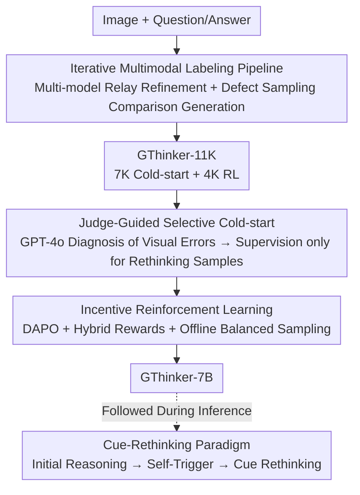

# GThinker: Towards General Multimodal Reasoning via Cue-Guided Rethinking

**Conference**: CVPR 2026  
**Paper**: [CVF Open Access](https://openaccess.thecvf.com/content/CVPR2026/html/Zhan_GThinker_Towards_General_Multimodal_Reasoning_via_Cue_Guided_Rethinking_CVPR_2026_paper.html)  
**Code**: https://github.com/jefferyZhan/GThinker (Available)  
**Area**: Multimodal VLM  
**Keywords**: Multimodal reasoning, visual inertia, visual cue rethinking, reinforcement learning, cold-start  

## TL;DR
GThinker addresses the "visual inertia" problem in MLLMs—where "textual logic is flawless but misled by incorrect initial visual judgments"—by proposing a free-form Cue-Rethinking reasoning paradigm anchored by visual cues with self-triggered rethinking. Through a two-stage training process involving an "annotation pipeline + judge-guided selective cold-start + incentive RL," this capability is injected into Qwen2.5-VL-7B, achieving 81.5% on M3CoT and surpassing o4-mini.

## Background & Motivation
**Background**: Open-source MLLMs (e.g., Qwen2.5-VL) have approached closed-source models in text-intensive reasoning (math, science) using CoT and RLVR (Reinforcement Learning from Verifiable Rewards, following the DeepSeek-R1 route). Mainstream approaches either use structured CoT templates (LLaVA-CoT, fixed steps/tree search in Mulberry) or employ RLVR to strengthen reflections within the textual reasoning chain.

**Limitations of Prior Work**: The authors identify a fundamental cross-domain flaw—**Visual Inertia**: while models excel at iterative reflection within textual contexts, they uncritically "stick to" initial visual interpretations, rarely correcting them even when subsequent contradictions arise. The paper illustrates this with a magnet example: the model perfectly recites physical laws ("like poles repel, opposites attract") but applies them to a flawed initial visual observation, leading to an inevitable error.

**Key Challenge**: Existing paradigms do not address the root cause. Structured CoT templates are too rigid to capture diverse and subtle visual inconsistencies. RLVR effectively polishes linguistic reasoning chains, but its reward signal naturally focuses on final textual answer correctness and **lacks a mechanism to trigger "re-examining visual evidence."** Essentially, visual evidence itself requires rethinking, whereas current methods only operate at the textual level.

**Goal**: To allow models to maintain strong textual logic while acquiring "adaptive visual rethinking" capabilities, specifically solving: (1) designing a flexible rethinking paradigm that does not disrupt reasoning flow, and (2) teaching the model **when** to trigger rethinking (rather than on every question).

**Key Insight**: Treat "labeling visual cues + on-demand rethinking of cues" as an intrinsic part of the reasoning process, rather than an external fixed template or a global reflection trigger.

**Core Idea**: Replace rigid CoT templates and text-only RLVR with free-form reasoning + explicit visual cue tags (`<vcues_*>`) + self-triggered cue rethinking to fundamentally treat visual inertia.

## Method

### Overall Architecture
The input to GThinker is an image + question, and the output is a reasoning chain containing explicit visual cue annotations and (on-demand) cue rethinking + the final answer. The solution follows two tracks: the **Reasoning Paradigm** defines "how the model should think" (Cue-Rethinking Pattern); the **Training Pipeline** injects this paradigm into a 7B base (Qwen2.5-VL-7B) in three steps—first creating GThinker-11K data via an iterative multimodal annotation pipeline, then using judge-guided selective cold-start to teach "how to think via the paradigm + when to rethink," and finally using incentive reinforcement learning (DAPO) to generalize this capability across tasks. The flowchart below illustrates this training flow.

### Key Designs

**1. Cue-Rethinking Pattern: Integrating "Visual Cue Labeling + On-demand Rethinking" into Free-form Reasoning**

This is the core mechanism for treating visual inertia, addressing the limitation where RLVR fails to revisit visual evidence. It does not enforce a rigid reasoning structure but divides reasoning into three phases. **Initial Reasoning**: The model uses any learned textual strategy (step-by-step deduction, reflection, knowledge-driven logic), with the only constraint being that reasoning must be anchored to visual evidence using `<vcues_*> </vcues_*>` tags (where `*` is the cue index). This lightweight constraint preserves flexibility while providing clear anchors for rethinking. **Rethinking Trigger**: After initial reasoning, the model **self-triggers** a rethinking prompt (e.g., "Let's check each visual cue and the corresponding reasoning before the final answer"). The authors intentionally avoid rethinking immediately after each cue to maintain natural reasoning flow and global context. **Cue-based Rethinking**: The model revisits all labeled visual cues, checks for inconsistencies, corrects or supplements cues as needed, updates the reasoning, and provides the final answer. This rethinking is **on-demand**, not mandatory for every question.

**2. Iterative Multimodal Labeling Pipeline: Generating High-Quality Rethinking Data via Multi-model Relay and Defect Sampling**

This addresses the lack of diverse rethinking data. The pipeline has two branches. **Iterative Refinement Branch**: FEeds images, questions, and answers to advanced multimodal models with prompts to generate "labeled visual cues + deduction + self-reflection." It uses iterative refinement—where the output of one model serves as context for the next to correct, refine, and supplement (using GPT-4o, o1, and o3 relay). **Rethinking Annotation Branch ("Defect Sampling-Comparison-Generation")**: To obtain samples with rethinking processes, diverse "erroneous reasoning samples" are collected via high-temperature sampling. o3 then **compares** these defective samples with refined correct annotations to generate new samples with the cue-rethinking process. This reduces hallucinations compared to manually fabricated rethinking processes. The result is 7,358 samples labeled with "contains visual cue rethinking."

**3. Judge-guided Selective Cold-start: Using LLM-as-judge to Convert Failure Cases into "When to Rethink" Signals**

Forcing rethinking on all samples is sub-optimal; models must learn **when** to trigger rethinking. The base model first performs an initial rollout on the training set. An LLM-as-judge (GPT-4o) takes the "question + answer + model response" and **diagnoses whether the error stems from visual cue defects**. For samples that "failed due to visual reasoning errors," supervision is applied using detailed annotations with the cue-rethinking process; other samples are supervised with regular reasoning labels. This **converts specific failures into valuable learning signals**, teaching the model exactly which situations require rethinking. Cold-start uses 7K samples, global batch 128, learning rate 5e-6, for 3 epochs.

**4. Incentive Reinforcement Learning: DAPO + Hybrid Rewards + Offline Balanced Sampling**

Algorithmically, DAPO (introducing Clip-Higher and dynamic sampling to GRPO for stability, with token-level policy gradient loss) is used for exploration and generalization. The objective function is:

$$J(\theta) = \mathbb{E}_{(q,a)\sim D,\ \{o_i\}_{i=1}^{G}\sim \pi_{\text{old}}(\cdot|q)}\left[\frac{1}{\sum_{i=1}^{G}|o_i|}\sum_{i=1}^{G}\sum_{t=1}^{|o_i|}\min\big(r_{i,t}(\theta)\hat{A}_{i,t},\ \text{clip}(r_{i,t}(\theta),1-\varepsilon_{\text{low}},1+\varepsilon_{\text{high}})\hat{A}_{i,t}\big)\right]$$

Two engineering points: **Hybrid Rewards**—QA is no longer limited to multiple-choice; it supports multiple-choice (exact match), math (Math-Verify extraction), and open-ended questions (summarizing answers into key phrases/words for matching). **Offline Balanced Sampling**—Joint embeddings of images and questions are clustered to ensure diverse task sampling, followed by rolling out samples (n=16) and discarding those the model consistently fails (likely due to noise or extreme difficulty), resulting in 4K high-quality RL samples.

### Main Results

GThinker-7B is based on Qwen2.5-VL-7B and was trained on 4 nodes × 8×H100 for approximately 9 hours.

| Benchmark | Metric | GThinker-7B | Baseline | Gain |
|-----------|--------|-------------|----------|------|
| M3CoT (Overall) | Overall | **81.5** | Qwen2.5-VL-7B 62.4 | +19.1 |
| M3CoT | Overall | 81.5 | LLaVA-CoT-11B 56.0 | +25.5 |
| M3CoT | Overall | 81.5 | o4-mini 80.9 (Closed) | +0.6 |
| M3CoT | Overall | 81.5 | Prev. SOTA InternVL2.5-MPO-8B 73.3 | +8.2 |
| MMStar / RealWorldQA | Avg | 66.4 / 70.1 | Qwen2.5-VL-7B | Avg +2.1 |
| MMMU-Pro | acc | 40.7 | Qwen2.5-VL-7B 38.3 | +2.4 |
| MathVista | acc | 72.7 | Qwen2.5-VL-7B 68.2 | +4.5 |

On M3CoT, it not only exceeds all open-source models but also surpasses closed-source o4-mini. It avoids the common RL issue where gains in some areas cause drops in others (e.g., VLAA-Thinker on MMStar); GThinker shows consistent improvements.

### Ablation Study

Incremental addition of components (M3CoT, %):

| Configuration | Sci. | Com. | Math | Overall | Notes |
|---------------|------|------|------|---------|-------|
| Qwen2.5-VL-7B | 57.6 | 80.8 | 60.6 | 62.4 | Base |
| Qwen2.5-VL-7B-Zero | 63.3 | 81.6 | 49.0 | 64.2 | Only DAPO, no cold-start |
| + Pattern Cold-start | 73.1 | 79.3 | 46.9 | 73.6 | +11.2 over base |
| └ w/o Judge-guided Selection | 68.0 | 82.0 | 42.7 | 68.4 | -5.2 drop |
| + Incentive RL | 82.5 | 83.7 | 71.0 | 81.5 | +6.9 more |

### Key Findings
- **Judge-guided selective training provides the critical "when to rethink" signal**: Removing it drops cold-start performance from 73.6 to 68.4.
- **Visual rethinking cannot be induced by pure RLVR**: Qwen2.5-VL-7B-Zero only achieves 64.2, proving that cue-rethinking is distinct from text-centric reflection and requires a specific two-stage recipe.
- **Math domain improvements are particularly significant**: Increasing from 60.6 to 71.0 suggests precise visual cue anchoring is the foundation for formal reasoning.
- **Offline balanced sampling is vital for math**: Removing it drops Math accuracy from 71.0 to 60.2.

## Highlights & Insights
- **Insightful definition of "Visual Inertia"**: The magnet example clearly demonstrates that "perfect logic + flawed visual premise = failure," identifying a failure mode often ignored by RLVR papers.
- **The `<vcues_*>` tag + delayed self-trigger is a lightweight, transferable trick**: It preserves reasoning flow while adding explicit anchors and a "think then check" trigger.
- **"Defect sampling-comparison-generation" produces realistic data**: Instead of inventing rethinking traces, it uses real failures to generate correction trajectories, making them more natural and effective.
- **Hybrid rewards and balanced sampling** push RLVR beyond multiple-choice, allowing open-ended tasks to benefit from verifiable rewards.

## Limitations & Future Work
- The scale is primarily validated at 7B; cross-scale scalability is not fully explored in the main text.
- The annotation pipeline relies heavily on high-end closed-source models (GPT-4o/o1/o3), impacting reproducibility costs.
- Gains on some benchmarks (e.g., MathVision) are relatively small compared to others.
- The appropriateness of rethinking triggers depends on the judge's diagnosis quality; diagnostic errors may lead to missed learning opportunities.

## Related Work & Insights
- **vs. Structured MCoT (LLaVA-CoT / Mulberry)**: These use rigid templates or tree search suitable for logic-heavy tasks but poor at generalizing to open domains. GThinker uses free-form reasoning + cue rethinking.
- **vs. RLVR Reflection (MM-Eureka / VLAA-Thinker)**: These rely on result rewards to implicitly strengthen textual logic but rarely look back at visual evidence. GThinker makes visual cue rethinking an intrinsic part of the reasoning chain.

## Rating
- Novelty: ⭐⭐⭐⭐⭐ Proposes and systematically treats "visual inertia" with a clear paradigm.
- Experimental Thoroughness: ⭐⭐⭐⭐ Extensive benchmarks and ablations, though scale and trigger accuracy analysis could be deeper.
- Writing Quality: ⭐⭐⭐⭐ Clear motivation and intuitive examples.
- Value: ⭐⭐⭐⭐⭐ Surpassing o4-mini at 7B with consistent gains across benchmarks; the paradigm is highly transferable.

<!-- RELATED:START -->

## Related Papers

- [\[CVPR 2026\] OpenMMReasoner: Pushing the Frontiers in Multimodal Reasoning with an Open and General Recipe](openmmreasoner_pushing_the_frontiers_in_multimodal_reasoning_with_an_open_and_ge.md)
- [\[CVPR 2026\] R-4B: Incentivizing General-Purpose Auto-Thinking in MLLMs via Bi-Mode Annealing and Reinforce Learning](r-4b_incentivizing_general-purpose_auto-thinking_in_mllms_via_bi-mode_annealing_.md)
- [\[CVPR 2026\] Seeing What Matters: A Training-Free Self-Guided Framework for Multimodal Detail Perception and Reasoning](seeing_what_matters_a_training-free_self-guided_framework_for_multimodal_detail_.md)
- [\[CVPR 2026\] When to Think and When to Look: Uncertainty-Guided Lookback](when_to_think_and_when_to_look_uncertainty-guided_lookback.md)
- [\[CVPR 2026\] Chain-of-Thought Guided Multi-Modal Object Re-Identification](chain-of-thought_guided_multi-modal_object_re-identification.md)

<!-- RELATED:END -->
