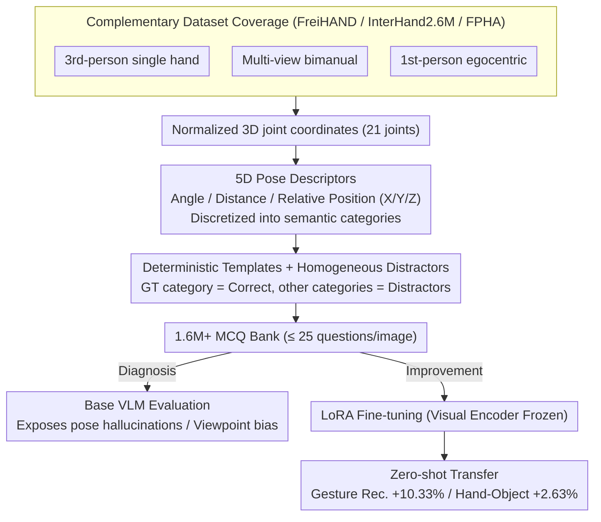

# HandVQA: Diagnosing and Improving Fine-Grained Spatial Reasoning about Hands in Vision-Language Models

**Conference**: CVPR 2026  
**arXiv**: [2603.26362](https://arxiv.org/abs/2603.26362)  
**Code**: [https://kcsayem.github.io/handvqa/](https://kcsayem.github.io/handvqa/)  
**Area**: Multimodal VLM  
**Keywords**: Hand spatial reasoning, VQA benchmark, Vision-language models, Fine-grained understanding, Zero-shot transfer

## TL;DR
The authors construct HandVQA, a large-scale diagnostic benchmark containing 1.6M+ multiple-choice questions automatically generated from 3D hand joint annotations regarding joint angles, distances, and relative positions. The benchmark systematically exposes severe deficiencies in current VLMs' fine-grained hand spatial reasoning and demonstrates that models fine-tuned on HandVQA achieve zero-shot transfer to downstream tasks such as gesture recognition (+10.33%) and hand-object interaction recognition (+2.63%).

## Background & Motivation

**Background**: Vision-Language Models (VLMs) have approached human-level performance on general VQA tasks (e.g., VQAv2) but struggle with fine-grained spatial reasoning. Existing research indicates that VLMs achieve only about 56% accuracy in simple left/right discrimination (compared to 99% for humans), reflecting reliance on surface correlations rather than genuine geometric understanding.

**Limitations of Prior Work**: The hand is a primary medium for conveying human actions, intentions, and control. Precise understanding of hand pose is critical in high-stakes scenarios such as robotic surgery, chip manufacturing, and AR/VR interaction. However, current VLMs lack joint-level understanding of spatial relationships (complex configurations of 21 joints) and frequently suffer from "pose hallucinations"—misinterpreting joint flexion states or incorrectly estimating finger distances.

**Key Challenge**: General VQA benchmarks cannot diagnose specific VLM weaknesses in fine-grained spatial reasoning. Existing spatial reasoning benchmarks (e.g., CLEVR, SPHERE) focus on inter-object relationships and do not evaluate part-level spatial structures within a single object, such as the kinematic and geometric relationships of hand joints.

**Goal**: 1) How to systematically evaluate VLMs' understanding of hand joint-level spatial relationships? 2) What are the specific failure modes of VLMs? 3) Can the capabilities gained through hand spatial reasoning training transfer to other tasks?

**Key Insight**: Utilize precise 3D joint annotations from existing high-quality hand datasets (FreiHAND, InterHand2.6M, FPHA) to automatically generate diagnostic VQA questions, decomposing hand pose estimation into five independently evaluable sub-tasks.

**Core Idea**: Transform 3D hand joint coordinate systems into structured natural language multiple-choice questions to achieve precise diagnosis and effective improvement of VLM hand spatial reasoning capabilities.

## Method

### Overall Architecture
The core problem HandVQA addresses is how to evaluate whether a VLM understands hand joint-level spatial relationships without manual annotation or ambiguity. The approach uses precise 21-joint coordinates from 3D hand datasets as the "source of ground truth," passing them through an automated, deterministic pipeline to translate coordinates into multiple-choice questions. The pipeline follows three steps: first, calculating continuous geometric metrics (joint angles, inter-joint distances, and relative positions along axes) from normalized 3D coordinates; second, discretizing these continuous values into finite semantic categories based on fixed thresholds; third, populating natural language sentences using deterministic templates, where sentences corresponding to the ground truth category serve as the correct answer and other categories serve as distractors. Standard multiple-choice questions are formed by pairing images with these options. Each image generates up to 25 questions (5 descriptors × 5 sampled instances each), accumulating over 1.6 million questions. The entire link is free of randomness or manual judgment, making the benchmark reproducible and auditable. The generated question bank is used both to diagnose deficiencies in off-the-shelf VLMs and for LoRA fine-tuning to verify if such spatial reasoning skills transfer to downstream tasks.

### Key Designs

**1. Complementary Dataset Coverage: Evaluating Viewpoint and Handedness Bias**
Evaluating on a single capture setup would bias results toward specific data distributions. HandVQA utilizes three complementary datasets: FreiHAND (3rd-person single hand), InterHand2.6M (multi-view bimanual), and FPHA (1st-person egocentric). Each is trained and evaluated independently, allowing the benchmark to reveal model vulnerability to acquisition conditions. Base models show significant performance drops on egocentric FPHA views, indicating systematic viewpoint bias; InterHand2.6M's bimanual scenes increase spatial reasoning difficulty due to doubled joint counts and hand occlusions.

**2. Five-dimensional Pose Descriptors: Quantizing Geometric Metrics into Unambiguous Categories**
To ensure diagnostic credibility, "ground truth" for each question must be uniquely determined, avoiding ambiguity in continuous values. HandVQA defines and discretizes three geometric metrics: angle $\theta_j$ is the angle between three adjacent joints on the same finger, cut into 4 categories (fully bent / bent / slightly bent / straight); distance $d_{(i,k)}$ is the Euclidean distance between two joints, cut into 3 categories (close / apart / far apart); relative position $\Delta_a(i,k)$ is the signed offset along X/Y/Z axes, divided into left-right / up-down / front-back. Thresholds are fixed (e.g., $\theta_j < 105^\circ$ is fully bent, $\theta_j \geq 170^\circ$ is straight), and samples falling near category boundaries are excluded to avoid edge cases. This 5D decomposition allows evaluation to be granular, pinpointing whether a model fails on angles, distances, or relative positions.

**3. Deterministic Templates and Homogeneous Distractors: Objective and Discriminative MCQs**
HandVQA uses fixed syntactic templates for each descriptor. For distance, the template is: "The {joint A} joint of the {finger A} is {category} the {joint B} joint of the {finger B}." The critical aspect is the source of distractors: they are other categories for the same joint pair under that specific descriptor (e.g., if GT is "spread," distractors are "close" and "far apart"). This ensures distractors are semantically plausible and reside on the same axis, requiring the model to actually judge geometric relationships rather than relying on elimination. Templating ensures consistent evaluation across models and datasets.

### Loss & Training
The improvement phase uses LoRA for parameter-efficient fine-tuning of the VLM. The visual encoder is frozen, and training occurs only on the HandVQA training set. Accuracy and MAE are reported for angle and distance tasks during evaluation. Freezing the visual encoder, while computationally efficient, may represent a bottleneck for achieving higher accuracy in angle tasks.

## Key Experimental Results

### Main Results

| Model | Fine-tuned | Angle Acc↑ | Angle MAE↓ | Distance Acc↑ | Distance MAE↓ |
|------|------|-----------|-----------|--------------|--------------|
| DeepSeek 7B (Base) | ✗ | 34.10 | 0.883 | 45.55 | 0.657 |
| LLaVA 7B (Base) | ✗ | 40.08 | 0.739 | 16.20 | 1.293 |
| Qwen 7B (Base) | ✗ | 37.92 | 0.779 | 19.58 | 1.247 |
| LLaVA 7B (Finetuned) | InterHand | **74.35** | **0.263** | **90.79** | **0.094** |
| DeepSeek 7B (Finetuned) | InterHand | 68.00 | 0.334 | 88.02 | 0.122 |

### Zero-shot Transfer Results

| Model | Gesture Rec.↑ | Hand-Object Interaction↑ |
|------|----------|-----------|
| LLaVA 7B (Base) | 57.42% | - |
| LLaVA 7B (Finetuned) | **69.58%** (+12.16) | - |
| Qwen 7B (Base) | 71.86% | 80.26% |
| Qwen 7B (Finetuned) | **82.19%** (+10.33) | **82.89%** (+2.63) |

### Key Findings
- Base VLMs fail severely on distance judgment: LLaVA and Qwen accuracy is lower than random guess (33.3%), with Qwen answering "close" 93% of the time when the correct option is "spread."
- Angle tasks remain difficult even after fine-tuning: capping at 74.35% (vs. 90.79% for distance), suggesting frozen visual encoders may be a bottleneck.
- Egocentric viewpoint (FPHA) is particularly challenging for base models, indicating systematic viewpoint bias in VLMs.
- Strengths in a single task do not generalize to others; no base model leads across all spatial dimensions.

## Highlights & Insights
- The pipeline transforming 3D joint coordinates into VQA MCQs is highly effective—fully automated, deterministic, and unambiguous, allowing low-cost generation of massive diagnostic data. This approach is transferable to body pose or object 6DoF estimation.
- Zero-shot transfer experiments prove "3D spatial reasoning is a transferable skill"—joint-level spatial reasoning learned on HandVQA directly improves gesture recognition and interaction recognition without task-specific training.
- Discovery of the "pose hallucination" phenomenon: models tend to provide simplified answers (e.g., always answering "close" or "slightly bent") to handle spatial reasoning problems, which differs from object-level hallucinations.

## Limitations & Future Work
- Evaluation limited to 7B models; larger models might behave differently.
- LoRA fine-tuning with frozen visual encoders may restrict the learning of fine-grained features for tasks like angle estimation.
- Fixed discretization thresholds may not perfectly align with the continuity of human perception.
- Limited to static images; not extended to dynamic hand reasoning in video.
- Templated language limits question diversity; future work could introduce more natural phrasings.

## Related Work & Insights
- **vs SPHERE**: While SPHERE evaluates inter-object spatial relationships, HandVQA focuses on intra-object part-level structures, which are more granular and challenging.
- **vs SpatialVLM**: Unlike SpatialVLM, which injects spatial information via depth maps, HandVQA enables models to learn spatial reasoning autonomously through VQA training.
- The automated generation pipeline in HandVQA can inspire the construction of diagnostic benchmarks in other domains.

## Rating
- Novelty: ⭐⭐⭐⭐ First large-scale benchmark for systematic evaluation of VLM hand spatial reasoning.
- Experimental Thoroughness: ⭐⭐⭐⭐⭐ Comprehensive evaluation across three datasets, three models, five sub-tasks, and zero-shot transfer.
- Writing Quality: ⭐⭐⭐⭐ Clear structure with in-depth analysis.
- Value: ⭐⭐⭐⭐ Highly valuable for understanding and improving spatial reasoning in VLMs.

<!-- RELATED:START -->

## Related Papers

- [\[CVPR 2026\] Improving Vision-language Models with Perception-centric Process Reward Models](improving_vision-language_models_with_perception-centric_process_reward_models.md)
- [\[CVPR 2026\] Chart-FR1: Visual Focus-Driven Fine-Grained Reasoning on Dense Charts](chart-fr1_visual_focus-driven_fine-grained_reasoning_on_dense_charts.md)
- [\[CVPR 2026\] Thinking Beyond Labels: Vocabulary-Free Fine-Grained Recognition using Reasoning-Augmented LMMs](thinking_beyond_labels_vocabulary-free_fine-grained_recognition_using_reasoning-.md)
- [\[CVPR 2026\] ReasonMap: Towards Fine-Grained Visual Reasoning from Transit Maps](reasonmap_towards_fine-grained_visual_reasoning_from_transit_maps.md)
- [\[CVPR 2026\] BOP-Ask: Object-Interaction Reasoning for Vision-Language Models](bop-ask_object-interaction_reasoning_for_vision-language_models.md)

<!-- RELATED:END -->
