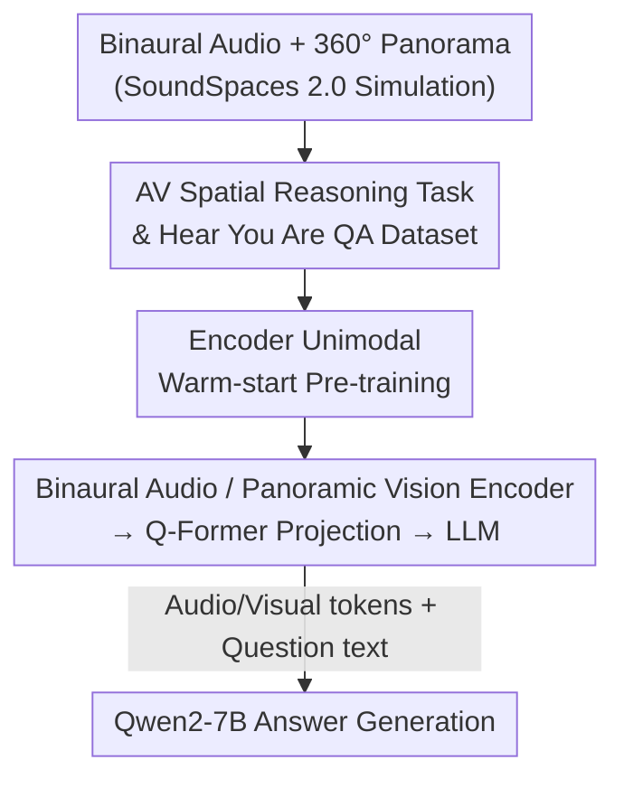

# Hear you are: Teaching LLMs Spatial Reasoning with Vision and Spatial Sound

**Conference**: CVPR 2026  
**Paper**: [CVF Open Access](https://openaccess.thecvf.com/content/CVPR2026/html/Ryu_Hear_you_are_Teaching_LLMs_Spatial_Reasoning_with_Vision_and_CVPR_2026_paper.html)  
**Code**: None (Authors state datasets and training code will be open-sourced)  
**Area**: Multimodal VLM  
**Keywords**: Spatial Reasoning, Binaural Spatial Audio, Audio-Visual Question Answering (AVQA), Multimodal LLM, Sound Source Localization  

## TL;DR
This paper proposes the "Audio-Visual Spatial Reasoning" task and synthesizes a million-scale QA dataset, Hear You Are QA, featuring binaural audio and $360^{\circ}$ panoramas using SoundSpaces 2.0. It trains "Hear You Are LLM," a multimodal large model connecting a binaural spatial audio encoder and a panoramic vision encoder to Qwen2-7B. In scenarios solvable only through spatial cues—such as "semantic mismatch between sound and visual objects" or "multiple identical objects distinguishable only by orientation"—it significantly outperforms baselines using only monaural audio.

## Background & Motivation
**Background**: Mainstream audio-visual learning (sound source localization, separation, synchronization) almost exclusively utilizes **monaural audio**, relying on semantic alignment between "audio semantics" and "object appearance" or temporal alignment between events and sound.

**Limitations of Prior Work**: Monaural audio lacks **directional information**, rendering these methods inherently incapable of handling two types of scenarios: ① Semantic **mismatch** between the sounding object and the audio—e.g., a phone ringing inside a backpack, where "ringtone" and "backpack" have no semantic correspondence and inference must rely on "the direction of the sound"; ② Multiple **identical** visual objects sharing the same semantic cue—e.g., several students in a classroom might "speak," requiring spatial audio to lock onto the specific student asking a question.

**Key Challenge**: Humans naturally perceive the orientation of sound sources through **binaural hearing** and perform high-level reasoning by combining spatial sound with vision. In contrast, machines losing binaural spatial cues are forced to guess based on semantic priors when encountering "semantically ambiguous or misleading" scenarios. Existing spatial audio reasoning works (e.g., BAT) utilize **only audio without vision**, lacking the spatial context carried by visual signals.

**Goal**: To define and solve "Audio-Visual Spatial Reasoning"—moving beyond mere perception and localization of sound sources to reasoning about spatial cues and inferring relationships between sound and visual objects. This necessitates the creation of both a dataset and a model capable of processing binaural audio and panoramic vision simultaneously.

**Core Idea**: Connect a **binaural spatial audio encoder + panoramic vision encoder** through projection layers to a Large Language Model (LLM), allowing the LLM to jointly perform semantic alignment and spatial reasoning in a unified token space. The model is trained using mass-synthesized audio-visual QA data with ground-truth orientations from a simulator.

## Method

### Overall Architecture
The mechanism consists of two tracks: **Data Generation** and **Model Architecture**. On the data side, the SoundSpaces 2.0 acoustic simulator is used within 3D-scanned rooms from Matterport3D. Given sound source positions, monaural source audio, and receiver poses, **binaural audio** is rendered via convolution with Room Impulse Responses (RIRs). 3D objects generated by Stable Diffusion 3 + InstantMesh are placed into the scenes to form $360^{\circ}$ panoramas. Approximately **1 million QA pairs** are automatically generated using 9 types of question templates. On the model side, Hear You Are LLM receives a $224 \times 812$ panorama and a 10-second binaural waveform. The vision and audio encoders extract features → map to the LLM latent space via Q-Former projection layers → the projected visual/audio tokens and question text tokens are fed into Qwen2-7B, optimized using standard language modeling cross-entropy. To ensure both encoders learn effective representations, a round of **unimodal warm-start pre-training** is performed before end-to-end joint fine-tuning.

### Key Designs

**1. AV Spatial Reasoning Task & Hear You Are QA Dataset: Making "Spatial-Only" Scenarios Trainable and Evaluable**

Addressing Limitations ① & ②, the authors define the task and use simulation to generate supervised data. SoundSpaces 2.0 is used to render **geometric acoustics** across 90 scanned buildings in Matterport3D (split 72/9/9 for train/val/test). Observation signals = convolution of monaural source audio and Room Impulse Responses; the receiver side records **binaural signals** using the default Head-Related Transfer Function (HRTF) in SoundSpaces, preserving directional cues and accurate ground-truth (3D position and orientation of each source). Audio sources are from VGGSound (manually filtered for indoor/visually clear categories), and visual objects are generated via SD3 + InstantMesh. Objects are injected as sounding sources or distractors; each scene contains one source assigned as a "semantically matched object," a "random object of a different category," or a "random empty space," with up to 3 additional distractors to increase visual complexity and prevent stitching seams from becoming shortcuts.

The dataset features **9 classes of base questions** (Table 1) covering four categories: Spatial Correspondence (Q1, including **counterfactual** samples like "dog bark at piano position" to force learning true spatial correspondence over semantic priors), Relative Position (Q2/Q3/Q4, regarding left/right, front/back, up/down, angle, distance), Joint Spatial-Semantic Correspondence (Q5–Q8, split by difficulty based on identical objects), and Semantic Co-occurrence (Q9, visibility of the source). Templates are automatically filled based on scene parameters and rewritten by ChatGPT-4o for natural language diversity.

**2. Multimodal Architecture for Binaural Spatial Audio + Panoramic Vision: Unifying Directional and Appearance Cues**

To meet the requirement for both semantics and spatiality, the model maintains dual encoders with projection layers. For vision, **SigLIP2 (NaFLEX setting, supporting flexible resolution/aspect ratio)** processes the panorama, outputting a patch token sequence $v\in\mathbb{R}^{N_v\times C_v}$ while **foregoing pooling to preserve the full spatial layout** (directional info is embedded in the spatial arrangement of patches); LoRA is used to fine-tune patch embeddings and attention layers. For audio, the **Spatial-AST binaural encoder** from BAT processes binaural spectrograms to output tokens $a\in\mathbb{R}^{N_a\times C_a}$ that retain spatial acoustic cues; this encoder is **frozen throughout**. Each branch uses a **Q-Former projection layer** (audio side uses BAT weights, vision side uses the first two attention layers of BLIP-2) to produce $N_1=64$ audio query tokens and $N_2=128$ visual query tokens. These tokens, concatenated with question embeddings, are fed into **Qwen2-7B-Instruct**. Compared to VideoLLaMA2, the architecture is isomorphic; the critical difference is the use of **binaural** instead of monaural audio.

**3. Unimodal Warm-start Pre-training: Learning "Object Recognition + Orientation Reporting" Separately**

In direct end-to-end training, encoders may fail to learn clean modal representations. The authors perform two auxiliary tasks for each modality under a unimodal + LLM setting: **Classification** (Vision: "What object is detected at ({azimuth}, {elevation}), {distance} meters?"; Audio: "What sound is detected?") and **Localization** (Asking for the azimuth, elevation, and distance of a specified category/source). The vision encoder uses **progressive** training—first classification for semantic representation, then joint classification + localization for spatial grounding. The audio encoder is trained on both tasks from the start. Post warm-start, unimodal metrics were solid (Table 3: vision detection accuracy 0.633, Mean Angular Error 26.89°; audio 0.575, 38.01°), providing a strong starting point for joint training.

### Loss & Training
The end-to-end phase uses standard language modeling cross-entropy (maximizing answer likelihood token-by-token). The model was trained on 8 $\times$ A5000 GPUs for 3 epochs with an effective batch size of 128, using LoRA rank 16 for the image encoder and LLM, taking roughly 3 days. Inputs consist of a single $224 \times 812$ panorama and 10 seconds of 32 kHz binaural audio.

## Key Experimental Results

### Main Results (vs. Baselines, Table 2)
Baselines use **monaural** audio: ISSL / ACL-SSL are sound source localization methods (evaluating only non-language tasks), while VideoLLaMA2 is an MLLM with the same encoders as this paper, fine-tuned on this dataset (isomorphic architecture, differing only by binaural input). Metrics include classification accuracy and Direction of Arrival (DoA) accuracy.

| Task | Meaning | VideoLLaMA2 (R+M+Q) | Ours (R+B+Q) |
|------|------|------|------|
| Q1 (aligned) | Localization with matched AV semantics | 77.44 | **77.61** |
| Q1 (non-matching) | Sound/Object **mismatch** at source | 50.75 | **61.67** |
| Q7 (DoA) | Single identical object, estimate orientation | 68.57 | **73.21** |
| Q8 (DoA) | **Multiple identical objects**, estimate orientation | 46.37 | **64.27** |

When semantics are sufficient (Q1 aligned, Q7), both models are close—monaural + vision suffices for localization. However, in semantically ambiguous cases (Q1 non-matching requiring directional association, Q8 with identical objects), VideoLLaMA2 (monaural) collapses toward random guess (approx. 50% in Q8), while the binaural model maintains a lead of over ten percentage points.

### Ablation Study (Modality Settings, Table 4, Excerpt)
Comparison of R+B+Q (Vision+Binaural+Question) / R+M+Q (Monaural) / B+Q / M+Q / R+Q, with Random/Oracle references.

| Task/Metric | R+B+Q | R+M+Q | B+Q | Description |
|------|------|------|------|------|
| Q1 coming-from acc ↑ | **69.64** | 64.10 | 26.40 | Binaural orientation advantage when semantics are similar |
| Q4-invisible DoA acc ↑ | **41.18** | 16.71 | 11.18 | Binaural is nearly the only cue when source is invisible |
| Q4-invisible DoA err ↓ | **39.81°** | 69.25° | 80.51° | Same as above, error significantly reduced |
| Q6 sounding acc ↑ | **72.33** | 52.33 | 59.33 | Two identical objects; R+M+Q degrades to random guessing |
| Q8 DoA err ↓ | **23.78°** | 50.80° | 32.32° | Binaural disambiguates multiple identical objects |

### Key Findings
- **Binaural audio is decisive in "semantically ambiguous/invisible" scenarios**: When the source is visible and unique (Q5, Q7), R+M+Q can localize via visual spatial cues, and the binaural advantage is minimal. However, when the source is invisible (Q4-invisible) or multiple identical objects exist (Q6, Q8), monaural input degrades to near-random, while binaural remains stable. This pattern proves the core thesis.
- **Vision and Binaural audio are complementary**: B+Q focuses purely on direction and is unaffected by object-level ambiguity, showing lower DoA error in multi-object scenes than R+M+Q. Conversely, R+M+Q outperforms B+Q on single objects (visual spatial info is more precise without semantic confusion). R+B+Q achieves the lowest error in Q8 (23.78°), proving the robustness of the combination.
- **Vision aids spatial audio learning**: Testing a model trained on R+B+Q in a B+Q setting shows a drop in Q5/Q6. This suggests visual signals during training provide implicit spatial cues that help align audio orientation with visual scenes.

## Highlights & Insights
- **Forcing true spatial correspondence with counterfactual samples**: Placing "piano + dog bark" pairs at the same location prevents the model from taking shortcuts through semantic priors. This is a simple but effective data design for testing geometric vs. appearance priors.
- **Feeding raw directional cues to LLM**: By preserving patch spatial layout and using binaural encoders, directional cues from both branches enter the token space, allowing the LLM to perform cross-modal spatial reasoning rather than relying on human-designed localization heads.
- **Simulation as a proxy for annotation**: Real binaural data requires ambisonic or dummy-head microphones and is hard to scale. Using SoundSpaces 2.0 + generative 3D objects to synthesize million-scale data with precise ground-truth is a reusable paradigm for scaling "spatial audio-visual" tasks.

## Limitations & Future Work
- **Purely Synthetic Domain**: Scenes, binaural audio, and 3D objects are all synthetic. HRTF uses a default model, leaving questions about sim-to-real gaps regarding individual differences in real binaural recordings, complex reverberation, and real image textures ⚠️.
- **Frozen Audio Encoder**: Spatial-AST uses frozen BAT weights, potentially capping spatial audio representation limits. Joint fine-tuning of the audio encoder remains unexplored.
- **Static Single-Source Settings**: Each scene contains only one source with static inputs (single panorama + 10s audio), lacking multi-source overlap, moving sources, or temporal dynamics.
- **Evaluation Depth**: Results focus on per-task accuracy/angular/distance error; more systematic evaluation of LLM response robustness and hallucination rates in free-form dialogue is needed.

## Related Work & Insights
- **vs. BAT [56] (Pure Spatial Audio Reasoning)**: BAT also uses SoundSpaces 2.0 but is **audio-only**, handling sound event detection/localization. This paper reuses its Spatial-AST encoder but adds panoramic vision, advancing the task to "spatial reasoning between sounding sources and visible/invisible visual objects," which handles semantic mismatch and multi-object disambiguation.
- **vs. VideoLLaMA2 [10] (AV MLLM)**: As the closest baseline, this paper fine-tunes VideoLLaMA2 on its dataset. The monaural baseline lags significantly in Q1 (non-matching) and Q8 (DoA), directly proving the performance gap stems from binaural audio rather than architecture.
- **vs. Traditional Localization (ISSL/ACL-SSL)**: These methods perform "audio-query based object detection/segmentation" via semantic alignment, lacking language understanding and spatial reasoning. They fall behind in counterfactual and multi-identical-object scenarios.

## Rating
- Novelty: ⭐⭐⭐⭐ First to integrate binaural audio + vision + LLM for "Audio-Visual Spatial Reasoning" with a large-scale dataset.
- Experimental Thoroughness: ⭐⭐⭐⭐ Systematic cross-ablation of 9 question types and multimodal settings; Oracle/Random references included. Lacks real-world verification.
- Writing Quality: ⭐⭐⭐⭐ Intuitive motivation (phone in a backpack); clear per-task explanation of binaural necessity.
- Value: ⭐⭐⭐⭐ Provides a comprehensive task definition, dataset, and baseline, establishing a reproducible benchmark for AV spatial reasoning.

<!-- RELATED:START -->

## Related Papers

- [\[CVPR 2026\] STAR-R1: Multi-View Spatial TrAnsformation Reasoning by Reinforcing Multimodal LLMs](star-r1_multi-view_spatial_transformation_reasoning_by_reinforcing_multimodal_ll.md)
- [\[CVPR 2026\] G$^2$VLM: Geometry Grounded Vision Language Model with Unified 3D Reconstruction and Spatial Reasoning](g2vlm_geometry_grounded_vision_language_model_with_unified_3d_reconstruction_and.md)
- [\[ICLR 2026\] SCoT: Teaching 3D-LLMs to Think Spatially with Million-scale CoT Annotations](../../ICLR2026/vlm_reasoning/scot_teaching_3d-llms_to_think_spatially_with_million-scale_cot_annotations.md)
- [\[CVPR 2026\] Beyond 3D VQAs: Injecting 3D Spatial Priors into Vision-Language Models for Enhanced Geometric Reasoning](beyond_3d_vqas_injecting_3d_spatial_priors_into_vision-language_models_for_enhan.md)
- [\[ICLR 2026\] Spatial-DISE: A Unified Benchmark for Evaluating Spatial Reasoning in Vision-Language Models](../../ICLR2026/vlm_reasoning/spatial-dise_a_unified_benchmark_for_evaluating_spatial_reasoning_in_vision-lang.md)

<!-- RELATED:END -->
