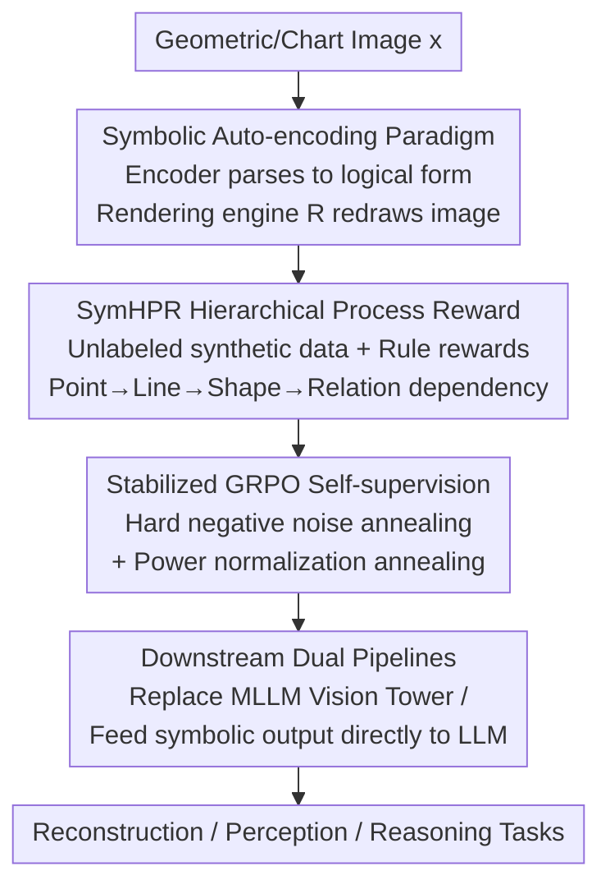

# Hierarchical Process Reward Models are Symbolic Vision Learners

**Conference**: CVPR 2026  
**Paper**: [CVF Open Access](https://openaccess.thecvf.com/content/CVPR2026/html/Zhang_Hierarchical_Process_Reward_Models_are_Symbolic_Vision_Learners_CVPR_2026_paper.html)  
**Code**: Project Page https://vi-ocean.github.io/projects/SymVAE  
**Area**: Multimodal VLM  
**Keywords**: Symbolic Vision, Process Reward Models, Geometric Diagram Parsing, Self-supervised Autoencoder, GRPO

## TL;DR
This work redefines "geometric diagram understanding" as a **symbolic auto-encoding** problem—the encoder parses the diagram into a logical form of points/lines/shapes/relations (latents are symbolic graphs rather than pixel vectors), and an executable rendering engine redraws the logical form back into the original image. A **Hierarchical Process Reward (SymHPR) + Stabilized GRPO** is used to supervise this non-differentiable pipeline, enabling a 7B model to achieve a 98.2% reduction in reconstruction MSE and gains of +13% / +3% on perception and reasoning benchmarks, respectively.

## Background & Motivation
**Background**: Diagrams such as charts and geometric figures are universal media for "reasoning with images" in science and education. However, they differ fundamentally from natural images: while natural images convey semantics through texture, color, and scenes, diagrams are "semantically sparse but structurally dense" blueprints where meaning resides entirely in the topological and logical relations between points, lines, and surfaces.

**Limitations of Prior Work**: Mainstream vision encoders (CLIP series, Qwen2.5-VL vision towers) treat diagrams as ordinary natural images, encoding them into continuous high-dimensional vectors. Autoencoders like VAE/MAE reconstruct from these continuous features, resulting in latents that capture **pixel-level semantics rather than symbolic structures**. Consequently, pixel values do not carry symbolic meaning when parsing a line or an arc; models only "approximate" symbolic understanding through weak supervision, leading to coarse reconstructed structures and chaotic relationships.

**Key Challenge**: Correct understanding of diagrams requires **hierarchical dependency**—lines must be built upon correctly identified points, shapes depend on lines, and relations depend on shapes. If a line is parsed incorrectly, subsequent shape analysis becomes meaningless. The paradigm of continuous latents + pixel reconstruction fails to explicitly model this "support from lower levels for higher levels."

**Goal**: (1) Ensure the latent space itself is a symbolic representation rather than a continuous vector; (2) provide fine-grained, verifiable process supervision for multi-step parsing without manual annotation; (3) maintain stable training even when reconstruction supervision is extremely sparse.

**Key Insight**: The authors adapt Process Reward Models (PRM, originally used for step-by-step supervision in language reasoning) to vision, incorporating **hierarchical geometric dependencies** unique to diagrams—a structural prior entirely absent in text PRMs.

**Core Idea**: Replace "pixel autoencoder + holistic reconstruction loss" with a "symbolic autoencoder + hierarchical process reward," enabling the encoder to learn to output executable, verifiable, and compositional geometric logical forms.

## Method

### Overall Architecture
The method revolves around a three-stage training pipeline: first, an SFT cold-start enables the base VLM to output structured logical forms (SymParser); next, RL with hierarchical process rewards strengthens its grasp of geometric dependencies (SymHPR); finally, a deterministic rendering engine acts as a decoder for **self-supervised** reconstruction training using stabilized GRPO (SymVAE). The trained symbolic encoder serves MLLM perception and reasoning via two downstream pipelines. Given a geometric/chart image $x$, it outputs a structured logical form $s$ (points → lines → shapes → shape properties → geometric relations), and the rendering engine redraws $\hat{s}$ into $\hat{x}=R(\hat{s})$.

### Key Designs

**1. Symbolic Auto-encoding Paradigm: Latents as Executable Logical Graphs**

To address the failure of pixel latents in capturing diagram structures, the authors replace the continuous vector bottleneck of the autoencoder with a **symbolic logical form**. The encoder $f_\theta: X \to S$ parses an image into compositional geometric primitives: points marked with vertex letters and normalized coordinates $(x,y)\in[0,1]^2$; lines defined by vertex pairs (e.g., $ab$); shapes composed of lines/circles (e.g., `RightTriangle` explicitly stating which lines are perpendicular); and relations describing interactions (e.g., `IntersectAt`, `Incircle`, `Tangent`, `AngleBisector`). The decoder is a **deterministic rendering engine** $R:S\to X$ (based on graphics libraries like matplotlib) that redraws the logical form. Thus, the latent naturally encodes dependencies where "points define lines, lines form shapes, and primitives constitute relations." Self-supervised training on **unlabeled images** is achieved via RL, passing back vision rewards $r_\text{vis}(x, R(\hat{s}))$ as scalar supervision.

**2. SymHPR Hierarchical Process Reward: Preventing Reward Hacking via Hierarchical Dependency**

Text PRMs rely on expensive manual labels or hallucination-prone LLM-as-judge models, and they lack geometric constraints. SymHPR introduces three innovations: ① **Zero-cost training data**—a synthetic engine constructs parsing paths (POINT ⇒ LINE ⇒ SHAPE ⇒ SHAPE PROPERTIES ⇒ GEOMETRIC RELATIONS) paired with rendered images; ② **Rule-based verifiable rewards**—six dimensions are scored using verifiable metrics like F1 or L2 (points use F1; lines use order-insensitive F1 where $ab\equiv ba$; shape properties reward $r_\text{indicator}=r_\text{shape}\times F1(\cdot)$ only gives credit if the shape is correct; point positions use $r_\text{position}=\exp(-d_\text{avg}/\tau)$ with $\tau=0.05$); ③ **Hierarchical dependency modeling**—sub-component rewards are fused based on their dependence on parent components:

$$r'_c = r_c \cdot \big[(1-\alpha_{c\to p}) + \alpha_{c\to p}\cdot r'_p\big],\quad \alpha=0.9$$

The reward for a line/shape/relation is multiplied by its parent’s (point/line/shape) adjusted reward, equivalent to $r'_c = r_c\cdot[0.1+0.9\,r'_p]$. This mechanism ensures that if a line is parsed incorrectly, the shape built upon it cannot receive a high score, effectively blocking "reward hacking" where higher levels match by luck despite lower-level errors.

**3. Stabilized GRPO: Preventing Collapse under Sparse Visual Reconstruction Rewards**

Standard GRPO collapses with visual rewards because diagrams consist of uniform backgrounds and thin foreground lines; reconstruction rewards fail to distinguish quality, leading to near-zero advantage and KL divergence (stopping exploration). The authors introduce two solutions: ① **Hard negative contrast + noise annealing**—injecting Gaussian noise $\hat{x}_\text{noisy}=\text{clip}(\hat{x}+\mathcal{N}(0,\sigma^2 I),0,255)$ into 4 out of 8 rollouts per group as hard negatives to increase reward variance; $\sigma$ follows an exponential annealing schedule $\sigma_t=\sigma^{(0)}_\text{min}+(\sigma^{(0)}_\text{max}-\sigma^{(0)}_\text{min})e^{-t/T}$, enabling a curriculum of aggressive exploration followed by stable exploitation. ② **Power normalization annealing**—applying a power transform to normalized intra-group rewards $\tilde{r}_i=\big(\frac{r_i-r^\text{group}_\text{min}}{r^\text{group}_\text{max}-r^\text{group}_\text{min}+\epsilon}\big)^{\alpha_t}$, where $\alpha_t$ anneals from 3.0 to 1.0. Since $r_i^\alpha/r_j^\alpha > r_i/r_j$ for $\alpha\ge1$, this sharpens the distribution to provide stronger gradient signals.

**4. Downstream Dual Pipelines: From Vision Tower Replacement to Neuro-Symbolic Connection**

The symbolic encoder can be used in two ways: first, **replacement**—replacing the entire visual encoder of Qwen2.5-VL-7B with the symbolic version; second, **Neuro-Symbolic Direct Connection**—feeding interpretable symbolic results **directly as text logical forms to the LLM** to guide reasoning. In the latter, visual rewards can adaptively supplement text answer rewards (final answer + format). This demonstrates that symbolic logical forms are naturally compatible with the language reasoning space.

### Loss & Training
Three stages: ① Cold-start SFT using standard next-token prediction $L_\text{SFT}(\theta)=-\mathbb{E}_{(x,s)\sim D}[\log p_\theta(s\mid x)]$ on 100K synthetic pairs to learn symbolic language; ② SymHPR on 9K pairs using hierarchical process rewards ($K=8$ rollouts, $\beta=0.03$ KL); ③ SymVAE on 16K pure images (7K synthetic + 5K Geo170K + 4K PGDP) using visual rewards $r_\text{vis}=\sum_k \frac{w_k}{\sum_j w_j}r_k$ (MSE/SSIM/DINO weights 0.6/0.3/0.1) with stabilized GRPO. Downstream fine-tuning uses LoRA (rank=64).

## Key Experimental Results

### Main Results

Geometric Reconstruction (MSE ×10⁻³↓, lower is better):

| Test Set | Metric | Ours (SymVAE-7B) | VAE | GPT-4o |
|--------|------|----------------|-----|--------|
| Synth Diagram | MSE↓ | **6.01** | 12.9 | 34.3 |
| Synth Diagram | SSIM↑ | **0.94** | 0.62 | 0.82 |
| Geo170K | MSE↓ | **16.8** | 37.9 | 39.9 |
| Geo170K | SSIM↑ | **0.83** | 0.64 | 0.76 |

Compared to the pixel VAE, the synthetic set MSE dropped from 12.9 to 6.01. For chart reconstruction (ChartMimic Direct Mimic), SymVAE+chart-7B outperformed GPT-4o by +0.6% to +6.5% and surpassed the specialized parser VisCodex-8B using only 1/5 of the samples.

Downstream Perception/Reasoning:

| Task/Benchmark | Metric | Ours | Qwen2.5-VL-7B | Gain |
|----------------|------|------|----------------|------|
| MathGlance (Avg.) | top-1 acc | 72.6 | 59.2 | +13.4 |
| Relation ID (rlat) | acc | 100.0 | 52.0 | +48 |
| MathVerse | acc | 51.8 | 49.2 | +2.6 |
| GeoQA | acc | 79.4 | 76.4 | +3.0 |

Notably, the version **without a projector** (79.4) matched the projector-based variant (79.2) on GeoQA, proving symbolic forms are natively compatible with language LLMs.

### Ablation Study

| Configuration | Phenomenon / Key Metric | Explanation |
|------|--------------|------|
| Flat Reward $r_\text{flat}$ | Close to cold-start levels | Averaging rewards limits exploration; fails to learn structure |
| Hierarchical SymHPR | Significantly better | Explicitly models Point→Line→Shape dependency ($\alpha=0.9$) |
| SymVAE-3B⊖ (Vanilla GRPO) | MSE 6.99 / SSIM 0.81 | Collapse without stabilization; KL near 0 |
| SymVAE-3B⊕ (Noise Anneal) | MSE 6.20 / SSIM 0.87 | Hard negatives expand variance |
| SymVAE-3B (Power Norm) | MSE 6.13 / SSIM 0.89 | Sharpens distribution; most stable (Default) |

### Key Findings
- **Hierarchy is the soul of SymHPR**: Removing it causes the policy to stagnate, indicating that the constraint "lower-level must be correct for higher-level reward" is vital to prevent reward hacking.
- **Stabilization is non-negotiable**: Vanilla GRPO collapses under sparse visual rewards. Both noise annealing and power normalization help, with the latter providing better final performance.
- **Cross-domain Generalization**: The model generalizes from 2D geometry to 3D and even circuit/chemical diagrams, showing that symbolic primitives possess compositional generalization.

## Highlights & Insights
- **Revisiting Vision as Symbolic Auto-encoding**: Using a deterministic rendering engine as a decoder forces the model to parse logical forms accurately, providing an elegant self-supervised signal.
- **Hierarchical PRM as a Vision Upgrade**: Instead of a simple port of text PRMs, this work embeds diagram-specific "Point→Line→Shape→Relation" dependencies into a multiplicative reward cascade.
- **Stabilization Recipes for Sparse Rewards**: The strategy of "artificially expanding intra-group variance via noise" is valuable for any GRPO scenario where low reward discriminability leads to vanishing advantages.
- **Neuro-Symbolic Connection**: Feeding symbolic parses as text to LLMs without projection alignment yields competitive results, suggesting that interpretable intermediate representations may be more efficient than continuous visual tokens.

## Limitations & Future Work
- The rendering engine relies on a manual deterministic pipeline (matplotlib-based), which may struggle with primitives outside the predefined set (e.g., complex curves or stylized aesthetics).
- Heavy reliance on **synthetic logical data** for cold-start training suggests a gap with real-world diagram noise and style.
- Self-supervision is limited to diagrams that can be formally rendered; this paradigm is not applicable to natural images.
- Multiple hyperparameters ($\alpha$, noise/power annealing) require extensive validation for robustness across datasets.

## Related Work & Insights
- **vs. Pixel Autoencoders (VAE/MAE)**: These capture pixel semantics; Ours uses symbolic graphs and "Vision-Logic Rules" for reconstruction, which is more suitable for structurally dense diagrams.
- **vs. Text PRMs (Let's Verify/VisualPRM)**: These provide step-by-step scores but lack geometric hierarchical constraints. SymHPR is the first hierarchical process reward model for symbolic vision.
- **vs. Code-based Parsers (ChartMimic/Plot2Code)**: Code representations are good for mapping values in charts, but matplotlib-based approaches often lack explicit shape and hierarchical relationship metadata.
- **vs. Logical Parsing (PGDP/AlphaGeometry)**: PGDP lacks shape attribute indicators; AlphaGeometry is for theorem proving and cannot parse/reconstruct visual diagrams. Ours is the first self-supervised symbolic vision encoder.

## Rating
- Novelty: ⭐⭐⭐⭐⭐ Paradigmatic innovation combining symbolic auto-encoding and hierarchical PRM.
- Experimental Thoroughness: ⭐⭐⭐⭐ Strong coverage across reconstruction/perception/reasoning, though some gains were statistics-dependent.
- Writing Quality: ⭐⭐⭐⭐ Clear motivation and mechanism, though formulas are somewhat dense.
- Value: ⭐⭐⭐⭐ Methodological contributions to interpretable vision and RL stabilization.

<!-- RELATED:START -->

## Related Papers

- [\[CVPR 2026\] Improving Vision-language Models with Perception-centric Process Reward Models](improving_vision-language_models_with_perception-centric_process_reward_models.md)
- [\[ICLR 2026\] CircuitSense: A Hierarchical MLLM Benchmark Bridging Visual Comprehension and Symbolic Reasoning in Engineering Design Process](../../ICLR2026/vlm_reasoning/circuitsense_a_hierarchical_mllm_benchmark_bridging_visual_comprehension_and_sym.md)
- [\[CVPR 2026\] Keep it SymPL: Symbolic Projective Layout for Allocentric Spatial Reasoning in Vision-Language Models](keep_it_sympl_symbolic_projective_layout_for_allocentric_spatial_reasoning_in_vi.md)
- [\[ICLR 2026\] VisualPRM400K: An Effective Dataset for Training Multimodal Process Reward Models](../../ICLR2026/vlm_reasoning/visualprm400k_an_effective_dataset_for_training_multimodal_process_reward_models.md)
- [\[CVPR 2026\] ARM-Thinker: Reinforcing Multimodal Generative Reward Models with Agentic Tool Use and Visual Reasoning](arm-thinker_reinforcing_multimodal_generative_reward_models_with_agentic_tool_us.md)

<!-- RELATED:END -->
