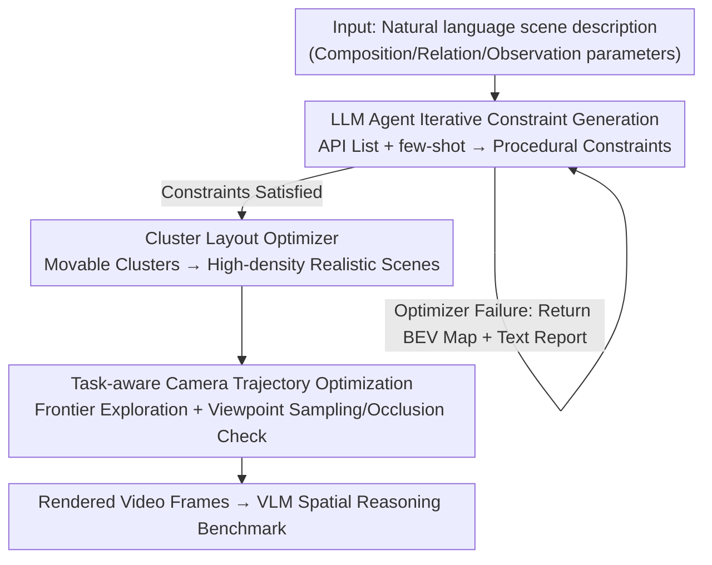

# InfiniBench: Infinite Benchmarking for Visual Spatial Reasoning with Customizable Scene Complexity

**Conference**: CVPR 2026  
**Paper**: [CVF Open Access](https://openaccess.thecvf.com/content/CVPR2026/html/Wang_InfiniBench_Infinite_Benchmarking_for_Visual_Spatial_Reasoning_with_Customizable_Scene_CVPR_2026_paper.html)  
**Code**: https://github.com/pittisl/infinibench (Dataset: https://huggingface.co/datasets/Haoming645/infinibench)  
**Area**: Multimodal VLM / Spatial Reasoning Evaluation / 3D Scene Generation  
**Keywords**: Spatial Reasoning, Customizable Benchmark, Procedural Generation, LLM Agent, Camera Trajectory Optimization

## TL;DR
InfiniBench is a fully automated, parameterizable 3D scene benchmark "generator." It translates natural language scene descriptions into physically plausible, photorealistic videos with controllable complexity. This allows for the theoretical generation of infinite VLM spatial reasoning evaluation tasks across composition, relation, and observation complexities, specifically exposing model failure modes under diverse spatial conditions.

## Background & Motivation
**Background**: Visual spatial reasoning (understanding object positions, orientations, and inter-relationships) is a core capability for VLM real-world perception, requiring systematic evaluation across varying scene complexities. Current evaluations rely either on real-world datasets or synthetic 3D scenes.

**Limitations of Prior Work**: Real datasets are photorealistic but difficult to scale and lack parametric control. Early procedural engines (Blender, IsaacSim) lack realism. While 3D-aware diffusion models offer visual richness, they lack semantic labels and physical consistency. Pure LLMs generating layouts directly often produce illegal configurations—such as "absurd orientations, out-of-bounds, or inter-penetrating objects" (Fig. 2)—due to their inherent spatial logic flaws when object counts increase. Optimization-based frameworks like Infinigen or ProcTHOR fail to create high-density cluttered scenes and require expert parameter tuning.

**Key Challenge**: Existing benchmarks cannot simultaneously achieve **customizability, scalability, and semantic richness**. Specifically, they fail to decouple "scene complexity" into independently adjustable dimensions, resulting in aggregated average accuracies that **cannot isolate or locate why a VLM fails under a specific spatial condition**.

**Goal**: Rather than releasing a static benchmark for each complexity type, the goal is to create a **generator**. This allows users to specify complexity parameters via natural language to produce theoretically infinite 3D scene evaluation tasks. Complexity is explicitly decomposed into three dimensions: composition (object count/variety), relation (spatial relations/occupancy), and observation (extreme viewpoints/occlusion).

**Key Insight**: Decouple "high-level planning" from "low-level execution." Instead of letting the LLM generate precise layouts directly, it generates high-level **constraints**. These are then passed to a specialized optimizer to be implemented as physically plausible 3D scenes, combining the linguistic expressiveness of LLMs with the scalability and controllability of procedural generation.

**Core Idea**: A three-stage pipeline consists of an "LLM agent for iterative scene constraint generation + a cluster-based layout optimizer + task-aware camera trajectory optimization" to transform a single-sentence scene description into a video benchmark consumable by VLMs.

## Method

### Overall Architecture
The core of InfiniBench is a three-stage pipeline. The input is a natural language scene description (e.g., "A $30 m^2$ dining room with 10 different chairs, add furniture to reach 50% occupancy, camera moves in handheld style covering most objects"), and the output is a rendered video frame sequence. The first stage uses an LLM agent to translate the description into machine-readable procedural constraints, iterating based on failure feedback. The second stage uses a cluster-based layout optimizer to implement these constraints into physically plausible, high-density 3D scenes. The third stage utilizes task-aware camera trajectory optimization to ensure all task-relevant objects are captured fully and without occlusion.

### Key Designs

**1. LLM Agent Iterative Constraint Generation: Using constraints instead of direct layouts with closed-loop error correction.**

Traditional procedural generation requires manual scripting of complex constraints. InfiniBench enables an LLM agent to translate natural language into machine-readable constraints (e.g., `set_object_count(monitor, 3)`, `on_top_of(keyboard, desk)`). The agent is provided with two types of domain knowledge: a complete procedural API syntax list and few-shot translation examples. Since single-pass generation often yields logical conflicts or physical impossibilities, a **critical feedback loop** is introduced. Each round, an optimizer attempts to implement the constraints; if it fails, it returns an error report containing a Bird’s Eye View (BEV) map showing collisions and a text summary of unsatisfied constraints. This drives a CoT reasoning process where the agent analyzes the failure (e.g., "desk area insufficient for three monitors") and revises the constraints (e.g., increasing desk size). Constraints usually converge within 5 rounds and are highly reusable.

**2. Cluster Layout Optimization: Using "movable clusters" to replace rigid hierarchical optimization for high-density scenes.**

Frameworks like Infinigen or ProcTHOR use hierarchical optimization: large objects (e.g., tables) are fixed first, then small objects (e.g., chairs) are placed. This often leads to deadlocks in complex scenes where large objects occupy all space, leaving no room for smaller ones (Fig. 6a). InfiniBench transforms the layout engine via **cluster optimization**. The core concept is "movable clusters," where a group of related objects (a table and its surrounding chairs) is optimized as a single entity. The process involves three steps: ① Cluster identification—automatically grouping objects based on the scene semantic graph; ② Action space expansion—allowing the optimizer to move entire clusters to better positions without breaking internal relationships; ③ Collision detection—using the bounding box of the entire cluster. This allows for global repositioning in a larger solution space, making high-density scenes feasible (Fig. 6b).

**3. Task-aware Camera Trajectory Optimization: Redefining "frontier exploration" for object clusters to ensure coverage.**

3D scene outputs (Blender files or point clouds) cannot be directly consumed by VLMs, and poor viewpoints can occlude critical objects, making tasks unanswerable (Fig. 3). InfiniBench aims to generate the **shortest** camera path that clearly and completely captures every task-relevant object. Inspired by frontier-based exploration in robotics, the "frontier" is redefined as the "set of unvisited target objects." The iterative process involves: ① Target selection—choosing the nearest unvisited target; ② Viewpoint sampling—sampling candidate viewpoints scored by camera legality, object visibility, and occlusion; ③ Path planning—calculating a collision-free path on a 2D floor plan via Dijkstra's algorithm; ④ Iteration—moving the camera and marking targets as visited until coverage is complete.

## Key Experimental Results

**Metrics Definition**:
- **Prompt Fidelity**: Match accuracy of object counts and occupancy against GT values in the prompt (↑).
- **CLIP**: CLIP alignment score between the text prompt and the scene BEV (↑).
- **Realism**: Layout plausibility (spatial and functional consistency) evaluated by GPT-5 (↑).
- **#OB / #CN**: Number of physical defects—out-of-bounds objects (#OB) and colliding object pairs (#CN) (↓).

### Main Results
Scene generation quality comparison under "High Object Count" settings (Data from Table 1):

| Method | Fidelity↑ | CLIP↑ | Realism↑ | #OB↓ | #CN↓ |
|------|-----------|-------|----------|------|------|
| I-Design | 0.90 | 27.1 | 0.61 | 6.9 | 10.3 |
| Holodeck | 0.88 | 28.8 | 0.71 | 7.7 | 9.4 |
| LayoutGPT | 0.93 | 28.3 | 0.67 | 4.5 | 13.5 |
| Luminous | 0.42 | 26.2 | 0.63 | 0.0 | 0.0 |
| Infinigen | 0.64 | 29.7 | 0.79 | 0.0 | 0.2 |
| **Ours** | **0.98** | **29.9** | **0.81** | 0.1 | **0.0** |

Conclusion: LLM-based methods have high fidelity but poor physical plausibility (high collision counts). Procedural frameworks (Luminous/Infinigen) are physically sound but fidelity collapses as complexity increases. Ours achieves both high fidelity and near-perfect physical plausibility.

### Ablation Study
Component ablation (High Object Count, baseline is original Infinigen optimizer, from Table 3):

| Configuration | Fidelity↑ | CLIP↑ | Realism↑ | Description |
|------|-----------|-------|----------|------|
| Base (Infinigen) | 0.64 | 29.7 | 0.79 | Original hierarchical optimizer |
| Constraint Refine Only | 0.71 | 28.9 | 0.79 | Iterative agent-based refinement |
| Cluster Opt Only | 0.68 | 29.9 | 0.81 | Slight realism gain |
| **Full InfiniBench** | **0.92** | 29.9 | 0.81 | Synergistic jump when combined |

Constraint iteration ablation (from Table 4):

| Iterations | Fidelity↑ | Description |
|----------|-----------|------|
| 1 | 0.68 | Single-pass constraint |
| 3 | 0.86 | Significant climb |
| 5 | 0.92 | Convergence at ~5 rounds |

### Key Findings
- Constraint refinement and cluster optimization show **small gains individually** but a "synergistic jump" (0.64 → 0.92) when combined, suggesting both are essential.
- Constraint iteration is effective: fidelity improves from 0.68 to 0.92 within 5 rounds. Converged constraints can be reused to amortize inference costs.
- Performance gaps across methods widen significantly in **high-complexity** scenarios, whereas they are comparable in low-complexity settings.

## Highlights & Insights
- **From Benchmark to Benchmark Generator**: Shifting from fixed datasets to parameterizable generators allows moving from "average accuracy" to "isolating spatial conditions and locating failure modes."
- **Constraints as the Optimal Interface**: Using constraints for high-level planning avoids the spatial logic weaknesses of LLMs while maintaining linguistic flexibility.
- **Movable Clusters**: This simple yet critical abstraction breaks hierarchical optimization deadlocks, enabling high-density scene generation.
- **Task-Aware Exploration**: Adapting frontier exploration from robotics effectively solves the coverage problem for camera planning in diverse 3D scenes.

## Limitations & Future Work
- The pipeline is heavy, relying on Gemini-2.5-Pro, Infinigen libraries, and Blender Cycles rendering, leading to high reproduction costs and latency.
- Evaluation relies on the richness of the asset library; uncovered object types or materials are difficult to represent.
- Realism and counting depend on GPT-5/external models, posing a risk of evaluator bias ⚠️.
- The work focuses on generation quality; a large-scale systematic diagnosis of mainstream VLM failure spectrums remains a valuable future direction.

## Related Work & Insights
- **vs. Infinigen / ProcTHOR**: These rely on hierarchical optimization and fail in complex scenes; Ours uses cluster-based optimization + LLM agent, raising fidelity from 0.64 to 0.92.
- **vs. LayoutGPT / Holodeck**: These direct-layout LLM methods suffer from high collision rates (#CN up to 13.5); Ours uses an optimizer to keep physical plausibility near 0.
- **vs. 3D Diffusion**: Diffusion lacks semantic labels and physical consistency; procedural generation provides metadata and QA pairs naturally.

## Rating
- Novelty: ⭐⭐⭐⭐⭐ 
- Experimental Thoroughness: ⭐⭐⭐⭐ 
- Writing Quality: ⭐⭐⭐⭐ 
- Value: ⭐⭐⭐⭐⭐ 

<!-- RELATED:START -->

## Related Papers

- [\[ACL 2026\] TableVista: Benchmarking Multimodal Table Reasoning under Visual and Structural Complexity](../../ACL2026/vlm_reasoning/tablevista_benchmarking_multimodal_table_reasoning_under_visual_and_structural_c.md)
- [\[ICLR 2026\] Spatial CAPTCHA: Generatively Benchmarking Spatial Reasoning for Human-Machine Differentiation](../../ICLR2026/vlm_reasoning/spatial_captcha_generatively_benchmarking_spatial_reasoning_for_human-machine_di.md)
- [\[CVPR 2026\] Hear you are: Teaching LLMs Spatial Reasoning with Vision and Spatial Sound](hear_you_are_teaching_llms_spatial_reasoning_with_vision_and_spatial_sound.md)
- [\[ACL 2026\] CAPruner: Conceptual-Adjacent Scene Graph Pruner for Enhancing 3D Spatial Reasoning of Large Language Models](../../ACL2026/vlm_reasoning/capruner_conceptual-adjacent_scene_graph_pruner_for_enhancing_3d_spatial_reasoni.md)
- [\[CVPR 2026\] AV-Reasoner: Improving and Benchmarking Clue-Grounded Audio-Visual Counting for MLLMs](av-reasoner_improving_and_benchmarking_clue-grounded_audio-visual_counting_for_m.md)

<!-- RELATED:END -->
