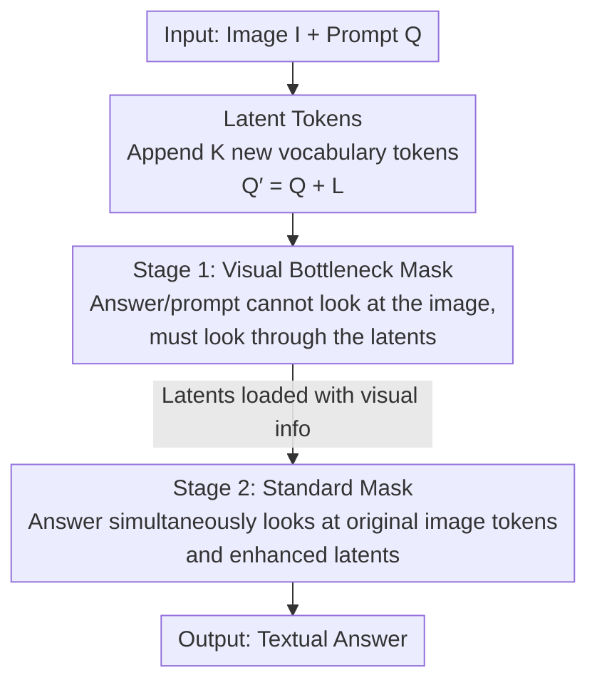

# Latent Implicit Visual Reasoning

**Conference**: CVPR 2026  
**Paper**: [CVF Open Access](https://openaccess.thecvf.com/content/CVPR2026/html/Li_Latent_Implicit_Visual_Reasoning_CVPR_2026_paper.html)  
**Code**: None  
**Area**: Multimodal VLM / Visual Reasoning  
**Keywords**: Implicit Visual Reasoning, latent token, visual bottleneck, LMM, unsupervised intermediate representation

## TL;DR
LIVR appends a set of learnable latent tokens to Large Multimodal Models (LMMs) and employs a "visual bottleneck" attention mask to force the answers to be generated through these tokens. This allows the model to learn task-beneficial visual abstractions **without any intermediate-step supervision**, consistently outperforming direct supervised fine-tuning (SFT) on 9 vision-intensive tasks and achieving state-of-the-art (SOTA) performance in multi-task and cross-dataset generalization.

## Background & Motivation
**Background**: Most modern LMMs adopt LLaVA-style architectures, where images are encoded by a visual encoder, mapped into the language model via a projector, and the model subsequently outputs text. Consequently, visual information is projected into the language space in a "one-off" manner at the start of the input, with all subsequent reasoning occurring purely on textual tokens.

**Limitations of Prior Work**: This paradigm introduces heavy **language bias**. For **vision-centric** tasks (e.g., counting, puzzle-solving, identifying the most similar images, finding visual correspondences), text-only representations struggle to capture the required spatially structured abstractions. Tasks that humans complete easily using mental imagery become difficult and ambiguous when description via language is forced.

**Key Challenge**: To make models more "visual", prior work has taken the path of **explicitly supervising intermediate steps** (e.g., predicting bounding boxes, image crops, depth maps, or helper images). However, this introduces a triple dilemma: (1) it requires extensive task-specific annotations, leading to high costs; (2) it **pre-defines** "what constitutes a useful intermediate visual representation," yet human-intuitive intermediate steps might not match the optimal representation for the model; (3) many tasks (e.g., artistic style, relative albedo, visual similarity) cannot easily define clear intermediate targets, rendering these methods poorly generalizable and difficult to scale to diverse tasks.

**Goal**: To design a **task-agnostic, intermediate-supervision-free** mechanism that allows LMMs to autonomously discover and utilize the most useful visual abstractions for the target task.

**Key Insight**: The authors draw insight from latent reasoning (such as Coconut, pause tokens)—specifically, that the latent space provides a more flexible internal representation than discrete text. By decoupling internal computation from external tokens, the model can refine its internal states purely for task optimization without being restricted by verbalizability. The distinction is that previous implicit visual reasoning methods (e.g., Mirage, LVR) still resort to explicit intermediate targets to train latents, whereas this work **imposes absolutely no intermediate supervision**.

**Core Idea**: To introduce a set of latent tokens to the model as an auxiliary "visual computation space," and implement a **visual bottleneck** via attention masking—forcing the generation of answers through these latents. This compels the latents to encode visual information, trained end-to-end solely using task loss, thereby implicitly learning task-adaptive visual abstractions.

## Method

### Overall Architecture
LIVR (Latent Implicit Visual Reasoning) is built upon standard LMMs (visual encoder + projector + language decoder), where the input consists of an image $I$ and a text prompt $Q$, and the output is a textual answer. It introduces only two modifications: (1) appending $K$ newly parameterized latent tokens after the prompt, changing the prompt from $Q$ to $Q' = Q + L$; (2) employing a **two-stage training** scheme paired with a **visual bottleneck attention mask** to force visual information to flow through these latent tokens. During training, the visual encoder and projector are completely frozen, the language backbone is fine-tuned using LoRA, and only the embedding rows corresponding to the $K$ latent tokens are unfrozen. The entire pipeline requires zero helper images, bounding boxes, or intermediate-step annotations, relying solely on question-answer pairs.

### Key Designs

**1. Latent Tokens: Providing the Model a "Visual Computation Scratchpad" Beyond Discrete Text**

The limitation is that once the visual information is projected into the language space, LMMs can only reason over textual tokens, bounding their expressiveness to discrete vocabularies. LIVR introduces $K$ special tokens $L=\{l_1,\dots,l_K\}$ outside the original vocabulary $V$, expanding the vocabulary to $V\cup L$, and appends them to the input during training. Crucially, **the model does not need to learn to generate these latent tokens**—they are directly appended to the sequence. The model only needs to learn **how to utilize** them to represent essential visual features. These tokens are randomly initialized, and their corresponding rows in the embedding table remain unfrozen during training, allowing them to freely adapt as carriers of visual abstraction. Compared to reusing pre-trained text tokens, the newly introduced latents have "no historical baggage" and are more easily shaped into abstract visual representations (this is verified in the ablation study).

**2. Visual Bottleneck Attention Mask: Forcing Visual Information to Flow Exclusively Through Latents**

Simply adding tokens is insufficient—if the answer tokens can still attend directly to the image, the model can easily bypass these latents. The core mechanism of LIVR is modifying the attention mask to act as a **bottleneck**: allowing the answer tokens to attend **only** to the prompt tokens $Q$ and latent tokens $L$, while preventing them from attending to the visual inputs $I$. To eliminate visual information leakage from the prompt side, prompt tokens $Q$ are also blocked from attending to the image $I$. Consequently, to answer correctly, the model's sole "window" to the image is this set of latents, forcing them to become a bottleneck for visual information. The authors argue that this provides two benefits: first, the latents are compelled to ingest visual information, offering "additional visual computation" that is more expressive than pre-trained text tokens; second, the model must focus on these visual latents to answer, thereby **alleviating language bias**. Attention visualizations indicate that these latents spontaneously attend to image regions highly relevant to the correct answer (such as semantically corresponding target points or objects to be counted), proving that they indeed learn meaningful visual structures without supervision.

**3. Two-Stage Training: Infusing Visuals into Latents First, Then Unifying Them**

If a standard mask is applied from the outset, the latents lack the pressure of "having to load visual information" and may be marginalized as ignorable noise. LIVR addresses this with a two-stage scheduling using a 2:3 ratio. **Stage 1 (Bottleneck Phase)** imposes the bottleneck mask described above, computing the loss with a standard NLL objective **only on the answer tokens**:

$$\mathcal{L} = -\frac{1}{|x|}\sum_{i=1}^{|x|}\log P(x_i \mid x_{<i})$$

Since the latents are the sole channel for the answer to view the image, this objective directly optimizes the latents to capture the most task-beneficial visual information. **Stage 2 (Joint Phase)** restores the standard mask—allowing answer tokens to simultaneously look at the original image tokens and the now "visually filled" latents, keeping the loss computation strictly on the answers. This stage teaches the model to **jointly leverage the original image and the enhanced latents** to answer. Ablation studies show that both the bottleneck and latents are indispensable: applying only latents without the bottleneck (latents-only) yields no improvement, and omitting either degrades performance; an epoch ratio of (4,6) is optimal, while pure Stage 2 training (0,10) degenerates to standard SFT.

### Loss & Training
Both stages utilize the NLL loss computed solely on the answer tokens (as shown in the formula above). For single-task experiments with 1k samples per task, LIVR is trained for 4 epochs in Stage 1 + 6 epochs in Stage 2 with $K=16$. For multi-task settings (6 tasks, 6k samples in total), a 2:3 ratio is maintained with 2+3 epochs. The language backbone is fine-tuned using LoRA (applied to attention and MLP blocks), while the vision encoder and projector are frozen, and only the embedding rows for the $K$ latent tokens are unfrozen. The checkpoint is selected based on the highest validation accuracy for single-task settings, and the final checkpoint is used for multi-task settings.

## Key Experimental Results

### Main Results
Single-task fine-tuning is evaluated on 9 vision-intensive tasks adapted from BLINK (counting, jigsaw puzzle, localization, visual correspondence, art style, semantic correspondence, functional correspondence, relative albedo, visual similarity). The primary comparison baseline is Direct SFT (same dataset, no intermediate supervision, clean control).

| Backbone Model | Setup | 9-Task Avg. Accuracy | Δ vs SFT |
|----------|------|------|------|
| Qwen2.5-VL-3B | Direct SFT | 61.61 | — |
| Qwen2.5-VL-3B | **LIVR (Ours)** | **67.85** | **+6.24** |
| Qwen3-VL-4B | Direct SFT | 74.12 | — |
| Qwen3-VL-4B | **LIVR (Ours)** | **77.55** | **+3.43** |
| LLaVA-OneVision-1.5-4B | Direct SFT | 63.70 | — |
| LLaVA-OneVision-1.5-4B | **LIVR (Ours)** | **69.30** | **+5.60** |

The improvements are particularly pronounced on tasks where "explicit intermediate representations are difficult to specify": on Qwen2.5-VL, jigsaw puzzles gained +12.00 and functional correspondence gained +13.02; on LLaVA-OneVision, functional correspondence surged by +27.40. In multi-tasking (Qwen3-VL-4B, 6 joint tasks), the average accuracy rose from 69.60 (SFT) to 72.37 (+2.77). Being task-agnostic, it can be applied directly without changing supervision for each task.

Cross-method comparisons are similarly compelling: on the VSP task, discarding helper images and using only $K=4$, LIVR achieves 66.00 on Qwen2.5-VL-3B, significantly outperforming Mirage's 46.00 (+20). On spatial reasoning benchmarks, LIVR-3B achieves 85.6 on SAT Val (compared to ViGoRL's 62.9) and 59.5 on BLINK-3 (the highest), all without employing text-CoT, explicit grounding, or RL.

### Ablation Study
Breakdown on three tasks (Localization / Sem. Corr. / Func. Corr.) using Qwen3-VL-4B-Instruct (Table 5):

| Configuration | Local. | Sem. Corr. | Func. Corr. | Description |
|------|--------|-----------|------------|------|
| Direct SFT | 79.51 | 61.15 | 58.90 | Baseline |
| **Ours (LIVR)** | **83.61** | **64.75** | **67.81** | Full model |
| Latents only (no mask) | 79.51 | 61.15 | 58.22 | Latents only without bottleneck $\rightarrow$ no effect |
| Mask only (no latents) | 80.33 | 61.16 | 59.59 | Bottleneck only but no latents $\rightarrow$ text tokens are hard to reshape |
| Input image twice (no mask) | 78.69 | 61.16 | 58.22 | Merely increasing visual compute is ineffective |
| Prompt tuning | 71.31 | 49.64 | 36.30 | Lightweight adaptation baseline, far underperforming |

Hyperparameter sensitivity: The Stage ratio $(S_1, S_2)$ is optimal at $(4,6)$, while $(0,10)$ degrades to SFT and $(8,2)$ is significantly worse. The number of latents $K$ is optimal at 16, whereas 4, 8, or 32 slightly underperform. Regarding masking strategy, "blocking both answer and prompt from seeing the image" outperforms blocking only the answer.

### Key Findings
- **Whether latents are truly utilized + whether they genuinely contain visual info**: Measuring the average attention from answers to latents, LIVR yields 0.076 while latents-only yields only 0.028. Removing latents during evaluation causes LIVR to drop from 83.61 to 76.23 (indicating reliance), whereas latents-only remains at 79.51 (learning to ignore them). When forcing the bottleneck mask during testing, LIVR still reaches 70.49, whereas latents-only plummets to near-random at 43.44—proving that LIVR's latents are indeed utilized and carry task-relevant visual information.
- **Bottleneck > Merely increasing compute**: Replicating image tokens twice as "additional visual computation" yields virtually no improvement, demonstrating that LIVR's gains stem from the visual abstractions compelled by the bottleneck, rather than simply having more compute.
- **Why not reuse text tokens**: The mask-only variant is inferior to LIVR because pre-trained text tokens already possess semantic priors, making them difficult to reshape into abstract visual representations, whereas newly introduced latents can adapt freely.

## Highlights & Insights
- **The "bottleneck-compelled learning" paradigm is elegant**: Instead of designing "what the latents should look like," the method cuts off the direct image-viewing channel of the answer, making "learning useful visual abstractions" an inevitable requirement for the model to answer correctly. Supervised signals are derived entirely from the final task loss, bypassing any intermediate annotations.
- **Task-agnosticity is the real game-changer**: Because it is not bound to any task-specific visual targets (e.g., depth maps, bounding boxes, helper images), the same method can be seamlessly transferred to multi-task joint fine-tuning, unlike explicit supervision methods that require swapping supervision targets for each task, hindering scalability.
- **Attention visualization provides interpretable evidence**: Latent-to-image attention spontaneously aligns with correct answer regions (such as the counted objects, corresponding points, and visual targets to be localized), substantiating the abstract concept of "implicitly learning visual structures."
- **Transferable concepts**: The mechanism of "introducing learnable tokens + using attention masks to create information bottlenecks + training end-to-end to end-task loss" can be generalized to any scenario where one wishes the model to learn internal intermediate representations but lacks explicit supervision targets (e.g., audio, 3D, cross-modal alignment).

## Limitations & Future Work
- "Although the hyperparameters ($K$, stage epoch ratio) are fixed across tasks, they were tuned based on ablation on only 3 tasks. The authors acknowledge that task-specific hyperparameter tuning could yield higher gains, indicating that the default configuration might not be optimal for every task."
- The interpretability of the latents remains post-hoc: attention maps still contain attention sinks, and "what the latents actually encode" is more of an observation than a controllable/verifiable mechanism.
- Evaluations are clustered on BLINK-style perception tasks and several spatial reasoning benchmarks. Its efficacy on longer-chain, multi-step compositional reasoning visual tasks (as opposed to single-step perceptual abstraction) remains unverified.
- The approach strictly follows a fixed "bottleneck first, then release" two-stage schedule. Whether it can be formulated as a single-stage, adaptive switch, or dynamically annealed bottleneck strength is left for future exploration.

## Related Work & Insights
- **vs. Textual visual reasoning (LLaVA-CoT / Visual-RFT / Vision-R1)**: These methods express all intermediate reasoning in text, struggling to form spatially structured visual abstractions beyond reportable language. LIVR places intermediate reasoning in the latent space, bypassing the bottleneck of "whether it can be verbalized."
- **vs. Visual token recycling (Visual CoT / Pixel Reasoner / ViGoRL)**: These predict bounding boxes and then feed visual crops back into the reasoning chain, which restricts expressiveness to the original input tokens and heavily relies on hand-crafted cropping and explicit supervision. LIVR neither crops nor requires coordinate supervision, significantly outperforming ViGoRL on spatial reasoning tasks like SAT and BLINK.
- **vs. Intermediate visual representations (Mirage / LVR / Aurora)**: These methods employ explicit intermediate targets (e.g., helper images, depth maps, reconstructed embeddings) to train latents, which are expensive to annotate and lack well-defined targets for many tasks. LIVR discards intermediate targets entirely, outperforming Mirage by +20 on the VSP task without helper images, and matching or exceeding LVR on MMVP/V*/BLINK with less data.
- **vs. Pure latent-space reasoning (Coconut / pause tokens)**: That line of work leverages latent states/pause tokens to expand computation in text-only LLMs. LIVR applies this idea to the joint vision-text state of LMMs, specifically shaping **visual** abstractions via a visual bottleneck.

## Rating
- Novelty: ⭐⭐⭐⭐⭐ Formulating 'unsupervised learning of visual abstraction' driven strictly by end-to-end task loss via an attention bottleneck is an elegant and uncommon approach.
- Experimental Thoroughness: ⭐⭐⭐⭐⭐ Comprehensive evaluation across 3 backbones $\times$ 9 tasks + multi-task settings + 4 sets of cross-method comparisons + thorough ablation studies, with particularly solid control experiments validating whether latents "are used" and "carry information."
- Writing Quality: ⭐⭐⭐⭐ Motivation and mechanisms are clearly articulated, and the attention visualizations are convincing; however, some implementation details are relegated to the Appendix.
- Value: ⭐⭐⭐⭐⭐ Task-agnostic, requires no intermediate annotations, and can be directly integrated into existing LMM fine-tuning, demonstrating strong practicality.

<!-- RELATED:START -->

## Related Papers

- [\[CVPR 2026\] StaR-KVQA: Structured Reasoning Traces for Implicit-Knowledge Visual Question Answering](star-kvqa_structured_reasoning_traces_for_implicit-knowledge_visual_question_ans.md)
- [\[CVPR 2026\] Monet: Reasoning in Latent Visual Space Beyond Image and Language](monet_reasoning_in_latent_visual_space_beyond_image_and_language.md)
- [\[ICLR 2026\] Latent Visual Reasoning](../../ICLR2026/vlm_reasoning/latent_visual_reasoning.md)
- [\[CVPR 2026\] Machine Mental Imagery: Empower Multimodal Reasoning with Latent Visual Tokens](machine_mental_imagery_empower_multimodal_reasoning_with_latent_visual_tokens.md)
- [\[ACL 2026\] Forest Before Trees: Latent Superposition for Efficient Visual Reasoning](../../ACL2026/vlm_reasoning/forest_before_trees_latent_superposition_for_efficient_visual_reasoning.md)

<!-- RELATED:END -->
