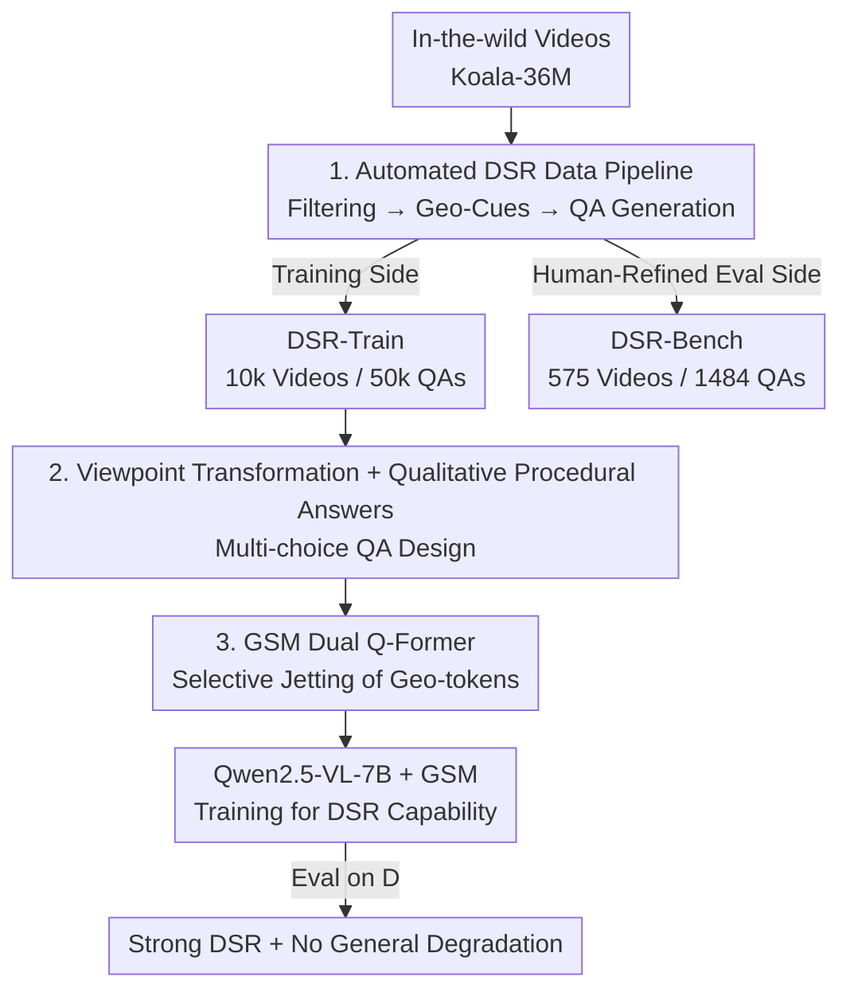

# Learning to Reason in 4D: Dynamic Spatial Understanding for Vision Language Models

**Conference**: CVPR 2026  
**Paper**: [CVF Open Access](https://openaccess.thecvf.com/content/CVPR2026/html/Zhou_Learning_to_Reason_in_4D_Dynamic_Spatial_Understanding_for_Vision_CVPR_2026_paper.html)  
**Code**: https://github.com/TencentARC/DSR_Suite  
**Area**: Multimodal VLM / Spatial Reasoning  
**Keywords**: Dynamic Spatial Reasoning, 4D Understanding, VLM, Q-Former, Video Question Answering Dataset  

## TL;DR
Addressing the common failure of VLMs in "dynamic spatial reasoning" (understanding how objects move/change relative relationships in 3D space over time), this paper proposes DSR Suite: an automated pipeline using visual foundation models to generate multiple-choice QAs with geometric cues from in-the-wild videos, constructing the training set DSR-Train and a human-refined evaluation benchmark DSR-Bench. Furthermore, it designs a lightweight Geometric Selection Module (GSM) (dual Q-Former) to inject "question-relevant" 3D priors into Qwen2.5-VL-7B, substantially outperforming all competitors on DSR-Bench with 58.9% (vs. 38.4% for the runner-up) while preserving general video understanding capabilities.

## Background & Motivation
**Background**: VLMs have achieved strong performance on general video understanding. However, to serve interactive systems such as robotics, autonomous driving, AR/VR, and embodied AI, they must perform spatial reasoning in dynamic environments—specifically, understanding how object geometry and mutual relationships evolve over time in 3D space (dynamic spatial reasoning, DSR).

**Limitations of Prior Work**: Existing 3D spatial reasoning works are mostly constrained to two corners. First, on the **data side**: most focus solely on static scenes (objects do not move) or short temporal horizons with only two image frames. The few works addressing dynamic scenes suffer from single scenarios (autonomous driving or human-object interaction), narrow question types, and coarse-grained answers, and they generally lack training data, leaving models without sufficient supervision. Second, on the **model side**: existing methods directly apply cross-attention or brute-force concatenation of geometric features from 3-D foundation models (e.g., CUT3R, VGGT) with visual tokens. This injects a huge chunk of task-specific features, leading to severe performance drops on spatial-irrelevant general benchmarks—sacrificing general capability for DSR.

**Key Challenge**: Reconstructing in-the-wild videos with 3D foundation models yields massive amounts of noisy and question-irrelevant geometric cues. Stuffing all of them into the VLM overwhelms the model, causing task overfitting and degradation of general capability. This introduces a trade-off between "more and more accurate geometric priors" and "preservation of general capability."

**Goal**: To comprehensively open up DSR across three levels: data, benchmark, and model. Specifically, (1) to scale up the generation of DSR training data; (2) to establish an evaluation benchmark covering multiple objects, multiple viewpoints, and fine-grained details; and (3) to construct a model that injects geometric priors without hurting general capabilities.

**Key Insight**: While absolute scale cannot be reliably estimated from in-the-wild monocular videos, relative (non-metric) 3D structures are sufficient to support qualitative, trend-based QAs such as "growing larger/smaller, moving left/right, speed up/down"—which are both faithful and scalable to annotate. On the model side, we bet that "question-relevant geometry only accounts for a small fraction," using text to selectively retrieve geometric knowledge rather than injecting everything.

**Core Idea**: Automating the generation of qualitative DSR QAs (DSR-Train/Bench) from in-the-wild videos using visual foundation models, and then using a dual Q-Former to compress "question-relevant" geometric priors into a fixed small number of tokens injected into the VLM.

## Method

### Overall Architecture
DSR Suite consists of two major parts: On the **data side**, an automated pipeline translates in-the-wild videos into multiple-choice QAs with geometric supervision, producing the large-scale training set DSR-Train (10,000 videos) and the human-curated benchmark DSR-Bench (575 videos, 1,484 questions). On the **model side**, the Geometric Selection Module (GSM) is built on top of Qwen2.5-VL-7B. During training, it selectively injects geometric tokens extracted from the 3D foundation model $\pi^3$ into the LLM guided by text queries. The data pipeline runs serially in three stages: video filtering $\rightarrow$ geometric cue extraction $\rightarrow$ QA generation. The model is fine-tuned on DSR-Train to acquire DSR capabilities while maintaining general video understanding.

### Key Designs

**1. Automated 4D Data Generation Pipeline: "Translating" in-the-wild videos into qualitative QAs with geometric supervision using visual foundation models**

The fundamental bottleneck of DSR is the lack of scalable training data with 3D supervision. This paper constructs a three-stage automated pipeline to generate data. **Stage 1: Video Filtering**: Starting with the Koala-36M in-the-wild video library, a large portion of videos have almost no object displacement (only joint micro-movements), making them unsuitable for DSR. For the training side, DeepSeek-R1 is used to filter based on captions; for the evaluation side, Gemini-2.5-Pro is used to inspect video contents directly for more reliable screening, keeping clips of 20s–120s to obtain 10,000 training videos and 575 evaluation videos. **Stage 2: Geometric Cue Extraction**: The key engineering trade-off is acknowledging that absolute metric scale cannot be reliably obtained from monocular videos, so foundation models that produce relative-scale reconstructions are utilized. At the scene level, $\pi^3$ is used to estimate camera poses and local point clouds. At the object level, DeepSeek-R1 (guided by captions) segment agents/non-agents, and Grounded SAM2 is applied for tracking and segmentation to obtain temporally consistent masks. The masks are projected back to the point clouds, and the mean of the points is taken as the 3D center of each object at each frame, forming smooth 3D trajectories. For agents, Orient Anything is used to estimate azimuth/pitch/roll, whereas non-agents are bypassed to avoid noisy estimations. Geometries of inconsistently visible objects are clipped to ensure reliability. **Stage 3: QA Generation**: QAs are synthesized based on this compact geometric base (camera poses, 3D trajectories, 3D centers, agent orientations) (see Design 2). The QAs in DSR-Bench are further human-curated to ensure correctness. This pipeline allows "4D supervision" to sprout from in-the-wild videos at scale and low cost for the first time.

**2. Viewpoint Transformation + Qualitative Procedural Answers: Forcing questions to test "dynamic, multi-object, cross-viewpoint" relations rather than single-frame snapshots**

Having geometry is not enough; how questions are asked dictates whether a benchmark truly evaluates DSR. This paper focuses on two aspects. First, **viewpoint transformation**: spatial intelligence naturally depends on the observer's viewpoint. Here, viewpoint varies along two dimensions: it can originate from the camera or a specific agent, and it can **evolve over time (relative viewpoint)** based on agent motion or stay **fixed at a specific frame (absolute viewpoint)**. The 3D centers of all objects are transformed into the selected reference frame using camera poses and the agent's orientation, which enables questions requiring **egocentric $\leftrightarrow$ allocentric coordinate transformation**, rather than passive observation. The Cartesian product of viewpoints $\times$ 6 question types forms 12 template-based QA categories, plus 1 non-template category. Second, **qualitative procedural answers**: since monocular reconstruction only yields relative scale and humans struggle to consistently judge metric values, the options are designed to be qualitative (combinations of basic options like larger/smaller, left/right, front/back). Correct answers are obtained by comparing the queried attribute between every 2 adjacent frames to get a basic state, and then consecutive identical states are merged into a concise "procedural" answer that reflects the **evolution process** of attributes over time instead of single-frame results. Beyond templates, DeepSeek-R1 is used to automatically generate non-template open-ended questions based on trajectories, object identities, and viewpoints, expanding linguistic and reasoning diversity. This formulation maps directly to the five key differences highlighted in the paper: in-the-wild video sources, object+scene-level 3D requirements, viewpoint transformation, multi-object interaction, and fine-grained procedural answers. Quantitatively, the "procedural answer proportion" in DSR-Bench reaches 78%, which is dramatically higher than the 2%–22% of previous benchmarks.

**3. GSM Geometric Selection Module: Dual Q-Former using text to "pick" question-relevant geometry to avoid overwhelming VLM with noise**

Directly injecting all geometric features from 3D foundation models into the VLM compromises general video understanding (Video-MME falls from 60.2 to 48.6) due to noisy in-the-wild geometric cues that are mostly irrelevant to the queried question. GSM addresses this by **retrieving only a tiny subset of task-relevant geometries**. Given a video, we first compute VLM visual tokens $T_{vis}$, text query tokens $T_{text}$, and 3D tokens $T_{3D}$ extracted by applying the $\pi^3$ encoder on video frames. GSM utilizes two stacked Q-Formers to produce a fixed number of $N$ geometric tokens. First, the **Semantic Condenser** uses $N$ learnable queries to attend to text tokens $T_{text}$, distilling the question semantics into language-conditioned query embeddings $Q_{lang}\in\mathbb{R}^{N\times d}$. Second, the **Relevant-Geometry Selector** lets $Q_{lang}$ attend to 3D tokens $T_{3D}$ to extract only the question-relevant geometry, yielding compact geometric tokens $Q_{geo}\in\mathbb{R}^{N\times d}$. Since $N$ is fixed (set to 32 in experiments), the LLM receives a **bounded, task-aligned** geometric summary, bypassing direct exposure to the variable-length, long, and noisy $T_{3D}$. Finally, the geometric tokens are concatenated with visual and textual tokens:

$$\tilde{T}_{total} = [\,T_{vis}\,;\,Q_{geo}\,;\,T_{text}\,]$$

and fed into the LLM. This "late, compact" fusion scheme injects crucial geometric priors while fully preserving the general reasoning ability of the VLM. GSM also offers three benefits: architecture-agnostic (pluggable into different VLM backbones and geometric encoders), parameter-efficient (fixed $N$ queries), and robust to question lengths (language compression normalizes variable-length $T_{text}$).

## Key Experimental Results

The base model is Qwen2.5-VL-7B + GSM, trained on 50K QAs from DSR-Train for 1 epoch (GSM query size $N=32$, learning rate $2\times10^{-7}$, batch size 32, frozen visual encoder).

### Main Results
Comparison of average accuracy across 13 sub-tasks on DSR-Bench (selected representative models):

| Model | Category | DSR-Bench Avg |
|------|------|------|
| GPT-4o | Closed-source | 26.4 |
| Gemini-2.5-Pro | Closed-source | 31.7 |
| GPT-5 | Closed-source | 30.8 |
| Qwen2.5-VL-7B | General (Base) | 23.5 |
| Qwen3-VL-30B-A3B | General | 31.1 |
| InternVL3.5-38B | General | 26.7 |
| VLM-3R | Spatial Reasoning | 31.4 |
| VG-LLM | Spatial Reasoning (Runner-up) | 38.4 |
| **Ours (Qwen2.5-VL-7B+GSM)** | Ours | **58.9** |

Key Observation: Non-spatial-specialized models (including GPT-5 and Gemini-2.5-Pro) perform marginally above random guess, indicating that DSR itself is extremely challenging. Even spatial reasoning models struggle due to their reliance on static scene training. Ours, using a 7B model, outperforms all closed-source LLMs/VLMs by approximately 27 percentage points, highlighting the necessity of dedicated DSR training data.

### Ablation Study
Comparison of different training paradigms (trained on a randomly sampled subset of 20K QAs from DSR-Train for efficiency):

| Training Method | DSR-Bench | VLM4D | STI-Bench | Video-MME | Avg. |
|----------|-----------|-------|-----------|-----------|------|
| Baseline (Original Qwen2.5-VL-7B) | 23.5 | 43.1 | 33.2 | 60.2 | 40.0 |
| SFT (Direct FT, no geometry) | 54.4 | 46.7 | 34.6 | 60.1 | 48.9 |
| Addition (Direct sum of 3D tokens) | 57.7 | 48.5 | 35.3 | **48.6** | 47.5 |
| **GSM** | 57.4 | 48.3 | 35.2 | 59.9 | **50.2** |

Ablation on the number of learnable queries (trained on 20K subset):

| Query Count | DSR-Bench | Video-MME | Avg. |
|----------|-----------|-----------|------|
| 8 | 55.7 | 59.9 | 49.3 |
| 16 | 56.9 | 60.0 | 49.8 |
| 32 | 57.4 | 59.9 | 50.2 |
| 64 | 57.6 | 59.2 | 50.0 |

### Key Findings
- **GSM thrives in having the best of both worlds**: Addition yields a slightly higher score on DSR-Bench (57.7 vs 57.4) but crashes Video-MME to 48.6. GSM maintains comparable performance on DSR while stabilizing Video-MME at 59.9, achieving the highest overall Avg (50.2). This illustrates the core difference between selective injection and blind full-context injection.
- **The data itself is highly effective**: Even with pure SFT (no geometry), DSR-Bench accuracy surges from 23.5 to 54.4, with concurrent gains on other dynamic spatial benchmarks like VLM4D and STI-Bench. This indicates that the supervision signals in DSR-Train are highly transferable.
- **Query count functions as a trade-off dial**: More queries boost DSR but degrade general comprehension. At 64 queries, Video-MME drops to 59.2, reducing the overall average, which designates 32 as the optimal balance point.
- **Scalability of data scale**: Increasing the training set from 5K $\rightarrow$ 10K $\rightarrow$ 20K $\rightarrow$ 50K smoothly pushes DSR-Bench performance from 47.3 to 58.9, showing no signs of saturation.

> ⚠️ Note: Ours in the main table (58.9) is trained on the full 50K dataset, while GSM in the ablation Table 5 (57.4) is trained on the 20K subset. They should not be compared directly.

## Highlights & Insights
- **"Embracing the lack of absolute scale" powers scalability**: Giving up on metric 3D in favor of qualitative and trend-based QAs avoids the complete infeasibility of metric depth estimation in-the-wild, and makes the generated answers naturally faithful and constructable. This is a crucial engineering insight for scaling up spatial/geometric datasets.
- **Procedural answers are a smart trick to solidify "dynamics"**: Comparing adjacent frame pairs and merging sequential identical states forces the model to reason about continuous updates rather than single-frame snapshots. Calculating a 78% "procedural answer proportion" via DeepSeek-R1 provides hard evidence that the benchmark surpasses prior arts.
- **The dual Q-Former's "semantic compression before geometric selection"** can be extended to any scenario where we want to "inject large-scale modal priors but fear overwhelming the backbone" (e.g., injecting depth/normal/optical flow priors, retrieval-augmented knowledge injection). Essentially, it filters modal features based on textual queries before performing fixed-length fusion.

## Limitations & Future Work
- **Heavily relies on a pipeline of visual foundation models**: Errors in any component ($\pi^3$, Grounded SAM2, Orient Anything, or DeepSeek-R1/Gemini) can propagate and contaminate data. Bypassing orientations of non-agent objects and clipping inconsistently visible objects limits coverage of complex occlusions and fast out-of-frame motions.
- **Only supports qualitative answers**: It lacks support for downstream tasks requiring precise metric values (e.g., "how many meters did the distance change" or "what is the velocity"), which are crucial for fine-grained robot manipulation. Relative scale remains its ceiling.
- **Abs/Rel Dir Pred sub-tasks remain weak**: Performance on direction prediction tasks (Abs Dir Pred at 35.5, Rel Dir Pred at 35.1) is significantly lower than other sub-tasks, indicating that forward-looking dynamic trajectory forecasting is still a hard nut to crack.
- **The gain from GSM is relatively moderate, and a tension exists with general capacity**: Slightly larger query counts impair general understanding, restricting the capacity of injected features. The fusion occurs via late concatenation, lacking a deeply integrated interaction between geometry and vision.

## Related Work & Insights
- **vs VG-LLM / VLM-3R (spatial reasoning models)**: They directly apply cross-attention or summation to inject the entire 3D foundation model features into visual tokens. In contrast, this paper uses GSM to perform query-guided selective retrieval. The core difference is "full-input vs selective," leading to a massive gain on DSR (58.9 vs 38.4) while preserving general capabilities—though it still depends heavily on the quality of external geometric encoders.
- **vs DynSuperCLEVR / VLM4D / STI-Bench (dynamic spatial benchmarks)**: They predominantly focus on synthetic/driving/single-object scenes with camera viewpoints and coarse answers. Our DSR-Bench addresses in-the-wild, multi-object challenges with viewpoint transformations, strong 3D requirements, and fine-grained procedural answers. Quantitative analysis shows a high 3D focus and a 78% procedural answer ratio, representing a much more comprehensive DSR evaluation.
- **vs Pure SFT Data Injection**: While fine-tuning with DSR-Train alone brings significant gains, this paper further shows that pairing data with GSM is key to achieving "strong specialization + stable generalization." This suggests that data and injection mechanisms must be co-designed.

## Rating
- Novelty: ⭐⭐⭐⭐ The data pipeline ("qualitative + procedural + viewpoint transformed") and the dual Q-Former selective injection are not entirely new components individually, but their combination systematically bridges the data-benchmark-model trifecta for DSR.
- Experimental Thoroughness: ⭐⭐⭐⭐⭐ Comprehensive evaluation against 15+ models (including GPT-5/Gemini-2.5-Pro) alongside comprehensive ablations on training paradigms, query counts, and dataset scales. The benchmark is thoroughly analyzed via quantitative 3D-demands and answer granularity.
- Writing Quality: ⭐⭐⭐⭐ Highly logical, with clear explanations of motivations and trade-offs. Minor equations/spelling flaws exist (e.g., "GSW", "cam").
- Value: ⭐⭐⭐⭐⭐ Directly fills the training and benchmarking void for 4D dynamic spatial reasoning. It acts as an infrastructure-level contribution for embodied AI, autonomous driving, and AR, with fully open-sourced code.

<!-- RELATED:START -->

## Related Papers

- [\[CVPR 2026\] Thinking in Dynamics: How Multimodal Large Language Models Perceive, Track, and Reason Dynamics in Physical 4D World](thinking_in_dynamics_how_multimodal_large_language_models_perceive_track_and_rea.md)
- [\[CVPR 2026\] R4: Retrieval-Augmented Reasoning for Vision-Language Models in 4D Spatio-Temporal Space](r4_retrieval-augmented_reasoning_for_vision-language_models_in_4d_spatio-tempora.md)
- [\[CVPR 2026\] MoE-GRPO: Optimizing Mixture-of-Experts via Reinforcement Learning in Vision-Language Models](moe-grpo_optimizing_mixture-of-experts_via_reinforcement_learning_in_vision-lang.md)
- [\[CVPR 2026\] SpatiaLQA: A Benchmark for Evaluating Spatial Logical Reasoning in Vision-Language Models](spatialqa_a_benchmark_for_evaluating_spatial_logical_reasoning_in_vision-languag.md)
- [\[CVPR 2026\] Think Visually, Reason Textually: Vision-Language Synergy in Abstract Reasoning](think_visually_reason_textually_vision-language_synergy_in_abstract_reasoning.md)

<!-- RELATED:END -->
