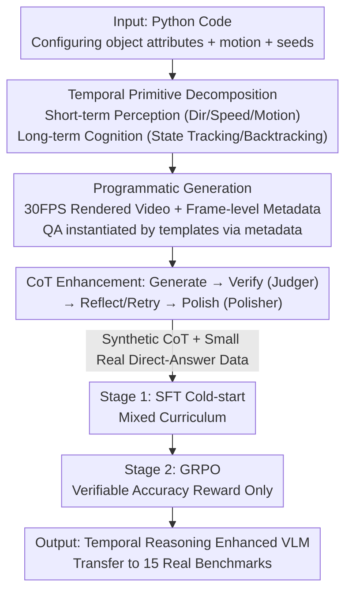

# Learning Transferable Temporal Primitives for Video Reasoning via Synthetic Videos

**Conference**: CVPR 2026  
**Paper**: [CVF Open Access](https://openaccess.thecvf.com/content/CVPR2026/html/Jiang_Learning_Transferable_Temporal_Primitives_for_Video_Reasoning_via_Synthetic_Videos_CVPR_2026_paper.html)  
**Code**: https://github.com/jiangsongtao/Synthetic-Video  
**Area**: Video Understanding / Multimodal VLM  
**Keywords**: Temporal Reasoning, Synthetic Video, Temporal Primitives, Data-efficient, GRPO

## TL;DR
This paper proposes SynRL: a method to teach VLMs "temporal primitives" (direction, speed, state tracking, etc.) using synthetic videos (geometric movements/state changes) generated entirely via code. The core finding is that basic temporal skills learned from abstract synthetic videos can be **directly transferred** to real-world videos. Using only ~7.7K synthetic CoT samples, the model achieves comprehensive improvements across 15 benchmarks, even outperforming Video-R1 which uses 165K real samples (approximately 21× data efficiency).

## Background & Motivation
**Background**: As VLMs evolve from static image understanding to video understanding, models are required to transition from "identifying static patterns" to "reasoning about temporal dynamics"—such as motion trajectories, velocity changes, and state transitions. RL post-training (e.g., GRPO) is a promising path to enhance these capabilities.

**Limitations of Prior Work**: High-quality video data with temporal annotations is scarce, forcing existing methods to **rely on proprietary models** (GPT-4V, Gemini-2.5-Pro) to synthesize training data (QA or CoT annotations). However, two critical issues exist: (1) **Proprietary models suffer from systematic errors in basic temporal perception**—Figure 1 shows Gemini-2.5-Pro incorrectly describing trajectories of simple geometric shapes or reversing motion directions. Such "fluent-but-wrong" annotations **inject** errors into training data, teaching a similar "fluent-but-wrong" reasoning style. (2) Existing video datasets **lack temporal centrality**, as many questions can be answered from a single key frame, allowing models to bypass true temporal integration via static pattern matching.

**Key Challenge**: The difficulty lies in obtaining high-quality, temporal-centric training data and supervision signals without relying on proprietary models.

**Goal**: Obtain high-quality, **temporal-centric** training data without proprietary model dependency and enable models to learn transferable temporal capabilities.

**Key Insight**: Since "generating videos via code" provides full control over ground truth metadata (state snapshots, event timestamps, operation sequences), **programmatic generation** of synthetic videos can bypass the perceptual errors of proprietary models. Furthermore, questions are specifically designed to be "unanswerable from a single frame," naturally satisfying temporal centrality. The key hypothesis: **abstract temporal primitives** such as direction, speed, and state tracking learned in simple geometric scenes can transfer to real-world videos.

**Core Idea**: Decompose temporal understanding into **learnable temporal primitives** and use programmatically synthesized videos (with ground truth) for SFT + RL post-training, facilitating the transfer of primitives from synthetic to real domains—establishing a new paradigm of "synthetic data is more cost-effective" for video post-training.

## Method

### Overall Architecture
SynRL is a three-stage pipeline: **Programmatic Generation** of synthetic videos (with frame-level ground truth covering short-term perception and long-term cognition primitives) → **CoT Enhancement** (generating reasoning chains conditioned on metadata, filtered via verify-reflect-polish iterations) → **Two-stage Training** (SFT cold-start on CoT, followed by GRPO with verifiable rewards). The most innovative aspect of this pipeline is that ground truth is derived entirely from code simulation logs (e.g., collision counts from event counters, trajectory shapes from positional analysis, rotation counts from cumulative angular displacement), ensuring strictly correct supervision signals without proprietary model "perception."

### Key Designs

**1. Temporal Primitive Decomposition: Short-term Perception + Long-term Cognition**

To address the lack of temporal centrality in existing data, the authors decompose temporal understanding into two layers of learnable primitives. **Short-term perception primitives** test basic motion perception within short windows, implementing 12 synthetic video types: collision counting, direction recognition, trajectory shape recognition (linear/circular/zigzag), velocity perception, motion counting, attribute change detection, rotation perception, relative position tracking, acceleration detection, speed comparison, distance estimation, and temporal event ordering. **Long-term cognition primitives** test continuous reasoning over long sequences, implemented across 6 scenarios: abstract data structure tracking (card stacks/chip containers/file systems/math symbol operations), grid object tracking with occlusion (e.g., shell game), and backtracking identity inference (e.g., sliding number puzzles requiring reverse reasoning). Long-term videos are modeled as state transition sequences $\{S_t, o_t, S_{t+1}\}$: **only the initial or final state is shown**, but the operation sequence is visible throughout, forcing the model to simulate the complete state evolution internally rather than relying on visual comparison. In total, the paper specifies 8 major categories and 18 subcategories (Figure 3).

**2. Programmatic Generation + Frame-level Ground Truth**

This is the fundamental approach to bypass proprietary model errors. Object attributes (shape, color, size, position, velocity) are initialized in Python, positions are updated via basic physical equations, boundary collisions are determined by geometric intersection tests, and rotation angles are accumulated. Key events are marked with frame-level timestamps. Ground truth answers are **calculated directly from simulation logs** without any model perception. Short-term videos are rendered using Matplotlib at 30 FPS with H.264 encoding; long-term videos consist of initial reveal (2s), operation animation (0.5–1s per step), and final reveal (2s), synthesized with FFmpeg. Multiple-choice distractors are automatically generated by applying random alternative operations to the correct state. Since questions are designed to be unanswerable from a single frame, the data is inherently temporal-centric.

**3. Four-phase CoT Enhancement Loop: Generate-Verify-Reflect-Polish**

QA pairs alone are insufficient; the model must be taught **how to reason step-by-step**. Given synthetic videos + code-exported metadata (frame-level events, millisecond timestamps, state snapshots, operation sequences) + ground truth, high-quality CoT is constructed in four phases: (1) **Generate**—Using a Multimodal LLM (Qwen3-VL-235B-A22B) to generate human-like reasoning chains that explicitly reference timestamps (e.g., "at 00:00", "at 00:02") based on metadata. (2) **Verify**—An LLM judge (Qwen3-235B-A22B) checks if the CoT reaches the correct answer and aligns accurately with the event timeline. (3) **Reflect**—If verification fails, feedback regarding inconsistencies is sent back to the generator for a retry (up to 5 rounds); otherwise, the sample is discarded. (4) **Polish**—Verified chains are polished to be more natural and fluent while retaining all logic and temporal dependencies. This metadata-conditioned, iterative filtering ensures CoT is both correct and temporally aligned.

**4. Two-stage Training: Mixed Curriculum SFT + Verifiable Reward GRPO**

(Note: Data scales vary slightly across text sections; estimates are ~6.7K–7.7K CoT + 7K RL, or 5K SFT + 5K RL per Section 3.2). **Stage 1 SFT**: Teaches the model step-by-step temporal reasoning using generated CoT. To prevent distribution drift and maintain general video understanding, a **mixed curriculum** is used: synthetic temporal videos provide full CoT supervision, mixed with ~15% general video data from LLaVA-Video providing **direct-answer supervision only** (to avoid propagating potential reasoning errors in general data). **Stage 2 GRPO**: Since the model can already generate structured reasoning, RL focuses purely on **correctness**. GRPO is performed on synthetic videos using **accuracy rewards** only. The verifiability of synthetic data ensures reward signals are strictly correct. Implementation uses the VeRL framework with KL regularization and entropy loss disabled for aggressive updates, batch size 512, lr $1\times10^{-6}$, and 8 candidates sampled per prompt.

## Key Experimental Results

### Main Results
Evaluated on 15 video benchmarks covering temporal localization, complex reasoning, and general video understanding. SynRL (applied to Qwen3-VL-4B/8B) shows consistent improvements (Accuracy %; ↑ denotes relative gain over base):

| Benchmark | Qwen3-VL-4B | +SynRL | Qwen3-VL-8B | +SynRL |
|------|-------------|--------|-------------|--------|
| TOMATO (Complex Reasoning) | 32.1 | 36.7 ↑4.6 | 33.2 | 38.1 ↑4.9 |
| Video-TT | 38.9 | 40.7 ↑1.8 | 40.6 | 41.5 ↑0.9 |
| MVBench | 65.4 | 67.1 ↑1.7 | 67.2 | 69.1 ↑1.9 |
| VideoMME | 60.9 | 62.0 ↑1.1 | 63.4 | 65.2 ↑1.8 |
| vinoground | 40.8 | 43.2 ↑2.4 | 43.4 | 47.6 ↑4.2 |
| AoTBench | 52.7 | 54.4 ↑1.7 | 54.8 | 57.7 ↑2.9 |

Temporal Localization (RexTime / Charades-STA, most significant gains):

| Benchmark / Metric | Qwen3-VL-4B | +SynRL | Gain |
|------|------|------|------|
| RexTime R@0.3 | 26.2 | 38.8 | ↑12.6 |
| RexTime mIoU | 20.9 | 28.9 | ↑8.0 |
| NExTGQA mIoU | 23.5 | 28.1 | ↑4.6 |
| Charades-STA R@0.3 | 65.1 | 73.7 | ↑8.6 |
| Charades-STA mIoU | 41.9 | 47.0 | ↑5.1 |

### Data Efficiency Comparison

| Training Data | Scale | Type | Conclusion |
|------|------|------|------|
| Video-R1 CoT | 165K | Real Video | Baseline |
| SynRL CoT | ~7.7K | Synthetic Geometric Video | Achieves superior results with ~1/21 the data (approx. 21× efficiency) |

### Key Findings
- **Temporal localization sees the largest gain**: RexTime R@0.3 +12.6 and Charades-STA R@0.3 +8.6 indicate that frame-level timestamps from code + explicit temporal CoT teach precise "event-to-frame" mapping, which transfers to real human activity videos.
- **Abstract-to-Real transfer is valid**: Although trained on simple geometric shapes, the model improves on real-world benchmarks involving human actions, camera motion, and complex scenes. This confirms that basic skills like "frame-by-frame tracking" and "speed comparison" are transferable.
- **No loss of general capabilities**: Performance on general benchmarks like MVBench and VideoMME is maintained or improved, thanks to the inclusion of direct-answer general data in the mixed curriculum.

## Highlights & Insights
- **Code as "Perfect Labeler"**: Ground truth derived from simulation logs instead of model perception eliminates "fluent-but-wrong" annotation noise. This approach is generalized to any task requiring verifiable temporal or spatial ground truth.
- **Counter-intuitive "Simple Training, Strong Transfer" Conclusion**: Learning direction and speed from geometric balls improves temporal localization in real videos. Abstracting "temporal capability" into primitives for transfer is a highly insightful paradigm, suggesting video post-training needn't rely solely on expensive real data.
- **Reusable CoT Verification Loop**: The Judger + Reflection + Polisher triad (with up to 5 retries) provides a general pipeline for automated high-quality CoT data generation that can be applied to other domains requiring verifiable reasoning chains.

## Limitations & Future Work
- ⚠️ **Data scale inconsistencies in the original text** (Abstract suggests 7.7K CoT/7K RL, Introduction suggests 6.7K CoT + 1K Real = 7.7K, Section 3.2 suggests 5K+5K). These may be OCR or versioning errors; refer to official code/paper for precision.
- Synthetic videos use abstract shapes and lack real-world textures, lighting, and complex semantics. While basic primitives transfer well, evidence is less direct for temporal tasks relying on rich semantic priors (e.g., fine-grained human intent).
- Future Work: Extending synthetic primitives from geometric motion to semantic programmatic scenes (e.g., skeletal animations) or applying "verifiable ground truth" to longer, complex multi-event narrative videos to further close the synthetic-real gap.

## Related Work & Insights
- **vs Video-R1**: Both use SFT cold-start + RL. However, Video-R1 uses 165K real video CoT, while SynRL outperforms it with ~7.7K synthetic CoT. The core difference is the **data source**—programmatic synthesis ensures correct ground truth and temporal centrality, yielding ~21× data efficiency.
- **vs Video-Jigsaw**: Video-Jigsaw uses RL on 100K shuffled videos to enhance temporal understanding. SynRL avoids proxy tasks like "unshuffling" and instead uses explicit synthetic videos with ground truth to teach primitives (direction/speed/state), resulting in more precise supervision.
- **vs Proprietary Model Annotation**: This paper argues against relying on proprietary models for annotation. Figure 1 proves they suffer from systematic temporal perception errors that pollute datasets; programmatic generation avoids this at the source.

## Rating
- Novelty: ⭐⭐⭐⭐⭐ "Synthetic video for transferable temporal primitives" is a highly novel and counter-intuitive paradigm.
- Experimental Thoroughness: ⭐⭐⭐⭐ Solid results across 15 benchmarks and 2 base models with data efficiency comparisons. Ablations on primitive contributions/curriculum ratios are relatively brief.
- Writing Quality: ⭐⭐⭐⭐ Motivation and pipeline are clear, though data scale discrepancies require careful referencing of the source.
- Value: ⭐⭐⭐⭐⭐ The conclusion that "synthetic data is 21× more efficient and performs better" has significant practical implications for the cost of video post-training.

<!-- RELATED:START -->

## Related Papers

- [\[CVPR 2026\] Incentivizing Versatile Video Reasoning in MLLMs via Data-Efficient Reinforcement Learning](incentivizing_versatile_video_reasoning_in_mllms_via_data-efficient_reinforcemen.md)
- [\[CVPR 2026\] StreamReady: Learning What to Answer and When in Long Streaming Videos](streamready_learning_what_to_answer_and_when_in_long_streaming_videos.md)
- [\[ACL 2026\] TemporalVLM: Video LLMs for Temporal Reasoning in Long Videos](../../ACL2026/video_understanding/temporalvlm_video_llms_for_temporal_reasoning_in_long_videos.md)
- [\[CVPR 2026\] Learning to Refuse: Refusal-Aware Reinforcement Fine-Tuning for Hard-Irrelevant Queries in Video Temporal Grounding](learning_to_refuse_refusal-aware_reinforcement_fine-tuning_for_hard-irrelevant_q.md)
- [\[CVPR 2026\] Streaming Video Crime Anticipation with Spatio-Temporal Causal Reasoning](streaming_video_crime_anticipation_with_spatio-temporal_causal_reasoning.md)

<!-- RELATED:END -->
