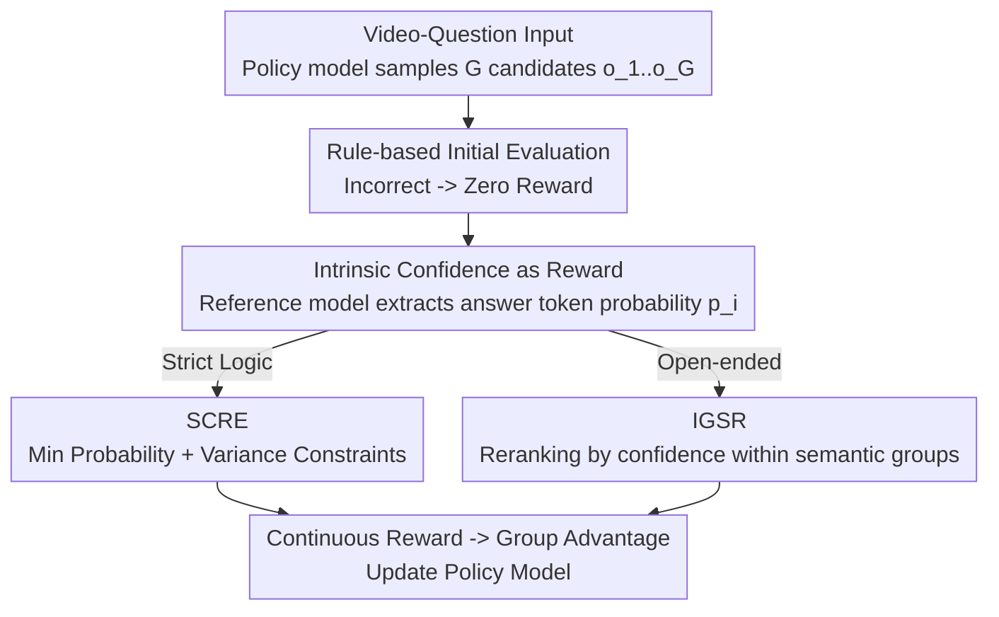

# Let VLMs Grade Their Own Thoughts: A Self-Quantification Approach to Reasoning-Aware Reward Modeling

**Conference**: CVPR 2026  
**Paper**: [CVF Open Access](https://openaccess.thecvf.com/content/CVPR2026/html/Xi_Let_VLMs_Grade_Their_Own_Thoughts_A_Self-Quantification_Approach_to_CVPR_2026_paper.html)  
**Code**: To be confirmed  
**Area**: Multimodal VLM  
**Keywords**: Video Understanding, Reinforcement Learning, Reward Modeling, Self-evaluated Confidence, Reasoning Chain Alignment

## TL;DR
Video-RAISE proposes to let video VLMs score their own reasoning chains using "intrinsic confidence" (answer token probabilities) during generation. This transforms the sparse 0/1 text-matching rewards in GRPO into continuous, fine-grained learning signals. By designing two reward mechanisms, SCRE for strict logic tasks and IGSR for open-ended tasks, the method achieves SOTA performance on six video understanding benchmarks and achieves approximately 90% reasoning chain consistency.

## Background & Motivation

**Background**: Utilizing reinforcement learning (especially GRPO) for post-training to stimulate the reasoning capabilities of foundation models has successfully extended from LLMs to the multimodal domain. Representative works in video understanding include Video-R1 (enforcing temporal logic) and GRPO-Care (aligning reasoning with high-quality rationales).

**Limitations of Prior Work**: A common thread among these methods is their reliance on **external, human-defined constraints** to guide the model: either by enforcing specific temporal sequences or rewarding alignment with preset reasoning steps. They are inherently anchored to the assumption that "optimal performance requires the model to mimic human cognitive patterns."

**Key Challenge**: The authors argue that this **forced alignment is a bottleneck**. A model's internal reasoning path may differ from human cognition; forcing it into human paradigms can prevent the model from discovering more effective, non-human reasoning strategies and may even damage performance. Furthermore, rewards based on text correctness in GRPO are sparse 0/1 signals—two responses with significantly different reasoning quality receive the same reward as long as the final answer is correct, resulting in weak learning signals (as seen in Figure 2 of the original paper: GRPO provides poor discrimination between two D-answers of differing quality, with scores like 0.76 and 0.52).

**Key Insight**: Rather than external alignment, the focus should shift toward **intrinsic self-evaluation**, allowing the model to discover optimal reasoning paths itself. The authors hypothesize that high-quality reasoning paths lead to higher confidence when generating final answers. This confidence is quantified using answer token probabilities and converted into RL rewards.

**Core Idea**: Transform the model's intrinsic confidence into continuous reward signals. Recognizing that different question types require different evaluation criteria—SCRE for strict logic and IGSR for open-ended questions—the method performs fine-grained optimization of the VLM reasoning process. The full framework is named Video-RAISE (Reasoning Alignment through Intrinsic Self-Evaluation).

## Method

### Overall Architecture
For each "video-question" input, the policy model first samples a set of candidate responses $o_1, \dots, o_G$. Similar to GRPO, an initial evaluation is performed using rule-based text matching: rewards for responses with incorrect answers are set to zero. For the remaining responses, a reference model calculates the generation probability of the token sequence and extracts the probability of the **answer segment** (within `<answer>...</answer>`). This probability is processed via SCRE for strict logic questions or IGSR for open-ended questions to produce continuous, fine-grained rewards $\tilde r_i$. Finally, these rewards are used to calculate group relative advantage to update the policy model. The reference model is a base Qwen2.5-VL (without SFT), updated via EMA during training.

### Key Designs

**1. Intrinsic Confidence as Continuous Reward: Replacing Sparse 0/1 with Answer Token Probabilities**

The core assumption is that "internal model confidence (answer probability) is a proxy for reasoning quality." The authors conducted analysis to verify this: the average confidence of the **entire sequence** is a fuzzy signal—distributions for correct (blue) and incorrect (orange) answers overlap significantly. However, zooming into the **answer token level** reveals a much clearer pattern: confidence for correct answers is sharply concentrated at 1.0, while incorrect answers exhibit clear **bipolarization**—one peak near 0.0 (blind guessing due to uncertainty) and another significant peak at 1.0 (flawed but internally consistent reasoning, leading to "confident errors"). This discovery suggests the true signal resides at the token level and directly motivates the design of task-specific strategies: SCRE handles blind guessing (0.0 peak), while IGSR reranks multiple high-confidence candidates in open-ended tasks. 

**2. SCRE (Sequential Confidence Rigorous Evaluation): Capturing the "Confidence Bottleneck"**

Targeted at tasks requiring strict correctness where a single incorrect token invalidates the entire answer. Given a video-question pair, candidates are sampled, and token-level probabilities $p_{i,j} = \pi_{ref}(o_{i,j} \mid q, o_{i,<j})$ are calculated using the reference model $\pi_{ref}$, specifically extracting the answer segment $p_i$. The authors argue that simple averaging masks the impact of a single low-confidence (likely incorrect) token. Thus, they use **multiplication of probabilities with positional decay weights** as the reward, making it extremely sensitive to any single low-probability token:

$$r_i = \prod_{j=1}^{|p_i|} p_{i,j}^{w_j}, \quad w_j = e^{-\eta j}$$

where $w_j$ is the positional decay factor ($\eta > 0$), assigning higher weights to earlier tokens to encourage well-structured outputs from the start. Finally, a **variance penalty** is applied to suppress responses with fluctuating confidence:

$$\tilde r_i = r_i \cdot e^{-\lambda \sigma^2}, \quad \sigma^2 = \frac{1}{|p_i|}\sum_{j=1}^{|p_i|}(p_{i,j} - \text{mean}(p_i))^2$$

SCRE simultaneously penalizes the "minimum probability" and "confidence fluctuations," effectively filtering out the 0.0 peak (blind guesses) in the error distribution.

**3. IGSR (In-Group Score Reranking): Confidence-based Refinement within Semantic Groups**

Targeted at open-ended questions where diverse expressions are allowed—here, strict token-based matching might penalize correct answers that use different phrasing. IGSR is based on two principles: (1) among semantically equivalent candidates, higher reward is given to those with higher confidence; (2) cross-group constraints are introduced to set reward upper bounds based on accuracy groups, balancing semantic accuracy, confidence, and diversity. Candidates are grouped $g = \text{Group}(r(t), \tau)$ by text accuracy $r(t)$ (e.g., ROUGE-L). Since average confidence within a group is hard to distinguish, the **average negative log-probability** is used: $e_i = \frac{1}{|p_i|}\sum_j -\log(p_{i,j}+\delta)$. Using the median reward $r^{\{k\}}_{(m)}$ of group $k$ as a baseline, an adjustment bonus $a_i$ is calculated based on relative confidence. This includes a cross-group interval term $r^{\{k+1\}}_{(m)} - r^{\{k\}}_{(m)}$ and a stabilization penalty $\partial(1 - 1/(|g^{\{k\}}|+1))$. The final reranked reward is obtained via geometric mean:

$$\tilde r_i = \sqrt{r^{\{k\}}_{(m)} \cdot \big(r^{\{k\}}_{(m)} + a_i \cdot \mathbb{1}(a_i \geq \tau)\big)}$$

The geometric mean ensures the adjustment is proportional to the baseline group reward, maintaining stable separation between groups.

## Loss & Training
The framework follows the GRPO group relative advantage approach, replacing the reward function with the continuous rewards from SCRE/IGSR. The reference model is a non-SFT base Qwen2.5-VL updated via EMA. Ablations show both policy and reference models can serve as reward sources; adding a KL penalty (coefficient 0.04) slightly degraded performance.

## Key Experimental Results

Evaluated on six major video understanding benchmarks (VSI-Bench, VideoMMMU, MMVU, MVBench, TempCompass, VideoMME) using Qwen2.5-VL-7B as the backbone across 16/32/64 frames.

### Main Results (32 frames, representative results)

| Method | Pub. | VSI-Bench | VideoMMMU | MMVU | MVBench | TempCompass | VideoMME |
|------|------|-----------|-----------|------|---------|-------------|----------|
| GPT-4o | Prop. | 34.0 | 61.2 | 75.4 | - | - | 71.9 |
| Video-R1-7B | NeurIPS25 | 35.8 | 52.3 | 63.8 | 63.9 | 73.2 | 59.3 |
| CARE-7B | arXiv25 | 35.8 | 50.4 | 65.8 | 65.1 | 73.5 | 59.6 |
| **Video-RAISE-7B** | Ours | **36.6** | **53.0** | **65.9** | **65.9** | **75.1** | **60.7** |

Advantages are more pronounced in the 16-frame setting: VideoMMMU reaches 52.8% (3.0 points higher than Prev. SOTA Video-R1). It significantly outperforms proprietary-model-based VideoTree (47.8) on VideoMMMU.

### Ablation Study / Reasoning Chain Consistency Analysis

| Method | VideoMMMU Answer | VideoMMMU Match | VSI-Bench Match | TempCompass Match |
|------|------------------|-----------------|-----------------|-------------------|
| Qwen2.5-VL | 46.9 | 46.7 | 17.2 | 87.8 |
| Qwen2.5-VL-SFT | 47.4 | 87.8 | 41.2 | 93.5 |
| Qwen2.5-VL-GRPO | 40.4 | 34.0 | 41.4 | 43.7 |
| **Ours: Video-RAISE** | **55.3** | **87.9** | **84.9** | **95.9** |

**Answer** refers to the accuracy of a new answer generated by a text-only LLM given the reasoning chain (`<think>` content) and the question. **Match** measures consistency between the new answer and the original VLM answer. Video-RAISE achieves nearly 90% Match across all benchmarks, double that of Qwen2.5-VL-Instruct and even surpassing SFT.

### Key Findings
- **GRPO causes reasoning chain degradation**: GRPO's Match is only 34.0% on VideoMMMU and 43.7% on TempCompass; on several benchmarks, Answer accuracy is lower than the baseline, indicating that rewarding only the final answer leads to "saying one thing and doing another."
- **SFT consistency does not generalize**: SFT achieves a high Match (87.8%) in-distribution (VideoMMMU) but drops to 41.2% on the OOD VSI-Bench. Video-RAISE maintains 84.9% on VSI-Bench.
- **Confidence correlates with consistency**: Using the minimum probability as a proxy for confidence shows positive correlation with reasoning chain consistency.
- Reward Source: Both the policy and reference models can serve as reward sources with comparable results.

## Highlights & Insights
- **Bipolarization of Token-level Confidence**: Refining "sequence-level fuzzy overlap" into "token-level clear bipolarization" (0.0 blind guess peak vs. 1.0 confident error peak) explains why average confidence is ineffective and justifies the split between SCRE and IGSR.
- **Amplifying the "Weakest Link"**: SCRE uses weighted multiplication rather than averaging, allowing a single low-confidence token to dominate the reward. This effectively turns the most vulnerable parts of an answer into the primary signal.
- **Explicit Consistency Evaluation**: Measuring Answer/Match by feeding reasoning chains into a text-only LLM provides a quantitative measure of whether the reasoning actually supports the answer.

## Limitations & Future Work
- The method relies on the assumption that "confidence = reasoning quality," but the existence of a "confident error" (1.0 peak) suggests it is not a perfect proxy.
- IGSR involves multiple hyperparameters ($\tau, \eta, \lambda, \partial$), increasing tuning complexity.
- Experiments focused on Qwen2.5-VL-7B; transferability to other VLM families/scales and dependence on the reference model quality require further investigation.
- The task split (strict logic vs. open) requires pre-determining question types, and the robustness of automated classification was not detailed.

## Related Work & Insights
- **vs GRPO**: GRPO uses sparse binary rewards; this work constructs continuous rewards for fine-grained discrimination and prevents reasoning chain degradation.
- **vs Video-R1**: Video-R1 uses human-defined temporal logic rewards; this work avoids manual constraints, using intrinsic self-evaluation instead.
- **vs GRPO-Care**: GRPO-Care aligns reasoning with rationales (external alignment); this work allows the model to discover paths via its own confidence, achieving higher consistency (~90%).

## Rating
- Novelty: ⭐⭐⭐⭐⭐ 
- Experimental Thoroughness: ⭐⭐⭐⭐ 
- Writing Quality: ⭐⭐⭐⭐ 
- Value: ⭐⭐⭐⭐ 

<!-- RELATED:START -->

## Related Papers

- [\[ICLR 2026\] Let's Think in Two Steps: Mitigating Agreement Bias in MLLMs with Self-Grounded Verification](../../ICLR2026/vlm_reasoning/lets_think_in_two_steps_mitigating_agreement_bias_in_mllms_with_self-grounded_ve.md)
- [\[ICLR 2026\] What "Not" to Detect: Negation-Aware VLMs via Structured Reasoning and Token Merging](../../ICLR2026/vlm_reasoning/what_not_to_detect_negation-aware_vlms_via_structured_reasoning_and_token_mergin.md)
- [\[ICLR 2026\] Through the Lens of Contrast: Self-Improving Visual Reasoning in VLMs](../../ICLR2026/vlm_reasoning/through_the_lens_of_contrast_self-improving_visual_reasoning_in_vlms.md)
- [\[CVPR 2026\] From Exploration to Exploitation: A Two-Stage Entropy RLVR Approach for Noise-Tolerant MLLM Training](from_exploration_to_exploitation_a_two-stage_entropy_rlvr_approach_for_noise-tol.md)
- [\[NeurIPS 2025\] Enhancing Outcome Reward-Based RL Training of MLLMs with Self-Consistency Sampling](../../NeurIPS2025/vlm_reasoning/enhancing_the_outcome_reward-based_rl_training_of_mllms_with_self-consistency_sa.md)

<!-- RELATED:END -->
