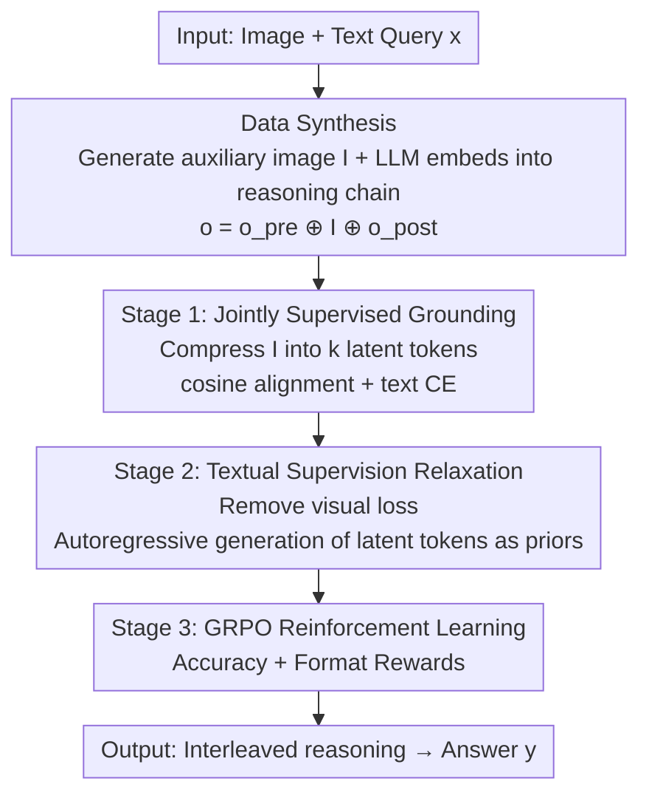

# Machine Mental Imagery: Empower Multimodal Reasoning with Latent Visual Tokens

**Conference**: CVPR 2026  
**Paper**: [CVF Open Access](https://openaccess.thecvf.com/content/CVPR2026/html/Yang_Machine_Mental_Imagery_Empower_Multimodal_Reasoning_with_Latent_Visual_Tokens_CVPR_2026_paper.html)  
**Code**: None  
**Area**: Multimodal VLM / Multimodal Reasoning  
**Keywords**: Latent visual tokens, interleaved reasoning, mental imagery, spatial reasoning, two-stage training

## TL;DR
This paper proposes the **Mirage** framework, enabling VLMs to treat their own hidden states as "latent visual tokens" and directly append them into text sequences during decoding. This allows interleaved multimodal reasoning without generating any actual pixel-level images. Combined with a two-stage fine-tuning approach of "first visual grounding, then textual relaxation" and reinforcement learning (RL), Mirage consistently outperforms pure-text decoding and explicit image-generation baselines across multiple benchmarks such as spatial planning, jigsaw puzzles, and spatial relations.

## Background & Motivation

**Background**: Although Vision-Language Models (VLMs) can encode both images and text simultaneously, their decoding side is **purely textual**—all reasoning must first be "translated" into language before outputting. Relying on chain-of-thought (CoT) prompting and RL fine-tuning can extend this textual reasoning chain further, yielding additional gains.

**Limitations of Prior Work**: However, many tasks (e.g., spatial planning, jigsaw puzzles, relative orientation judgment) essentially require the model to **manipulate visual elements** mentally. Relying solely on textual descriptions to describe each candidate piece or path is both verbose and error-prone. An intuitive remedy is to enable VLMs to perform **explicit image generation** (such as unified token models like Chameleon, Anole, and MVoT), generating drawings alongside reasoning. However, the authors point out two critical flaws: ① The objectives of large-scale pixel-level generative pre-training and logical reasoning differ drastically; forcing a model to excel at both often **degrades reasoning quality instead**. ② It is difficult for images produced by image decoders to form a truly interleaved trajectory with the input images.

**Key Challenge**: There is a **trade-off between "generating pixels" and "preserving reasoning capability"**—the heavier the image-generation burden placed on the model, the less capacity is left for reasoning.

**Key Insight**: Borrowing from the theory of **mental imagery** in cognitive science, the authors note that humans do not render photo-realistic images in their minds when thinking; instead, they construct and manipulate **simplified sketches containing only task-relevant information** (e.g., observing only piece outlines for puzzles, or recalling only the shelf edges when searching for keys). Thus, can a VLM also directly reason within its **latent visual embedding space**, weaving compact visual embeddings into the text stream and completely bypassing explicit image generation?

**Core Idea**: Use the model's **own hidden states** as "latent visual tokens" to append into the context, replacing actual image generation. This allows the model to fully allocate its capacity to reasoning while still benefiting from the guidance of visual cues.

## Method

### Overall Architecture
The core mechanism of Mirage is remarkably simple: when the model decides to "think visually" during decoding (triggered by generating a special token), it **bypasses the language projection layer** and directly appends the hidden states of the current final layer back into the context as a compact visual embedding, before continuing to generate text. This inserts several "latent visual tokens" between text tokens, forming an interleaved image-text reasoning trajectory completely **without any external image decoders**.

Since VLMs naturally generate only text tokens, supervised fine-tuning (SFT) is necessary to learn this interleaved paradigm. The entire pipeline consists of three steps: first, **synthesize training data** (equipping each question with an "auxiliary image" and prompting a large model to embed it into the reasoning chain); second, perform **Stage 1 Joint Supervision** to force the model to ground latent tokens into the visual subspace; and finally, perform **Stage 2 Textual Supervision** to loosen visual constraints and allow latent tokens to freely guide the subsequent text as priors. After the two-stage SFT, a round of **GRPO reinforcement learning** is applied for further improvement.

### Key Designs

**1. Latent Visual Tokens: Appending Hidden States as Next Tokens to Bypass Pixel Generation**

This is the core foundation of the paper. The limitation of prior work is that explicit image generation models must pass internal representations through a language projector or image decoder to "materialize" them into pixels, which is slow and drains reasoning capacity. Mirage's approach is: when the model chooses to think visually, it **reuses the current top-layer hidden states directly as a compact visual embedding**, skipping the language projection layer and appending it into the context as the "next token". These internal embeddings provide focused visual cues for subsequent reasoning steps. Because they never leave the model's continuous embedding space, there is neither quantization loss nor external decoder overhead, and they are inherently differentiable, allowing gradients to propagate backward. This closely maps to the human mental imagery concept of "simplified sketches": retaining only task-relevant information without rendering photorealistic details.

**2. Auxiliary-Image-Driven Data Synthesis: Materializing "What to Imagine" into a Supervised Image**

Initially, the model does not know where in the reasoning chain or what visual content it should imagine, lacking supervision signals for interleaved reasoning. To address this, the authors construct an auxiliary image $I$ for each problem $x$ using **task-specific tools**: in navigation tasks, the ground-truth action sequence is drawn with red arrows on the starting map; in jigsaw puzzles, candidate fragments and reference images are stitched into a composite image; in spatial tasks, a fine-tuned CogVideoX-5B is used to render a scene image of the text description. Then, the original input $x$, ground-truth answer $y$, and auxiliary image $I$ are jointly fed to a powerful reasoning VLM $M$, prompting it to generate a step-by-step reasoning chain that **embeds the auxiliary image inside the reasoning process** as $o = M(x, y, I)$. Since the auxiliary image is embedded in the middle of the chain, it naturally splits the chain into $o = o_{pre} \oplus I \oplus o_{post}$. This allows batch synthesis of the training set $D = \{x^{(i)}, I^{(i)}, o^{(i)}, y^{(i)}\}_{i=1}^N$. This auxiliary image serves as the precise supervised target for "what to imagine."

**3. Stage 1 Jointly Supervised Grounding: Compressing Image Features + Cosine Alignment**

Direct training on synthetic data presents a hidden risk: prompting the VLM to synthesize auxiliary images can be bottlenecked by its limited generation capacity. The authors' clever workaround is to **first let the VLM encode the auxiliary image into patch-level features**, and then train the model to directly output these features as latent tokens, completely bypassing image generation. Specifically, passing $I$ through $f_\theta(\cdot)$ yields patch features $\{e_1,\dots,e_n\}=f_\theta(I)$, which are then compressed via **average pooling** into $k$ highly salient vectors $\{\hat e_1,\dots,\hat e_k\}=\text{Compress}(\{e_1,\dots,e_n\})$—retaining only task-critical visual summaries (reminiscent of "mental sketches"). The training objective aligns the latent tokens to the target vectors using **cosine similarity**:

$$\mathcal{L}_{visual} = \ell_{cos}\!\left(\hat e_j,\ g_\theta(o_{pre}, \hat e_{1:j-1})\right)$$

Meanwhile, the surrounding text tokens are trained with standard cross-entropy (where $o_{pre}$ relies only on prior context, and $o_{post}$ must also attend to those $k$ compressed visual embeddings):

$$\mathcal{L}_{text} = \sum_{i=1}^{|o_{pre}|}\ell_{CE}\big(o_{pre,i}, f_\theta(x, o_{pre,<i})\big) + \sum_{i=1}^{|o_{post}|}\ell_{CE}\big(o_{post,i}, f_\theta(x, o_{pre}, \{\hat e_j\}_1^k, o_{post,<i})\big)$$

The total objective is $\mathcal{L}_1 = \mathcal{L}_{visual} + \gamma\,\mathcal{L}_{text}$, anchoring the latent tokens in the visual space while training the model to seamlessly weave them into its textual train of thought.

**4. Stage 2 Textual Supervision Relaxation: Removing Visual Loss to Allow Free Evolution of Latent Tokens as Priors**

Although Stage 1 anchors the latent tokens, forcing the reconstruction of compressed image embeddings **over-constrains** the model, diverting capacity away from the main objective (getting the correct answer) and degrading reasoning performance. Consequently, Stage 2 **completely removes the cosine loss and retains only text cross-entropy (CE)**. Now, latent tokens are generated autoregressively by the model as $e_j = f_\theta(x, o_{pre}, e_{<j})$, replacing the compressed image vectors of Stage 1 to serve as priors for subsequent text tokens. Since $\{e_i\}_1^k$ are continuously differentiable and the prediction of $o_{post}$ is a function of these latent tokens, gradients can propagate back to the latent tokens via the text loss. Thus, the model optimizes the generation of latent tokens within the **already-learned visual subspace**, making them flexible, task-adaptive priors that yield more adaptive reasoning trajectories compared to rigidly matching predefined embeddings. Ablation results show both stages are indispensable (see below).

**5. GRPO Reinforcement Learning: Exploratory Improvement over Interleaved Trajectories**

After two-stage SFT, the model has learned to reason with interleaved text and images. The authors borrow from long-CoT language models to add a round of **GRPO** (Group Relative Policy Optimization). For each query, multiple responses are sampled to explicitly optimize text token probabilities while allowing gradients to flow through latent tokens. Following the design of LMM-R1, two types of rewards are used: an **accuracy reward** $r_{acc}=1$ if the answer is correct (0 otherwise), and a **format reward** that checks if the thinking process is enclosed within `<think></think>` and if the answer is in the `\boxed{}` format (0.1 if correct, 0 otherwise). Because latent visual cues are woven into the text, the model can naturally explore more diverse sequences, leading to an additional ~2% gain on VSP after GRPO.

## Key Experimental Results

### Main Results

The default base model is Qwen2.5-VL 7B (with 3B used for some transfer experiments), latent token count $k=4$, loss coefficient $\gamma=0.1$, and seed fixed at 42. Benchmarks cover VSP (maze spatial planning + spatial reasoning), BLINK-Jigsaw (puzzles), SAT (static/dynamic spatial relations), and COMT-Geometry (mathematical geometric spatial reasoning). 1k samples per task are used for SFT, and 1k for RL.

Main results on VSP (Accuracy, selected Avg.):

| Method | Spatial Reasoning Avg. | Spatial Planning Avg. |
|------|------|------|
| Zero-Shot | 0.32 | 0.06 |
| Direct SFT | 0.83 | 0.72 |
| CoT SFT + GRPO | 0.85 | 0.51 |
| Anole (Explicit Gen.) | 0.52 | 0.01 |
| MVoT | 0.61 | 0.11 |
| Aurora | 0.71 | 0.13 |
| **Ours (Direct)** | 0.86 | **0.76** |
| **Ours (CoT)** | 0.87 | 0.58 |
| **Ours + GRPO** | **0.89** | 0.60 |

Compared to directly fine-tuning with synthetic data, Mirage yields gains of +3% in spatial reasoning and +11% in spatial planning. Compared to CoT SFT + GRPO, the gains are +2% and +7%, respectively, with GRPO providing an additional +2% boost. Notably, **explicit image-generation baselines (Anole/Aurora) perform very poorly** (planning at only 1%/13%), which the authors attribute to the heavy burden of pixel generation degrading reasoning capabilities.

Transfer results of Qwen2.5-VL 3B on Jigsaw / SAT (selected Avg.):

| Method | Jigsaw | SAT Synthetic | SAT Real Avg. |
|------|------|------|------|
| Direct SFT | 0.80 | 0.82 | 0.83 |
| ViGoRL | 0.56 | 0.75 | 0.67 |
| MindJourney | - | 0.84 | 0.73 |
| **Ours** | **0.85** | **0.85** | **0.89** |

On COMT math-geometry, Mirage (SFT version) scores 0.77, which is approximately 5% higher than the best baseline. Mirage consistently outperforms competitors even when they are specifically pre-trained on related domains, such as MINT-CoT on large-scale math data and ViGoRL on large-scale spatial data.

### Ablation Study

Ablation of the two-stage design (VSP Spatial Planning, Accuracy Avg.):

| Configuration | Avg. | Description |
|------|------|------|
| Full (Two Stages) | 0.58 | Full model |
| w/o Stage 1 | 0.52 | Without visual grounding, latent tokens drift to useless regions, performing only slightly better than pure text |
| w/o Stage 2 | 0.21 | Only grounding without relaxation, latent tokens are over-constrained, leading to a significant performance drop |

Hyperparameter robustness (latent token count $k$, coefficient $\gamma$, VSP Spatial Reasoning Avg.):

| $k$ | $\gamma$ | Avg. |
|------|------|------|
| 2 | 0.1 | 0.86 |
| 4 | 0.1 | 0.87 |
| 6 | 0.1 | 0.88 |
| 8 | 0.1 | 0.75 |
| 4 | 0.5 | 0.84 |
| 4 | 1.0 | 0.83 |

### Key Findings
- **Both stages are indispensable**: Staying only with Stage 2 (0.21) is far worse than the full model (0.58). Without the visual grounding in Stage 1, latent vectors drift into regions of the multimodal embedding space that do not assist reasoning. This contradicts the findings in LLMs where "unsupervised latent vectors can also assist reasoning," indicating that the visual and textual subspaces in VLMs are highly heterogeneous, making a grounding stage absolutely necessary.
- **More tokens ($k$) is not always better**: Performance is stable when $k$ ranges from 2 to 6 (with $k=6$ being slightly better), but drops sharply by about 13% at $k=8$. The authors attribute this to error accumulation within longer latent sequences under autoregressive non-decoding generation; this aligns with the conclusion on LLMs that "optimal latent reasoning typically utilizes fewer than 6 tokens."
- **Auxiliary images are highly informative**: Directly feeding auxiliary images as inputs to the model yields near 100% accuracy on both VSP tasks, proving that the synthesized auxiliary images genuinely encode task-critical visual cues, forming the performance upper bound of Mirage.
- **Honest negative results**: On VSP spatial planning, fine-tuning on synthesized reasoning chains actually underperformed direct training on target answer labels. The authors acknowledge that some perception-heavy tasks do not necessarily benefit from explicit reasoning, and that the synthesized reasoning chains, generated by Qwen2.5-VL-32B, are imperfect, passing flaws down to the base model. Additionally, the auxiliary images for SAT are generated by video generation models without ground-truth labels, which also introduces noise.

## Highlights & Insights
- **The step of "appending hidden states as tokens" is extremely lightweight yet hits the mark**: It does not introduce any new decoders or pixel-level supervisions, but simply bypasses the language projection layer to recycle hidden states. This directly bypasses the trade-off of "explicit image generation dragging down reasoning capabilities." It is the most impressive "aha" design of the paper.
- **Using auxiliary images to transform the abstract notion of "what to imagine" into a supervised target**, and then compressing them into a few vectors via average pooling, echoes the cognitive science principle that "mental sketches retain only task-relevant info." The alignment between theoretical motivation and engineering implementation is exceptionally elegant.
- **The two-stage paradigm of "first grounding, then relaxation" is highly transferable**: Any task aiming to let models "think" in continuous latent spaces can adopt this pattern—aligning with a meaningful subspace in Stage 1, and lifting constraints in Stage 2 to allow adaptation—preventing unsupervised latent vectors from drifting aimlessly.
- Latent visual tokens are naturally differentiable, enabling SFT, gradient backpropagation, and GRPO to transition seamlessly along the same continuous trajectory, which is much cleaner in terms of engineering than discrete image tokens.

## Limitations & Future Work
- **Dependency on synthetic data quality**: Both auxiliary images and reasoning chains are produced by LLMs or video-generation models, letting flaws propagate to the base model. The authors acknowledge that on VSP planning, training with synthesized reasoning chains actually performs worse than direct training on answer labels.
- **Constrained number of latent tokens**: An obvious autoregressive error accumulation occurs when $k > 6$, limiting the amount of visual information that can be injected, which may prove insufficient for complex scenes.
- **Task-dependent auxiliary image construction**: Each task requires manual design of "how to construct the auxiliary image" (drawing arrows, stitching fragments, rendering scenes). Generality is bound by the availability of task-specific tools, making it difficult to plug-and-play on arbitrary new tasks.
- **Under-explored interpretability**: There is only a preliminary analysis of what latent tokens actually encode. It would be more convincing to verify whether they truly "internalize" the auxiliary image information (the performance upper bound mentioned in the paper).

## Related Work & Insights
- **vs. MVoT / Anole / Chameleon (Explicit Token Image Gen)**: They require unified models to directly output image tokens, which demands large-scale pixel-level supervision and imposes a heavier decoding overhead. Consequently, they perform poorly on interleaved reasoning. Mirage, by contrast, only outputs compact latent vectors without rendering pixels, saving the model's capacity for reasoning and significantly outperforming them in evaluations.
- **vs. Aurora**: Aurora introduces an image de-tokenizer to generate perceptual tokens explicitly, whereas Mirage completely remains within the continuous embedding space, making it much more lightweight and efficient.
- **vs. Coconut-like LLM Latent Reasoning ([21])**: That line of work replaces CoT tokens with latent tokens in the pure language latent space for efficient/planning reasoning and finds that unsupervised latent vectors are effective. Mirage's key difference is that it treats latent tokens as a **bridge to explore visual information**, and empirically demonstrates that the visual and textual subspaces in VLMs are highly heterogeneous, requiring initial visual grounding (unsupervised setups fail), thereby revealing the heterogeneity of vision-text subspaces.
- **vs. ViGoRL / MindJourney / MINT-CoT (Task-Specific Fine-tuning)**: These models are specifically fine-tuned on large-scale spatial or math datasets. Mirage, despite using less training data, outperforms them using a generic latent visual reasoning mechanism, indicating that interleaved compact visual cues are a more fundamental source of performance gains.

## Rating
- Novelty: ⭐⭐⭐⭐⭐ The concept of "appending hidden states as visual tokens, completely bypassing image generation" is simple yet fundamental. The cognitive science motivation is highly coherent with the actual implementation.
- Experimental Thoroughness: ⭐⭐⭐⭐ It covers four benchmarks, multiple base models, and two-stage/hyperparameter ablations, while honestly presenting negative results. However, utilizing only 1k samples per task represents a relatively small scale.
- Writing Quality: ⭐⭐⭐⭐ Clear progression from motivation to method and experiments. The pipeline diagram is intuitive, though formatting of some math formulas is slightly messy.
- Value: ⭐⭐⭐⭐⭐ Provides a low-cost, highly transferable paradigm for "VLMs performing multimodal reasoning in latent space," offering valuable insights for subsequent advancements in latent multimodal reasoning.

<!-- RELATED:START -->

## Related Papers

- [\[ICML 2026\] MentisOculi: Revealing the Limits of Reasoning with Mental Imagery](../../ICML2026/vlm_reasoning/mentisoculi_revealing_the_limits_of_reasoning_with_mental_imagery.md)
- [\[CVPR 2026\] Latent Implicit Visual Reasoning](latent_implicit_visual_reasoning.md)
- [\[CVPR 2026\] Monet: Reasoning in Latent Visual Space Beyond Image and Language](monet_reasoning_in_latent_visual_space_beyond_image_and_language.md)
- [\[ICCV 2025\] Perspective-Aware Reasoning in Vision-Language Models via Mental Imagery Simulation](../../ICCV2025/vlm_reasoning/perspective-aware_reasoning_in_vision-language_models_via_mental_imagery_simulat.md)
- [\[ICLR 2026\] Latent Visual Reasoning](../../ICLR2026/vlm_reasoning/latent_visual_reasoning.md)

<!-- RELATED:END -->
