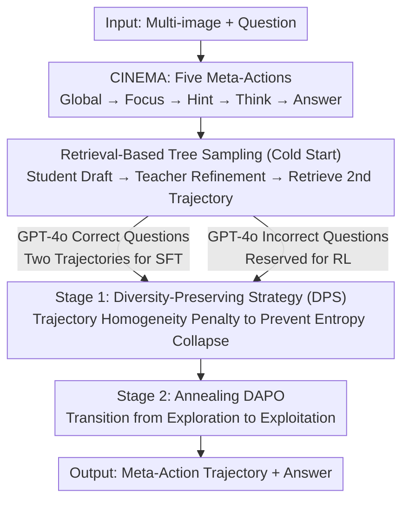

# Mimic Human Cognition, Master Multi-Image Reasoning: A Meta-Action Framework for Enhanced Visual Understanding

**Conference**: CVPR 2026  
**Paper**: [CVF Open Access](https://openaccess.thecvf.com/content/CVPR2026/html/Yin_Mimic_Human_Cognition_Master_Multi-Image_Reasoning_A_Meta-Action_Framework_for_CVPR_2026_paper.html)  
**Code**: TBD  
**Area**: Multimodal VLM / Multi-image Reasoning / Reinforcement Learning  
**Keywords**: Multi-image Reasoning, Meta-Action, Cognitive Framework, Tree-sampling Cold Start, Diversity-Preserving Reinforcement Learning

## TL;DR
To address the significant performance drop of Multimodal Large Language Models (MLLMs) in multi-image reasoning, this paper mimics human cognition by decomposing multi-image reasoning into five structured "meta-actions": Global / Focus / Hint / Think / Answer (the CINEMA framework). It utilizes "Retrieval-Based Tree Sampling" to generate two high-quality trajectories for cold-start and implements a two-stage reinforcement learning (RL) process—Diversity-Preserving Strategy (DPS) followed by Annealing DAPO—to prevent entropy collapse. The 7B model surpasses GPT-4o on multi-image benchmarks like MUIR and MV-Math, while also achieving gains in video and single-image tasks.

## Background & Motivation

**Background**: MLLMs have become powerful in single-image understanding, with extensive research enhancing their single-image reasoning. However, real-world applications (e-commerce, autonomous driving, video understanding) frequently require processing **multiple** images simultaneously.

**Limitations of Prior Work**: Despite excellent performance in single-image tasks, MLLM performance degrades significantly in multi-image scenarios. This is due to: (1) **complex relationships** such as semantic correlation, spatial arrangement, and temporal sequences between images, which require deep integration beyond isolated processing; (2) key information being **scattered** across specific images in a set, requiring the model to precisely locate and focus on relevant content amidst distractor images.

**Key Challenge**: Existing methods either perform intra-image reasoning (e.g., splitting multi-image tasks into single-image sub-problems) or use preference optimization for simplified cases where only one image is relevant. They fail to **truly model the simultaneous "per-image analysis + global inter-image relationship."** 

**Goal**: To enable models to both focus on local details of individual images and understand global relationships across a group, achieving stable gains in multi-image reasoning and generalizing to video and single-image tasks.

**Key Insight**: Derived from human cognition—when humans face complex multi-image problems, they follow a systematic process: reading to grasp the overall structure (global), then focusing on key images (local details). Explicitly stating key points and potential pitfalls enhances complex reasoning. This "global-to-local, explicit-hinting" cognitive sequence is transferred to the model.

**Core Idea**: Explicitly model human reasoning steps using a set of discrete "meta-actions" (CINEMA). This is supported by a training paradigm consisting of "high-quality trajectory generation (tree-sampling cold start) + diversity-preserving training (two-stage RL)," teaching the model to reason according to human cognitive sequences rather than memorizing answers.

## Method

### Overall Architecture
CINEMA (Cognition-Inspired Meta-Action Framework) uses Qwen2.5-VL-7B as its backbone and unifies multi-image reasoning into a **meta-action trajectory**. The model organizes reasoning using labels: `<global>`, `<focus>`, `<hint>`, `<think>`, and `<answer>`, with the final answer provided in `<answer>` (the `global` tag is disabled for single-image inputs). Training consists of two stages: first, cold-start SFT—using "Retrieval-Based Tree Sampling" to create **two** distinct, high-quality meta-action trajectories for each problem as supervision; second, two-stage RL—Stage 1 uses a "Diversity-Preserving Strategy (DPS)" to maintain diversity at the meta-action level and prevent entropy collapse, and Stage 2 uses Annealing DAPO to gradually transition from exploration to exploitation. The training data includes 56k cold-start instances (two trajectories each) and 58k RL instances, covering multi-image, multi-frame (video), and single-image tasks.

### Key Designs

**1. Five Meta-Actions (CINEMA): Explicitly decomposing multi-image reasoning into five cognitive steps.**

The root cause of multi-image reasoning failure is the lack of structure to organize "global view, then local detail, then explicit hinting, then integrated reasoning." This paper defines: **Global** for analyzing temporal/spatial/semantic relations across images; **Focus** for concentrating on specific image details; **Hint** for summarizing key points and confusing elements; **Think** for logical reasoning integrating clues and priors; **Answer** for the final output. While trajectories usually follow this order, they can start with any action (except Answer) and combine flexibly to model the non-fixed but systematic human cognitive process.

**2. Retrieval-Based Tree Sampling: Creating two high-quality, diverse trajectories per problem via a "Student-Teacher-Retrieval" mechanism.**

To teach the model, high-quality trajectories are needed. Borrowing from educational mechanisms: **① Initial Trajectory Generation**—a smaller student model generates an initial solution; **② Teacher-Guided Refinement**—a stronger teacher (GPT-4o) follows the **student's action path** to redo the task, ensuring correctness while maintaining the structural intent; **③ Retrieval-Based Diverse Sampling**—a database of "meta-action trees" is maintained, and BGE is used to calculate cosine similarity. Correct trajectories with **low similarity** to the refined trajectory are retrieved. This provides **two distinct correct paths** per problem, expanding the exploration space for subsequent RL.

**3. Two-Stage Reinforcement Learning (DPS → Annealing DAPO): Preserving meta-action diversity to prevent entropy collapse, followed by performance consolidation.**

To counter entropy collapse, the first stage employs a **Diversity-Preserving Strategy (DPS)**. It encourages diverse solutions by rewarding accuracy, format validity, and uniqueness:

$$R = 0.5 \cdot \Big(R_{acc}\cdot\big(R_{acc} - \tfrac{N-1}{G-1}\cdot 0.1\big)\Big) + 0.5 \cdot R_{format}$$

where $R_{acc}$ and $R_{format}$ are binary indicators. $G$ is the sample group size, and $N$ is the count of trajectories with the **same meta-action pattern**. The $\tfrac{N-1}{G-1}$ term suppresses identical trajectories. **Stage 2: Annealing DAPO** uses an annealing schedule to transition to exploitation, utilizing the diversity from Stage 1 to consolidate performance.

### Mechanism
Consider a multi-image ordering task (identifying the correct sequence A/B/C/D). The model first uses `<global>` to analyze time/space/semantics across the four images to identify them as steps in a single process. It then uses `<focus>` on a key image showing a decisive state change. Next, `<hint>` highlights pitfalls (e.g., "Note the difference between options B and C in the middle images"). Then, `<think>` synthesizes these clues into a conclusion, and `<answer>A</answer>` outputs the result.

## Key Experimental Results

### Main Results on Multi-image / Video Benchmarks (Table 1, Selection, Backbone: Qwen2.5-VL-7B)

| Model | MUIR | MMIU | MV-Math | EMMA | MIRB | MVBench | VideoMME | VideoMMMU | Overall |
|------|------|------|---------|------|------|---------|----------|-----------|---------|
| GPT-4o (Closed) | 68.0 | 55.7 | 32.1 | 32.7 | – | – | 75.0 | 61.2 | – |
| Qwen2.5-VL-7B (Baseline) | 57.9 | 50.6 | 26.7 | 20.4 | 48.3 | 62.6 | 56.7 | 45.8 | 48.2 |
| VISC 7B | 44.5 | 52.8 | – | – | 60.2 | 68.0 | – | – | – |
| VideoRFT 7B | 56.6 | 44.5 | 25.1 | 17.8 | 46.7 | 62.1 | 59.8 | 51.1 | 46.7 |
| **Ours (DAPO)** | **71.6** | 53.3 | **36.9** | 29.3 | 55.2 | 66.5 | 59.4 | 49.0 | 54.3 |
| Ours (DPS+Annealing) | 71.0 | 52.2 | 35.0 | 28.6 | 55.7 | 66.8 | 61.0 | 50.1 | 54.3 |
| Δ vs Baseline | +13.7 | +2.7 | +10.2 | +8.9 | +6.9 | +3.9 | +2.7 | +3.2 | +6.1 |

**Ours** surpasses GPT-4o on MUIR and MV-Math (71.6>68.0, 36.9>32.1) and outperforms specialized video models across three benchmarks, with an average overall gain of +6.1 over the Qwen2.5-VL baseline.

### Ablation Study I: Retrieval-Based Tree Sampling (Table 3, MUIR / MMIU / EMMA, SFT→RL)

| Cold-start Method | MUIR(RL) | MMIU(RL) | EMMA(RL) | Note |
|-----------|----------|----------|----------|------|
| Direct Prompting | 33.8 | 36.9 | 14.1 | Significantly lower; indicates actions require training. |
| Standard CoT | 70.0 | 51.6 | 26.9 | Single `<think>` format. |
| Single Trajectory | 65.1 | 52.2 | 27.9 | One trajectory per problem. |
| **Two Trajectories (Ours)** | **71.6** | **53.3** | **29.3** | Optimal performance across RL tasks. |

### Ablation Study II: Contribution of Meta-Actions (Table 4)

| Configuration | MUIR | MIRB | VideoMME |
|------|------|------|----------|
| Full CINEMA | 71.0 | 55.7 | 61.0 |
| w/o global | 63.4 | 52.6 | 57.1 |
| w/o focus | 61.6 | 53.2 | 57.5 |
| w/o hint | 63.5 | 52.3 | 56.8 |
| w/o think | 60.1 | 53.6 | 57.1 |

### Key Findings
- **Dual trajectories outperform single/CoT**: The best RL results are achieved with two correct trajectories per problem, confirming that diverse supervised examples open the exploration space.
- **Every meta-action is essential**: Removing `think` or `focus` results in the largest performance drops.
- **Two-stage RL resists entropy collapse**: DPS maintains higher entropy levels throughout training without sacrificing accuracy. Pass@K experiments confirm a higher performance ceiling.
- **Stronger advantage with more images**: On MMIU (up to 32 images), the model maintains a lead even as image count increases.

## Highlights & Insights
- **Discretizing human cognitive steps into meta-action labels** is more structured than vague CoT. It allows for step-by-step ablation and measuring diversity through meta-action patterns.
- **Retrieval-based tree sampling** is a cost-effective recipe for diverse cold-starts: using a small model to draft, a strong teacher to correct, and similarity retrieval to provide a secondary path.
- **DPS homogeneity penalty $\tfrac{N-1}{G-1}$** directly bakes diversity into the reward function at the meta-action level rather than just at the token or final answer level.

## Limitations & Future Work
- **Teacher dependence**: Relies on GPT-4o for refinement and BGE for retrieval; noise from teacher bias is not quantified.
- **Fixed Meta-actions**: The meta-action set is manually designed; its optimality across all imaginable tasks is not fully established.
- **Single backbone**: Primarily validated on 7B models; scalability to larger architectures needs confirmation.

## Related Work & Insights
- **vs VISC**: While VISC decomposes multi-image tasks into single-image sub-problems, CINEMA uses the `Global` action to model inter-image relationships explicitly.
- **vs MIA-DPO**: Unlike MIA-DPO, which primarily handles single-image queries within multi-image contexts, CINEMA addresses true cross-image integrative reasoning.
- **vs Standard RLHF/DPO**: CINEMA uses pure RL (outcome-based rewards + format rewards) with diversity penalties, removing the need for preference labeling.

## Rating
- Novelty: ⭐⭐⭐⭐
- Experimental Thoroughness: ⭐⭐⭐⭐⭐
- Writing Quality: ⭐⭐⭐⭐
- Value: ⭐⭐⭐⭐⭐

<!-- RELATED:START -->

## Related Papers

- [\[CVPR 2026\] Will Multimodal Models Be Dazzled by Multi-Image Visual Puzzles?](will_multimodal_models_be_dazzled_by_multi-image_visual_puzzles.md)
- [\[CVPR 2026\] EgoMind: Activating Spatial Cognition through Linguistic Reasoning in MLLMs](egomind_activating_spatial_cognition_through_linguistic_reasoning_in_mllms.md)
- [\[CVPR 2026\] KEC: Hierarchical Textual Knowledge for Enhanced Image Clustering](kec_hierarchical_textual_knowledge_clustering.md)
- [\[CVPR 2026\] MA-Bench: Towards Fine-grained Micro-Action Understanding](ma-bench_towards_fine-grained_micro-action_understanding.md)
- [\[ACL 2026\] SlideAgent: Hierarchical Agentic Framework for Multi-Page Visual Document Understanding](../../ACL2026/multimodal_vlm/slideagent_hierarchical_agentic_framework_for_multi-page_visual_document_underst.md)

<!-- RELATED:END -->
