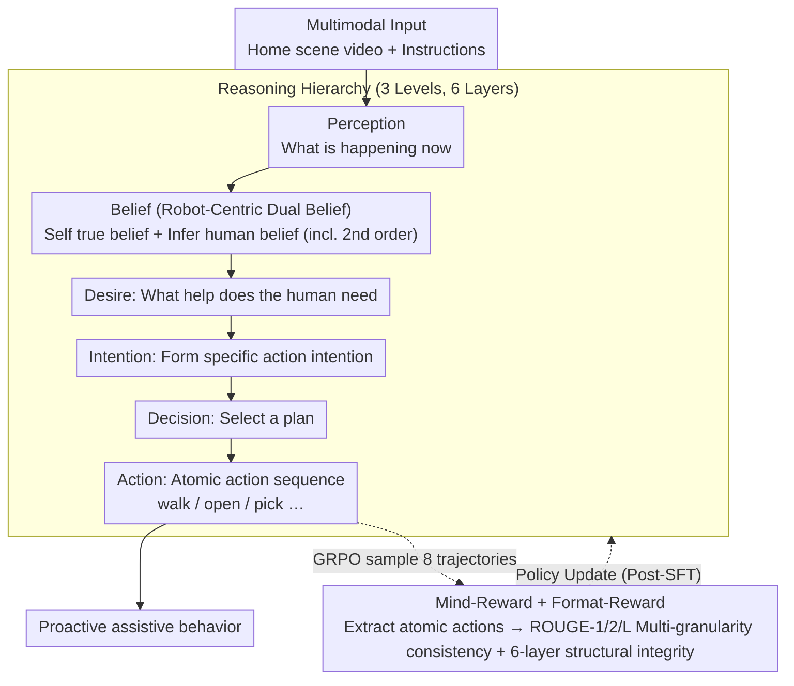

# MindPower: Enabling Theory-of-Mind Reasoning in VLM-based Embodied Agents

**Conference**: CVPR 2026  
**arXiv**: [2511.23055](https://arxiv.org/abs/2511.23055)  
**Code**: [zhangdaxia22.github.io/MindPower/](https://zhangdaxia22.github.io/MindPower/) (Benchmark)  
**Area**: Multimodal VLM  
**Keywords**: Theory of Mind, BDI Reasoning, Embodied Agent, Mind-Reward, GRPO

## TL;DR

MindPower introduces a robot-centric Theory-of-Mind (ToM) reasoning framework that organizes the process of Perception → Belief → Desire → Intention → Decision → Action into a six-layer reasoning hierarchy. By optimizing reasoning consistency with Mind-Reward (based on GRPO), the model exceeds GPT-4o by 12.77% in decision-making and 12.49% in action generation.

## Background & Motivation

**Background**: The field of embodied agents is advancing rapidly—PaLM-E, RoboBench, and Smart-Help have achieved task decomposition and execution. While VLMs (GPT-4o, Gemini, Qwen-VL) excel at the perception layer, they remain weak in inferring human intentions and providing proactive assistance. Existing ToM benchmarks (MuMA-ToM, MMToM-QA) only evaluate the inference of mental states of characters within videos.

**Limitations of Prior Work**: (1) Existing VLM-based agents can only execute explicit instructions and lack the ability to infer human beliefs, desires, and intentions; (2) Current ToM benchmarks adopt a "character-centric" perspective—focusing only on human mental states in videos without involving the agent's own perspective or requiring decision and action generation; (3) VLMs are easily distracted by scene biases at the perception layer (e.g., predicting "cleaning" upon seeing a kitchen rather than reasoning the actual intent).

**Key Challenge**: An agent needs to understand "what someone else is thinking" to help proactively, but it also needs to reason from "its own perspective"—e.g., "I know the apple is actually in the fridge, even though Alice thinks it is on the table." Existing benchmarks and methods fail to establish this dual-perspective reasoning loop.

**Goal**: To enable embodied agents to infer human mental states (beliefs, desires, intentions) from their own perspective and make proactive decisions and actions based on these inferences.

**Key Insight**: Systematically introduce the BDI (Belief-Desire-Intention) framework from cognitive science into embodied agents. Construct a three-level, six-layer continuous reasoning hierarchy and utilize a structured reward function (Mind-Reward) to optimize reasoning consistency via Reinforcement Learning (RL).

**Core Idea**: Link perception to action using a three-level, six-layer Robot-Centric BDI reasoning hierarchy, and optimize the consistency of the reasoning chain through GRPO using Mind-Reward based on atomic action matching.

## Method

### Overall Architecture

MindPower aims to enable embodied agents to proactively decide on actions by inferring human beliefs, desires, and intentions from their own perspective rather than just executing explicit commands. It consists of three components: a benchmark (**MindPower Benchmark**, 590 scenarios from VirtualHome + ThreeDWorld, including false belief correction and implicit goal inference tasks), a reasoning hierarchy (**Reasoning Hierarchy**, three levels and six layers) connecting perception to action, and a reinforcement signal (**Mind-Reward + GRPO**) to ensure consistency in the reasoning chain. The Robot-Centric dual-belief perspective is embedded within the belief layer of the hierarchy, distinguishing it from older benchmarks that only evaluate third-party mental states. The entire pipeline uses Qwen2.5-VL-7B as the base model, with SFT for cold-starting basic reasoning capabilities followed by GRPO to refine the reasoning chain.

### Key Designs

**1. Reasoning Hierarchy: Decomposing "One-step" Decisions into a Traceable Six-layer Chain**

Existing VLMs typically output decisions directly when viewing a scene, lacking an interpretable reasoning process. MindPower formalizes the decision process as a chain: Level-1 Perception `<Perception>` answers "what is happening now"; Level-2 Mental Reasoning follows `<Belief>` (inferring self and human beliefs, supporting second-order beliefs—"I think Alice thinks the apple is on the table") → `<Desire>` ("What help does Alice need") → `<Intention>` (formulating specific action intent); Level-3 results in `<Decision>` (selecting a plan) → `<Action>` (outputting atomic operations like `walk(fridge), open(fridge), pick(apple)`). This ensures every action is supported by a traceable chain of belief-desire-intention evidence.

**2. Robot-Centric Perspective: Maintaining Mental Models for Self and Others**

ToM benchmarks like MuMA-ToM or MMToM-QA usually require models to answer multiple-choice questions about a character's mental state, keeping the agent as an observer. True collaboration requires the agent to hold two sets of beliefs: in a false belief correction task, the agent observes an object being moved. When the human returns to search for it, the agent must simultaneously infer "Alice thinks the apple is on the table (her false belief)" and "I know the apple is actually in the fridge (my true belief)" to conclude "I should fetch the apple from the fridge for her." This parallel modeling is essential for assistive behavior.

**3. Mind-Reward: Optimizing Consistency via Atomic Action Matching**

The reasoning chain is sequential, with temporal and logical dependencies. Focusing only on the final action score fails to regulate intermediate steps. Mind-Reward utilizes an LLM (Qwen3-Max) to extract atomic action sequences from each reasoning layer and calculates alignment across three granularities—atomic accuracy (ROUGE-1), local consistency (ROUGE-2), and global consistency (ROUGE-L)—to synthesize a process-based reward:

$$R_{Mind} = \alpha_1 R_{atomic} + \alpha_2 R_{local} + \alpha_3 R_{global}$$

A Format-Reward is also included to ensure the integrity of the six-layer structure. Compared to black-box scoring of final outputs, distributing rewards throughout the steps constrains reasoning quality.

### An Example: False Belief Correction

Example of a six-layer process where Alice searches for an apple: **Perception**—The agent sees Alice place an apple on the table and leave, then observes someone moving it to the fridge; **Belief**—First-order "The apple is in the fridge," second-order "Alice still thinks it is on the table," detecting a conflict (false belief); **Desire**—Inferring Alice wants the apple upon return; **Intention**—Deciding to bridge the information gap and proactively fetch the apple; **Decision**—Choosing "Fetch apple and give it to Alice" rather than just "Remind her it is not on the table"; **Action**—Output `walk(fridge), open(fridge), pick(apple), walk(Alice), give(apple)`. 

### Loss & Training

- Two-stage training: (1) SFT cold-start (5 epochs) to establish basic reasoning; (2) GRPO Reinforcement (400 iterations, 8 samples per session) using Mind-Reward + Format-Reward.
- GRPO updates the policy via relative advantage within a group: $A_i = (R_i - \text{mean}(\{R_j\})) / \text{std}(\{R_j\})$.
- Training conducted on a single H800 GPU using Qwen2.5-VL-7B as the base model.

## Key Experimental Results

### Main Results

| Method | Decision (S) | Action SR | Action AC | BPC |
|------|-------------|-----------|-----------|-----|
| GPT-4o (Image) | 34.35 | 1.82 | 2.91 | 8.05 |
| Gemini-2.5 Pro | 33.87 | 2.08 | 2.54 | 8.56 |
| Video-R1 (Best Open Source) | 30.33 | 1.43 | 1.72 | 6.45 |
| Qwen2.5-VL-7B (Base) | 26.56 | 0.29 | 0.22 | 6.07 |
| **Ours (SFT+Mind-Reward)** | **47.12** | **11.75** | **15.40** | **8.87** |
| Human Baseline | 56.66 | 19.37 | 26.26 | 8.19 |

### Ablation Study

| Training Config | Action AC | Decision (S) | BPC |
|----------|-----------|-------------|-----|
| Qwen2.5-VL-7B (No training) | 0.22 | 26.56 | 6.07 |
| Mind-Reward only (No SFT) | 0.40 | - | - |
| SFT only (No RL) | 10.48 | 42.35 | 8.32 |
| **SFT + Mind-Reward** | **15.40** | **47.12** | **8.87** |

| Reasoning Strategy (GPT-4o) | Decision | Action AC |
|-------------------|----------|-----------|
| Direct Output (No Reasoning) | 33.11 | 0.82 |
| Standard CoT (`<think>`) | 29.46 | 0.90 |
| **MindPower Hierarchy** | **34.35** | **2.91** |

### Key Findings

- SFT alone provides a massive boost (Action AC: 0.22→10.48), demonstrating the effectiveness of the BDI hierarchy structure.
- RL further improves performance by about 5 points (10.48→15.40) on top of SFT, but RL without SFT is largely ineffective.
- MindPower Hierarchy significantly outperforms standard CoT (Decision +4.89%)—structured BDI reasoning is more effective than generic "thinking."
- Open-source VLMs severely lack a Robot-Centric perspective and are easily biased by scene context (e.g., kitchen → cleaning).
- A significant gap remains compared to the Human Baseline (Decision: 47.12 vs 56.66).

## Highlights & Insights

- Systematically introduces the BDI framework into embodied agents, resulting in an interpretable reasoning chain where every decision is backed by traceable beliefs.
- The Robot-Centric perspective is a core innovation—the agent not only infers others' mental states but also explicitly models its own beliefs to achieve second-order reasoning.
- Mind-Reward decomposes reasoning quality into atomic, local, and global consistency, offering more control than black-box LLM scoring.
- Insightful task design: False Belief Correction (detecting moved objects) and Implicit Goal Inference (inferring needs from search behavior).

## Limitations & Future Work

- The dataset contains only 590 scenarios, all from simulators (VirtualHome + ThreeDWorld), limiting scene diversity.
- The action space is coarse (high-level atomic operations like `walk(fridge)`) and does not involve low-level motor control.
- Mind-Reward relies on Qwen3-Max for atomic action extraction, introduces additional LLM dependency.
- Whether automatic metrics for open-ended evaluation (BERTScore, ROUGE) truly reflect reasoning quality remains debatable.
- Performance was only evaluated on a 7B model; the behavior of larger-scale models was not verified.

## Related Work & Insights

- **MuMA-ToM / MMToM-QA**: These focus on multiple-choice questions for character mental state inference, whereas MindPower requires full BDI reasoning and action generation from a self-perspective.
- **Smart-Help / AToM-Bot**: Provide human-robot assistance but lack explicit mental reasoning; MindPower explicitly models the detection and correction of belief inconsistencies.
- **Video-R1 / VideoChat-R1**: Use RL for video understanding but do not involve ToM reasoning or embodied decision-making.
- **Insight**: The BDI reasoning hierarchy can be generalized as a "structured CoT" for other tasks requiring intent inference; the process decomposition and atomic matching in Mind-Reward provide a reference for designing other process-based rewards.

## Rating

- ⭐⭐⭐⭐⭐ Novelty: Robot-Centric ToM + BDI reasoning hierarchy is a fresh perspective, a cross-disciplinary innovation between cognitive science and AI.
- ⭐⭐⭐⭐ Experimental Thoroughness: Comparison across multiple VLMs + Human Baseline + detailed ablation, though the dataset size is small.
- ⭐⭐⭐⭐ Writing Quality: Clear concepts and well-structured, with a formalized 3-level/6-layer framework that is easy to follow.
- ⭐⭐⭐⭐ Value: Empowering embodied agents with ToM is a critical direction; while practical application is distant, the path is clearly defined.

<!-- RELATED:START -->

## Related Papers

- [\[ICML 2026\] From Shortcuts to Reasoning: Robust Post-Training of Theory of Mind with Reinforcement Learning](../../ICML2026/vlm_reasoning/from_shortcuts_to_reasoning_robust_post-training_of_theory_of_mind_with_reinforc.md)
- [\[ICML 2025\] Overcoming Multi-step Complexity in Multimodal Theory-of-Mind Reasoning: A Scalable Bayesian Planner](../../ICML2025/vlm_reasoning/overcoming_multi-step_complexity_in_multimodal_theory-of-mind_reasoning_a_scalab.md)
- [\[CVPR 2026\] See, Think, Act: Teaching Multimodal Agents to Effectively Interact with GUI by Identifying Toggles](see_think_act_teaching_multimodal_agents_to_effectively_interact_with_gui_by_ide.md)
- [\[CVPR 2026\] CLiViS: Unleashing Cognitive Map through Linguistic-Visual Synergy for Embodied Visual Reasoning](clivis_unleashing_cognitive_map_through_linguistic-visual_synergy_for_embodied_v.md)
- [\[NeurIPS 2025\] VAGEN: Reinforcing World Model Reasoning for Multi-Turn VLM Agents](../../NeurIPS2025/vlm_reasoning/vagen_reinforcing_world_model_reasoning_for_multi-turn_vlm_agents.md)

<!-- RELATED:END -->
