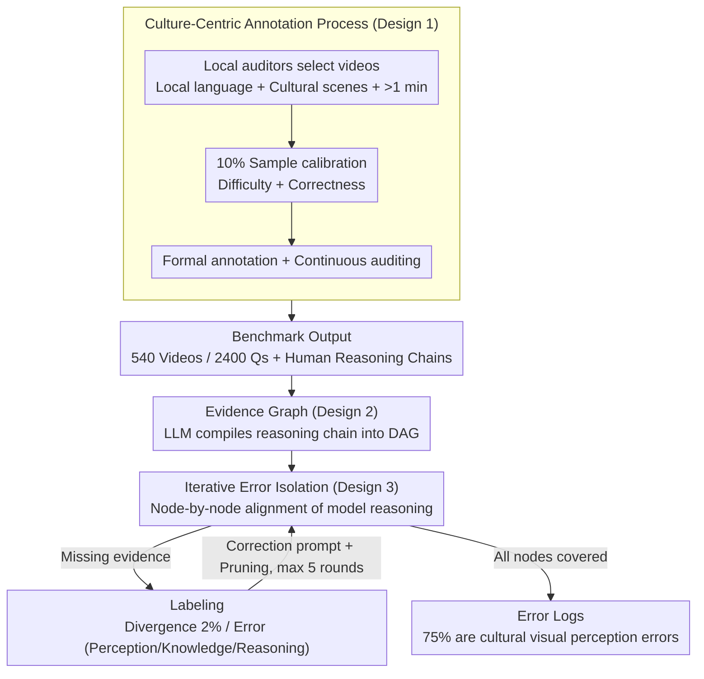

# MINERVA-Cultural: A Benchmark for Cultural and Multilingual Long Video Reasoning

**Conference**: CVPR 2026  
**arXiv**: [2601.10649](https://arxiv.org/abs/2601.10649)  
**Code**: To be released  
**Area**: Video Understanding / Multicultural Benchmark  
**Keywords**: Video Question Answering, Multicultural Understanding, Multilingual Reasoning, Long Video, Evidence Graph Error Analysis

## TL;DR

The MINERVA-Cultural benchmark is introduced, featuring 2,400 human-annotated video reasoning questions across 18 languages/regions. Through evidence graphs and an iterative error isolation strategy, it reveals severe deficiencies in the cultural visual perception of current SOTA Video-LLMs (the strongest model, Gemini-2.5-Pro, achieves only 45.07% vs. 95.22% for humans).

## Background & Motivation

1. **Background**: Significant progress has been made in video understanding, with long video understanding becoming a focal point. Benchmarks like EgoSchema, LongVideoBench, and MLVU have driven model development. Frontier models such as GPT-5 and Gemini-2.5 demonstrate strong performance on standard benchmarks.

2. **Limitations of Prior Work**: (a) Existing video benchmarks are dominated by Western content and English, introducing severe evaluation bias; (b) Cross-cultural benchmarks like ViMUL-Bench rely on automatic translation, and their visual content remains tied to Western concepts; (c) Most focus only on final answer accuracy, ignoring specific failure modes in the reasoning process.

3. **Key Challenge**: The dominance of Western/English content in training data leads to a severe lack of understanding of low-resource languages and cultures (e.g., Tamil, Telugu). Simple accuracy metrics fail to reveal "exactly at which step the model failed."

4. **Goal**: (a) Construct a multicultural and multilingual video reasoning benchmark annotated by local experts; (b) Provide human reasoning chains as diagnostic tools; (c) Develop a fine-grained error analysis method to locate the causes of model failure.

5. **Key Insight**: Each question is designed to require "visual cultural understanding" skills, tightly binding perception with culture. Human reasoning processes are modeled via Directed Acyclic Graphs (DAGs) to iteratively isolate and classify errors.

6. **Core Idea**: By using a long video reasoning benchmark fully annotated by local experts in 18 regions (non-translated) combined with an evidence graph iterative analysis method, the systematic deficiencies of Video-LLMs in cultural visual perception are exposed and quantified.

## Method

### Overall Architecture

This work addresses a question often avoided by existing video benchmarks: to what extent can current Video-LLMs reason about "non-Western, non-English" cultural videos, and at which step do they fail? To this end, two components are provided. First is the benchmark itself—540 videos and 2,400 questions covering 18 languages/regions and 6 cultural domains. Each question is accompanied by a multi-step reasoning chain written by local experts rather than just a ground-truth answer. Second is the diagnostic method: the human reasoning chain is compiled into an evidence graph (DAG). The model's reasoning is then aligned node-by-node with the human evidence along this graph, using iterative error isolation to identify and categorize every failure. The former ensures that "tasks truly require understanding cultural visuals," while the latter ensures "failures can be attributed to either perception or reasoning."

### Key Designs

**1. Culture-Centric Annotation Process: Making "Cultural Visual Understanding" a Hard Constraint**

Many so-called cross-cultural benchmarks are "pseudo-multicultural," consisting of automatically translated English questions paired with Western imagery. Models can often guess the answer using common sense or audio, bypassing cultural visual understanding. This work uses a four-stage pipeline to block these shortcuts: local auditors select YouTube videos based on a cultural taxonomy, requiring local language, cultural scenes, and a duration of over 1 minute. Next is difficulty calibration, where 10% of samples are pre-labeled to ensure the questions are sufficiently difficult for LLMs—they must not be solvable by single frames, audio alone, or common sense. Correctness calibration follows, where independent auditors re-answer the questions blindly; disagreement triggers revisions until consensus is reached. Finally, official annotation and auditing occur. Each question is forced to require at least two reasoning skills, one of which must be "visual cultural understanding."

**2. Evidence Graph: Compiling Human Reasoning into Localizable DAGs**

Relying solely on final accuracy makes it impossible to distinguish between a model "not seeing a cultural garment" and "seeing it but reasoning incorrectly." The evidence graph decouples these errors. An LLM compiles the human-written reasoning chain into atomic evidence nodes—categorized into timestamped visual observations, external knowledge retrieval, and logical reasoning—connected by prerequisite dependency edges. If upstream evidence is incorrect, downstream reasoning is blocked. A linear human reasoning chain thus becomes a DAG representing causal dependencies and spatio-temporal relationships. Statistically, each question requires an average of 5.0 atomic nodes, with 63% tied to specific video timestamps, indicating that the tasks are heavily grounded in visual evidence.

**3. Iterative Error Isolation: Preventing Early Errors from Masking Subsequent Failures**

One-shot error analysis has a fatal flaw: if a model fails early, all subsequent reasoning is based on a false premise. You only see the first error, while actual reasoning deficits are "covered" by earlier perceptual failures. Iterative Error Isolation uses a three-phase loop: alignment of model reasoning with human evidence node-by-node; stopping at missing evidence; labeling the error (distinguishing "divergence" (~2%) from "errors" like temporal/spatial localization or attribute misrecognition); and finally providing a targeted correction prompt to the model, pruning the evaluated node, and allowing the model to continue on the corrected premise. This continues for up to 5 rounds, covering 99.7% of cases. This iterative approach uncovers 22% more errors compared to one-shot analysis, specifically surfacing 78 reasoning errors previously masked by perceptual failures.

### Loss & Training

As this is a benchmark paper, no model training is involved. Evaluation utilizes an LLM Judge (Gemini-2.5-Flash) to score open-ended responses on a 0–2 scale, using majority voting to mitigate evaluation bias.

## Key Experimental Results

### Main Results

**Model Performance across 18 Regions (Accuracy %):**

| Model | Aggregate | Highest Region | Lowest Region |
|------|-----------|---------|---------|
| Qwen-2.5-VL | 12.75 | en-GB (25.70) | ta-IN (3.60) |
| Qwen-3-VL | 21.50 | en-GB (34.58) | te-IN (12.40) |
| Claude-Sonnet-4 | 23.36 | en-GB (29.91) | te-IN (14.40) |
| GPT-5-mini | 36.64 | ko-KR (51.90) | ta-IN (16.40) |
| GPT-5 | 42.20 | id-ID (56.34) | te-IN (23.60) |
| Gemini-2.5-Flash | 35.84 | de-DE (51.90) | ta-IN (20.00) |
| **Gemini-2.5-Pro** | **45.07** | **ko-KR (64.29)** | **te-IN (28.00)** |
| **Human Baseline** | **95.22** | it-IT (98.24) | de-DE (90.51) |

### Ablation Study

| Analysis Dimension | Key Findings |
|---------|---------|
| Audio vs. Video-only | Adding audio improves performance by 4.32% on average (zh-TW +8.15%, id-ID +7.09%) |
| Reasoning Budget (token) | Accuracy increases from 35.9% to 45.9% as budget goes from 128 to 2k tokens, then saturates |
| Frame Count (1→512) | Performance increases monotonically but with diminishing returns, indicating a need for temporal reasoning |
| Error Type Analysis | 75% of errors are attributed to cultural visual perception (Time/Space localization, attribute misrecognition, hallucination) |

### Key Findings

- **Huge Human-AI Gap**: Even the strongest Gemini-2.5-Pro (45.07%) lags behind humans (95.22%) by 50 percentage points.
- **Significant Cultural Disparity**: The gap in performance for the same model between Korean (ko-KR, 64.29%) and Telugu (te-IN, 28.00%) is 36 percentage points, exposing severe cultural bias.
- **South Indian Languages are Hardest**: Performance in ta-IN (31.60%), te-IN (28.00%), and mr-IN (38.72%) is significantly lower than in English-speaking regions.
- **75% of Errors are Cultural Visual Perception**: The issue is not necessarily a lack of reasoning capability, but rather that models "cannot see" or "cannot understand" culture-specific visual elements (garments, rituals, symbols).
- **Iterative Error Analysis is Crucial**: 22% of errors are missed in one-shot analysis, particularly reasoning errors masked by perceptual failures.
- **Low-resource Perception Errors are 1.4x Higher**: Cultural perception errors in ar-EG and ta-IN are 40% more frequent than in en-GB or ja-JP.

## Highlights & Insights

- **Cultural Understanding as a Visual Perception Problem**: A key finding is that models often fail not because they cannot reason, but because they cannot perceive culture-specific visual elements. This suggests that increasing cultural diversity in pre-training data is more critical than merely enhancing reasoning logic.
- **Evidence Graph + Iterative Error Isolation Methodology**: This diagnostic approach offers depth far beyond simple accuracy. It is transferable to any benchmark requiring multi-step reasoning (e.g., mathematical reasoning, code generation).
- **High Standard of Human Annotation**: Every question is annotated by local cultural experts and calibrated by independent auditors, avoiding translation artifacts. This is a resource-intensive but highly valuable contribution to the community.

## Limitations & Future Work

- **Limited Scale**: With 2,400 questions across 18 regions (~130 per region), the coverage of all cultural scenarios may be insufficient.
- **Reliance on LLM Judge**: Although majority voting is used, LLM evaluation itself may carry biases toward certain languages.
- **Geographic Coverage**: Parts of Africa, South America, and smaller Southeast Asian linguistic groups are not yet included.
- **Future Directions**: (a) Expansion to more regions and languages; (b) Developing strategies for culture-aware visual pre-training data; (c) Open-sourcing automated diagnostic tools based on evidence graphs; (d) Exploring strategies to balance cultural distribution in pre-training data.

## Related Work & Insights

- **vs. ViMUL-Bench**: While ViMUL-Bench covers 14 languages, it uses a mix of non-cultural videos and some translated annotations. MINERVA-Cultural uses only original annotations by local experts and culture-specific video content.
- **vs. MINERVA**: While the original MINERVA provides reasoning chains and error classification, MINERVA-Cultural adds the multicultural dimension and the evidence graph analysis for finer diagnostics.
- **vs. LongVideoBench/MLVU**: These focus on general video understanding. MINERVA-Cultural fills the gap in cultural and multilingual reasoning.

## Rating

- Novelty: ⭐⭐⭐⭐ First large-scale, fully human-annotated multicultural video reasoning benchmark with a novel evidence graph analysis.
- Experimental Thoroughness: ⭐⭐⭐⭐⭐ Evaluates 7 models across 18 regions with multi-dimensional analysis (audio/frames/budget/error types) and human baselines.
- Writing Quality: ⭐⭐⭐⭐⭐ Strong motivation, detailed annotation process, and insightful analysis.
- Value: ⭐⭐⭐⭐⭐ Exposes cultural biases in AI, defines key directions for improvement, and is significant for equitable AI and global deployment.

<!-- RELATED:START -->

## Related Papers

- [\[CVPR 2026\] MMTIT-Bench: A Multilingual and Multi-Scenario Benchmark with Cognition-Perception-Reasoning Guided Text-Image Machine Translation](mmtit-bench_a_multilingual_and_multi-scenario_benchmark_with_cognition-perceptio.md)
- [\[CVPR 2026\] VideoARM: Agentic Reasoning over Hierarchical Memory for Long-Form Video Understanding](videoarm_agentic_reasoning_over_hierarchical_memory_for_long-form_video_understa.md)
- [\[CVPR 2026\] Thinking with Drafts: Speculative Temporal Reasoning for Efficient Long Video Understanding](thinking_with_drafts_speculative_temporal_reasoning_for_efficient_long_video_und.md)
- [\[CVPR 2026\] A Multi-Agent Perception-Action Alliance for Efficient Long Video Reasoning](a_multi-agent_perception-action_alliance_for_efficient_long_video_reasoning.md)
- [\[CVPR 2026\] Thinking With Videos: Multimodal Tool-Augmented Reinforcement Learning for Long Video Reasoning](thinking_with_videos_multimodal_tool-augmented_reinforcement_learning_for_long_v.md)

<!-- RELATED:END -->
