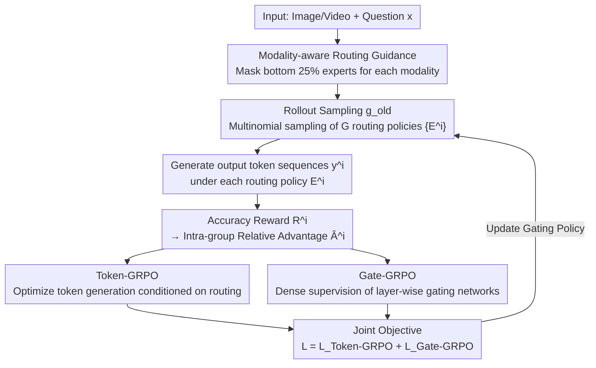

# MoE-GRPO: Optimizing Mixture-of-Experts via Reinforcement Learning in Vision-Language Models

**Conference**: CVPR 2026  
**arXiv**: [2603.24984](https://arxiv.org/abs/2603.24984)  
**Code**: None  
**Area**: Multimodal VLM  
**Keywords**: Mixture-of-Experts, Reinforcement Learning, Routing Policy Optimization, Vision-Language Models, GRPO

## TL;DR

Expert selection in MoE is modeled as a sequential decision-making problem. The routing policy is optimized via GRPO reinforcement learning with modality-aware routing guidance. This approach consistently outperforms deterministic top-K routing and its variants on image and video understanding tasks for VLMs.

## Background & Motivation

**Background**: Mixture-of-Experts (MoE) reduces the computational overhead of Transformers by sparsely activating a subset of parameters while maintaining high model capacity. Recently, MoE has been extended to Vision-Language Models (VLMs), achieving efficient multimodal understanding. The standard practice is to use deterministic top-K greedy selection for experts at each layer.

**Limitations of Prior Work**: Deterministic top-K routing limits the exploration of diverse expert combinations, often leading the model to overfit to a small subset of experts. Methods like V-MoE introduce randomness by adding Gaussian noise to gating scores, but this heuristic perturbation only partially alleviates the issue and does not explicitly optimize the expert selection "policy."

**Key Challenge**: Existing methods rely on either deterministic selection (lacking exploration) or noisy random selection (lacking directionality), neither of which truly learns an optimal expert routing policy. Expert routing is essentially a sequential decision-making problem, yet it has traditionally been treated as a simple softmax + top-K operation.

**Goal**: (1) How to enable the MoE router to learn superior expert combinations? (2) How to perform efficient and stable routing policy exploration in multimodal scenarios?

**Key Insight**: Explicitly model expert selection as a sequential decision-making problem. Leverage reinforcement learning (GRPO) to explore different expert combinations through multiple rollouts and optimize the routing policy based on reward feedback. Additionally, observe that tokens from different modalities have distinct preferences for experts, which can be used as a prior to constrain the exploration space.

**Core Idea**: Replace deterministic top-K routing with GRPO reinforcement learning. Jointly optimize token generation and hierarchical expert selection policies through Token-GRPO + Gate-GRPO, and introduce modality-aware guidance to accelerate convergence.

## Method

### Overall Architecture

This paper addresses the issue that MoE routers "cannot explore." Standard approaches use deterministic top-K greedy selection at each layer; once the router is fixed, it repeatedly activates the same experts. The core idea of MoE-GRPO is to treat "which experts to select" as a policy optimizable via reinforcement learning, allowing the router to learn better expert combinations through trial and error.

The workflow is as follows: Given an input image (or video) and a question $\boldsymbol{x}$, the rollout module $g_\text{old}$ first samples $G$ different expert routing policies $\{\boldsymbol{E}^i\}_{i=1}^G$ from the gating network. Each $\boldsymbol{E}^i$ represents a complete sequence of expert choices across all layers. Before sampling, **modality-aware routing guidance** masks experts irrelevant to the current modality, narrowing the exploration budget to a meaningful range. The model generates an output token sequence $\boldsymbol{y}^i$ for each of the $G$ routes. Accuracy rewards $R^i$ are calculated based on whether the answers are correct, and advantage values $\hat{A}^i$ are computed using relative intra-group rewards. Finally, this advantage drives two complementary objectives: **Token-GRPO** updates routing policies from the output side, and **Gate-GRPO** updates them from the gating side of each layer, pushing the policy towards expert combinations with higher rewards. In other words, the same problem is tested with 8 parallel "expert combinations"; the successful ones are reinforced, and the updated gating network enters the next round of sampling.

### Key Designs

**1. Token-GRPO: Driving Expert Selection via Task Rewards**

Simply allowing the router to try combinations randomly is insufficient; signals must indicate which routes are better. Token-GRPO connects this signal to the output tokens: for each rollout-sampled expert policy $\boldsymbol{E}^i$, the model generates the corresponding token sequence $\boldsymbol{y}^i$. Then, a PPO-style clipped ratio objective optimizes the generation probability of each token based on the relative advantage within the group. Crucially, the probability is **conditioned on the expert routing**:

$$r_t^i = \frac{\pi_\theta(y_t^i \mid \boldsymbol{x}, \boldsymbol{y}_{<t}^i; \boldsymbol{E}_{<t}^i)}{\pi_\text{old}(y_t^i \mid \boldsymbol{x}, \boldsymbol{y}_{<t}^i; \boldsymbol{E}_{<t}^i)}$$

Since routing $\boldsymbol{E}$ appears in the condition, rewards for correct answers flow back through this probability chain to the decisions that initially selected those experts. This component directly links to task accuracy and serves as the primary performance engine: removing it in ablation studies drops the average accuracy from 55.7% to 50.9%.

**2. Gate-GRPO: Dense Supervision for Each Layer's Routing**

The issue with Token-GRPO is that it only indirectly influences routing from the final output; the signals reaching expert selections in middle layers are sparse. Gate-GRPO applies supervision directly to the gating network of each layer: at each layer $l$ and token position $t$, a routing ratio is calculated as $\hat{r}_{t,l}^i = g_\theta^l(E_{t,l}^i) / g_\text{old}^l(E_{t,l}^i)$. This is similarly optimized using a clipped objective after averaging across all layers and token positions. This provides fine-grained, dense gradients for routing decisions at every layer without waiting for output rewards to backpropagate. It complements Token-GRPO: one handles coarse-grained goal alignment, while the other handles hierarchical fine-grained routing correction. Removing Gate-GRPO results in a 1.8% drop in average accuracy.

**3. Modality-aware Routing Guidance: Pruning Invalid Exploration with Modality Priors**

RL training inevitably faces efficiency challenges: selecting $K$ experts out of $N$ across all layers and tokens leads to an extraordinarily large combinatorial space, making convergence through pure random sampling difficult. A simple but effective prior is utilized: visual and text tokens prefer different experts. Specifically, the frequencies of each expert being selected by visual tokens $N_v(e_i)$ and text tokens $N_t(e_i)$ are counted and normalized into modality-aware scores $\hat{s}_v(e_i)$ and $\hat{s}_t(e_i)$. When processing a visual token, experts are ranked by $\hat{s}_v$, and the gating scores of the bottom P% (experimentally P=25%) are set to $-\infty$ to be masked. Multinomial sampling then occurs among the remaining experts. This concentrates the exploration budget on experts that "this type of token typically uses," avoiding wasted trials on clearly irrelevant experts. Ablation studies show this outperforms unguided noisy sampling and multinomial sampling by 1.5% and 0.9%, respectively, with faster convergence and lower reward variance.

### Loss & Training

The final objective function is $\mathcal{L}_\text{MoE-GRPO} = \mathcal{L}_\text{Token-GRPO} + \mathcal{L}_\text{Gate-GRPO}$. Since the gating network is trained from scratch without a pre-trained routing policy, KL divergence regularization is not used (unlike standard GRPO). The reward function employs an accuracy reward (correct=1, incorrect=0). Training is based on an MoE architecture converted from InternVL3.5-1B (N=8 experts, K=2 active), with total parameters of 2.9B and 1.3B activated. It uses 100K multiple-choice visual instruction tuning samples, 25K training steps, and takes approximately one day on 4 GPUs.

## Key Experimental Results

### Main Results

| Model | Architecture | Active/Total Params | MMBench | MMStar | MLVU | LongVideoBench | Avg. |
|------|------|-----------|---------|--------|------|----------------|------|
| InternVL3.5 + Det-FT | MoE | 1.3B/2.9B | 75.8 | 45.6 | 48.6 | 45.3 | 54.0 |
| InternVL3.5 + Stoch-FT-Noise | MoE | 1.3B/2.9B | 76.3 | 46.1 | 51.1 | 45.3 | 54.3 |
| InternVL3.5 + MoE-GRPO (Ours) | MoE | 1.3B/2.9B | **77.5** | 45.7 | **53.1** | **46.5** | **56.0** |
| InternVL2.5 (Dense) | Dense | 1B/1B | 70.7 | 50.1 | 57.3 | 47.9 | - |

MoE-GRPO achieves the best performance on 7 out of 9 benchmarks, outperforming the three baselines by an average accuracy of 2.0%, 2.3%, and 1.7%, respectively.

### Ablation Study

| Configuration | Avg. | Description |
|------|------|------|
| Token-GRPO + Gate-GRPO (Full) | 55.7 | Full model |
| Token-GRPO only | 53.9 | -1.8% without Gate-GRPO |
| Gate-GRPO only | 50.9 | -4.8% without Token-GRPO; token-level optimization is core |
| Modality-aware Guidance | 55.7 | Optimal |
| Modality-agnostic (Noise) | 54.2 | -1.5% |
| Modality-agnostic (Multinomial) | 54.8 | -0.9% |

### Key Findings

- Token-GRPO is the core driver of performance, while Gate-GRPO provides complementary hierarchical fine-grained supervision.
- Modality-aware guidance outperforms unguided methods by 0.9-1.5% on average, with faster convergence and lower reward variance.
- MoE-GRPO significantly improves expert diversity: routing distribution entropy increases from 1.05 (Det-FT) to 1.82.
- In cross-dataset generalization experiments (CLIP-MoE), MoE-GRPO outperforms Det-FT by 3.1% on average, whereas Det-FT degrades due to overfitting.
- In cross-domain generalization, MoE-GRPO shows consistent gains across all OOD datasets, outperforming CLIP-MoE by 4.1% on average.

## Highlights & Insights

- **New Paradigm for RL Routing Policy Optimization**: This is the first work to model MoE expert selection as a sequential decision-making problem and optimize it using RL. The approach is novel and effective, opening new directions for MoE architectural optimization, with potential for exploring more complex RL algorithms in the future.
- **Dual-layer GRPO Complementary Design**: Token-GRPO and Gate-GRPO provide supervision from the output and layer levels, respectively, combining coarse-grained goal alignment with fine-grained routing optimization. this hierarchical optimization strategy is transferable to other hierarchical decision problems.
- **Modality-aware Constraint on Exploration Space**: Leveraging modality-expert statistical priors to constrain the exploration space significantly improves training efficiency and stability without adding extra complexity. This strategy of using prior knowledge to guide RL exploration is applicable to other RL + Large Model scenarios.

## Limitations & Future Work

- Currently only validated on relatively small-scale models (1.3B active parameters); the effectiveness on larger MoE-VLMs (e.g., DeepSeek-V3 scale) is unknown.
- The rollout count G=8 increases training computational overhead (requiring 8 sets of outputs); maintaining efficiency in large-scale training is a challenge.
- The reward function relies only on accuracy (multiple-choice); applicability to open-ended generation tasks remains to be verified.
- Modality-aware guidance is based on static statistics of expert preferences; dynamic adaptation capabilities might be insufficient.

## Related Work & Insights

- **vs V-MoE**: V-MoE introduces exploration via Gaussian noise, but the noise is a directionless heuristic perturbation that does not optimize the "policy." MoE-GRPO explicitly optimizes the routing policy, yielding better results.
- **vs Expert Choice / Optimal Transport Routing**: These methods optimize routing for load balancing. MoE-GRPO optimizes from the perspective of task rewards and is complementary to load balancing losses (providing an extra 0.9% gain when combined).
- **vs Standard GRPO (DeepSeek-R1)**: Standard GRPO explores only at the token level. MoE-GRPO extends the action space to hierarchical expert selection, providing finer control.

## Rating

- Novelty: ⭐⭐⭐⭐ First application of RL to MoE routing policy optimization with a clear formulation.
- Experimental Thoroughness: ⭐⭐⭐⭐⭐ 9 benchmarks for image + video, cross-dataset generalization, domain generalization, multiple ablations, and routing analysis.
- Writing Quality: ⭐⭐⭐⭐ Clear logic, rich visualizations, and complete methodological derivation.
- Value: ⭐⭐⭐⭐ Provides a new paradigm for MoE routing optimization, although rollout overhead may limit application in actual deployment.

<!-- RELATED:START -->

## Related Papers

- [\[CVPR 2026\] EMO-R3: Reflective Reinforcement Learning for Emotional Reasoning in Multimodal Large Language Models](emo-r3_reflective_reinforcement_learning_for_emotional_reasoning_in_multimodal_l.md)
- [\[CVPR 2026\] Reading or Reasoning? Format Decoupled Reinforcement Learning for Document OCR](reading_or_reasoning_format_decoupled_reinforcement_learning_for_document_ocr.md)
- [\[CVPR 2026\] Dr. Seg: Revisiting GRPO Training for Visual Large Language Models through Perception-Oriented Design](dr_seg_revisiting_grpo_training_for_visual_large_language_models_through_percept.md)
- [\[CVPR 2026\] Incentivizing Versatile Video Reasoning in MLLMs via Data-Efficient Reinforcement Learning](incentivizing_versatile_video_reasoning_in_mllms_via_data-efficient_reinforcemen.md)
- [\[CVPR 2026\] R-C2: Cycle-Consistent Reinforcement Learning Improves Multimodal Reasoning](r-c2_cycle-consistent_reinforcement_learning_improves_multimodal_reasoning.md)

<!-- RELATED:END -->
