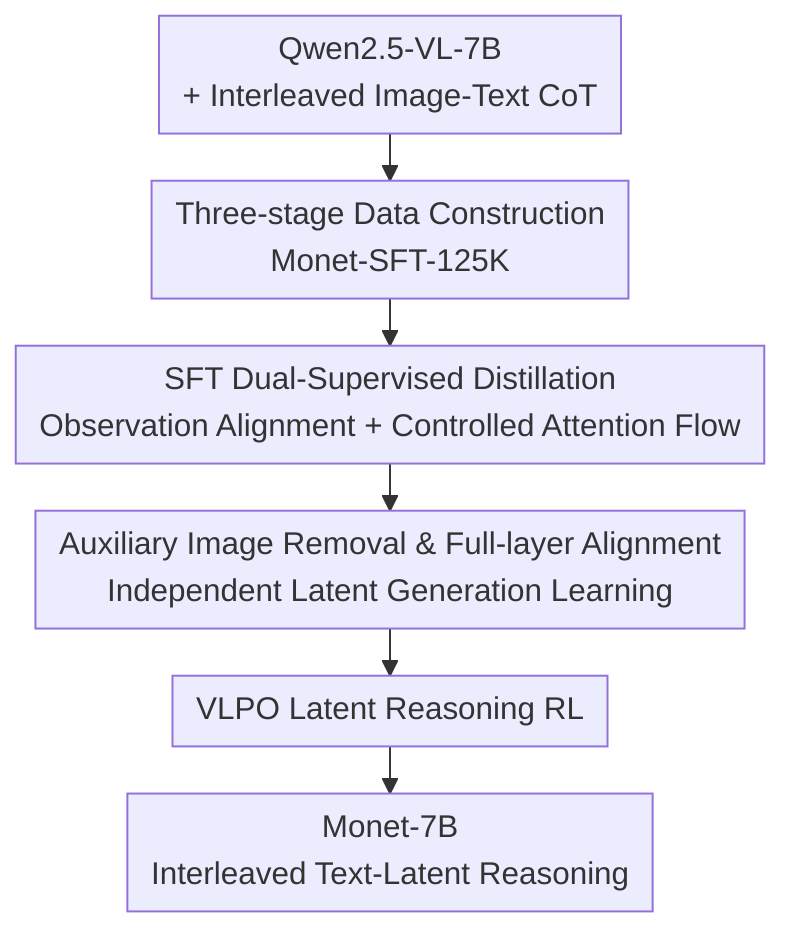

# Monet: Reasoning in Latent Visual Space Beyond Image and Language

**Conference**: CVPR 2026  
**Paper**: [CVF Open Access](https://openaccess.thecvf.com/content/CVPR2026/html/Wang_Monet_Reasoning_in_Latent_Visual_Space_Beyond_Image_and_Language_CVPR_2026_paper.html)  
**Code**: https://github.com/NOVAglow646/Monet  
**Area**: Multimodal VLM  
**Keywords**: Latent Visual Reasoning, MLLM, Distilled SFT, Reinforcement Learning, Continuous Latent Embeddings

## TL;DR
Monet enables Multimodal Large Language Models (MLLMs) to perform visual reasoning within a continuous latent visual space by generating sequences of latent embeddings as "intermediate visual thoughts," rather than relying on image cropping or external tools. Through a three-stage distilled SFT and a specialized Reinforcement Learning (RL) method called VLPO—which incorporates latent embeddings into the policy gradient—the 7B model achieves consistent gains in both real-world perception/reasoning and out-of-distribution (OOD) abstract visual reasoning.

## Background & Motivation
**Background**: "Thinking with images" is a dominant paradigm for enhancing the visual reasoning of MLLMs, where visual evidence is injected into intermediate steps of the Chain-of-Thought (CoT) rather than relying solely on text. Common approaches include predicting coordinates for cropping/grounding, calling external visual tools (depth estimation, etc.), or generating executable code to edit input images.

**Limitations of Prior Work**: These methods are constrained by the flexibility of external tools. First, models trained for specific tools (e.g., bounding box prediction) generalize poorly to tasks requiring complex visual operations (visual math, spatial reasoning). Second, tool dependency increases training overhead, and models often fail to generate valid tool calls or executable code. Third, reliance on external tools/interpreters necessitates asynchronous, multi-turn reasoning, increasing deployment complexity and latency. These are far from the human capability of flexible "mental imagination" in perceptual space.

**Key Challenge**: To mimic human abstract visual thinking, models must reason directly in a **continuous latent space**, generating latent embeddings that go beyond text descriptions and image embeddings. Previous latent visual reasoning works (e.g., LVR, Mirage) face two fundamental challenges: (1) **High alignment costs**: Aligning generated latent embeddings with hundreds of image tokens is computationally expensive, while mean pooling image tokens destroys fine-grained features. (2) **Insufficient supervision for latent embeddings**: In SFT, Next-Token-Prediction (NTP) loss is only applied to text tokens, making the model prone to overfitting on subsequent tokens rather than learning representations. In the RL stage, GRPO loss is only calculated on text tokens, ignoring latent embedding optimization. Consequently, performance gains are limited and task-specific.

**Goal**: To train a text-output MLLM (Qwen2.5-VL-7B) for latent reasoning by solving two sub-problems: how to provide low-cost, strong supervision for latent embedding generation during SFT, and how to allow reward signals to flow back to latent embeddings during RL.

**Key Insight**: The role of latent embeddings is to "substitute for auxiliary images to help predict subsequent observation descriptions." Therefore, the supervision signal should not be hard alignment with image tokens, but alignment with the **latent representations of key observation tokens**. If the model produces consistent representations for key visual description tokens under both "observed auxiliary image" and "generated latent embedding only" conditions, the latent embedding successfully encodes the necessary visual cues.

**Core Idea**: Replace expensive image token alignment with a dual-supervised distilled SFT featuring "key observation token alignment + controlled attention flow + latent-only backpropagation." Then, replace text-only GRPO with VLPO (Visual Latent Policy Optimization) which probabilistically models latent embeddings to ensure they are optimized during RL.

## Method

### Overall Architecture
Monet trains a text-output MLLM to produce a **text-latent interleaved** CoT. During inference (see original Figure 1 left), the model decides when to output a special token `<latent>` to initiate latent reasoning. The decoding process is modified so that the hidden representation of the last decoder layer is fed back as the input for the next step, generating a fixed number of $K$ latent embeddings before shifting back to text reasoning via `</latent>`. The training consists of **three-stage SFT** to teach the basic capability and **VLPO RL** to explicitly incorporate latent embeddings into policy optimization. All stages utilize the specialized Monet-SFT-125K dataset.

### Key Designs

**1. Monet-SFT-125K: Ensuring Auxiliary Images are "Necessary and Correct"**

Effective latent reasoning requires CoT data where intermediate visual steps are informative and noise-free. The authors identify three flaws in existing datasets: many samples can be answered correctly without auxiliary images (rendering them redundant), some intermediate images are inaccurate (introducing noise), and text tokens are treated equally regardless of their visual significance. They designed a three-stage curation: Stage 1 retains only samples where **Qwen2.5-VL-7B fails using only the question and original image**, ensuring auxiliary images are necessary. Stage 2 retains only samples where **Qwen2.5-VL-72B succeeds using the auxiliary image**, ensuring accuracy. Stage 3 uses DeepSeek-V3.1 and Gemini 2.5 Pro to **label text tokens corresponding to key visual observations** (wrapped in `<observation>...</observation>`), providing fine-grained supervision markers. The final 125K samples cover real-world scenes, documents, charts, and geometry.

**2. SFT Stage 2 Dual-Supervision: Distilling Target Latents via Observation Alignment and Controlled Attention**

This stage addresses the pain points of "high alignment cost" and "weak latent supervision." After a Stage 1 vanilla SFT warmup, Stage 2 utilizes a **Teacher** and **Student** both initialized from $M_\text{warm-up}$. The teacher receives CoT with ground-truth auxiliary images, while the student receives CoT where auxiliary images are followed by autoregressively generated latent embeddings. Three mechanisms are employed:

First, **Alignment of Key Observation Token Representations**. Latent embeddings must substitute for auxiliary images. Thus, observation token hidden representations should be consistent between the "Image (Teacher)" and "Latent (Student)" conditions. The authors freeze the teacher and derive all-layer observation token representations $H^*_\text{obs}=\{h^{*(i,l)}_\text{obs}\}$ to perform layer-wise cosine alignment with the student's corresponding representations $\hat h^{(i,l)}_\text{obs}$:

$$\mathcal{L}_\text{align-obs} = \frac{1}{N}\sum_i \sum_l \left(1 - \cos\big(h^{*(i,l)}_\text{obs}.\mathrm{detach}(),\ \hat h^{(i,l)}_\text{obs}\big)\right)$$

Second, **"Auxiliary Image → Latent Embedding → Observation" Controlled Attention Flow**. To ensure observation tokens encode visual information, auxiliary image embeddings are inserted before latent embeddings in the student's CoT. A modified attention mask allows **latent embeddings to attend to auxiliary images, but subsequent text tokens cannot**. This forces visual information to pass through the latent embedding bottleneck, compels the embeddings to encode relevant cues.

Third, **Latent-only Backpropagation**. To prevent the model from bypassing latent embeddings to minimize the alignment loss, gradients from $\mathcal{L}_\text{align-obs}$ are restricted to flow **only through the generated latent embeddings** back to parameters; other representations are detached (stop-gradient). Ablation tests show that removing this ("w/o latent-only BP") causes V\* performance to crash from 82.20 to 46.07. After Stage 2, the student $M_\text{stage2}$ is used to generate **target latent embeddings** $h^{*(i)}_\text{latent}$ for the next stage.

**3. SFT Stage 3: Removing Auxiliary Images and Full-layer Alignment**

To bridge the gap between training and inference (where truth auxiliary images are unavailable), Stage 3 re-initializes from $M_\text{warm-up}$. In the CoT, **auxiliary images are removed**, and the model is trained to generate $\hat h^{(i)}_\text{latent}$ aligned with the fixed targets $h^{*(i)}_\text{latent}$ from Stage 2:

$$\mathcal{L}_\text{align-latent} = \frac{1}{N}\sum_i \sum_l \left(1 - \cos\big(h^{*(i,l)}_\text{latent}.\mathrm{detach}(),\ \hat h^{(i,l)}_\text{latent}\big)\right)$$

Unlike previous works (LVR, Mirage) which align only the last layer, Monet uses **full-layer alignment** for stronger supervision. Combined with NTP loss, the total loss $\mathcal{L}_\text{stage3}=\mathcal{L}_\text{NTP}+\beta\mathcal{L}_\text{align-latent}$ ($\beta=2.0$) produces $M_\text{SFT}$.

**4. VLPO: Probabilistic Latent Embeddings for Reward Optimization**

Standard GRPO targets can only be calculated for text tokens, leaving latent reasoning unoptimized during RL. VLPO addresses this by **estimating the output probability of continuous latent embeddings** sampled during rollout to calculate an importance ratio $r_{i,t}(\theta)$. Specifically, the latent embedding $h^\text{old}_{i,t}$ generated by $\pi_\text{old}$ is treated as a sample from a Gaussian distribution centered at the current policy's output $h^\theta_{i,t}$:

$$\pi_\theta(h^\text{old}_{i,t}\mid Q,I,o_{i,<t}) = \exp\left(-\frac{1}{2\sigma^2}\lVert h^\text{old}_{i,t}-h^\theta_{i,t}\rVert^2 - \text{const}\right)$$

The ratio becomes $r_{i,t}(\theta)=\exp\big(-\frac{1}{2\sigma^2}\lVert h^\text{old}_{i,t}-h^\theta_{i,t}\rVert^2\big)$ (with constant scalar $\sigma$). When advantage $\hat A_{i,t}>0$, maximizing the objective is equivalent to **minimizing $\lVert h^\text{old}_{i,t}-h^\theta_{i,t}\rVert^2$**, effectively pulling the policy's latent embeddings toward "good actions." Rewards include only Accuracy (1 or 0) and Format (use of `\boxed{}`), deliberately avoiding rewards for "performing latent reasoning" to prevent trivial exploitation.

### Loss & Training
SFT Stage 1 trained for 4 epochs; Stages 2 and 3 for ~1 epoch each. RL trained on 3.2K subset of Thyme-RL for 1 epoch. $K_\text{train}=8$ for Monet-SFT, $K_\text{train}=10$ for Monet-7B (RL). Optimal $K_\text{test}$ selected from $\{8,10,12,16\}$.

## Key Experimental Results

### Main Results
On perception and reasoning benchmarks, Monet-7B outperforms vanilla SFT, SFT+GRPO, the cropping-based DeepEyes, and the latent predecessor LVR:

| Dataset (Overall) | Qwen2.5-VL-7B | vanilla SFT | SFT+GRPO | DeepEyes | Monet-7B | Gain |
|--------|------|------|------|------|------|------|
| V\* | 76.44 | 81.68 | 78.53 | 83.25 | **83.25** | +6.81 |
| HRBench4K | 68.00 | 68.38 | 70.00 | 71.25 | 71.00 | +3.00 |
| HRBench8K | 63.75 | 61.63 | 66.75 | 65.13 | **68.00** | +4.25 |
| MME-RealWorld-Lite | 45.75 | 51.28 | 52.42 | 54.28 | **55.50** | +9.75 |

On the OOD abstract reasoning benchmark VisualPuzzles, Monet achieves SOTA among open-source models:

| Model | VisualPuzzles Overall | Algorithmic | Analogical | Deductive |
|------|------|------|------|------|
| Qwen2.5-VL-7B | 32.71 | 37.02 | 21.80 | 47.50 |
| + vanilla SFT | 33.99 | 40.46 | 30.81 | 46.00 |
| + SFT + GRPO | 30.99 | 36.26 | 25.12 | 43.50 |
| DeepEyes | 32.96 | 37.79 | 27.01 | 41.00 |
| **Monet-7B** | **35.02** | **45.80** | 30.81 | **47.50** |

### Ablation Study

| Configuration | V\* | HRBench8K | MME-RW-Lite | VisualPuzzles | Note |
|------|------|------|------|------|------|
| Monet-7B (full) | 83.25 | 68.00 | 55.50 | 35.02 | Full package |
| Monet-SFT (w/o VLPO) | 82.20 | 66.00 | 52.68 | 30.48 | OOD drops 4.5 pts |
| Monet-SFT + GRPO | 80.10 | 64.75 | 54.19 | 31.51 | GRPO unstable for latents |
| w/o latent-only BP | 46.07 | 39.00 | 38.67 | 33.65 | Crash due to shortcuts |
| w/o auxiliary img | 73.30 | 57.63 | 39.66 | 28.60 | No visual flow, large drop |
| w/o obs token align | 75.39 | 63.50 | 46.90 | 27.48 | Align target missing |

### Key Findings
- **Latent-only BP is essential**: Removing it collapses V\* to 46.07, proving the model will reduce alignment loss through shortcuts without improving latent representations.
- **Dual supervision is non-negotiable**: Removing either observation alignment or auxiliary image attention flow leads to significant degradation.
- **VLPO drives OOD generalization**: On OOD VisualPuzzles, only the VLPO-enhanced model shows stable gains with $K_\text{test}>0$; vanilla SFT and GRPO fail to provide strong OOD generalization for latent reasoning.
- **Support for test-time scaling**: Performance often peaks when $K_\text{test} > K_\text{train}$. VLPO makes the choice of $K_\text{test}$ more robust.

## Highlights & Insights
- **Shifting from "image token alignment" to "observation token representation alignment"** solves both cost and supervision issues: instead of aligning hundreds of tokens, focus is placed on key reasoning tokens, making the process computationally efficient and purposeful.
- **Controlled attention mask as a structural constraint**: By making auxiliary images visible only to latents (not text), the model is forced to route visual information through the latent embedding bottleneck.
- **VLPO treats continuous latent embeddings as actions**: Through Gaussian modeling, the discrete token policy gradient framework was adapted to continuous latents, reducing the objective to an intuitive L2 distance toward "good" latents.
- **"Teacher as Referee" Data Curation**: Filtering for difficulty (7B fails) and effectiveness (72B succeeds with aux) is a reproducible formula for high-quality CoT datasets.

## Limitations & Future Work
- **Fixed length $K$ decoding**: $K$ is a hyperparameter rather than being adaptive to task difficulty; complex tasks might be limited by predefined steps.
- **Dependence on strong teacher models**: Curation relies on Qwen2.5-VL-72B and Gemini 2.5 Pro, making reproduction expensive and subject to teacher bias.
- **VLPO Gaussian assumption**: Modeling latent probability with a fixed $\sigma$ is a strong assumption; robustness across diverse tasks requires further study.
- **Scale and Architecture**: Validated only on a 7B backbone; scaling laws for latent reasoning in larger models remain unexplored.

## Related Work & Insights
- **vs LVR / Mirage**: These works align generated latents with auxiliary image tokens (LVR uses cropping, Mirage uses mean pooling) and only at the final layer, with standard GRPO. Monet uses **key observation representation alignment**, **full-layer alignment**, and **VLPO**, resulting in lower cost, stronger supervision, and superior OOD performance.
- **vs DeepEyes**: DeepEyes relies on discrete cropping, which is a fixed tool. Monet's continuous latent space reasoning provides higher flexibility, particularly for abstract puzzles.
- **vs GRPO**: While GRPO optimizes text tokens, its lack of probability modeling for latent embeddings renders it ineffective for latent-only optimization. VLPO bridges this gap.

## Rating
- Novelty: ⭐⭐⭐⭐⭐ "Observation alignment + Controlled attention + Latent-only BP" and "continuous latent RL via VLPO" are highly original.
- Experimental Thoroughness: ⭐⭐⭐⭐ Comprehensive results across perception and OOD benchmarks, though restricted to a 7B backbone.
- Writing Quality: ⭐⭐⭐⭐ Logical flow from motivation to design is clear; multi-stage pipelines and VLPO derivations are well-explained.
- Value: ⭐⭐⭐⭐⭐ Provides a practical training and RL recipe for tool-free latent visual reasoning, offering significant methodological contributions.

<!-- RELATED:START -->

## Related Papers

- [\[CVPR 2026\] Reasoning Palette: Modulating Reasoning via Latent Contextualization for Controllable Exploration for (V)LMs](reasoning_palette_modulating_reasoning_via_latent_contextualization_for_controll.md)
- [\[CVPR 2026\] ANTS: Adaptive Negative Textual Space Shaping for OOD Detection via Test-Time MLLM Understanding and Reasoning](ants_adaptive_negative_textual_space_shaping_for_ood_detection_via_test-time_mll.md)
- [\[CVPR 2026\] VisMem: Latent Vision Memory Unlocks Potential of Vision-Language Models](vismem_latent_vision_memory_unlocks_potential_of_vision-language_models.md)
- [\[CVPR 2026\] LASAR: Towards Spatio-temporal Reasoning with Latent Cognitive Map](lasar_towards_spatio-temporal_reasoning_with_latent_cognitive_map.md)
- [\[CVPR 2026\] R4: Retrieval-Augmented Reasoning for Vision-Language Models in 4D Spatio-Temporal Space](r4_retrieval-augmented_reasoning_for_vision-language_models_in_4d_spatio-tempora.md)

<!-- RELATED:END -->
