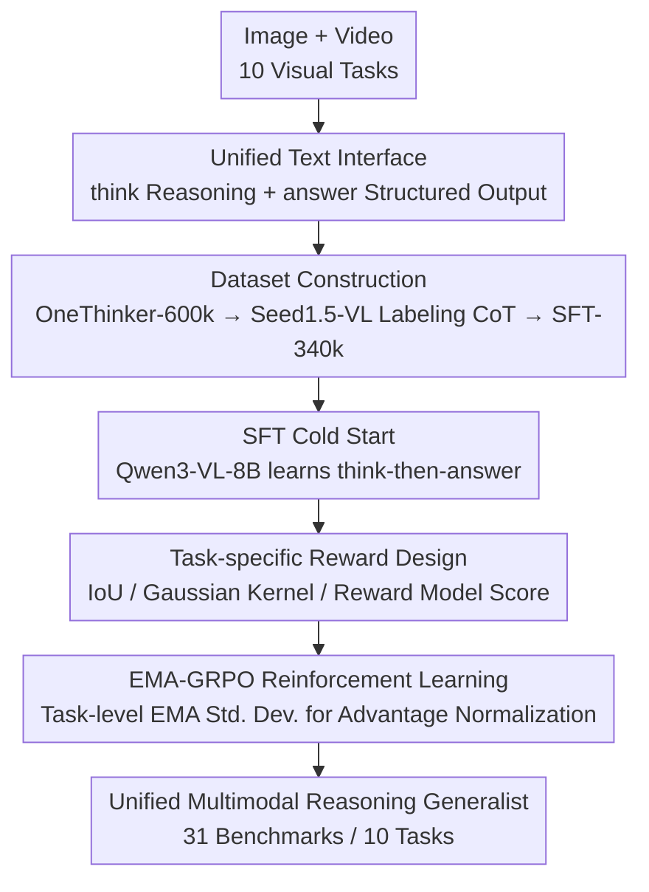

# OneThinker: All-in-one Reasoning Model for Image and Video

**Conference**: CVPR 2026  
**arXiv**: [2512.03043](https://arxiv.org/abs/2512.03043)  
**Code**: https://github.com/tulerfeng/OneThinker (Available)  
**Area**: Multimodal VLM / LLM Reasoning  
**Keywords**: Multimodal Reasoning Generalist, Reinforcement Learning, GRPO, Multi-task Reward Normalization, Image-Video Unification

## TL;DR
OneThinker utilizes an 8B model to unify 10 basic visual tasks across image and video (QA, captioning, spatio-temporal grounding, tracking, and segmentation) into a "think-then-structured-output" reasoning paradigm. It introduces EMA-GRPO to resolve optimization imbalances caused by significant differences in reward magnitudes and densities across multiple tasks, outperforming specialized models of comparable size across 31 benchmarks.

## Background & Motivation

**Background**: Following DeepSeek-R1, the paradigm of using rule-based rewards with GRPO for Reinforcement Learning (RL) to stimulate reasoning capabilities has been extensively applied to Multimodal Large Language Models (MLLMs): Vision-R1 for image QA, Video-R1 for video QA, VLM-R1 for detection, Seg-R1 for segmentation, and Time-R1 for temporal localization. Each work focuses on pushing reasoning limits within its specific task and modality.

**Limitations of Prior Work**: These "reasoning models" are predominantly **single-task and single-modality**, processing either only images or only videos and handling either only QA or only grounding. Few attempts at multi-task learning (e.g., VideoChat-R1) are restricted to narrow subsets—jointly training on only 3 spatio-temporal perception tasks with 18k samples, confined exclusively to the video modality. This fragmentation results in poor versatility for real-world deployment and prevents beneficial knowledge transfer between tasks and modalities.

**Key Challenge**: Integrating heterogeneous visual tasks into a **single** model for multi-task RL encounters an unavoidable reward imbalance problem. Reward **scales and densities differ vastly** across tasks: mathematical QA provides sparse 0/1 rewards, while grounding provides continuous, narrow-range IoU rewards. Standard GRPO normalizes using "standard deviation within each prompt group," which biases towards low-variance samples (intra-task imbalance); meanwhile, removing normalization (as in Dr.GRPO) allows sparse rewards (math) to dominate gradients, suppressing dense, small-magnitude rewards (detection) (inter-task imbalance).

**Goal**: To train a true "**Multimodal Reasoning Generalist**"—a single model capable of simultaneously handling a series of basic visual tasks across images and videos while maintaining stable training under heterogeneous rewards. This is decomposed into two sub-problems: (1) constructing a large-scale, modality-balanced dataset covering all tasks, and (2) designing an RL algorithm that simultaneously addresses intra-task and inter-task imbalances.

**Key Insight**: The authors take the fact that "vision naturally encompasses both static images and dynamic videos" as a starting point. Since the real world requires unified reasoning for diverse visual tasks, all tasks are cast into the same textual interface (`<think>` reasoning + `<answer>` structured output) to enable joint training within a unified RL framework.

**Core Idea**: Replace the "immediate group-wise standard deviation" in GRPO with a **task-level Moving Average (EMA) of reward standard deviations** for advantage normalization. Each task uses its own smooth, adaptive normalization scale, concurrently curing both intra-task and inter-task imbalances.

## Method

### Overall Architecture
OneThinker aims to solve 10 heterogeneous visual tasks with an 8B model via a three-stage pipeline: First, **Data Construction** (OneThinker-600k covers 8 categories; Seed1.5-VL is used for annotation and filtering to create a 340k high-quality CoT subset); Second, **SFT Cold Start** using the 340k CoT data to teach the Qwen3-VL-Instruct-8B base model the "think-before-answer" format; Finally, **EMA-GRPO Reinforcement Learning** on the full 600k corpus to refine reasoning capabilities.

Crucially, all tasks are unified into a single textual interface: the model generates internal reasoning within `<think>...</think>` and task-specific results within `<answer>...</answer>`. For perception tasks (grounding/tracking/segmentation), `<answer>` contains structured representations (time intervals, bounding boxes, sparse points) in a predefined JSON schema, allowing for automatic parsing and rule-based reward calculation. Each task category has a custom accuracy reward $R = R_{\text{acc}} + R_{\text{format}}$. Heterogeneous rewards are handled by EMA-GRPO during the RL phase.

### Key Designs

**1. Unified Text Interface + Task-specific Verifiable Rewards: Casting 10 Heterogeneous Tasks into the "Think $\rightarrow$ Structured Output" Format**

Multi-task RL requires comparable and automatically verifiable rewards. OneThinker mandates `<think>` reasoning and `<answer>` structured output, with tailored accuracy rewards: Rule-based QA (choice/numerical/math/OCR) uses equivalence checks; regression tasks use Mean Relative Accuracy; OCR uses Word Error Rate. For open-ended QA and captioning without unique answers, an external reward model (POLAR-7B) provides similarity scores $R_{\text{acc}}=\mathrm{RM}(q,\hat a,a)$. Temporal grounding uses $R_{\text{acc}}=\mathrm{tIoU}([\hat s,\hat e],[s,e])$, spatial grounding uses $\mathrm{sIoU}(\hat b,b)$, spatio-temporal grounding sums both $\mathrm{tIoU}+\overline{\mathrm{sIoU}}$, and tracking uses average box IoU $\overline{\mathrm{sIoU}}$.

Segmentation is ingeniously handled: instead of masks, the model predicts a bounding box and a set of positive/negative points, which are fed into SAM2 to generate the final mask (video segmentation also identifies a keyframe time $\hat t$). To avoid the high latency of running SAM2 during rollouts, the mask reward is replaced by a **Gaussian kernel** $\mathcal{G}(d)=\exp(-d^2/2\sigma^2)$ that normalizes the "minimum matching distance from predicted points to ground truth points" to $[0,1]$ (spatial $\sigma=50$, temporal $\sigma=1$). Image segmentation reward is $R_{\text{acc}}=\mathrm{sIoU}(\hat b,b)+\mathcal{G}(\mathrm{dis}_+)+\mathcal{G}(\mathrm{dis}_-)$, with video segmentation adding a $\mathcal{G}(|\hat t-t|)$ term for the keyframe time. 

**2. OneThinker-600k Dataset + Seed1.5-VL CoT Labeling: Training Corpus for a Multimodal Generalist**

To master logic, knowledge, spatial, and temporal reasoning, large-scale, diverse, and balanced data is required. The authors curated OneThinker-600k from public datasets, covering 8 task categories across image/video modalities. Using Seed1.5-VL, they generated CoT annotations for the 600k samples, filtered by task-specific thresholds and quality checks to produce OneThinker-SFT-340k for cold starting. 

**3. EMA-GRPO: Curing Intra-task and Inter-task Imbalance via Task-level EMA Standard Deviation**

The core algorithm. Standard GRPO uses **immediate group-wise standard deviation**, causing samples with extreme group variance to receive stronger updates, while moderate-difficulty samples are under-optimized (intra-task imbalance). Dr.GRPO removes normalization, avoiding intra-task bias but allowing tasks with higher reward densities/scales (math) to drown out others (grounding) (inter-task imbalance).

EMA-GRPO maintains the first and second moments of rewards for each task $\tau$. For rewards $\{R_i\}$ of task $\tau$ in the current batch, calculate $\mu^\tau(t)=\mathrm{mean}(\{R_i\})$ and $\nu^\tau(t)=\mathrm{mean}(\{R_i^2\})$, then update moments with decay factor $\beta=0.99$:
$$m_1^\tau(t)=\beta\,m_1^\tau(t-1)+(1-\beta)\,\mu^\tau(t),\quad m_2^\tau(t)=\beta\,m_2^\tau(t-1)+(1-\beta)\,\nu^\tau(t).$$
The task-level standard deviation $\sigma^\tau(t)=\sqrt{m_2^\tau(t)-(m_1^\tau(t))^2}$ is used to normalize the advantage:
$$A_i^\tau(t)=\frac{R_i-\mathrm{mean}(\{R_j\})}{\sigma^\tau(t)}.$$
This strategy ensures that rollouts within the **same task** share a normalization scale, preventing bias toward specific groups (solving intra-task imbalance). Across **different tasks**, independent $\sigma^\tau(t)$ values level the gradient contributions, preventing sparse reward tasks from dominating (solving inter-task imbalance). 

### Loss & Training
RL employs the standard GRPO objective with EMA-normalized advantages:
$$\mathbb{E}_{q,\{o_i\}}\Big[\tfrac{1}{G}\sum_{i=1}^{G}\big(\min(r_i A_i^\tau, \mathrm{clip}(r_i,1-\epsilon,1+\epsilon)A_i^\tau)-\beta_{\mathrm{KL}}D_{\mathrm{KL}}(\pi_\theta\|\pi_{\mathrm{ref}})\big)\Big],$$
where $r_i=\pi_\theta(o_i|q)/\pi_{\theta_{\text{old}}}(o_i|q)$. Training utilized 32 H800 GPUs. Base: Qwen3-VL-Instruct-8B. SFT: batch 32, lr $1\times10^{-5}$. RL: batch 128, lr $2\times10^{-6}$, group size 8, $\beta_{\mathrm{KL}}=0.01$. Max response length 4096 tokens, max 128 frames for video.

## Key Experimental Results

Evaluated across 31 benchmarks and 10 task categories, using a reproduced Qwen3-VL-Instruct-8B as the baseline.

### Main Results

Image/Video QA Highlights:

| Task | Benchmark | Metric | Qwen3-VL-8B | OneThinker-8B |
|------|-----------|------|------|------|
| Image QA | MMMU | acc | 60.2 | **70.6** |
| Image QA | MathVerse | acc | 58.1 | **64.3** |
| Image QA | ScienceQA | acc | 92.0 | **96.5** |
| Video QA | LongVideo-Reason | acc | 71.5 | **79.2** |
| Video QA | VideoMathQA | acc | 24.3 | **35.0** |
| Video QA | VideoHolmes | acc | 40.9 | **48.7** |

Perception Task Highlights (grounding / tracking / segmentation):

| Task | Benchmark | Metric | Qwen3-VL-8B | OneThinker-8B |
|------|-----------|------|------|------|
| Temporal grounding | ActivityNet | mIoU | 29.1 | **45.9** |
| Spatial grounding | RefCOCO testA | acc | 92.2 | **93.7** |
| Spatio-temporal grounding | STVG | sIoU | 13.6 | **36.7** |
| Tracking | GOT-10k | AO | 33.7 | **73.0** |
| Tracking | GOT-10k | R@0.5 | 28.9 | **84.4** |
| Video Segmentation | ReasonVOS | J&F | 19.6 | **54.9** |
| Video Segmentation | MeViS | J&F | 22.9 | **52.7** |

Perception improvements are significant: Tracking AO rose from 33.7 to 73.0, and Video Segmentation J&F more than doubled.

### Ablation Study

Removing/replacing key components (averages across task-related benchmarks):

| Configuration | QA | Temporal grd | Spatial grd | Spatio-temporal grd | Tracking | Seg | Description |
|------|----|---------|---------|---------|------|------|------|
| Qwen3-VL-8B | 65.0 | 30.8 | 86.6 | 19.5 | 33.7 | 50.0 | Base |
| OneThinker-SFT | 67.0 | 31.8 | 87.8 | 27.1 | 48.1 | 62.8 | SFT only, no RL |
| OneThinker-GRPO | 67.2 | 46.9 | 86.5 | 34.5 | 65.5 | 62.3 | Std GRPO |
| OneThinker-DrGRPO | 67.6 | 46.3 | 88.2 | 34.0 | 67.8 | 61.2 | Dr.GRPO |
| **OneThinker-8B** | **69.8** | **49.7** | **89.2** | **38.1** | **73.0** | **64.2** | Full EMA-GRPO |

### Key Findings
- **EMA-GRPO is the primary driver of performance**: Replacing it with standard GRPO or Dr.GRPO leads to performance drops across all tasks (e.g., Tracking 73.0 $\rightarrow$ 65.5/67.8), confirming the necessity of addressing both intra-task and inter-task imbalances.
- **Cross-task/Cross-modality Knowledge Transfer is evident**: Ablating temporal grounding data significantly hurts video QA and tracking (temporal localization enhances sequence reasoning); removing spatial grounding lowers image QA and segmentation scores. Notably, removing image QA data severely degrades **video** QA (61.1 $\rightarrow$ 58.2), indicating that reasoning learned from image QA transfers to video.
- **Zero-shot Generalization**: OneThinker outperforms the base model on unseen tasks (point tracking, rotation detection, etc.), showing the benefit of unified reasoning.

## Highlights & Insights
- **Addressing "Reward Heterogeneity" as the primary obstacle in multi-task RL**: EMA-GRPO provides a clean insight—intra-task and inter-task imbalances are two sides of the same coin. A task-level adaptive standard deviation resolves both. This approach is transferable to any multi-task RL scenario with varying reward scales.
- **Conversion of Segmentation to "Box+Points+Time $\rightarrow$ SAM2"**: By reducing high-dimensional masks to structured predictions and Gaussian kernel rewards, the authors circumvented high RL rollout latency while incorporating segmentation into a rule-based RL framework.
- **Image QA data as a benefit for Video QA**: High-quality image reasoning data is a viable shortcut to improving video reasoning models when video-specific reasoning data is scarce.

## Limitations & Future Work
- **Lack of Mask-level Reward**: Due to SAM2 latency, proxy rewards (boxes/points) were used, which may limit the upper bound of segmentation quality compared to direct mask optimization.
- **Heavy Dependency on External Components**: CoT labeling and perception rewards rely on Seed1.5-VL and POLAR-7B. Performance is capped by these external proxies.
- **Scope of Generalization**: Zero-shot verification is preliminary; the stability of EMA-GRPO with even larger task sets or additional modalities (audio/3D) remains to be explored.

## Related Work & Insights
- **vs. Video-R1 / Vision-R1**: These models achieve high performance on single tasks/modalities. OneThinker covers 10 tasks and 2 modalities, surpassing Video-R1 on LongVideo-Reason (79.2 vs 67.2) through generalized knowledge transfer.
- **vs. VideoChat-R1**: While VideoChat-R1 joint-trains on 18k samples for 3 video tasks, OneThinker scales to 600k samples and 10 tasks across images and videos, highlighting the importance of balanced, large-scale data for generalists.
- **vs. Standard GRPO / Dr.GRPO**: EMA-GRPO specifically targets imbalances in heterogeneous multi-task settings, consistently outperforming both in ablation studies.

## Rating
- Novelty: ⭐⭐⭐⭐⭐ 
- Experimental Thoroughness: ⭐⭐⭐⭐⭐ 
- Writing Quality: ⭐⭐⭐⭐ 
- Value: ⭐⭐⭐⭐⭐ 

<!-- RELATED:START -->

## Related Papers

- [\[CVPR 2026\] One Patch to Caption Them All: A Unified Zero-Shot Captioning Framework](one_patch_to_caption_them_all_a_unified_zero-shot_captioning_framework.md)
- [\[CVPR 2026\] MUPO: All Roads Lead to Rome - Incentivizing Divergent Thinking in Vision-Language Models](mupo_all_roads_lead_to_rome_incentivizing_divergent_thinking_in_vlms.md)
- [\[AAAI 2026\] ClearAIR: A Human-Visual-Perception-Inspired All-in-One Image Restoration](../../AAAI2026/multimodal_vlm/clearair_a_human-visual-perception-inspired_all-in-one_image_restoration.md)
- [\[CVPR 2026\] PhysInOne: Visual Physics Learning and Reasoning in One Suite](physisinone_visual_physics_learning_and_reasoning_in_one_suite.md)
- [\[CVPR 2026\] MSJoE: Jointly Evolving MLLM and Sampler for Efficient Long-Form Video Understanding](msjoe_jointly_evolving_mllm_and_sampler_for_efficient_long-form_video_understand.md)

<!-- RELATED:END -->
