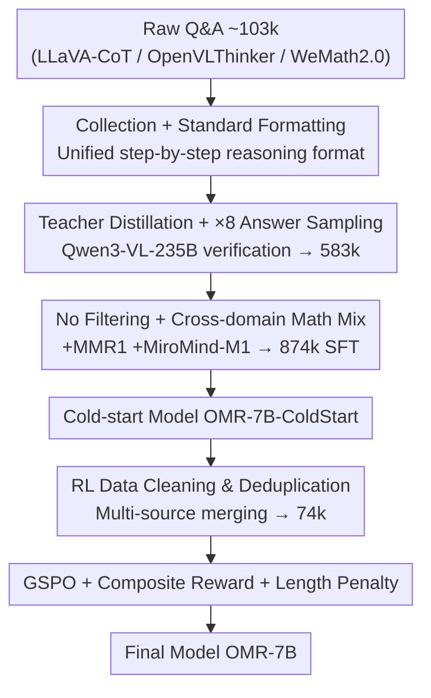

# OpenMMReasoner: Pushing the Frontiers in Multimodal Reasoning with an Open and General Recipe

**Conference**: CVPR 2026  
**Paper**: [CVF Open Access](https://openaccess.thecvf.com/content/CVPR2026/html/Zhang_OpenMMReasoner_Pushing_the_Frontiers_in_Multimodal_Reasoning_with_an_Open_CVPR_2026_paper.html)  
**Code**: https://github.com/EvolvingLMMsLab/OpenMMReasoner  
**Area**: Multimodal VLM / LLM Reasoning  
**Keywords**: Multimodal Reasoning, SFT Cold Start, Reinforcement Learning, Data Distillation, GSPO

## TL;DR
OpenMMReasoner provide a **fully transparent and reproducible two-stage recipe** for training open-source multimodal large models into strong reasoning models: starting with an SFT cold start using 874k high-quality distilled data, followed by RL (GSPO) refinement with 74k data. Based on Qwen2.5-VL-7B, it achieves an average improvement of 11.6% across nine multimodal reasoning benchmarks.

## Background & Motivation
**Background**: RLVR (Reinforcement Learning with Verifiable Rewards) has demonstrated in text models like DeepSeek-R1 and OpenAI o1/o3 that "multi-step reasoning + self-verification" can emerge purely through large-scale RL. The community naturally seeks to transfer this capability to Large Multimodal Models (LMMs), enabling models to "think" when performing tasks such as mathematical calculations from images, reading charts, or solving puzzles.

**Limitations of Prior Work**: Despite rapid progress in multimodal reasoning, the **training pipelines remain extremely opaque**. Most works only report using SFT and RL without disclosing how data was filtered, how teachers were selected, or which specific stage designs were effective, and thorough ablations are rare. This makes results difficult to reproduce and obscures the actual process of "how a reasoning LMM is forged."

**Key Challenge**: Existing efforts either cover only SFT (as in some text-only works) or touch upon both SFT and RL but **fail to provide a unified recipe that generalizes across tasks and modalities** (the authors specifically mention Open Vision Reasoner / OVR in the latter category). What is missing is not a single technique, but an end-to-end, reproducible pipeline "from raw data to a strong reasoning model."

**Goal**: Systematically answer two sub-questions—"how to construct SFT data" and "how to tune RL"—on an open-source LMM (Qwen2.5-VL-7B-Instruct), and clarify the design rationale for each step through ablation studies.

**Key Insight**: The authors treat the entire process as an **empirical study of data engineering and training strategies**. Rather than inventing new algorithms, they exhaustively compare key variables such as teacher selection, answer sampling ratios, filtering strategies, domain mixing, RL algorithms, and reward designs to identify the truly effective combinations.

**Core Idea**: Generate high-quality SFT cold-start data using "strong teacher distillation + amplified answer diversity + no excessive filtering + cross-domain mixing," followed by stable RL refinement using GSPO + composite rewards + length penalties. All data, code, and weights are open-sourced.

## Method

### Overall Architecture
OpenMMReasoner is a serial two-stage pipeline: the **SFT cold-start stage** first transforms the model from a "general instruction model" into a "base reasoning model capable of step-by-step reasoning," and the **RL stage** further sharpens and stabilizes reasoning capabilities on top of this cold-start model. SFT data starts from 103k raw Q&A pairs and evolves into 874k through three steps (collection/formatting → distillation/amplification → cross-domain mixing); RL data is separately cleaned and deduplicated to obtain 74k samples.

The entire process is clear and phased, with each contribution node corresponding to a subsequent key design:

### Key Designs

**1. Teacher Distillation + Answer Diversity: Repeatedly sampling from stronger teachers to treat "answer diversity" as an independent data expansion axis**

The quality of the SFT cold start directly determines the upper bound of RL, but simply stacking more problems yields limited returns. The authors take a two-step approach: first, **teacher selection**—multiple candidate models generate reasoning chains for the same set of problems, and only samples that pass both a rule-based verifier and LLM-as-judge are retained (approx. 59k verified traces). Comparison shows stronger teachers are consistently better; Qwen3-VL-235B-Instruct raised the average score from a baseline of 45.3 to 50.5, thus it was selected as the teacher. Second, **answer diversity amplification**: the teacher repeatedly sampled $\times1/\times2/\times4/\times8$ different verified reasoning chains for the same problems, with average scores monotonically increasing from 50.5 at $\times1$ to 55.2 at $\times8$. This demonstrates that "presenting multiple correct solutions for a single problem" is a gain axis independent of "problem diversity"—$\times8$ was ultimately adopted, expanding data from 59k to approximately 583k.

**2. No Filtering + Cross-domain Mixing: Doing less subtraction and more addition to preserve answer diversity and fill mathematical gaps**

Intuitively, SFT data should be filtered by difficulty or length to remove "poor samples," but empirical tests showed both types of filtering **reduced performance**: length filtering dropped the average score from 55.2 to 54.2, and difficulty filtering dropped it to 51.3. The reason is that filtering sacrifices answer diversity, which is the primary source of quality. Consequently, a **no-filter** strategy was adopted to retain the full 583k samples. Furthermore, as distilled data lacked coverage of mathematical reasoning, supervision from MMR1 (image-based math) and MiroMind-M1 (text-based math) was mixed in. Including both vision and text math raised the average score from 55.2 to 56.3 (MathVision from 34.6 → 36.6), as cross-domain knowledge brought transferable reasoning gains. These two steps combined yield the final 874k SFT recipe.

**3. RL Recipe: GSPO algorithm + Composite Reward + Length Penalty to sharpen reasoning while controlling "overthinking"**

During the RL stage, GRPO, DAPO, and GSPO algorithms were compared under a unified setting. GSPO replaces GRPO's token-level importance ratio with a **sequence-level** ratio and uses a smaller clipping threshold, exhibiting faster convergence, higher rewards, and more stable training dynamics. Although DAPO uses online filtering, it suffered from early entropy collapse and progressed slowly due to high rollout requirements—thus GSPO was selected. The reward is a weighted combination of **task accuracy + format consistency**: $R = (1-\lambda_{fmt})\cdot R_{acc} + \lambda_{fmt}\cdot R_{fmt}$, with $\lambda_{fmt}=0.1$. Additionally, to address the issue of "long but inefficient reasoning chains" seen in OVR, a **length penalty** similar to DAPO was used to suppress overthinking, achieving higher accuracy with a shorter reasoning budget on MMMU/We-Math. Notably, the authors also tested curriculum learning (sampling from easy to hard based on pass rate), but ablations showed it was **not superior** to direct mixed sampling, so no-sampling was used.

### Loss & Training
- **SFT**: Starting from Qwen2.5-VL-7B-Instruct, trained using LMMs-Engine with online packing and Liger-Kernel acceleration until convergence.
- **RL**: Accelerated with verl + vllm, temperature 1.0, starting from the best SFT checkpoint ($\times8$ sampling + mixed math version). The GSPO objective $J_{GSPO}$ performs clipping optimization based on the sequence-likelihood importance ratio $s_i$, with a composite reward coefficient $\lambda_{fmt}=0.1$.

## Key Experimental Results

### Main Results
On nine multimodal reasoning benchmarks (MathVista / MathVision / MathVerse / DynaMath / WeMath / LogicVista / MMMU / MMMU-Pro / CharXiv), comparing against 7B-scale models (higher is better, representative subsets shown below):

| Model | Stage | MathVista | MathVision | LogicVista | Note |
|------|------|-----------|------------|------------|------|
| Qwen2.5-VL-7B (baseline) | — | 69.2 | 25.5 | 53.1 | Starting Point |
| OMR-7B-ColdStart (Ours SFT) | 874k SFT | 74.8 | 36.6 | 67.2 | Cold start alone leads significantly |
| OVR-7B | 2M SFT + 300k RL | 72.1 | 51.8 | 64.8 | Strong RL baseline |
| **OMR-7B (Ours full)** | 874k SFT + 74k RL | **79.5** | 43.6 | **79.0** | SOTA on most benchmarks |

The authors emphasize: compared to Qwen2.5-VL-7B-Instruct, OMR-7B achieves an **average improvement of 11.6%** across nine benchmarks, using significantly less SFT/RL data (874k / 74k) than OVR (2M / 300k), demonstrating the data efficiency of the recipe.

### Ablation Study

| Ablation Dimension | Configuration | Avg Score | Conclusion |
|----------|------|--------|------|
| Teacher Choice | baseline → Qwen2.5-VL-72B → Qwen3-VL-235B | 45.3 → 49.8 → 50.5 | Stronger teachers are better |
| Answer Sampling | $\times1$ → $\times8$ | 50.5 → 55.2 | Answer diversity is an independent gain axis |
| Filtering Strategy | no-filter / length / difficulty | 55.2 / 54.2 / 51.3 | Filtering actually drops performance |
| Domain Mix | no-mix → Img+TxtMath | 55.2 → 56.3 | Cross-domain mixing improves generalization |
| RL Algorithm | DAPO×16 / GRPO×16 / GSPO×16 | 48.9 / 51.1 / 54.3 | GSPO is most stable and optimal |

### Key Findings
- **Answer diversity is more valuable than problem quantity**: Sampling $\times8$ for the same batch of problems increased the score from 50.5 to 55.2, suggesting that "preserving multiple correct solutions" is the most cost-effective axis.
- **Filtering is a double-edged sword**: Conventional difficulty/length filtering led to performance drops here because they sacrificed diversity; the authors counter-intuitively chose no filtering.
- **GSPO's sequence-level ratio is better suited for multimodal RL**: It converges faster and trains more stably compared to GRPO/DAPO; however, GSPO can collapse at higher temperatures (e.g., temp 1.4).
- **Curriculum learning is not necessarily useful**: Sampling from easy to hard did not outperform direct mixed sampling and was ultimately discarded.

## Highlights & Insights
- **The "recipe" itself as a contribution**: Instead of inventing new algorithms, the work provides a reproducible engineering checklist by ablating teacher choice, sampling ratio, filtering, domain mixing, RL algorithms, and rewards—highly valuable for those looking to reproduce multimodal reasoning models.
- **"Answer diversity is an independent data expansion axis"**: This observation is highly transferable; in any distillation-based SFT, multiple sampling of correct solutions for the same problem may be more cost-effective than simply adding more problems.
- **Full Transparency**: By open-sourcing the data pipeline, SFT/RL data, and weights, it enables research into how training dynamics evolve, unlike works that only release weights.
- **Efficiency Perspective**: Using length penalties to explicitly suppress overthinking, the model outperforms OVR with a shorter reasoning budget, reminding the community that "longer reasoning chains $\neq$ better."

## Limitations & Future Work
- **Scale and Backbone Simplicity**: All experiments centered on a single backbone (Qwen2.5-VL-7B) and scale; whether the recipe holds for larger/smaller models or different backbones is unverified.
- **Benchmark Dependency**: The nine benchmarks focus heavily on math/chart/puzzle reasoning; generalization to open-ended visual reasoning or long videos has not been fully tested.
- **Empirical Nature of Rewards and Hyperparameters**: Values like $\lambda_{fmt}=0.1$, $\times8$ sampling, and no-filter are empirically optimal results that may require readjustment for different data distributions.
- **Future Directions**: Explicitly modeling "answer diversity" into data selection targets, exploring automatic teacher selection, and adaptively adjusting reasoning length budgets during RL.

## Related Work & Insights
- **vs OVR (Open Vision Reasoner)**: OVR also covers SFT+RL but uses much larger data (2M/300k) and results in inefficiently long reasoning chains; Ours uses smaller data (874k/74k) + length penalties to surpass it efficiently on most benchmarks.
- **vs ThinkLite-VL / MM-Eureka**: These works provide clear methods for RL data construction but lack a unified, generalizable recipe covering both SFT and RL; Ours completes the end-to-end link from cold start to RL.
- **vs Text-only RLVR (DeepSeek-R1 / o1)**: This work transfers the RLVR paradigm to multimodal scenarios and empirically validates the stability advantages of GSPO in cross-modality settings.

## Rating
- Novelty: ⭐⭐⭐⭐ Not a new algorithm, but the empirical combination of a "systematic transparent recipe + answer diversity axis" has high value.
- Experimental Thoroughness: ⭐⭐⭐⭐⭐ Comprehensive main experiments across nine benchmarks plus detailed multi-dimensional ablations.
- Writing Quality: ⭐⭐⭐⭐ Clear logic and thorough explanation of ablations.
- Value: ⭐⭐⭐⭐⭐ Full open-sourcing of data, code, and weights makes it a high-availability reference recipe for reproducing multimodal reasoning models.

<!-- RELATED:START -->

## Related Papers

- [\[CVPR 2026\] GThinker: Towards General Multimodal Reasoning via Cue-Guided Rethinking](gthinker_towards_general_multimodal_reasoning_via_cue-guided_rethinking.md)
- [\[CVPR 2026\] R-4B: Incentivizing General-Purpose Auto-Thinking in MLLMs via Bi-Mode Annealing and Reinforce Learning](r-4b_incentivizing_general-purpose_auto-thinking_in_mllms_via_bi-mode_annealing_.md)
- [\[CVPR 2026\] From Indoor to Open World: Revealing the Spatial Reasoning Gap in MLLMs](from_indoor_to_open_world_revealing_the_spatial_reasoning_gap_in_mllms.md)
- [\[ICLR 2026\] PuzzleWorld: A Benchmark for Multimodal, Open-Ended Reasoning in Puzzlehunts](../../ICLR2026/vlm_reasoning/puzzleworld_a_benchmark_for_multimodal_open-ended_reasoning_in_puzzlehunts.md)
- [\[CVPR 2026\] R-C2: Cycle-Consistent Reinforcement Learning Improves Multimodal Reasoning](r-c2_cycle-consistent_reinforcement_learning_improves_multimodal_reasoning.md)

<!-- RELATED:END -->
