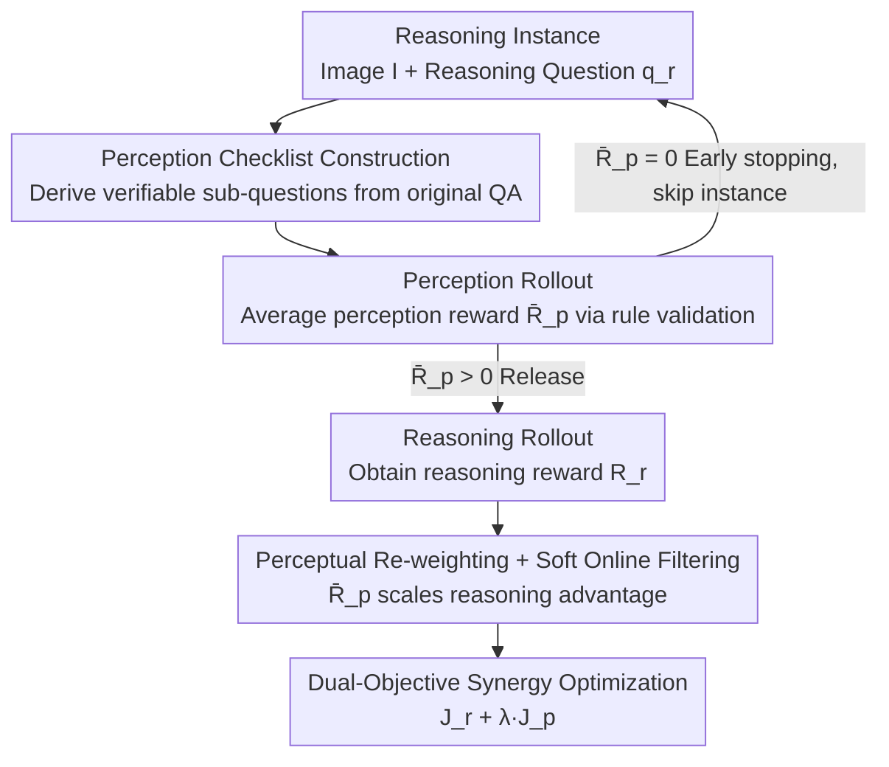

# Perceptual-Evidence Anchored Reinforced Learning for Multimodal Reasoning

**Conference**: CVPR 2026  
**Paper**: [CVF Open Access](https://openaccess.thecvf.com/content/CVPR2026/html/Zhang_Perceptual-Evidence_Anchored_Reinforced_Learning_for_Multimodal_Reasoning_CVPR_2026_paper.html)  
**Code**: https://github.com/MiliLab/PEARL  
**Area**: Multimodal VLM / LLM Reasoning / Reinforcement Learning  
**Keywords**: RLVR, Vision-Language Model, Perception-Reasoning Synergy, Reward Hacking, Multimodal Reasoning

## TL;DR
Addressing the defect in RLVR training for Vision-Language Models that "only verifies textual answers while allowing upstream visual perception errors to go unchecked," PEARL utilizes a "perception checklist" derived from the original problem to add a set of verifiable perception sub-questions to each reasoning task. It employs the perception reward as both a direct supervision signal and a "fidelity gate" to release reasoning updates, achieving an average improvement of approximately +9.7% over the baseline across 6 multimodal reasoning benchmarks including MathVerse.

## Background & Motivation

**Background**: Reinforcement Learning with Verifiable Rewards (RLVR, such as GRPO and DAPO) has significantly enhanced reasoning capabilities in Large Language Models and has recently been transferred to Vision-Language Models (VLMs) for multimodal mathematical and logical reasoning. The standard approach involves sampling candidate responses for a given image-text problem, where a rule-based verifier issues rewards based solely on the correctness of the final textual answer.

**Limitations of Prior Work**: This "outcome-only" reward mechanism entirely ignores the most fundamental step of the reasoning chain—the correctness of visual perception. The authors conducted a diagnostic experiment: after fine-tuning a leading VLM with GRPO, they decomposed failure modes into "perceptual errors (misidentifying objects/values/chart elements in the image)" and "reasoning errors (logical or calculation mistakes)." The results were telling—while GRPO significantly reduced reasoning errors, the perceptual error rate remained almost unchanged.

**Key Challenge**: When a model arrives at the correct final answer through "incorrect visual premises + logically plausible-looking steps," rewards are still issued. Consequently, the model learns to generate "pseudo-reasoning chains built upon erroneous perception." This is the root cause of reward hacking and visual hallucinations, establishing a performance ceiling by incorrectly entangling perception and reasoning.

**Goal**: Enable reinforcement learning signals to directly reward "correct perception" while preventing the model from reinforcing reasoning when perception is incorrect, thereby making perceptual correctness a prerequisite gate for reasoning updates.

**Key Insight**: The authors pose a simple yet critical question: "Did the model actually see the image correctly before reasoning?" Answering this requires a **verifiable, low-noise** perceptual signal. Existing "describe-then-reason" schemes require the model to generate an image description first, which is then scored by an external reward model or LLM. However, the "correctness" of free-text descriptions is inherently ambiguous, introduces reward noise, and requires additional scoring models, making it prone to perceptual reward hacking.

**Core Idea**: Replace "free-text descriptions" with a "perception sub-question checklist derived from the original QA with rule-verifiable answers." The resulting perception reward serves both as ① direct perceptual supervision and ② a fidelity gate for reasoning updates—allowing "reasoning training" only after "correct perception" is confirmed.

## Method

### Overall Architecture
PEARL is a synergistic reinforcement learning framework based on GRPO that features dual paths (Perception Path + Reasoning Path). The input is a multimodal reasoning instance $(Q_r, A_r)$ (image $I$ + reasoning question $q_r$ + ground truth); the output is a policy optimized through perception-reasoning synergy. Its core mechanism involves attaching a perception checklist to each reasoning problem at every training step. It first executes a "perception rollout" to calculate the average perception reward $\bar R_p$, which determines whether the reasoning path is activated and whether the reasoning gradient should be amplified or suppressed. The pipeline is: derive perception checklist from original question → perception rollout to obtain $\bar R_p$ as a fidelity gate → execute reasoning rollout only if the gate passes → re-weight reasoning advantage with perception reward combined with soft online filtering → joint dual-objective optimization.

### Key Designs

**1. QA-Anchored Perception Checklist Construction: Replacing vague descriptions with rule-verifiable sub-questions**

This is the fundamental difference between PEARL and the describe-then-reason approach. Given a reasoning problem, the authors do not require the model to generate long image descriptions. Instead, they follow "operational guidelines" to derive several **short-answer, rule-verifiable** perception sub-questions (e.g., a number or a label). Derivation occurs across two dimensions: content source (direct extraction of facts, pattern induction of key areas, derived calculations, or answer back-inference) and skill (identifying objects, reading trends, counting, geometric arrangement, etc.). Sub-questions generated this way are naturally bound to the original task logic, serving as a checklist to verify if the model has captured the critical visual evidence. The paper uses GPT-4.1 to construct these lists, and human evaluation verifies that the QA-anchored checklist error rate is 5.13% with an irrelevance rate of 5.53%, whereas a "description-enhanced dense checklist" has an irrelevance rate as high as 60.78% (⚠️ refer to Tab.5 in the original paper for specific percentages).

**2. Perceptual Fidelity Gating + Early Stopping: No reasoning learning without correct perception**

Using the perception reward as a "gate" for reasoning updates is the most critical mechanism. At each training step, $K$ perception sub-questions from the checklist are concatenated into a compact prompt $\tilde Q_p = (I, Q_p^1, \dots, Q_p^K)$. The VLM answers these directly (bypassing reasoning), and $G$ output groups are sampled. A rule verifier scores each sub-question, giving a reward for a single output as $R_p^i = \frac{1}{K}\sum_{j=1}^{K} R_p^{i,j}$, and the average across $G$ groups yields $\bar R_p$. This $\bar R_p$ measures the model's perception of the image and acts as a fidelity gate: if $\bar R_p = 0$, the model is assumed to lack the perceptual foundation to support the reasoning task, and the process **stops early, skipping the reasoning rollout**. Only if $\bar R_p > 0$ (perceptually passed) is the reasoning rollout allowed to continue to obtain $R_r$. This directly blocks reward hacking paths where pseudo-reasoning chains are reinforced on wrong premises. Furthermore, as training improves perception, more instances pass the gate, creating an implicit curriculum that transitions from "learning to see" to "learning to reason."

**3. Perception-Reasoning Synergy Optimization: Modulating reasoning gradients with perception rewards**

Beyond gating, the perception signal **modulates** the reasoning optimization. First is perception re-weighting: the group-normalized reasoning advantage $\hat A_r$ is reshaped as $\hat A_r \leftarrow \hat A_r \cdot \min(\bar R_p, 0.5)$, using the perception reward as a soft reliability prior to scale gradients—amplifying updates when perception is solid and suppressing them when perception is questionable. This biases optimization toward strategies that are "both perceptually and logically correct." Second is soft online filtering: while original online filtering only keeps samples where $\bar R_i \notin \{0,1\}$ to avoid zero variance, PEARL relaxes this to $\bar R_r \notin \{0,1\} \;\lor\; \bar R_p \notin \{0,1\}$. This ensures that as long as either path provides non-trivial signals, the instance is retained. Finally, both paths are combined: $J_{\text{dual}}(\theta) = J_{\text{GRPO}}(\theta; \hat A_r) + \lambda J_{\text{GRPO}}(\theta; \hat A_p)$, where $\lambda$ (set to 0.1) controls the relative contribution of the perception path.

### Loss & Training
The base objective follows the clipped objective $J_{\text{GRPO}}$, with advantages normalized within groups $\hat A_i = (r_i - \text{mean}\{r\}) / \text{std}\{r\}$. PEARL performs joint updates using the dual-objective in Equation (5). The implementation is based on EasyR1, using AdamW, a constant learning rate of $1\times10^{-6}$, a global batch size of 128, with 1 reasoning and 1 perception rollout per instance, each with 5 sampled responses. Maximum response length is 2048, and $\lambda=0.1$. The base models are Qwen2.5-VL-3B / 7B, and main experiments are trained on ViRL39K. Notably, component ablation (Tab.4) show that "removing KL regularization" is also an effective configuration.

## Key Experimental Results

### Main Results
On 6 datasets from the OpenCompass Multimodal Reasoning Leaderboard, PEARL outperforms all supervised and RLVR baselines across both 3B and 7B base models.

| Base | Method | MathVerse | MathVision | MathVista | WeMath | Average |
|------|------|-----------|-----------|-----------|--------|------|
| 3B | Base | 31.2 | 21.9 | 61.2 | 22.9 | 31.8 |
| 3B | GRPO | 34.9 | 26.8 | 64.7 | 26.9 | 34.8 |
| 3B | PAPOD (Strongest Baseline) | 40.1 | 27.0 | 67.0 | 34.9 | 39.2 |
| 3B | **PEARL** | **40.5** | **27.8** | **67.1** | **36.3** | **39.8** |
| 7B | Base | 41.1 | 25.4 | 68.1 | 36.2 | 40.1 |
| 7B | GRPO | 46.4 | 30.5 | 74.2 | 40.9 | 44.2 |
| 7B | DAPO | 45.7 | 30.9 | 75.9 | 40.7 | 45.1 |
| 7B | **PEARL** | **50.8** | **31.8** | **76.9** | **45.5** | **47.9** |

On the 7B model, Ours achieves a +9.7 gain over the base on MathVerse (50.8 vs 41.1) and +6.6 over GRPO (50.8 vs 44.2). Compared to perception-augmented methods like PAPO or Vision-SR1, which fluctuate across datasets, PEARL provides more uniform improvements, demonstrating the robustness of its inquiry-based design across scenarios.

### Ablation Study
Component roadmap ablation (7B, cumulative starting from GRPO):

| Configuration | MathVerse | LogicVista | WeMath | Average |
|------|-----------|-----------|--------|------|
| GRPO | 46.4 | 47.9 | 40.9 | 44.2 |
| + Perception Checklist | 47.6 | 50.2 | 44.1 | 45.8 |
| + Soft Online Filter & Remove KL | 47.8 | 54.0 | 42.7 | 46.7 |
| + Perceptual Re-weighting & Gating (Full PEARL) | 50.8 | 51.9 | 45.5 | 47.9 |

Perception checklist design ablation (Tab.3, 7B): The QA-Anchored checklist (47.9) significantly outperforms the "Description-Enhanced Dense Checklist" (45.5).

### Key Findings
- **"Alignment and Fidelity" trump "Quantity and Coverage"**: While dense checklists have more probes, they introduce significant task-irrelevant noise (60%+ irrelevance per human eval), dragging down RL rewards. The QA-anchored list has minimal noise and better performance.
- **Perception rewards are useful reasoning signals themselves**: Generalization experiments (Tab.2) show that even with Perception-Only training, non-trivial gains (+2.4/+2.5 for 7B) are achieved on Geo3K/MMK12 over pure reasoning baselines. This confirms "perceiving correctly" is a prerequisite for "reasoning correctly"; however, perception alone is insufficient and must be coupled with reasoning optimization.
- **Geometric/Chart-dense tasks benefit most**: Improvements are most significant in tasks requiring fine-grained visual details (e.g., WeMath, LogicVista), indicating that forcing correct perception helps models utilize visual structures rather than taking textual shortcuts.

## Highlights & Insights
- **"Fidelity Gating" is a simple yet powerful lever**: A single scalar $\bar R_p$ handles three functions—supervising perception, blocking reasoning updates on wrong premises, and implicitly forming a "vision-first" curriculum. A unified mechanism yields triple benefits with extreme simplicity.
- **Transforming ambiguous reward problems into rule-verifiable ones**: The pain point of "describe-then-reason" is that free text is hard to score. PEARL uses sub-questions with numeric/label answers to bypass external reward models, saving compute and reducing noise. This reflects a broader principle: "Converting hard-to-evaluate generation into easy-to-verify discrimination."
- **Plug-and-play**: PEARL can be seamlessly integrated on top of GRPO/DAPO as a complementary signal rather than a replacement framework, ensuring low implementation overhead.

## Limitations & Future Work
- The perception checklist relies on a strong external model (GPT-4.1) for offline construction; its quality and coverage are bounded by the generator's capability. The authors acknowledge that the QA-anchored list only covers visual details cited in the original QA and may miss other image information (though experiments show "more" doesn't necessarily mean "better").
- Evaluation is concentrated on math/logic multimodal reasoning; effectiveness on open-domain, long-chain, or non-scientific multimodal reasoning is not fully verified.
- The gate uses a hard threshold $\bar R_p > 0$ and re-weighting uses a $\min(\bar R_p, 0.5)$ truncation; systematic scans of these thresholds are lacking. While early stopping saves compute, it might prevent the hardest samples (those that never pass perception) from ever being trained.

## Related Work & Insights
- **vs GRPO / DAPO**: These models only use final textual answers for rewards, remaining "blind" to upstream perceptual errors. PEARL adds a perception path and fidelity gate, making perceptual correctness a prerequisite for reasoning updates, leading to more robust gains on perception-intensive tasks.
- **vs PAPO / Vision-SR1 (Perception-augmented RL)**: These methods align perception and reasoning implicitly through mask perturbations or consistency constraints, but they fluctuate across datasets. PEARL uses explicit, verifiable probe rewards, resulting in more uniform gains across benchmarks.
- **vs describe-then-reason / caption-based**: The latter requires generating image descriptions scored by external reward models, which is noisy and compute-intensive. PEARL replaces free text with rule-verifiable sub-question checklists, which are lower noise and require no additional reward model.

## Rating
- Novelty: ⭐⭐⭐⭐⭐ The "fidelity gate + QA-anchored verifiable checklist" approach makes perception a prerequisite for reasoning updates with a clear logic and strong diagnostic proof.
- Experimental Thoroughness: ⭐⭐⭐⭐ 6 benchmarks × 2 base models + multiple ablations and human evaluations is solid; however, threshold sensitivity and non-math task coverage are lacking.
- Writing Quality: ⭐⭐⭐⭐ The flow from motivation to diagnosis to method to ablation is smooth, with clear formulas and diagrams.
- Value: ⭐⭐⭐⭐⭐ Plug-and-play with GRPO/DAPO, directly addressing visual hallucinations and reward hacking in VLM reasoning with high practical feasibility.

<!-- RELATED:START -->

## Related Papers

- [\[CVPR 2026\] Conan: Progressive Learning to Reason Like a Detective over Multi-Scale Visual Evidence](conan_progressive_learning_to_reason_like_a_detective_over_multi-scale_visual_ev.md)
- [\[CVPR 2026\] CARE What Fails: Contrastive Anchored-REflection for Verifiable Multimodal Reasoning](care_what_fails_contrastive_anchored-reflection_for_verifiable_multimodal_reason.md)
- [\[CVPR 2026\] See Less, See Right: Bi-directional Perceptual Shaping For Multimodal Reasoning](see_less_see_right_bi-directional_perceptual_shaping_for_multimodal_reasoning.md)
- [\[CVPR 2026\] R-C2: Cycle-Consistent Reinforcement Learning Improves Multimodal Reasoning](r-c2_cycle-consistent_reinforcement_learning_improves_multimodal_reasoning.md)
- [\[CVPR 2026\] DPAD: Discriminative Perception via Anchored Description for Reasoning Segmentation](discriminative_perception_via_anchored_description_for_reasoning_segmentation.md)

<!-- RELATED:END -->
