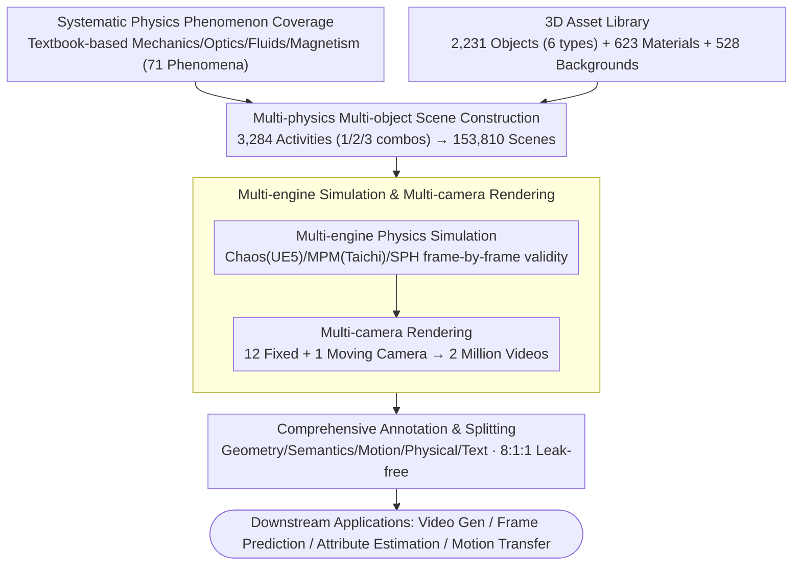

# PhysInOne: Visual Physics Learning and Reasoning in One Suite

**Conference**: CVPR 2026  
**arXiv**: [2604.09415](https://arxiv.org/abs/2604.09415)  
**Code**: [https://vlar-group.github.io/PhysInOne.html](https://vlar-group.github.io/PhysInOne.html)  
**Area**: Multimodal VLM/Physics Reasoning  
**Keywords**: Physics Learning, Synthetic Dataset, World Models, Video Generation, Physics Reasoning

## TL;DR

PhysInOne is a large-scale synthetic dataset containing $153,810$ dynamic 3D scenes and 2 million annotated videos. It covers 71 fundamental physical phenomena across mechanics, optics, fluid dynamics, and magnetism, establishing a new benchmark for physics-aware world models.

## Background & Motivation

**Background**: Current AI models suffer from a significant lack of understanding regarding the physical world—AI-generated videos frequently violate fundamental physical laws (e.g., objects falling upwards, sudden velocity changes). Existing physics datasets are extremely small in scale (ranging from hundreds to a few thousand samples), limiting progress in physics learning.

**Limitations of Prior Work**: There is a lack of large-scale, high-quality training data that covers a wide variety of physical objects, scenes, and phenomena. Existing datasets either involve only a single physical phenomenon (such as collisions) or use simple geometric primitives that fail to reflect the complexity of the real world.

**Key Challenge**: Physics-aware AI needs to learn the joint effects of multiple physical phenomena in diverse scenarios, but the current dataset scale is insufficient to support this.

**Goal**: To create a synthetic physics dataset several orders of magnitude larger than existing ones, covering the vast majority of physical phenomena encountered in daily life.

**Key Insight**: Systematically identify 71 key physical phenomena based on university physics textbooks and use physics engines to generate dynamic 3D scenes that strictly adhere to physical laws.

**Core Idea**: Large-scale synthetic physics data + multi-object complex interactions + complete ground-truth annotations to provide the data infrastructure for physics-aware world models.

## Method

### Overall Architecture

The construction of PhysInOne follows a six-stage synthetic data pipeline: (1) Systematically organizing 71 basic physical phenomena and their governing laws across mechanics, optics, fluid dynamics, and magnetism using university physics textbooks as an outline; (2) Collecting 2,231 common 3D objects (organized into 6 categories: rigid, interactable, destructible, deformable, granular, and liquid), 623 materials, and 528 backgrounds to form an asset library; (3) Combining basic phenomena into 3,284 "physical activities" (single/double/triple physics combinations), then instantiating $153,810$ multi-object 3D scenes by placing multiple objects, setting backgrounds, and varying materials for each activity; (4) Simulating the dynamics of rigid bodies, deformable/granular materials, and liquids using Chaos Physics (UE5), MPM (Taichi), and SPH engines, respectively, to ensure every frame strictly satisfies physical laws; (5) Rendering through 12 fixed cameras + 1 moving camera per scene to obtain 2 million video clips; (6) Manually writing text descriptions and automatically exporting multi-dimensional ground-truth annotations (geometry, semantics, motion, physical attributes), split into an $8:1:1$ ratio ensuring no asset leakage across sets.

### Key Designs

**1. Systematic Physics Phenomenon Coverage: Using textbooks as a "phenomenon checklist" to boost coverage to 71 types**

The biggest weakness of prior datasets is their focus on only 1-9 phenomena (CLEVRER only covers collisions), causing models to fail when scenes change. PhysInOne avoids subjective selection by following the "Fundamentals of Physics" textbook and related research. It systematically covers 71 basic phenomena across mechanics, optics, fluid dynamics, and magnetism, including gravity, reflection, buoyancy, and magnetic attraction. Thermodynamics and acoustics are explicitly excluded as the former cannot be directly observed visually and the latter requires additional sensory data, which would introduce unverifiable noise into a video dataset. This ensures coverage is backed by an external educational framework rather than author preference, approaching a complete set of "daily visual physics."

**2. Multi-physics & Multi-object Scene Construction: Combining abstract phenomena and instantiating them into 150K coupled scenes**

Identifying 71 phenomena is just the conceptual stage; training data requires specific scenes. PhysInOne prepares an asset library of 2,231 objects (rigid, interactable like fans, destructible like glass, deformable, granular, and liquid), 623 materials, and 528 backgrounds with commercial licenses. These are assembled via: **Multi-physics combinations**—real-world physics rarely occur in isolation (e.g., a ball rolling down a ramp while reflecting light and splashing into water). Phenomena are combined into 3,284 "physical activities" (71 single, 943 double, and 2,270 triple combinations after filtering meaningless ones). **Scene instantiation**—each activity is used to create an average of 46.84 scenes by varied placement, backgrounds, and materials, resulting in $153,810$ scenes. Complexity increases with combinations (scenes with 1/2/3 physical phenomena contain an average of $3.9$/$6.3$/$7.8$ objects). This forces models to learn joint laws and ensures visual distributions are closer to reality.

**3. Multi-engine Simulation & Multi-camera Rendering: Selecting engines by material type to ensure physical validity**

To make scenes "move correctly," the choice of simulation solver is critical. PhysInOne assigns engines based on physical properties: most daily phenomena use UE5's Chaos Physics; deformable objects and granules (e.g., sand) use Taichi-implemented MPM; liquids use SPH from Doriflow. This ensures Newton's laws, conservation of mass/momentum, and Hooke's law are satisfied frame-by-frame. Post-simulation, each scene is captured by 12 fixed cameras (uniformly distributed at $30^\circ$–$60^\circ$ elevations) + 1 orbiting moving camera, rendered at $1120 \times 1120 @ 30$ FPS (laser scenes at 60 FPS) with an average duration of $5.2$ seconds. This "13 videos per scene" approach scales $153,810$ scenes into 2 million videos.

**4. Comprehensive Annotation & Splitting: Turning the dataset into both a training resource and an evaluation benchmark**

Datasets with only pixels and text have limited downstream utility. PhysInOne provides 3D meshes, motion trajectories, 2D masks, material properties, depth maps, camera poses, and text descriptions across five dimensions: geometry, semantics, motion, physical attributes, and text. Text is manually written and grammar-checked by Qwen3 (avg. 64 words/scene), while other ground truths are exported during rendering. The $8:1:1$ split ensures 3D assets do not leak across sets. The scale of these annotations allows for quantitative assessment of whether a model has "learned" physics, enabling the dataset to serve as both training data and a capability benchmark.

### Loss & Training

PhysInOne is a dataset rather than a model. The paper demonstrates fine-tuning effects on four applications using standard training strategies for each respective task.

## Key Experimental Results

### Main Results

| Application | Model | After PhysInOne Fine-tuning | Effect |
|-------------|-------|----------------------------|--------|
| Physics-aware Video Gen | SVD/CogVideoX/WAN | Significant improvement in physical plausibility | Motion adheres better to physical laws |
| Future Frame Prediction | TiNeuVox/DefGS, etc. | Improved prediction quality | Enhanced spatio-temporal consistency |
| Physical Attribute Estimation | Various Models | Revealed critical gaps | Inherent attribute estimation remains difficult |
| Motion Transfer | Various Models | Performance boost | Physically plausible motion transfer |

### Ablation Study

| Configuration | Key Metrics | Explanation |
|---------------|-------------|-------------|
| Without PhysInOne fine-tuning | Frequent physical violations | Base models lack fundamental physics knowledge |
| Fine-tuning on small subset | Partial improvement | Data volume correlates positively with physics understanding |
| Full fine-tuning | Optimal | Significant gains from large-scale data |

### Key Findings

- Fine-tuning on PhysInOne significantly improves the physical plausibility of video generation, proving the value of large-scale synthetic physics data.
- Base models still show a fundamental gap in estimating intrinsic physical attributes (e.g., mass, friction).
- Complex multi-physics scenarios are the most challenging for current models; training on single phenomena is insufficient for generalization.

## Highlights & Insights

- **Orders of Magnitude Scale Advantage**: $153\text{K}$ scenes / 2 million videos, several orders of magnitude larger than previous datasets.
- **Systematic Physics Coverage**: 71 phenomena cover the vast majority of daily physics, serving as standardized training data for Physics AI.
- **Revealing Key Gaps**: Experiments highlight both the progress and fundamental limitations of foundation models in physical reasoning, guiding future research.

## Limitations & Future Work

- Domain gap remains between synthetic data and real-world physics.
- Thermodynamics and acoustics are excluded; non-visual physical phenomena are not covered.
- Text descriptions rely on manual annotation, which could be a bottleneck for further scaling.

## Related Work & Insights

- **vs. CLEVRER**: CLEVRER only covers collisions ($10\text{K}$ scenes). PhysInOne covers 71 phenomena ($150\text{K}$ scenes).
- **vs. Physion++**: Physion++ covers 9 phenomena with simple objects; PhysInOne uses complex geometries and multi-object interactions.

## Rating

- Novelty: ⭐⭐⭐⭐ Breakthrough in scale and coverage.
- Experimental Thoroughness: ⭐⭐⭐⭐ Comprehensive validation across four application tasks.
- Writing Quality: ⭐⭐⭐⭐ Well-organized with strong motivation.
- Value: ⭐⭐⭐⭐⭐ Infrastructure-level contribution to Physics AI.

<!-- RELATED:START -->

## Related Papers

- [\[CVPR 2026\] OneThinker: All-in-one Reasoning Model for Image and Video](onethinker_all-in-one_reasoning_model_for_image_and_video.md)
- [\[CVPR 2026\] Conan: Progressive Learning to Reason Like a Detective over Multi-Scale Visual Evidence](conan_progressive_learning_to_reason_like_a_detective_over_multi-scale_visual_ev.md)
- [\[ICML 2026\] Learning GUI Grounding with Spatial Reasoning from Visual Feedback](../../ICML2026/vlm_reasoning/learning_gui_grounding_with_spatial_reasoning_from_visual_feedback.md)
- [\[ICCV 2025\] Physics Context Builders: A Modular Framework for Physical Reasoning in Vision-Language Models](../../ICCV2025/vlm_reasoning/physics_context_builders_a_modular_framework_for_physical_reasoning_in_vision-la.md)
- [\[CVPR 2026\] Perceptual-Evidence Anchored Reinforced Learning for Multimodal Reasoning](perceptual-evidence_anchored_reinforced_learning_for_multimodal_reasoning.md)

<!-- RELATED:END -->
