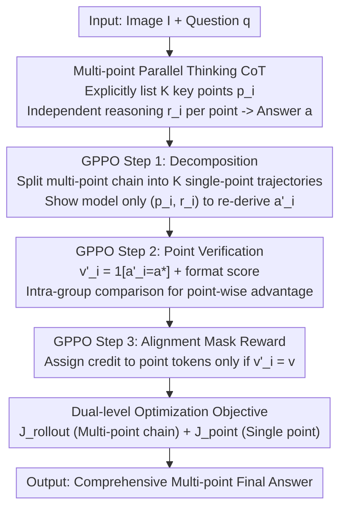

# PointThinker: Point-Incentivized Parallel Thinking for Multimodal Large Language Model

**Conference**: CVPR 2026  
**Paper**: [CVF Open Access](https://openaccess.thecvf.com/content/CVPR2026/html/Hu_PointThinker_Point-Incentivized_Parallel_Thinking_for_Multimodal_Large_Language_Model_CVPR_2026_paper.html)  
**Code**: To be confirmed (Repository address not provided; ⚠️ subject to the original text)  
**Area**: Multimodal VLM  
**Keywords**: Parallel Thinking, Multimodal Reasoning, Reinforcement Learning, Dense Reward, Credit Assignment

## TL;DR
PointThinker enables Multimodal Large Language Models (MLLM) to explicitly list multiple "key points" in an image during inference and develop independent reasoning paths around each point, thereby amplifying the diversity of parallel thinking. It employs a point-level dense reward RL method, GPPO, which assigns different rewards to "useful points" and "ineffective points" within the same thinking chain. This method improves Qwen2.5-VL-7B by +4~6 points on difficult benchmarks such as HallusionBench.

## Background & Motivation

**Background**: Chain-of-Thought (CoT) reasoning has been proven to enhance LLM and MLLM capabilities. Consequently, "parallel thinking" has become a popular research direction—rather than relying on a single reasoning chain, models explore multiple paths simultaneously (e.g., Tree-of-Thoughts, Self-Consistency, Parallel-R1) to improve robustness and reduce errors caused by the failure of a single path.

**Limitations of Prior Work**: The authors observed two issues. First, parallel thinking has **hardly been explored in the MLLM field**, representing a valuable research gap. Second, directly prompting models to generate multiple parallel reasoning chains often results in **highly redundant paths** in practice—different paths repeatedly approach the problem from the same angle (e.g., all discussing location or weather), which limits diversity and wastes the benefits of parallelism.

**Key Challenge**: Parallel thinking theoretically wins through "multi-perspective" exploration, but multiple chains generated freely by models often **converge to similar perspectives**. This lack of true diversity makes it difficult for RL to determine "exactly which reasoning step contributed to the success." Worse yet, the mainstream RL method GRPO only provides a **sparse reward** based on the final answer's correctness, which is then distributed uniformly across all tokens. In a chain where some points are helpful and others are irrelevant or misleading, they receive the same reward, leading to the incorrect reinforcement of ineffective reasoning and the drowning out of effective reasoning.

**Goal**: (1) To ensure that parallel paths explore **different** facets of a problem rather than just repeating variations of the same content; (2) To allow RL to distinguish the contributions of different reasoning segments within the same chain for **fine-grained credit assignment**.

**Key Insight**: The authors' key observation is that if each path is forced to "claim a specific key point first and then reason around it," the paths are naturally anchored to different facets, and redundancy is naturally reduced. Furthermore, each key point can be **independently evaluated**, which opens the door for dense rewards.

**Core Idea**: Use "key points" to solve both diversity and reward issues simultaneously—force multi-perspective exploration through a point-incentivized approach and implement dense rewards on a point-wise basis to accurately allocate credit for the final answer's correctness to the tokens of the corresponding key points.

## Method

### Overall Architecture
PointThinker uses Qwen2.5-VL-7B-Instruct as its backbone and is trained entirely via reinforcement learning (ablations show that additional SFT cold-starting provides no gain and is thus omitted). During inference, the model generates a **multi-point thinking chain** for a given image $I$ and question $q$: it explicitly lists $K$ key points $p_i$, provides an independent reasoning segment $r_i$ for each point, and finally synthesizes all points to give an answer $a$. During training, the core is **GPPO**, which decomposes the multi-point chain into multiple single-point trajectories for independent verification to obtain point-level signals. These signals are fed back to the original chain for fine-grained rewards via alignment masking, while a dual-level objective (rollout-level and point-level) is used for joint optimization.

### Key Designs

**1. Multi-point CoT: Forcing True Multi-perspective via "Point-then-Reasoning"**

To address "redundant parallel paths with inflated diversity," PointThinker forces the model to explicitly list a set of key points before reasoning for each point independently. Formally, the model $\pi_\theta$ generates a multi-point chain $C = \{(p_1, r_1), (p_2, r_2), \dots, (p_K, r_K), a\}$ for the input $(I, q)$, where $p_i$ is a key point describing a specific facet of the problem, $r_i$ is the reasoning surrounding it, and $a$ is the final answer synthesized from all paths. The structure is implemented using XML tags: key points are wrapped in `
...
`, reasoning in `<r>...</r>`, the entire thinking process in `<think>...</think>`, and the final answer in `<answer>...</answer>`.

Mechanism: Explicitly listing points achieves two things—first, it **incentivizes the model to identify different aspects of the problem**, establishing diverse exploration directions; second, because each path is tied to a specific key point, the model **focuses its reasoning on that specific perspective and avoids drifting into angles already covered by others**. Case studies (e.g., determining game time) show that standard CoT drifts into irrelevant content like weather/lighting, and naive parallel thinking repeats the same angle across paths, while PointThinker's paths anchor to different key points (sky color gradient, stadium lighting), resulting in more comprehensive and interpretable exploration.

**2. GPPO Point-wise Dense Reward: Accurate Credit Assignment via "Single-point Self-verification + Alignment Mask"**

To address the issue where "GRPO sparse rewards are distributed uniformly and cannot distinguish effective/ineffective points," the authors propose **Group Points Policy Optimization (GPPO)**, which calculates point-level rewards in three steps. **Step 1: Decomposition**: The multi-point chain $C$ is split into $K$ single-point trajectories. For each $(p_i, r_i)$, only the original input $(I, q)$ and this point-reasoning pair are fed back to the model (hiding other points), allowing it to generate an independent answer $a'_i$ (using the `<pointanswer>` tag), i.e., $T_i: (I, q, p_i, r_i) \to a'_i$. **Step 2: Verification**: A verification signal $v'_i = \mathbb{1}[a'_i = a^*] + F_{single,i}$ (answer correctness + format compliance) is calculated for each point. Point-level advantages $A^{point}_i$ are obtained by comparing these signals within the same rollout, encouraging the generation of points that can "autonomously lead to the correct answer."

**Step 3: Alignment Mask Reward** is the core of GPPO. First, the rollout-level advantage $A^{rollout}$ is calculated using the whole chain's reward $v$ according to standard GRPO. However, instead of distributing it uniformly to all tokens, **selective masking** is applied based on point-level signals:

$$M(s_t) = \begin{cases} A^{rollout} & \text{if } s_t \in \{p_i, r_i\} \text{ and } v'_i = v \\ 0 & \text{otherwise} \end{cases}$$

Intuitively: when the whole chain is correct ($v$ indicates success), **only points that could independently lead to the correct answer** receive a positive advantage, reinforcing useful reasoning. When the whole chain is wrong, **only points that also led to an incorrect answer** receive a negative signal, suppressing consistently ineffective reasoning. This accurately assigns credit to the points that contributed to the success or failure, rather than rewarding/punishing good and bad points indiscriminately.

**3. Dual-level Optimization Objective: Joint Rollout and Point Optimization without SFT Cold-start**

GPPO combines two levels of optimization. The **rollout-level objective** $J_{rollout}$ optimizes the multi-point chain using the masked advantage $M(s_{g,t})$, which is essentially a GRPO objective with selective token masking:

$$J_{rollout}(\theta) = \mathbb{E}\Big[\frac{1}{G}\sum_{g=1}^{G}\frac{1}{|C_g|}\sum_{t=1}^{|C_g|}\min\big(\rho_{g,t} M(s_{g,t}),\ \text{clip}(\rho_{g,t}, 1-\varepsilon, 1+\varepsilon) M(s_{g,t})\big) - \beta D_{KL}(\pi_\theta \| \pi_{ref})\Big]$$

Where $\rho_{g,t}$ is the importance sampling ratio. The **point-level objective** $J_{point}$ directly optimizes single-point trajectories: it calculates the policy ratio conditioned on the single-point input $(I, q, p_i, r_i)$ and uses the point-level advantage $A^{point}_i$ to weight each token of the generated answer, encouraging the model to learn to generate effective points and avoid ineffective ones. Combining both ensures that the multi-point chain is correct as a whole ($J_{rollout}$ + aligned credit assignment) and that single-point generation quality is maintained ($J_{point}$). Notably, ablations found that SFT cold-starting **provides no gain** (and sometimes causes performance drops), so PointThinker is trained purely via RL.

### An Example: Counting Players on a Baseball Field
The question asks how many players are in the image (GT=6). Standard CoT drifts into talking about weather, lighting, and celebration atmosphere, finally guessing "about 5" incorrectly. Naive parallel thinking generates two paths, but both repeat the same "counting jerseys by color" perspective and still answer 5. PointThinker first lists two **different** key points: Point 1 "Systematic census of all human figures"—counts 7 figures from foreground to background, then excludes one wearing black without a team uniform as a suspected umpire, resulting in 6; Point 2 "Distinguishing players from non-players"—identifies that among 7 people, 6 wear numbered jerseys and 1 wears black without gear, identifying the latter as an umpire, resulting in 6. The two points corroborate and converge to the correct answer 6. This demonstrates the design intent of "anchoring each path to a different facet → reducing redundancy → multi-perspective self-consistency."

## Key Experimental Results

### Main Results
Using Qwen2.5-VL-7B-Instruct as the base model, 102K samples were randomly sampled from MM-Eureka and WeThink for training (along with 30K Video-R1 samples for video). Easy-R1 was used as the RL framework, and DeepSeek-V3 served as the LLM-as-judge. PointThinker-7B outperformed the base model and same-base SOTAs across 7 image benchmarks:

| Benchmark | Qwen2.5-VL-7B (Base) | WeThink-VL-7B | PointThinker-7B | Gain over Base |
|------|----------------------|---------------|-----------------|------------|
| HallusionBench | 52.9 | 55.8 | **58.7** | +5.8 |
| MMVet | 67.1 | 71.7 | **73.4** | +6.3 |
| MathVista | 69.1 | 71.6 | **74.2** | +5.1 |
| MathVerse | 41.1 | 45.1 | **45.9** | +4.8 |
| MathVision | 25.9 | 26.7 | **28.1** | +2.2 |
| 7-bench Average | 54.0 | 56.4 | **58.1** | +4.1 |

Video understanding (Tab. 2, following the Video-R1 protocol) also generalized well: at 64 frames, PointThinker-7B led or matched Video-R1 on VSI-Bench (37.7), VideoMMMU (53.0), and MVBench (66.2), with gains of +8.7 on VSI-Bench and +4.1 on VideoMMMU over the base model.

### Ablation Study
Fixed on the Qwen2.5-VL-7B base model, components were added sequentially:

| Configuration | Point Structure | GPPO | HallusionBench | MMVet | Note |
|------|-----------|------|----------------|-------|------|
| Base | × | × | 52.9 | 67.1 | Qwen2.5-VL-7B |
| + Point | ✓ | × | 56.8 | 71.2 | Point structure + uniform reward; Hallusion +3.9 |
| + Point + GPPO | ✓ | ✓ | **58.7** | **73.4** | Added dense reward; extra +1.9 |

Another comparison (Tab. 3) evaluated "Naive Parallel vs. Point-Incentivized Parallel": Base 61.0 → +Parallel 63.5 → +Point 64.9 (Average of Hallusion/MathVista), indicating "Point-Incentivized" exploration adds an extra +1.4 over simple parallelism. On the smaller Qwen2.5-VL-3B model, PointThinker-3B also achieved +3.2 on HallusionBench and +4.1 on MathVista, validating the transferability of the method to smaller scales.

### Key Findings
- **Point structure contributes the most**: Adding the point structure alone brought a +3.9 gain on HallusionBench, which is the primary source of improvement—indicating that "explicitly splitting points" significantly improves the comprehensiveness and diversity of reasoning.
- **GPPO provide further gains**: On top of the point structure, dense rewards added an extra +1.9, proving that single-point trajectories provide meaningful verification signals and that "alignment masking" (rewarding/punishing only those points consistent with the final answer accuracy) is necessary for fine-grained credit assignment.
- **Pure RL is superior to SFT+RL** (Fig. 4): Among four comparison settings, pure RL performed best; standalone SFT sometimes even caused performance drops, which were only recovered after adding RL—supporting the decision to omit expensive SFT cold-starting.
- **Cross-modal generalization**: The method improves both image mathematics/general reasoning and video understanding across 3B and 7B scales, showing that "point-incentivized + point-level reward" is a generalized paradigm for reasoning enhancement.

## Highlights & Insights
- **"Points" serving two purposes**: The most ingenious part is using "key points" as both a diversity constraint and a reward unit—forcing multi-perspectives via points and implementing dense rewards based on points. Two major challenges (path redundancy + credit assignment) are solved by the same design.
- **Elegant Alignment Mask Reward**: The $v'_i = v$ alignment condition ensures that "when correct, only points that can independently lead to the answer are rewarded; when wrong, only points that consistently fail are penalized." This avoids the coarse approach of GRPO which applies the reward signal indiscriminately to all tokens. This logic can be migrated to any RL training for structured multi-step reasoning.
- **Self-verification Paradigm via Chain Decomposition**: Decomposing the multi-point chain into single-point trajectories and having the model re-derive answers from a single point is a lightweight "self-verification" mechanism. It provides point-level supervision signals without requiring an external reward model, ensuring high transferability.
- **Cost Reduction via No Cold-start**: Using ablations to prove that pure RL is sufficient—without the need for SFT—is friendly to training budgets and suggests that "structured reasoning formats" can be directly learned by RL.

## Limitations & Future Work
- **Dependency on extra verification overhead**: GPPO requires decomposing the multi-point chain and independently re-deriving $K$ single-point trajectories at each step. Training forward passes grow with the number of key points $K$, making it significantly more expensive than standard GRPO (quantified overhead was not provided in the cache; ⚠️ subject to the original text).
- **Point quality limited by the base model**: The method essentially guides the model to "list good points." If the base model identifies the wrong key points (e.g., treating irrelevant objects as key points), downstream reasoning will also be misled. The paper does not discuss robustness against erroneous points in depth.
- **Setting the number of points $K$**: $K$ is a hyperparameter; too few points lead to insufficient diversity, while too many increase verification costs and redundancy. The cache did not provide a full sensitivity analysis for $K$.
- **Scoring depends on external LLM**: Some data relies on DeepSeek-V3 as a judge; judge bias could affect the quality and reproducibility of reward signals.

## Related Work & Insights
- **vs GRPO**: GRPO only provides a sparse reward for the final answer, distributed uniformly across all tokens. GPPO adds point-level self-verification and alignment masking to achieve token-level fine-grained credit assignment, serving as a refined extension of GRPO.
- **vs Naive Parallel Thinking (Tree-of-Thoughts / Self-Consistency / Parallel-R1)**: These often suffer from redundant perspectives and are mostly used for text-only LLMs. PointThinker forces true diversity through explicit point listing and is the first to systematically introduce parallel thinking into MLLMs.
- **vs WeThink/Video-R1 and other same-base RL methods**: Also based on Qwen2.5-VL-7B, PointThinker performs better on MathVista (+2.6 over WeThink), HallusionBench, etc., and competes with or exceeds Video-R1 on video benchmarks, reflecting the extra gain provided by the point structure.

## Rating
- Novelty: ⭐⭐⭐⭐ "Point-incentivized exploration + point-level dense reward" solves diversity and credit assignment simultaneously with a fresh approach; however, it is built on existing frameworks of parallel thinking and GRPO, making it a sophisticated refinement rather than a completely new paradigm.
- Experimental Thoroughness: ⭐⭐⭐⭐ Includes multiple image/video benchmarks, ablation studies for point structure and GPPO, and tests across 3B/7B scales. Quantification of GPPO training overhead is missing (⚠️ subject to the original text).
- Writing Quality: ⭐⭐⭐⭐⭐ Clear connection between motivation, method, formulas, and cases. Alignment masking and dual-level objectives are well-explained with intuitive case diagrams.
- Value: ⭐⭐⭐⭐ Stable +4~6 improvements over a strong base on difficult benchmarks, with transferability to video and smaller models, offering practical reference value for multimodal reasoning enhancement.

<!-- RELATED:START -->

## Related Papers

- [\[NeurIPS 2025\] ACT as Human: Multimodal Large Language Model Data Annotation with Critical Thinking](../../NeurIPS2025/vlm_reasoning/act_as_human_multimodal_large_language_model_data_annotation.md)
- [\[CVPR 2026\] Thinking with Programming Vision: Towards a Unified View for Thinking with Images](thinking_with_programming_vision_towards_a_unified_view_for_thinking_with_images.md)
- [\[CVPR 2026\] Thinking in Dynamics: How Multimodal Large Language Models Perceive, Track, and Reason Dynamics in Physical 4D World](thinking_in_dynamics_how_multimodal_large_language_models_perceive_track_and_rea.md)
- [\[CVPR 2026\] OneThinker: All-in-one Reasoning Model for Image and Video](onethinker_all-in-one_reasoning_model_for_image_and_video.md)
- [\[ICLR 2026\] SportR: A Benchmark for Multimodal Large Language Model Reasoning in Sports](../../ICLR2026/vlm_reasoning/sportr_a_benchmark_for_multimodal_large_language_model_reasoning_in_sports.md)

<!-- RELATED:END -->
