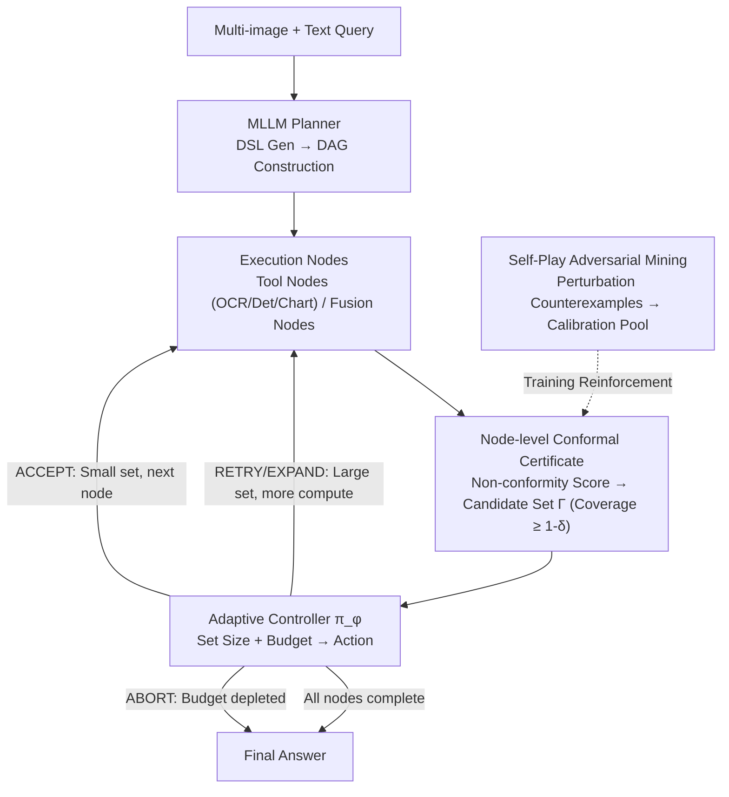

# Proof-of-Perception: Certified Tool-Using Multimodal Reasoning with Compositional Conformal Guarantees

**Conference**: CVPR 2026  
**arXiv**: [2603.00324](https://arxiv.org/abs/2603.00324)  
**Code**: [https://github.com/AryaFayyazi/PoP](https://github.com/AryaFayyazi/PoP)  
**Area**: Multimodal Reasoning / Reliable AI  
**Keywords**: Conformal Prediction, Tool Use, Multimodal Reasoning, Uncertainty Quantization, Adaptive Computation

## TL;DR
The authors propose Proof-of-Perception (PoP), which models multimodal reasoning as an executable directed acyclic graph (DAG). Each perception/logic node outputs set-values with conformal prediction certificates to provide step-by-step reliability guarantees. A lightweight controller adaptively allocates computing power within a budget based on these certificates, outperforming CoT, ReAct, and PoT baselines on document, chart, and multi-image QA benchmarks.

## Background & Motivation

**Background**: Multimodal LLMs have progressed in document understanding and chart reasoning but typically mix fine-grained perception (OCR, detection, chart parsing) and symbolic reasoning in a single forward pass. Tool use and structured prompting (CoT, ReAct, PoT) partially alleviate this.

**Limitations of Prior Work**: (1) Intermediate steps output a single guess, silently propagating errors; (2) computation allocation relies on heuristics (fixed retries, uncalibrated thresholds), failing to perform accuracy-cost trade-offs; (3) calibration, if present, is only on the final answer, leaving intermediate steps without reliability guarantees.

**Key Challenge**: Existing methods perform "single-point commitment" in intermediate perception steps—if OCR misses a character or detection misses a box, subsequent reasoning is forced to rationalize based on errors. Furthermore, a principled criterion is lacking for when to expand reasoning (multi-tool calls) or stop early.

**Goal**: How to provide reliability guarantees for each intermediate step of multi-step multimodal reasoning and transform uncertainty into a computation allocation strategy?

**Key Insight**: Conformal Prediction provides finite-sample coverage guarantees without distributional assumptions. Applying this to each node of a reasoning DAG allows for set-valued outputs with coverage guarantees rather than point estimates.

**Core Idea**: Use conformal prediction to output calibrated set-values at each perception/logic node in the reasoning DAG. A controller decides whether to accept, retry, or expand based on set size and budget.

## Method

### Overall Architecture
PoP addresses the "error propagation" issue in multi-step multimodal reasoning. Traditional approaches pack OCR, detection, chart parsing, and symbolic reasoning into one pass, where each step outputs only the most likely guess. PoP decomposes reasoning into an executable DAG $G=(V,E)$. An MLLM planner reads multi-image and text queries to generate a DSL program defining the graph. Tool nodes call external perception tools, and fusion nodes summarize upstream results within the MLLM. The key difference is that each node outputs a candidate set $\Gamma$ with a coverage guarantee derived from non-conformity scores and split-conformal calibration (Design 1). An adaptive controller monitors certificates and remaining budget to decide on actions: Accept, Retry, Expand, or Abort (Design 2). During training, a self-play adversary identifies perturbation samples that invalidate certificates to reinforce the calibration pool (Design 3).

### Key Designs

**1. Node-level Conformal Prediction Certificates: Reliability guarantees for every intermediate step**

The limitation is that once an intermediate step fails, subsequent reasoning rationalizes the error. PoP assigns a non-conformity function $s^{(t)}(x_v, z)$ to each node type $t$ (OCR/Detection/Chart/Fusion), measuring how "atypical" a candidate $z$ is. By sorting these scores on a calibration set, the threshold is determined as $\tau_\delta^{(t)} = \alpha_{(k)}^{(t)}$ where $k=\lceil(n_t+1)(1-\delta)\rceil$:

$$\tau_\delta^{(t)} = \alpha_{(k)}^{(t)}, \qquad \Gamma_\delta^{(t)}(x_v) = \{\, z : s^{(t)}(x_v, z) \leq \tau_\delta^{(t)} \,\}$$

The node outputs a set $\Gamma_\delta^{(t)}$ guaranteed to contain the ground truth with probability $\geq 1-\delta$. This avoids "single-point commitment" and allows downstream evidence to narrow down ambiguities.

**2. Adaptive Controller: Uncertainty as a computation signal**

The controller $\pi_\phi$ is a lightweight policy network that maps the certificate status $c_v$ (threshold, set size, node type) and remaining budget $b$ to an action $a_v \in \{\text{ACCEPT, RETRY, EXPAND, ABORT}\}$.
- **ACCEPT**: Keep current set.
- **RETRY**: Rerun the node with higher precision (e.g., high-res crop).
- **EXPAND**: Add a sub-node for more evidence (e.g., additional OCR call).
- **ABORT**: Stop early.
The controller maximizes:
$$R(x) = -C_{err}(x) - \beta\, C_{comp}(x)$$
trading off error cost $C_{err}$ and computation cost $C_{comp}$ via $\beta$.

**3. Self-Play Adversarial Sample Mining: Ensuring coverage under distribution shift**

Conformal prediction assumes "exchangeability." If the test distribution shifts, the coverage might drop. PoP uses a frozen adversary to apply controlled perturbations (cropping, affine transforms, noise) to inputs. Samples that cause prediction errors or abnormally high non-conformity scores are used to augment the training and the calibration pool. This ensures thresholds $\tau_\delta^{(t)}$ reflect real failure modes.

### Key Experimental Results

### Main Results

| Method | DocVQA | TextVQA | InfoVQA | ChartQA | MultiDoc2Dial |
|------|--------|---------|---------|---------|---------------|
| CoT (GPT-4V) | 74.2 | 68.1 | 51.3 | 71.8 | 42.5 |
| ReAct | 76.8 | 70.3 | 54.1 | 74.2 | 45.7 |
| PoT | 78.1 | 71.5 | 56.4 | 76.9 | 47.2 |
| **Ours (PoP)** | **82.3** | **75.8** | **61.2** | **80.5** | **52.8** |

### Ablation Study

| Configuration | DocVQA | Computation Cost (Norm) |
|------|--------|------------------|
| PoP (full) | 82.3 | 1.0x |
| w/o Conformal (Point Pred) | 77.5 | 0.8x |
| w/o Controller (Fixed Expand) | 80.1 | 1.6x |
| w/o Self-Play | 80.8 | 1.0x |

### Key Findings
- PoP outperforms CoT, ReAct, and PoT baselines across all 5 benchmarks, with a 4.2% Gain in DocVQA and 3.6% in ChartQA.
- Removing conformal certificates (point prediction) caused significant performance drops, validating the value of set-valued intermediate outputs.
- Without the controller, computation cost increased by 60% with marginal performance gains, proving the efficiency of adaptive allocation.
- Self-play mining contributed 1.5% to performance, enhancing robustness against distribution shifts.

## Highlights & Insights
- **Active Computation Strategy**: Converting uncertainty from a passive score into an active strategy (Large set $\rightarrow$ Expand; Small set $\rightarrow$ Accept) is the core insight.
- **Compositional Guarantees**: Providing step-by-step $1-\delta$ coverage is more meaningful than single final-answer calibration as it allows for error traceability.
- **Modularity**: The framework is highly modular, allowing flexible expansion of toolsets and node types.

## Limitations & Future Work
- The exchangeability assumption in conformal prediction remains a challenge despite self-play mitigations.
- Candidate set sizes are limited by beam search or sampling $K_{max}$, potentially omitting the ground truth.
- The discrete action space of the controller (4 actions) could be expanded for more fine-grained computation allocation.

## Related Work & Insights
- **vs CoT/ReAct**: These rely on point estimates and heuristic control without reliability guarantees.
- **vs Traditional Conformal Prediction**: Previous works usually focus on final outputs; PoP embeds it into every node of a multi-step reasoning pipeline.
- **vs ViperGPT/VisualProg**: These use programmatic reasoning but lack uncertainty quantification for intermediate steps.

## Rating
- Novelty: ⭐⭐⭐⭐⭐ 
- Experimental Thoroughness: ⭐⭐⭐⭐ 
- Writing Quality: ⭐⭐⭐⭐ 
- Value: ⭐⭐⭐⭐⭐

<!-- RELATED:START -->

## Related Papers

- [\[CVPR 2026\] Don't Show Pixels, Show Cues: Unlocking Visual Tool Reasoning in Language Models via Perception Programs](dont_show_pixels_show_cues_unlocking_visual_tool_reasoning_in_language_models_vi.md)
- [\[CVPR 2026\] Compositional Transformation Reasoning for Composed Video Retrieval](compositional_transformation_reasoning_for_composed_video_retrieval.md)
- [\[CVPR 2026\] Thinking With Videos: Multimodal Tool-Augmented Reinforcement Learning for Long Video Reasoning](thinking_with_videos_multimodal_tool-augmented_reinforcement_learning_for_long_v.md)
- [\[CVPR 2026\] ARM-Thinker: Reinforcing Multimodal Generative Reward Models with Agentic Tool Use and Visual Reasoning](arm-thinker_reinforcing_multimodal_generative_reward_models_with_agentic_tool_us.md)
- [\[ICLR 2026\] CompoDistill: Attention Distillation for Compositional Reasoning in Multimodal LLMs](../../ICLR2026/vlm_reasoning/compodistill_attention_distillation_for_compositional_reasoning_in_multimodal_ll.md)

<!-- RELATED:END -->
