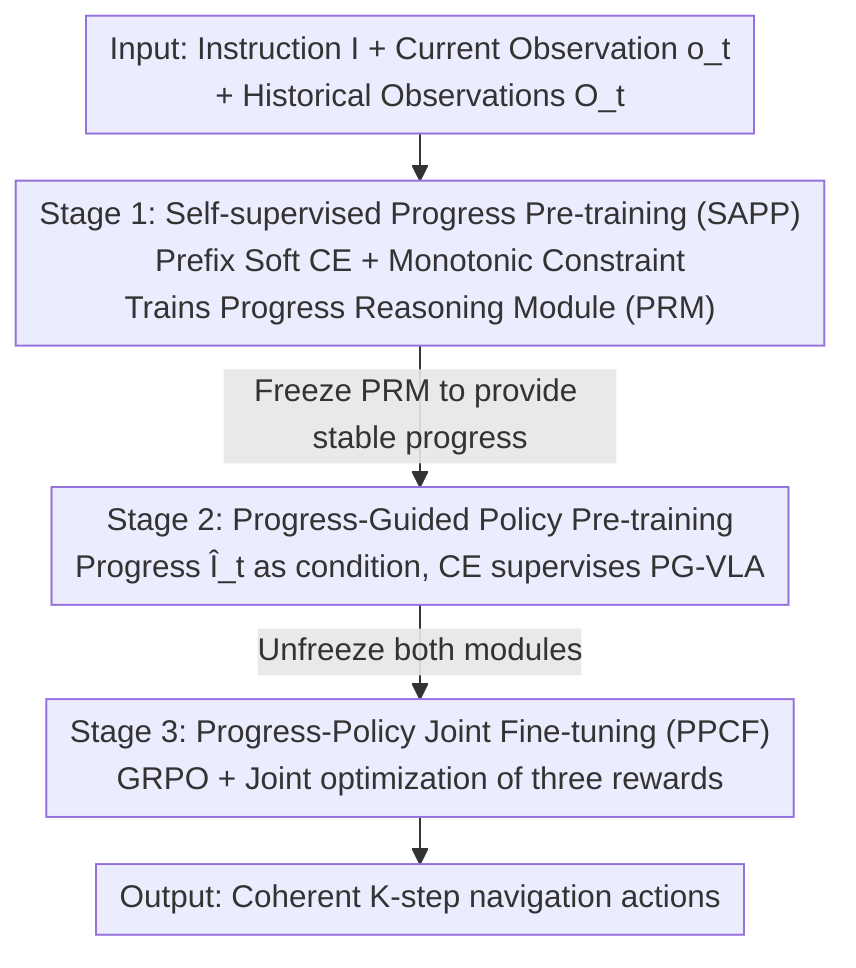

# Progress-Think: Semantic Progress Reasoning for Vision-Language Navigation

**Conference**: CVPR 2026  
**Paper**: [CVF Open Access](https://openaccess.thecvf.com/content/CVPR2026/html/Wang_Progress-Think_Semantic_Progress_Reasoning_for_Vision-Language_Navigation_CVPR_2026_paper.html)  
**Code**: [Project Page](https://horizonrobotics.github.io/robot_lab/progress-think)  
**Area**: Vision-Language Navigation / Embodied AI  
**Keywords**: VLN-CE, Semantic Progress Reasoning, Self-supervised Alignment, GRPO, VLA

## TL;DR
Addressing the issue in Vision-Language Navigation (VLN) where agents "do not know which step of the instruction they have reached," Progress-Think moves away from predicting numerical completion. Instead, it enables the model to reason the "completed instruction text" from historical observations. Using an annotation-free three-stage framework (Self-supervised Progress Pre-training → Progress-Guided Policy Pre-training → Progress-Policy Joint RL Fine-tuning), it couples progress reasoning with action policies, achieving SOTA on R2R-CE / RxR-CE using only monocular RGB.

## Background & Motivation

**Background**: Vision-Language Navigation in Continuous Environments (VLN-CE) requires agents to understand multi-step natural language instructions and navigate coherently over long horizons. Current mainstream approaches utilize VLA (Vision-Language-Action) models, feeding instructions, current RGB observations, and history into a multimodal large model to predict the next action end-to-end.

**Limitations of Prior Work**: Such end-to-end VLA models **implicitly embed** the state of "which step I have reached" within action prediction without explicit representation. Conversely, traditional progress methods use **numerical proxies** like geometric ratios or remaining distance. The problem is that numerical progress only measures spatial displacement and fails to capture "which semantic segment of the instruction the agent currently corresponds to." Traveling 60% of the distance does not equate to completing 60% of the semantic subgoals (e.g., the agent might be repeatedly turning to find a door).

**Key Challenge**: Observation sequences and instruction sequences naturally possess a structural property ignored by prior work—**monotonic co-progression**: as observations accumulate, the "aligned instruction prefix" also extends monotonically, where subsequent progress is built upon preceding progress (Figure 1 of the paper). However, existing methods either entangle progress signals with visual context or only regress a coarse global completion rate, failing to utilize this monotonic alignment structure for **step-level semantic alignment**.

**Core Idea**: Reformulate progress estimation as step-level semantic alignment between "**Visual Observations ↔ Instruction Prefixes**." The model directly predicts the "instruction text completed so far (instruction-style progress)" to serve as a semantic anchor for the policy. Crucially, labeling such step-level semantic progress is extremely expensive, and no public datasets provide such supervision. Therefore, the entire training process must be **annotation-free**: supervision signals are derived directly from the sequential structure of the instructions themselves.

## Method

### Overall Architecture

Progress-Think decouples VLN into two complementary components: a **Progress Reasoning Module (PRM, $\mathbf{F}_P$)** responsible for "reasoning where it has reached," and a **Progress-Guided VLA Module (PG-VLA, $\pi_\theta$)** responsible for "deciding the next move accordingly." At step $t$, the PRM takes historical observations $\mathcal{O}_t=\{o_0,\dots,o_{t-1}\}$ and the current observation $o_t$ to output a predicted "completed instruction text" $\hat{\mathcal{I}}_t=\mathbf{F}_P(\mathcal{O}_t, o_t)$. This semantic progress is then fed as an additional condition to the PG-VLA, which predicts the next $K$ actions under the joint influence of the instruction $I$, observations, and progress $\hat{\mathcal{I}}_t$.

The challenge lies in the absence of step-level annotations; thus, the system is built through a **three-stage progressive training** pipeline: first, self-supervision enables the PRM to learn progress reasoning from instruction prefix structures (PRM trained independently); then, the PRM is frozen to provide stable progress for policy supervision (PG-VLA trained independently); finally, RL is used for joint fine-tuning and mutual calibration of both modules.

### Key Designs

**1. Self-supervised Progress Pre-training (SAPP): Creating supervision from instruction prefixes without labels**

This stage addresses the fundamental pain point: datasets provide only high-level instructions and goals, not step-level subgoals. SAPP leverages two natural properties of instructions: (1) a correctly executed observation sequence should correspond to the "prefix of the instruction executed so far"; (2) progress should **increase monotonically** with the observation sequence.

It treats the "instruction prefix length $k$" as a latent progress state and converts decoder logits into a soft distribution over prefix lengths: $p_\theta(k\mid\mathcal{O}_t,\mathcal{I})\propto\exp\!\big(-\mathrm{CE}(\hat{\mathcal{I}}_{t,1:k},\mathcal{I}_{1:k})/\tau\big)$, where $\tau$ is the temperature and CE is cross-entropy. A differentiable "progress prefix length" is defined as the expected value $\hat{k}_t=\mathbb{E}_{p_\theta}[k]$. Two losses are applied: the **Prefix-Subset Soft CE Loss** provides fine-grained soft supervision for partial completion:

$$\mathcal{L}_{\mathrm{prefix}}=\mathbb{E}_t\Big[-\tau\log\sum_k\exp\!\big(-\tfrac{\mathrm{CE}(\hat{\mathcal{I}}_{t,1:k},\mathcal{I}_{1:k})}{\tau}\big)\Big],$$

and the **Monotonic Ordering Loss**, which enforces that for two states $t_i < t_j$ in the same episode, the predicted prefix for the latter is not shorter than the former: $\mathcal{L}_{\mathrm{mono}}=\mathbb{E}_{(i,j):t_i<t_j}\big[\max(0,\hat{k}_{t_i}-\hat{k}_{t_j})\big]$. The total objective is $\mathcal{L}_{\mathrm{SAPP}}=\mathcal{L}_{\mathrm{prefix}}+\mathcal{L}_{\mathrm{mono}}$. The former turns "execution progress" into a continuous learnable semantic quantity, while the latter uses temporal consistency to prevent progress regression and stabilize training.

**2. Progress-Guided Policy Pre-training (PG-VLA): Feeding "completed semantics" as explicit conditions**

Reasoning progress is insufficient; it must influence actions. In this stage, the PRM is **frozen** (to ensure stable progress guidance), and the progress-guided VLA is trained: $a_{t:t+K-1}=\pi_\theta(\mathcal{O}_t,o_t,\mathcal{I},\hat{\mathcal{I}}_t)$. Beyond standard instructions and observations, the progress $\hat{\mathcal{I}}_t$ from PRM is fed as an explicit condition. The intuition is that by knowing "which subgoals are finished and which remain," the policy can focus attention on the currently relevant subgoal rather than guessing within the entire instruction. Training uses standard cross-entropy to align with the expert's next $K$ actions: $\mathcal{L}_{\mathrm{policy}}=-\log\pi_\theta(a^*_{t:t+K-1}\mid\mathcal{O}_t,o_t,\mathcal{I},\hat{\mathcal{I}}_t)$.

**3. Progress-Policy Joint Fine-tuning (PPCF): Calibrating progress and policy with GRPO**

The first two stages are unidirectional (progress supervises policy), but self-supervised progress might not align perfectly with actual navigation goals. PPCF **unfreezes and jointly optimizes** both PRM and PG-VLA using the GRPO framework. It designs three complementary rewards summed as $r_t=r_{\mathrm{act}}+r_{\mathrm{fmt}}+r_{\mathrm{len}}$: **Action Reward** $r_{\mathrm{act}}=\sum_{i=0}^{K-1}\prod_{j=0}^{i}\mathbb{1}[a_{t+j}=a^*_{t+j}]$ rewards only the "longest correct prefix"—once a step is wrong, subsequent steps receive no points, with values in $\{0,1,\dots,K\}$ to encourage continuous correctness; **Format Reward** $r_{\mathrm{fmt}}$ checks if the action sequence is valid; and **Progress Length Reward** $r_{\mathrm{len}}$ constrains the predicted progress text from exceeding the full instruction length, penalizing as $-\beta(|\hat{\mathcal{I}}_t|-|\mathcal{I}|)$ to prevent "premature completion" or "over-extension." In each rollout, PRM samples $N$ progress hypotheses, each driving the action module to produce a set of actions. The joint optimization ensures that progress reasoning becomes more aligned with navigation targets while the policy becomes more sensitive to progress guidance.

### Loss & Training
The three stages use $\mathcal{L}_{\mathrm{SAPP}}$ (Prefix Soft CE + Monotonicity), $\mathcal{L}_{\mathrm{policy}}$ (CE), and $\mathcal{L}_{\mathrm{PPCF}}$ (GRPO + three rewards) respectively. Both PRM and PG-VLA are initialized from NVILA-2B. Training data comes from R2R-CE / RxR-CE / ScaleVLN training sets, converted into ~1200K step-level state-action pairs. Weak progress supervision samples are created using "trajectory prefixes with full instructions," along with 500K non-oracle samples collected by DAgger to enhance off-distribution robustness. Training is conducted on 8×H20: Stage 1 takes ~8 hours, while Stages 2 and 3 take ~60 hours each; GRPO rollout size is 4, clip is 0.28, and KL coefficient is 0. Action space includes {Forward (25/50/75 cm), Left/Right (15°/30°/45°), Stop}, predicting and executing $K=3$ steps at a time.

## Key Experimental Results

### Main Results

R2R-CE val-unseen (monocular RGB only, zero external data, yet outperforms methods using depth/panorama):

| Method | Obs | NE ↓ | OSR ↑ | SR ↑ | SPL ↑ | Ext. Data |
|------|------|------|-------|------|-------|----------|
| NaVILA | S.RGB | 5.22 | 62.5 | 54.0 | 49.0 | 2215K |
| Aux-Think | S.RGB | 5.49 | 62.9 | 55.7 | 48.7 | 1600K |
| MonoDream | S.RGB | 5.45 | 61.5 | 55.8 | 49.1 | 0K |
| BEVBert† | Depth+Pano | 4.57 | 67.0 | 59.0 | 50.0 | - |
| **Ours** | **S.RGB** | **4.68** | 63.6 | **60.1** | **53.6** | **0K** |

SR 60.1 / SPL 53.6 significantly leads monocular methods, and SPL even exceeds BEVBert (which uses depth+panorama), largely due to the data efficiency brought by explicit progress modeling.

RxR-CE val-unseen (cross-dataset generalization, all methods trained only on R2R-CE):

| Method | NE ↓ | OSR ↑ | SR ↑ | SPL ↑ |
|------|------|-------|------|-------|
| NaVid | 8.41 | 34.5 | 23.8 | 21.2 |
| MonoDream | 8.57 | 35.9 | 25.1 | 21.6 |
| **Ours** | **8.30** | **38.3** | **27.5** | **22.7** |

SOTA is achieved with zero training data from RxR-CE, verifying the transferability of the framework.

### Ablation Study

Comparison of progress representation forms (R2R-CE, verifying "Semantic Progress" is superior to numerical/global):

| Progress Representation | NE↓ | OSR↑ | SR↑ | SPL↑ |
|----------|------|------|------|------|
| Numerical Regression (% complete) | 8.25 | 37.7 | 33.4 | 26.2 |
| Instruction Reconstruction (global summary) | 7.67 | 45.8 | 37.7 | 32.1 |
| **Semantic Progress (Ours)** | **6.84** | **50.4** | **43.8** | **38.5** |

Component ablation (SAPP losses + PPCF reward configuration, R2R-CE):

| Prefix | Mono | AR+FR | PLR | NE↓ | OSR↑ | SR↓↑ | SPL↑ | Note |
|--------|------|-------|-----|------|------|------|------|------|
| | | | | 8.16 | 44.1 | 33.0 | 28.3 | Baseline |
| ✓ | | | | 7.26 | 45.8 | 39.4 | 34.6 | Add Prefix Soft CE, SR +6.4 |
| ✓ | ✓ | | | 6.94 | 48.4 | 41.4 | 36.5 | Add Mono, consistent gains |
| ✓ | ✓ | ✓ | | 7.16 | 46.2 | 40.0 | 35.0 | AR+FR rewards only |
| ✓ | ✓ | ✓ | ✓ | **6.84** | **50.4** | **43.8** | **38.5** | Full Model |

### Key Findings
- **Semantic Progress > Numerical/Global Progress**: Switching to semantic progress jumped SR from 33.4 (numerical) to 43.8, proving that step-level instruction-style alignment is necessary for executable decisions.
- **Progress Length Reward (PLR) is a key piece of PPCF**: Using only AR+FR caused SR to drop from 41.4 to 40.0; adding PLR brought SR to 43.8. Constraining progress text length to prevent "premature completion" is vital for RL stability.
- **$K=3$ steps is optimal**: Executing only 1 step leads to short-sightedness and frequent re-planning (NE 4.73), while 3 steps is most stable (NE 4.68 / SR 60.1).
- **Robust to trajectory granularity**: Gains are largest in cases where the instruction/trajectory length ratio is extremely coarse (<0.5) or fine (1.5-3.0).

## Highlights & Insights
- **"Monotonic co-progression" is a neglected yet essential structural prior**: The accumulation of observations ⇄ monotonic extension of instruction prefixes is elegantly realized through differentiable "expected prefix length $\hat{k}_t$" and monotonicity loss.
- **Upgrading progress from "scalar" to "instruction text fragment"**: Numerical progress only says "how much," while semantic progress says "which instructions are done," providing strong interpretability and serving as an explicit condition for the policy.
- **Integrating the PRM probability ratio into the GRPO importance ratio** ensures that progress reasoning itself is optimized by RL, rather than just optimizing the action policy.
- **Annotation-free training is highly transferable**: The idea of creating supervision from "sequence prefixes + monotonicity" can be generalized to any task where input and target sequences progress concurrently (e.g., procedural instruction following, flow-based agents).

## Limitations & Future Work
- Progress alignment assumes the observation sequence is "well-executed." If the agent deviates significantly (off-trajectory), the prefix alignment might fail. While DAgger helps, reliability under extreme deviation needs more analysis. ⚠️
- Three-stage training costs are high (~120+ hours on 8×H20) and depend on specific backbones like NVILA-2B; transferability to other backbones is unverified.
- Sensitivity to hyperparameters like penalty factor $\beta$ and temperature $\tau$ was not systematically analyzed; the performance drop without PLR suggests this regularization is critical.
- Evaluation is limited to photorealistic simulators (R2R-CE/RxR-CE); real-world robot deployment results are not yet reported.

## Related Work & Insights
- **vs. End-to-End VLA (NaVILA / Uni-NaVid)**: These embed progress implicitly. Ours explicitly extracts "semantic progress" and feeds it back to the policy, raising SR from ~54 to 60.1 with zero external data.
- **vs. Numerical Progress Estimation**: Traditional methods quantify spatial displacement but cannot locate semantic steps. Ours replaces scalar proxies with prefix alignment, leading to a 10+ point increase in SR.
- **vs. CoT Reasoning Supervision (Aux-Think)**: CoT aligns linguistic logic and depends on expensive external reasoning labels. Our progress reasoning aligns with measurable task advancement and is entirely self-supervised.
- **vs. Milestone-based Methods**: These require additional structures or supervision for step signals; ours "frees" step-level supervision from the monotonicity of instruction prefixes.

## Rating
- Novelty: ⭐⭐⭐⭐⭐ Realizes "monotonic co-progression" as self-supervised semantic progress reasoning, redefining progress estimation for VLN.
- Experimental Thoroughness: ⭐⭐⭐⭐ Two benchmarks + cross-dataset generalization + representation comparison + fine-grained ablation; lacks real robot and hyperparameter analysis.
- Writing Quality: ⭐⭐⭐⭐ Motivation (co-progression in Fig. 1) is clear, and the three-stage logic is coherent.
- Value: ⭐⭐⭐⭐⭐ SOTA with monocular RGB and zero external data; annotation-free training is highly practical for embodied navigation.

<!-- RELATED:START -->

## Related Papers

- [\[ACL 2026\] PROGRESSLM: Towards Progress Reasoning in Vision-Language Models](../../ACL2026/vlm_reasoning/progresslm_towards_progress_reasoning_in_vision-language_models.md)
- [\[CVPR 2026\] VOLD: Reasoning Transfer from LLMs to Vision-Language Models via On-Policy Distillation](vold_reasoning_transfer_from_llms_to_vision-language_models_via_on-policy_distil.md)
- [\[CVPR 2026\] Think Visually, Reason Textually: Vision-Language Synergy in Abstract Reasoning](think_visually_reason_textually_vision-language_synergy_in_abstract_reasoning.md)
- [\[CVPR 2026\] Think with 3D: Geometric Imagination Grounded Spatial Reasoning from Limited Views](think_with_3d_geometric_imagination_grounded_spatial_reasoning_from_limited_view.md)
- [\[CVPR 2026\] Reinforcing Video Object Segmentation to Think before it Segments](reinforcing_video_object_segmentation_to_think_before_it_segments.md)

<!-- RELATED:END -->
