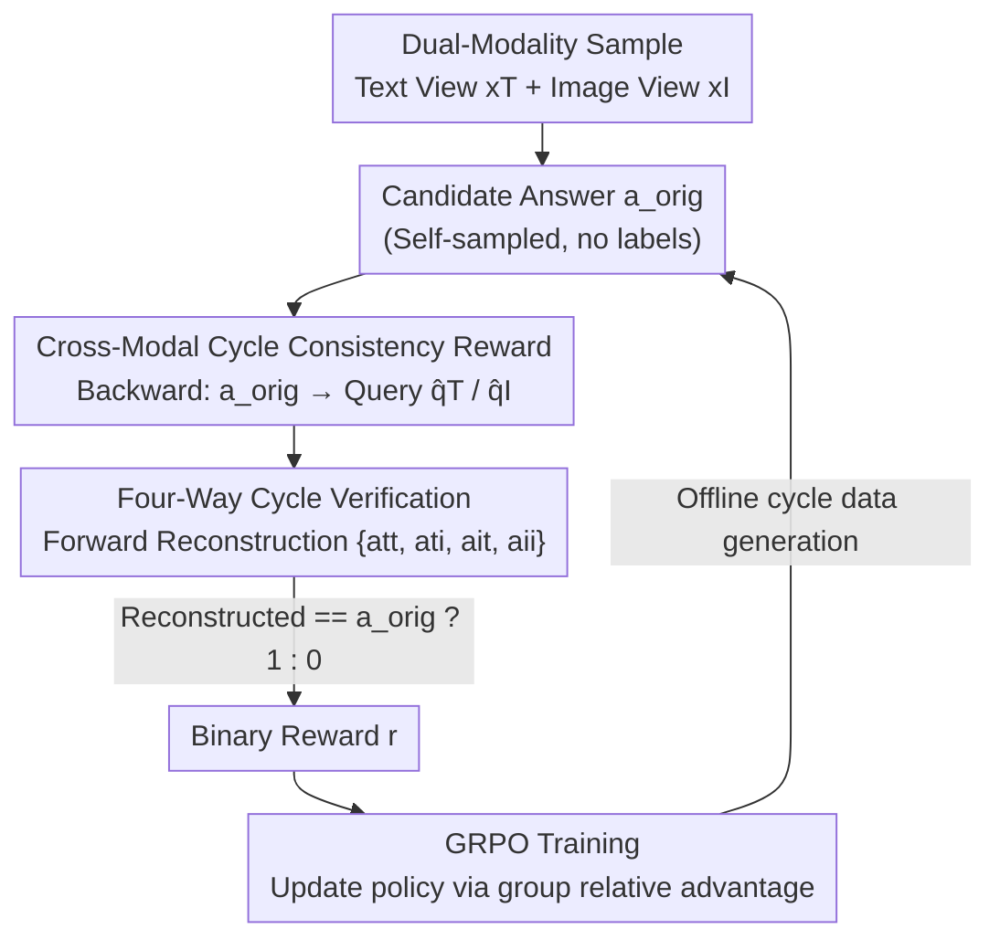

# R-C2: Cycle-Consistent Reinforcement Learning Improves Multimodal Reasoning

**Conference**: CVPR 2026  
**Paper**: [CVF Open Access](https://openaccess.thecvf.com/content/CVPR2026/html/Zhang_R-C2_Cycle-Consistent_Reinforcement_Learning_Improves_Multimodal_Reasoning_CVPR_2026_paper.html)  
**Code**: https://zirui00.github.io/RC2-Project-Page/  
**Area**: Multimodal VLM / LLM Reasoning  
**Keywords**: Multimodal Reasoning, Cycle Consistency, Reinforcement Learning, Self-supervised Reward, Modality Gap

## TL;DR
R-C2 treats the modality gap in multimodal large models—where the same content yields different answers under image versus text inputs—as an unannotated reward signal. The model derives a question from a candidate answer, switches modalities to reconstruct the answer, and receives a reward if the reconstruction is successful. This dense cycle-consistent signal is used for GRPO reinforcement learning, achieving up to a 7.6-point gain across six multimodal reasoning benchmarks.

## Background & Motivation
**Background**: Multimodal Large Language Models (MLLMs) are widely deployed in scenarios such as document understanding, web UI navigation, and agent systems. However, a fundamental "modality gap" exists: the same content, when provided as a screenshot (image) versus HTML source code (text), often results in contradictory answers from the model.

**Limitations of Prior Work**: To enhance reasoning capabilities, mainstream approaches rely on fine-tuning with large-scale, meticulously annotated data, which is expensive to construct and difficult to scale. Reinforcement learning (RL) offers an alternative but relies on reliable reward signals. While tasks like mathematics and coding have verifiable answers, complex multimodal answers are nearly impossible to verify automatically. Without annotated QA pairs, recent self-improvement methods resort to **majority voting** to generate pseudo-labels.

**Key Challenge**: Voting mechanisms suffer from two inherent flaws. First is "majority-is-wrong"—if the model has a systemic bias, the majority of rollouts will be incorrect, and voting will select the wrong answer as a pseudo-label, causing RL to reinforce errors and lead to performance collapse. Second, in multimodal scenarios, when predictions from image and text branches are **inconsistent** ( a very common occurrence), voting becomes unstable and arbitrary, often collapsing into a single dominant modality without resolving the underlying conflict, thus injecting significant noise into the training signal.

**Key Insight**: The authors observe that this cross-modal inconsistency is not a "failure" but an **untapped, natural self-supervised learning signal**. Rather than using voting to mask conflicts, it is better to transform the conflict into a reward that forces the model to resolve it.

**Core Idea**: Shifting from "answer-side voting" to "answer-side verification." Given a candidate answer, the model is tasked with backward reasoning to deduce the question that led to it, followed by a **modality switch** to forward-reconstruct the answer. If the reconstructed answer matches the original, a reward is given. This cycle constitutes a dense, label-free reward that compels the model to align its cross-modal representations.

## Method

### Overall Architecture
R-C2 models the improvement of multimodal reasoning as an RL problem, with the primary challenge being **acquiring reward signals without human labels**. The solution is a "Cross-Modal Cycle Consistency Reward." For each sample containing both a text view $x_T$ (e.g., HTML) and an image view $x_I$ (e.g., screenshot), the process starts with a candidate answer $a_{orig}$, performs **backward reasoning** (answer → query) to obtain a question, and then performs **forward reasoning** (query → answer) to reconstruct the answer. A binary reward is assigned based on the consistency between the reconstruction and the original answer. Finally, GRPO is used to update the policy with this reward.

The training pipeline consists of three steps: (0) Multimodal data preparation—ensuring each sample has semantically aligned image and text views (using existing pairs or completing image-only data with MLLM-generated text descriptions); (1) Cycle data construction from candidate answers; (2) GRPO reinforcement learning using cycle rewards. The authors adopt an **offline** strategy (pre-generating all cycle data before training), which allows for pre-computation and batch processing, significantly increasing training efficiency compared to online versions.

### Key Designs

**1. Converting Cross-Modal Inconsistency into Label-Free Self-Supervised Rewards: From Voting to Verification**

This approach directly addresses the issue where voting pseudo-labels reinforce model errors. Traditional self-improvement methods sample $k$ answers to a question and take the mode as the pseudo-label: $a' = \mathrm{mode}(\{a_j\}_{j=1}^{k})$, with $r_i = R(\hat a_i, a')$ as the reward. Multimodal versions pool rollouts from both image and text branches for joint voting: $a'_{multi} = \mathrm{mode}\big(\{a_j^I\}_{j=1}^{k_I} \cup \{a_t^T\}_{t=1}^{k_T}\big)$. Both assume "consensus = correctness," which fails during systemic bias or cross-modal divergence.

R-C2 shifts **from "answer-side voting aggregation" to "answer-side logical self-consistency verification."** Instead of aggregating multiple answers, it takes a single candidate answer $a_{orig}$ and tests whether it holds up in a "backward query induction → forward answer reconstruction" closed loop. Thus, the reward stems from logical consistency with itself rather than majority agreement among potentially erroneous answers.

**2. Four-Way Cross-Modal Cycle Consistency: Ensuring Intra-modal Stability and Cross-modal Alignment**

Backward-forward reasoning within a single modality only ensures internal consistency and does not bridge the modality gap. R-C2 constructs a **complete 4-way cycle**. In the backward step, from $a_{orig}$, the model derives two questions $\hat q_T$ (conditioned on $x_T$) and $\hat q_I$ (conditioned on $x_I$). In the forward step, each question is used to reconstruct the answer in **both modalities**, resulting in four paths (T→T, T→I, I→T, I→I) and four reconstructed answers $\{a_{tt}, a_{ti}, a_{it}, a_{ii}\}$. The reward is binary:

$$r = \begin{cases} 1, & \text{if reconstructed answer } \hat a \text{ matches } a_{orig}\\ 0, & \text{otherwise} \end{cases}$$

R-C2 **utilizes all four cycles simultaneously**. Intra-modal cycles (T→T, I→I) enforce stability within a modality, while cross-modal cycles (T→I, I→T) force the model to resolve the modality gap and align image-text semantics. This comprehensive assessment yields richer supervisory signals than single-modality consistency.

**3. Converting Cycle Rewards into Policy Gradients via GRPO: Offline Construction + Binary Reward Driven**

After obtaining binary cycle rewards, R-C2 optimizes the policy using GRPO (Group Relative Policy Optimization):

$$L_{GRPO} = \mathbb{E}\big[\log \pi_\theta(\hat a_i \mid x_i, q_i)\cdot \hat A(\hat a_i, a_i)\big]$$

Where the advantage is calculated using relative normalization within a batch: $\hat A(\hat a_i, a_i) = \dfrac{r_i - \mathrm{mean}(r)}{\mathrm{std}(r)}$. Probability is increased for answers with high rewards (cycle closed) and decreased for those with low rewards. The model gradually converges toward cross-modally consistent responses.

### Loss & Training
The GRPO objective is used with a learning rate of $1\times10^{-6}$, trained with mixed precision on 4 Blackwell 6000 Pro GPUs. For each update, 4 rollouts are sampled per modality (temperature 1.0, top-p 0.95), with an equivalent batch size of 256 via gradient accumulation. Training is capped at 100 steps with early stopping based on the validation set.

## Key Experimental Results

### Main Results
Evaluations were conducted on six benchmarks: ScienceQA, ChartQA, MathVista, VWA (web shopping subset, converted to multiple choice), DocVQA, and InfoVQA. The backbones used were Qwen2.5-VL-3B-Instruct and Qwen3-VL-8B-Instruct. Representative results for Qwen2.5-VL-3B are shown below (absolute gains over Base in parentheses):

| Dataset | Base (Text/Vision) | Voting(I+T) (Text/Vision) | R-C2 (Text/Vision) |
|--------|--------|--------|--------|
| ScienceQA | 68.9 / 76.0 | 73.1 / 78.0 | **76.7 (+7.8) / 83.3 (+7.3)** |
| ChartQA | 71.1 / 82.8 | 76.2 / 83.5 | **77.2 (+6.1) / 84.8 (+2.0)** |
| MathVista | 49.8 / 64.8 | 52.1 / 65.7 | **55.8 (+6.0) / 67.6 (+2.8)** |
| VWA | 69.0 / 62.9 | 73.3 / 64.5 | **74.5 (+5.5) / 67.1 (+4.2)** |
| DocVQA | 74.7 / 90.0 | 76.4 / 90.4 | 76.6 (+1.9) / 90.3 (+0.3) |
| InfoVQA | 54.9 / 74.1 | 56.1 / 74.3 | 56.3 (+1.4) / 74.3 (+0.2) |
| **Average** | 64.7 / 75.1 | 67.9 / 76.1 | **69.5 (+4.8) / 77.9 (+2.8)** |

R-C2 outperforms both text-only and joint voting baselines. The 8B model shows similar trends (avg Text +2.4, Vision +1.1), indicating that the method is complementary to model scale. Furthermore, the "Consistency Ratio" improved significantly (e.g., +10.0 on ScienceQA), proving the method aligns image-text semantics under a single interpretation.

### Ablation Study
Comparison of cycle path configurations on ScienceQA / ChartQA (Qwen2.5-VL-3B):

| Cycle Config | ScienceQA (Text/Vision/Cons.) | ChartQA (Text/Vision/Cons.) | Description |
|---------|--------|--------|------|
| Single (I→I, T→T) | 74.0 / 81.7 / 81.2 | 76.2 / 83.7 / 77.3 | Intra-modal only |
| Cross (I→T, T→I) | 75.8 / 80.1 / 83.1 | 76.5 / 83.8 / 78.4 | Cross-modal only |
| Mixed (All four) | **76.7 / 83.3 / 84.9** | **77.2 / 84.8 / 79.5** | Full R-C2 |

### Key Findings
- **All-paths Mixed is optimal**: Mixed configuration leads in accuracy and consistency, confirming that "intra-modal stability + cross-modal alignment" are both necessary.
- **Dual-modality for backward reasoning**: Utilizing both image and text for backward reasoning (answer → query) consistently yields higher accuracy and stronger cross-modal consistency.
- **Voting loses correct signals**: Qualitative analysis shows R-C2 aligns image and text branches to output correct, consistent answers where baselines fail due to modality divergence.

## Highlights & Insights
- **Bugs as signals**: R-C2 reverses the perspective from treating cross-modal inconsistency as a fault to be removed to treating it as a free, dense source of supervision.
- **Hybridizing Cycle Consistency + RL**: Cycle consistency, a veteran trick in generative tasks (e.g., CycleGAN), is cleverly applied to the "answer → question → answer" loop as a proxy for verifiability in non-verifiable multimodal reasoning.
- **Engineering trade-off with offline generation**: Pre-generating cycle data offline sacrifices the theoretical advantage of online data evolution but ensures significantly higher training efficiency.

## Limitations & Future Work
- **Reliance on dual-view data**: Requires semantically aligned image and text views; the quality of MLLM-generated text for image-only data impacts the reliability of cycle signals.
- **Coarseness of binary reward**: Precise matching doesn't distinguish between "partially correct" or "semantically similar" answers.
- **Inherent lag in offline strategy**: Training on fixed offline data may limit gains in later stages as the model outpaces the difficulty distribution of the generated cycles.
- **Short training steps**: Whether cycle signals become too sparse as model consistency increases during long-range training remains unexplored.

## Related Work & Insights
- **vs. Voting (e.g., R0)**: Voting equates consensus with correctness, reinforcing systemic biases. R-C2 relies on internal cycle consistency, avoiding "majority-is-wrong" failures.
- **vs. Process Rewards / Learned RMs**: Process rewards are vague in multimodal contexts, and learned RMs may inherit modality-specific biases. R-C2 provides structural rewards without extra RM training.
- **vs. Synthetic QA Fine-tuning**: R-C2 leverages the **existing** structure of natural multimodal data rather than relying on human-filtered or error-prone synthetic QA pairs.

## Rating
- Novelty: ⭐⭐⭐⭐⭐ Turning cross-modal inconsistency into label-free rewards is a novel and coherent perspective.
- Experimental Thoroughness: ⭐⭐⭐⭐ Extensive benchmarks, scales, and ablation studies, though comparison with more RLHF/process reward baselines is missing.
- Writing Quality: ⭐⭐⭐⭐ Clear motivation, but inconsistent naming (R-C2 vs. C3R) in parts of the manuscript may be confusing.
- Value: ⭐⭐⭐⭐ Provides a label-free RL path for multimodal reasoning where answers are not easily verifiable; highly practical.

<!-- RELATED:START -->

## Related Papers

- [\[CVPR 2026\] Reading or Reasoning? Format Decoupled Reinforcement Learning for Document OCR](reading_or_reasoning_format_decoupled_reinforcement_learning_for_document_ocr.md)
- [\[CVPR 2026\] Incentivizing Versatile Video Reasoning in MLLMs via Data-Efficient Reinforcement Learning](incentivizing_versatile_video_reasoning_in_mllms_via_data-efficient_reinforcemen.md)
- [\[CVPR 2026\] Thinking With Videos: Multimodal Tool-Augmented Reinforcement Learning for Long Video Reasoning](thinking_with_videos_multimodal_tool-augmented_reinforcement_learning_for_long_v.md)
- [\[ICLR 2026\] ReVisual-R1: Advancing Multimodal Reasoning from Optimized Cold Start to Staged Reinforcement Learning](../../ICLR2026/vlm_reasoning/revisual-r1_advancing_multimodal_reasoning_from_optimized_cold_start_to_staged_r.md)
- [\[CVPR 2026\] MoE-GRPO: Optimizing Mixture-of-Experts via Reinforcement Learning in Vision-Language Models](moe-grpo_optimizing_mixture-of-experts_via_reinforcement_learning_in_vision-lang.md)

<!-- RELATED:END -->
