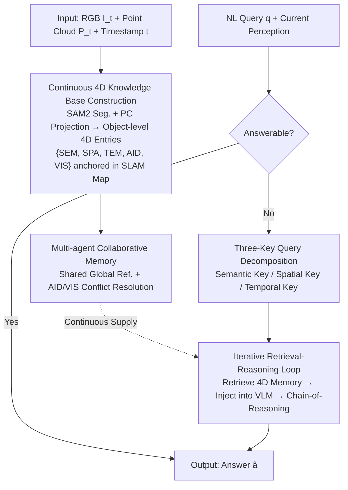

# R4: Retrieval-Augmented Reasoning for Vision-Language Models in 4D Spatio-Temporal Space

**Conference**: CVPR 2026  
**Paper**: [CVF Open Access](https://openaccess.thecvf.com/content/CVPR2026/html/Sohn_R4_Retrieval-Augmented_Reasoning_for_Vision-Language_Models_in_4D_Spatio-Temporal_Space_CVPR_2026_paper.html)  
**Code**: To be open-sourced (Authors declare availability upon publication)  
**Area**: Multimodal VLM / Embodied Reasoning  
**Keywords**: Retrieval-Augmented Reasoning, 4D Spatio-Temporal Memory, Embodied QA, Training-free, Multi-agent Collaboration

## TL;DR
R4 attaches a continuously growing "4D Spatio-Temporal Knowledge Base" (semantics + 3D space + time) to frozen Vision-Language Models. During reasoning, it decomposes natural language queries into three keys—semantic, spatial, and temporal—to retrieve evidence from this memory and iteratively inject it into the VLM. Without training any parameters, R4 enables VLMs to recall objects seen minutes ago, reason about occluded or disappeared entities, and coordinate across multiple agents, significantly outperforming strong baselines like GPT-5 and o3 on embodied QA and navigation benchmarks.

## Background & Motivation
**Background**: Current VLMs have made significant progress in tasks like visual question answering, embodied navigation, and manipulation. However, they either rely entirely on knowledge "memorized" within their parameters or can only observe a short window of current visual input.

**Limitations of Prior Work**: Purely parametric VLMs are prone to hallucinations in knowledge-intensive or long-horizon tasks and require retraining to absorb new information (leading to catastrophic forgetting) while lacking persistent memory. Existing Retrieval-Augmented Generation (RAG) solutions mostly perform retrieval on static text corpora. Multimodal extensions like ReMEmbR only store "flat video captions + GPS timestamps," lacking object-level geometry and preventing precise metric spatial reasoning. 3D-Mem stores unstructured image snapshots, shifting all spatio-temporal reasoning back into the VLM's context window, which limits accuracy for complex metric queries.

**Key Challenge**: Humans do not reason from isolated visual inputs—we anchor new observations into a persistent mental model of the world that simultaneously encodes "what (semantics), where (space), and when it appeared/changed (time)." Machines lack such a **structured, metrically anchored, and temporally continuous** 4D memory, as well as the mechanisms to retrieve and reason upon it.

**Goal**: To enable VLMs to integrate past and collaborative observations into current decision-making across long time horizons, occluded entities, and even multiple agents—all without fine-tuning the underlying VLM.

**Key Insight**: Mimic the human memory mechanism by coupling "semantic descriptions" with "metric spatial localization + temporal persistence" into object-level entries. This allows retrieval to occur directly within a structured 4D space rather than through text or image similarity searches.

**Core Idea**: Replace traditional "static text retrieval" in RAG with a **continuous 4D knowledge base + a three-key (semantic/spatial/temporal) retrieval-reasoning loop**, achieving training-free embodied 4D reasoning.

## Method

### Overall Architecture
R4 consists of two tightly coupled, parallel pipelines: the **Storage Pipeline** continuously builds a lifelong, continuous 4D knowledge base $D$ as the agent moves; the **Retrieval-Reasoning Pipeline** decomposes natural language queries into semantic, spatial, and temporal keys at inference time to retrieve evidence from $D$ and iteratively inject it into the frozen VLM. The entire system relies on a SLAM backend to provide a globally consistent reference frame, aligning all spatial features and agent poses to the same coordinates, thereby supporting shared memory across multiple agents.

### Key Designs

**1. Continuous 4D Knowledge Base: Anchoring every object into lifelong "Semantic+Spatial+Temporal" entries**

This is the foundation for R4 to solve the lack of persistent, metric memory. At each timestep, given synchronized RGB image $I_t$, point cloud $P_t$, and timestamp $t$, SAM2 is used to segment the image into object masks. Using camera intrinsic/extrinsic parameters, the point cloud is projected into image space and associated with mask $m_j$. For each object $o_j$, its 3D centroid $c^t_j=\text{centroid}(P_t[m_j])$ and bounding box extent $e^t_j=\text{extent}(P_t[m_j])$ are calculated in the world coordinate system. A self-prompted VLM then generates a "concise single-instance semantic description." These elements form an object-level 4D entry $O^t_j=\{\text{SEM}, \text{SPA}, \text{TEM}, \text{AID}, \text{VIS}\}$, where SEM is the NL description, SPA represents spatial attributes, TEM is the time interval, AID is the observing agent's ID, and VIS is a visibility flag (occluded or not). Entries are stored using three mechanisms: semantics in a vector database, space in a global metric Euclidean space, and time in a columnar temporal database by appearance/disappearance timestamps. The centroid $c^t_j$ serves as a "special point" inserted into the globally consistent, continuously updated SLAM map $M$, linking map positions to corresponding 4D JSON objects $O^t_j$. Thus, the knowledge base $D=(M, \{O_j\}_{j=1}^N)$. This dual representation—map for precision, JSON for semantics/time—is key to precise metric QA. The base is **incrementally refined**: new observations $o'_j$ are matched with existing entries $o_k$ based on $\lVert c'_j-c_k\rVert_2<\epsilon_c \wedge \text{sim}(\text{SEM}'_j, \text{SEM}_k)>\delta_s$. The agent then decides whether it is an old object (updating/adding attributes like color) or a new one (insertion).

**2. Multi-agent Collaborative Memory: Conflict resolution on shared maps using AID/VIS**

To address "limited single-agent memory and observation conflicts during collaboration," multiple agents align their SLAM maps to the same global reference frame to build a shared 4D knowledge base. An agent entering an area previously explored by others can inherit prior object knowledge and refine it with its own perception. Conflicts are resolved via metadata: AID tracks the source of each record. If two agents provide contradictory descriptions for the same location, the model uses the VIS flag to **prioritize unoccluded observations** over occluded ones. Whether an object is static or dynamic is implicitly inferred via attribute matching of historical entries with the same object ID.

**3. Three-Key Query Decomposition and Structured Retrieval Manual: Translating natural language into executable 4D retrieval commands**

Standard RAG using text similarity cannot answer inherently 4D questions like "What object was to the right of the car 12 seconds ago?". R4 includes a "Retrieval Manual" in the system prompt, defining the syntax for three keys: semantic key $k_{sem}$ (category/attribute/role, e.g., "tree-like", "open door"), spatial key $k_{spa}$ (spatial relations relative to ego or world coordinates, e.g., "10m ahead", "right of my view"), and temporal key $k_{tem}$ (absolute/relative time references, e.g., "12 seconds ago", "last time passing through"). The VLM decomposes complex queries into retrieval commands—e.g., "the red bus I just saw" becomes a semantic search for "red bus" + a time interval search. The three-way retrieval searches heterogeneous spaces: semantic search uses cosine similarity on SEM embeddings; spatial search filters the SLAM map $M$ for centroids satisfying $k_{spa}$; temporal search matches TEM intervals. Any key (used alone or coupled) retrieves the full 4D entry of the corresponding object.

**4. Iterative Retrieval-Reasoning Loop: Answerability self-assessment and chain-of-querying**

Reasoning is a two-step loop. **Step 1: Answerability Self-Assessment**: The VLM first attempts to answer using only current perception + parametric knowledge. If internal confidence and Chain-of-Thought consistency are high, it outputs directly. Otherwise, it enters retrieval-augmented reasoning. **Step 2: Structured Retrieval**: Using the three keys, retrieval results are serialized into text context $C(q)$ (including AID and visibility to allow the VLM to judge reliability), which is appended to the query: $\hat{a}=\text{VLM}(q\oplus C(q))$. The model runs in a continuous loop where the output of one iteration becomes the input for the next until termination criteria are met. It doesn't just fetch static entries; it filters unreasonable instances and dynamically re-aggregates objects/features. Subsequent iterations can implicitly **expand retrieval scope** and perform **chain-of-querying**—e.g., to find "what is within 2m of the table," it first retrieves the table, then queries its spatial neighborhood.

### Loss & Training
R4 is **completely training-free**: the underlying VLM is frozen with no gradient updates or fine-tuning. Capabilities come from the structured memory and prompt engineering (Retrieval Manual system prompt). Implementation uses MapAnything as the 4D map backend, SAM2 Hiera Large for segmentation, and Gemma3-4B-IT as the backbone VLM.

## Key Experimental Results

### Main Results
Evaluation covers three complementary embodied reasoning benchmarks: ERQA (Embodied Reasoning in Physical Environments), OpenEQA (Episodic Memory EM-EQA + Active A-EQA), and VLM4D (Structured 4D Knowledge formation). R4, using only a training-free 4B backbone, surpasses massive closed-source models.

| Benchmark | Metric | R4 | Next Best Baseline | Gain |
|-----------|--------|----|--------------------|------|
| ERQA | Multi-choice Acc | **70.25** | GPT-5: 65.7 | +4.55 |
| OpenEQA EM-EQA (All) | LLM-Match | **79.77** | GPT-5: 64.4 | +15.37 |
| OpenEQA EM-EQA (HM3D) | LLM-Match | **76.96** | — | +30.36 over next best |
| OpenEQA A-EQA (HM3D†) | LLM-Match | **74.00** | GPT-4V: 41.8 | +21.4 |
| VLM4D Overall | Combined Acc | **77.31** | Gemini-2.5-Pro: 62.0 | +15.31 |

*Note: On VLM4D, R4 is slightly weaker in FP (False Positive/local discrimination)—the authors explain that FP measures local situational judgment where memory provides no inherent advantage.*

### Ablation Study
Analyzing the contribution of Semantic (SEM), Spatial (SPA), and Temporal (TEM) keys on a subset of 184 EM-EQA tasks:

| Config | Active Keys | EM-EQA (All) | Relative to Baseline |
|--------|-------------|--------------|----------------------|
| A1 | None (Baseline) | 49.8 | — |
| A2 | SEM | 56.2 | +6.4 |
| A3 | SPA | 51.3 | +1.5 |
| A8 (R4)| SEM+SPA+TEM | **79.77** | +3.9 over the best partial combo |

Collaboration ablation (Table 4) shows: R4-Collab. vs R4-S.A. (Single Agent) yields +1.09 in accuracy (73.91 vs 72.82) but a massive +8.66 in exploration efficiency (LLM-Match SPL: 70.13 vs 61.47).

### Key Findings
- **All Three Keys are Essential**: Single keys provide at most a +6.4% gain, indicating isolated cues are insufficient for robust episodic reasoning; only 3D interaction (A8) unlocks the full potential.
- **Semantics as the Anchor**: "Spatial+Temporal" without semantic grounding (A7) yields limited gains—semantic world knowledge in the VLM is the necessary anchor for integration.
- **Collaboration Primarily Saves Paths**: The biggest gain from shared 4D memory is **exploration efficiency** (SPL +8.66), suggesting agents can retrieve and ground others' observations to take shorter paths.
- **Small Models Beat Large Models**: The 4B backbone outperforms GPT-5/o3 on ERQA, particularly in pointing and spatial localization, as the 4D map directly supports geometric disambiguation.

## Highlights & Insights
- **Retrieval in Structured 4D Space**: Unlike traditional RAG fetching text/image similarity, R4 enables retrieval within a "metrically anchored + temporally indexed" object-level memory, allowing 4D-native questions about orientations or disappeared entities to be answered directly.
- **Training-free yet SOTA**: All capabilities stem from memory structure and the Retrieval Manual; as a zero-gradient method, it is plug-and-play across VLMs and avoids catastrophic forgetting.
- **AID/VIS Metadata for Collaboration**: Using "who observed it + visibility" flags makes multi-agent conflict resolution lightweight and transferable to other multi-source systems.
- **Answerability Gate**: Allowing the model to first judge "Can I answer this directly?" before retrieving saves compute and reduces unnecessary context noise.

## Limitations & Future Work
- **Reliance on External Module Precision**: Centroids/extents rely on SAM2, point cloud projection, and SLAM; segmentation drift or SLAM noise can pollute 4D entries.
- **Prompt-dependent Retrieval Manual**: The three-key syntax relies on system prompts; its stability across different VLMs and potential for mis-decomposition of complex queries needs further study.
- **Implicit Temporal State Inference**: Motion status is inferred via attribute matching of historical entries, which might be unstable for fast-moving objects.
- **Future Directions**: Explicitly modeling visibility/source uncertainty in retrieval scoring; introducing robust updates against SLAM/segmentation errors; exploring the upper bound with larger backbones.

## Related Work & Insights
- **vs. ReMEmbR**: It stores flat memory ("captions + timestamps") lacking geometry; R4 stores object-level 4D entries where retrieval itself is spatio-temporal.
- **vs. 3D-Mem**: It uses unstructured snapshots, delegating reasoning to the VLM context; R4 decouples semantic-spatial-temporal structures for higher precision.
- **vs. Embodied-RAG**: It uses hierarchical semantic forests for navigation but lacks temporal 4D anchoring for reasoning about state changes over time.
- **vs. SRMT / Collaborative Memory**: These broadcast or compress individual memories but lack a queryable, unified spatio-temporal world model.

## Rating
- **Novelty**: ⭐⭐⭐⭐⭐ (Structured 4D retrieval is a clear new paradigm distinct from text RAG).
- **Experimental Thoroughness**: ⭐⭐⭐⭐ (Comprehensive across benchmarks/ablations, though lacking error robustess analysis against SLAM noise).
- **Writing Quality**: ⭐⭐⭐⭐ (Logical flow; clear components; some comparisons are slightly obscured by descriptive text).
- **Value**: ⭐⭐⭐⭐⭐ (Training-free, enables 4B models to beat GPT-5, and strong multi-agent potential).

<!-- RELATED:START -->

## Related Papers

- [\[CVPR 2026\] Streaming Video Crime Anticipation with Spatio-Temporal Causal Reasoning](streaming_video_crime_anticipation_with_spatio-temporal_causal_reasoning.md)
- [\[CVPR 2026\] Learning to Reason in 4D: Dynamic Spatial Understanding for Vision Language Models](learning_to_reason_in_4d_dynamic_spatial_understanding_for_vision_language_model.md)
- [\[CVPR 2026\] CogniVerse: Revolutionizing Multi-Modal Retrieval-Augmented Generation with Cognitive Reflection and Geometric Reasoning](cogniverse_revolutionizing_multi-modal_retrieval-augmented_generation_with_cogni.md)
- [\[CVPR 2026\] CaST-Bench: Benchmarking Causal Chain-Grounded Spatio-Temporal Reasoning for Video Question Answering](cast-bench_benchmarking_causal_chain-grounded_spatio-temporal_reasoning_for_vide.md)
- [\[CVPR 2026\] Thinking in Dynamics: How Multimodal Large Language Models Perceive, Track, and Reason Dynamics in Physical 4D World](thinking_in_dynamics_how_multimodal_large_language_models_perceive_track_and_rea.md)

<!-- RELATED:END -->
