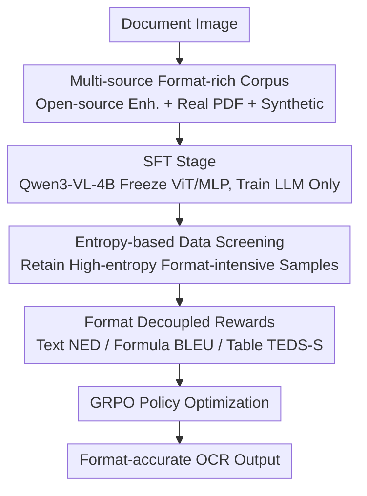

# Reading or Reasoning? Format Decoupled Reinforcement Learning for Document OCR

**Conference**: CVPR 2026  
**Paper**: [CVF Open Access](https://openaccess.thecvf.com/content/CVPR2026/html/Zhong_Reading_or_Reasoning_Format_Decoupled_Reinforcement_Learning_for_Document_OCR_CVPR_2026_paper.html)  
**Code**: https://github.com/DocTron-hub/FD-RL  
**Area**: Multimodal VLM / Document OCR / Reinforcement Learning  
**Keywords**: Document OCR, Reinforcement Learning, GRPO, Entropy Screening, Format Decoupled Rewards

## TL;DR
The authors observed that the output entropy of OCR models on "formatted text" like formulas and tables is an order of magnitude higher than on plain text. Consequently, they propose Format Decoupled RL (FD-RL): utilizing entropy to rank and filter format-intensive hard samples, and then applying GRPO training with a suite of separate reward functions for text, formulas, and tables. The method achieves a competitive score of 90.41 on OmniDocBench among end-to-end models.

## Background & Motivation
**Background**: Document OCR (parsing document images into structured text) currently follows two main paradigms. The first is the conventional pipeline (layout detection followed by region-specific specialized parsers, such as MinerU and PP-StructureV3), which is stable but lacks flexibility and incurs high fine-tuning costs. The second is end-to-end VLMs that decode text directly from images (e.g., dots.ocr, DeepSeek-OCR), offering simplicity and better generalization. Recent works focus almost entirely on "scaling data engineering + SFT."

**Limitations of Prior Work**: Even powerful OCR models struggle with formatted text like formulas and tables. The authors conducted a key empirical observation: they categorized documents into five levels based on the "formatted text ratio" (20%/40%/60%/80%/100%) and calculated the average output entropy during inference using Qwen3-VL. They found that a higher formatting ratio correlates with higher output entropy, and the entropy of formatted text is often an order of magnitude higher than that of plain text—indicating that the model is extremely uncertain and "confused" by format-intensive content.

**Key Challenge**: Token-level objectives in pure SFT force the model to "memorize" a specific output sequence. However, formulas may have multiple semantically equivalent representations (e.g., `1/2` vs. `\frac{1}{2}`), and tables have multiple valid structural expressions. Forcing the model to memorize a single path leads to unstable learning, and format errors are often "drowned out" by the massive volume of content errors in plain text, preventing targeted feedback.

**Key Insight**: Existing research suggests that high-entropy tokens are "crossroads" that guide language models toward diverse reasoning paths. Since formatted text naturally exhibits high entropy, it can generate diverse readings and provide varied reward signals in RL—effectively upgrading OCR from "pure perceptual reading" to "reasoning-after-reading."

**Core Idea**: Use entropy to filter high-value, format-intensive samples, and then design specific reward functions for text, formulas, and tables respectively for GRPO. This allows the model to learn "formatting rules" rather than "memorizing token sequences."

## Method

### Overall Architecture
FD-RL adopts a two-stage paradigm of "SFT for foundation and RL for refinement," supplemented by multi-source data engineering. The overall workflow is: first, construct a large-scale, format-rich corpus from three sources; then, perform SFT on Qwen3-VL-4B (freezing the vision encoder and projection layer, training only the LLM) to obtain a strong OCR base, FD-RL(SFT); following this, enter the RL stage by selecting high-entropy, format-intensive samples via entropy-based filtering; finally, optimize the policy using GRPO with format decoupled rewards (separate scoring for text/formulas/tables) to output format-accurate parsing results.

### Key Designs

**1. Multi-source Format-rich Corpus: Building a solid foundation for "reading"**

For RL to succeed, the SFT base must be strong enough and the data must sufficiently cover format-intensive scenarios. Thus, the authors constructed a corpus from three lines. ① **Open-source Data Quality Enhancement**: Collected PDFA, DocStruct4M, DocGenome, etc., plus handwriting/formula datasets (IAM, ORAND-CAR, HME). Sampling revealed common issues like "missing content, incorrect reading order, and sentence duplication." They re-labeled these using the lightweight OCR model GOT and applied similarity filtering—retaining only samples where original labels highly matched VLM labels, while **still using original labels as ground truth** (rather than VLM output) to avoid overfitting to the VLM's style. ② **Real PDF Construction**: Divided into layout-aware paths (page-level using MinerU for Markdown + Mathjax validation + deduplication; region-level following Fox using Mathpix for coordinate results and synthetic negative samples) and content-aware paths (using dots.ocr to convert formulas to LaTeX, tables to HTML, and reordering by reading sequence). ③ **Synthetic OCR Data**: Content sourced from K12 to adult exercises and StackExchange STEM Q&A, rendered with HTML templates (true fonts/spacing/colors) + MathJax + Playwright high-res screenshots, paired with Markdown to supplement scarce labels in educational/academic scenarios. This covers nine document types (Notes, Financial Reports, Slides, Exam Papers, Synthetic, Magazines, Academic Papers, Books, Newspapers).

**2. Entropy-based Data Screening: Concentrating RL compute on the "most confused" samples**

Using the full SFT data for RL is both wasteful and yields sparse signals (plain text is too certain to provide useful gradients). The authors first performed type filtering—removing samples containing only plain text, increasing the ratio of structured data, and balancing Chinese/English proportions. Then, they applied entropy filtering: inferring each sample with the SFT model, extracting log probabilities for each token, calculating the average output entropy, and filtering by threshold $\tau$:

$$D_{filtered} = \left\{ d \in D_{raw} \;\middle|\; -\frac{1}{N_d}\sum_{i=1}^{N_d}\log p_i^{(d)} \geq \tau \right\}$$

where $N_d$ is the number of tokens in sample $d$, and $p_i^{(d)}$ is the probability of the $i$-th token. Higher entropy represents more complex structures and higher prediction uncertainty, thus identifying "hard samples with the highest learning value." Ablations show that a 50% screening rate is optimal (90.41); both lower (0% full retention) or higher (75% too aggressive) results were worse—indicating the need to remove noise without discarding too many learnable samples.

**3. Format Decoupled Rewards: Scoring by content type to prevent format errors from being overwhelmed**

This is the core of the paper. If a single unified edit distance reward is used for the entire output, subtle structural errors in formulas/tables are diluted by the vast amount of plain text, preventing the model from learning format-level feedback. FD-RL uses regular expressions to split both model output and ground truth into three categories: plain text, formulas, and tables. Each category is assigned a specialized reward: **Plain Text** uses Normalized Edit Distance (NED) for character-level supervision; **Formulas** use BLEU—compared to edit distance, n-gram matching is more sensitive to local structural errors and provides sharper feedback for stable RL; **Tables** use TEDS-S (tree edit distance based on HTML representation) specifically targeting structural consistency. All formulas/tables undergo syntax normalization to absorb equivalent variants. A **Fallback Mechanism** was also established: when regex parsing fails, all rewards degrade to string matching rewards, ensuring the model still receives character-level supervision rather than a sparse zero reward, maintaining training stability. The total reward is averaged across "non-empty types":

$$R = \frac{\sum_{c=1}^{C} \mathbb{I}[|GT_c| > 0]\cdot f_c(Pred_c, GT_c)}{\sum_{c=1}^{C}\mathbb{I}[|GT_c| > 0]}$$

where $C$ is the total number of content types, $\mathbb{I}[\cdot]$ is 1 if the ground truth for that type is non-empty and 0 otherwise, and $f_c$ is the reward function for category $c$. Ablations show that progressively adding rewards (Unified NED → Decoupled → Formula BLEU → Table TEDS-S) increased the overall score from 88.64 to 90.41, with the Table TEDS gain being particularly significant (~4 points).

### Loss & Training
The RL stage uses GRPO: for each input $x$, a group of responses $\{o_1,\dots,o_G\}$ is sampled from the old policy $\pi_{\theta_{old}}$. Utilizing the format decoupled rewards above, individual $R_i$ are calculated and group-normalized to obtain the advantage:

$$A_i = \frac{R_i - \text{mean}(\{R_j\}_{j=1}^{G})}{\text{std}(\{R_j\}_{j=1}^{G})}$$

The objective is then to maximize the clipped GRPO goal (similar to PPO but **without a separate critic**, as group normalization serves as the baseline):

$$J_{GRPO}(\theta) = \mathbb{E}\left[\frac{1}{G}\sum_{i=1}^{G}\min\left(\frac{\pi_\theta(o_i|x)}{\pi_{\theta_{old}}(o_i|x)}A_i,\; \text{clip}\!\left(\frac{\pi_\theta(o_i|x)}{\pi_{\theta_{old}}(o_i|x)}, 1-\epsilon, 1+\epsilon\right)A_i\right)\right]$$

The base model is Qwen3-VL-4B. During SFT, the ViT vision encoder and MLP projection layer are frozen, updating only the LLM to concentrate compute on sequence decoding and format generation.

## Key Experimental Results

### Main Results (OmniDocBench, End-to-end VLM Comparison)
OmniDocBench contains 1,355 pages across nine document types in Chinese and English. The overall score is calculated as $\text{Overall} = \frac{(1-\text{TextEdit})\times 100 + \text{Formula}_{CDM} + \text{Table}_{TEDS}}{3}$.

| Method | E2E | Overall↑ | Text Edit↓ | Formula CDM↑ | Table TEDS↑ | Table TEDS-S↑ | RO Edit↓ |
|------|-----|----------|------------|--------------|-------------|---------------|----------|
| DeepSeek-OCR | ✓ | 87.01 | 0.073 | 83.37 | 84.97 | 88.80 | 0.086 |
| dots.ocr | ✓ | 88.41 | **0.048** | 83.22 | 86.78 | 90.62 | **0.053** |
| **FD-RL (Ours)** | ✓ | **90.41** | 0.049 | **88.67** | **87.35** | **92.10** | 0.055 |

FD-RL ranks first overall among end-to-end models, outperforming dots.ocr by 2.0 points and DeepSeek-OCR by 3.4 points. It places first in Formula CDM and Table TEDS/TEDS-S, while Text Edit and Reading Order are second only to dots.ocr. Broken down by document type (Table 2), FD-RL ranks first in 4 out of 9 categories and second in the remaining 5, with the lowest edit distances in Slides (0.0235) and Exam Papers (0.0464).

### Ablation Study

| Configuration | Overall↑ | Description |
|------|---------|------|
| Baseline Only (No Training Data) | 46.06 | Starting Point |
| + Open-source Data | 78.25 | +32.19, established basic OCR capability |
| + Real PDF | 84.16 | +5.91, improved layout robustness |
| + Synthetic Data | 87.13 | +2.97, reinforced formulas/tables |
| + RL Data (Full) | **90.41** | +3.28, SFT+RL synergy |

| Ablation Dimension | Key Comparison | Conclusion |
|---------|---------|------|
| Two-stage Training | RL Only 49.37 / SFT Only 87.13 / SFT+RL 90.41 | RL is almost useless without an SFT base; RL mainly bolsters formulas (+3.07) and tables (+6.08 TEDS). |
| Entropy Screening Rate| 0%: 88.47 / 25%: 89.53 / **50%: 90.41** / 75%: 88.58 | 50% is optimal; too low adds noise, too high discards learnable samples. |
| Format Decoupled Reward | Unified NED 88.64 → +Decoupled 89.61 → +Formula BLEU 89.80 → +Table TEDS-S 90.41 | Every additive component yields gains, with table rewards providing the largest boost. |

### Key Findings
- **RL gains are highly concentrated in formatted content**: SFT already reached 87.13, and RL raised the overall score by 3.28. However, Table TEDS increased by 6.08, TEDS-S by 7.19, and Formulas by 3.07—validating the design intent of "format decoupled rewards for format-intensive content."
- **SFT is a prerequisite for RL**: Performing RL directly on a general VLM without SFT yielded only 49.37 (+3.31); RL cannot function when the base lacks fundamental OCR capability.
- **Entropy screening has a sweet spot**: 50% is the optimal rate, indicating a required balance between filtering low-entropy noise and retaining enough learnable samples.

## Highlights & Insights
- **"Entropy" as a Difficulty Signal**: Turning the statistical observation that "formatted text has high output entropy" into a data screening criterion is a lightweight and interpretable way to mine hard samples. This can be transferred to any structured generation task where sub-tasks vary in difficulty (e.g., Code, SQL, Chemical formulas).
- **Decoupled Rewards + Fallback**: Splitting rewards by content type prevents format errors from being overwhelmed by plain text. The fallback to character-level rewards when parsing fails is a robust training trick worth reusing.
- **Reframing OCR as "Reasoning-after-Reading"**: Explaining why RL works for formulas and tables through the lens of high-entropy crossroads provides a clear argument for why perception tasks can benefit from RL.

## Limitations & Future Work
- The overall improvement relies heavily on SFT (87.13 → 90.41 is only +3.28). The marginal benefit of RL is relatively limited and depends on an already strong SFT base, making reproduction costly.
- The entropy threshold $\tau$ / screening rate is a sensitive hyperparameter (50% vs. 75% differs by nearly 2 points), necessitating retuning for different data distributions.
- It still lags behind pipeline-based models like PaddleOCR-VL (92.56), and end-to-end models have not yet overtaken pipelines in plain text edit distance—format decoupled rewards provide limited help for plain text itself. ⚠️ Some reward implementation details (e.g., normalization vs. regex split boundaries) should refer to the original text.

## Related Work & Insights
- **vs. Conventional Pipeline OCR (MinerU / PP-StructureV3)**: These rely on layout detection + specialized parsers, which are stable but inflexible with high migration costs. FD-RL is end-to-end with a single forward pass, offering better generalization, though plain text precision has not yet fully surpassed pipelines.
- **vs. End-to-end VLM OCR (dots.ocr / DeepSeek-OCR)**: These mainly scale data engineering + SFT. FD-RL adds RL on top of a strong SFT base to specifically reinforce formula/table formats, surpassing them by 2–3 points overall.
- **vs. Early RL-based OCR**: Earlier works empirically constructed RL datasets to improve scores but did not consider high-entropy formatted text or fine-grained reward designs; this work refines RL design through entropy screening and content-type decoupling.

## Rating
- Novelty: ⭐⭐⭐⭐ The link from "formatted text is high entropy" to "entropy screening + decoupled rewards" is clean and explanatory.
- Experimental Thoroughness: ⭐⭐⭐⭐⭐ Comprehensive ablations across data, training, screening, and rewards; main tables cover pipeline, general, and specialized VLMs.
- Writing Quality: ⭐⭐⭐⭐ Motivation driven by empirical figures, method narrative is clear, rewards and GRPO formulas are complete.
- Value: ⭐⭐⭐⭐ E2E SOTA level on OmniDocBench; entropy screening/decoupled reward ideas are transferable to other structured generation tasks.

<!-- RELATED:START -->

## Related Papers

- [\[CVPR 2026\] Incentivizing Versatile Video Reasoning in MLLMs via Data-Efficient Reinforcement Learning](incentivizing_versatile_video_reasoning_in_mllms_via_data-efficient_reinforcemen.md)
- [\[CVPR 2026\] MoE-GRPO: Optimizing Mixture-of-Experts via Reinforcement Learning in Vision-Language Models](moe-grpo_optimizing_mixture-of-experts_via_reinforcement_learning_in_vision-lang.md)
- [\[CVPR 2026\] R-C2: Cycle-Consistent Reinforcement Learning Improves Multimodal Reasoning](r-c2_cycle-consistent_reinforcement_learning_improves_multimodal_reasoning.md)
- [\[CVPR 2026\] Thinking With Videos: Multimodal Tool-Augmented Reinforcement Learning for Long Video Reasoning](thinking_with_videos_multimodal_tool-augmented_reinforcement_learning_for_long_v.md)
- [\[CVPR 2026\] EMO-R3: Reflective Reinforcement Learning for Emotional Reasoning in Multimodal Large Language Models](emo-r3_reflective_reinforcement_learning_for_emotional_reasoning_in_multimodal_l.md)

<!-- RELATED:END -->
