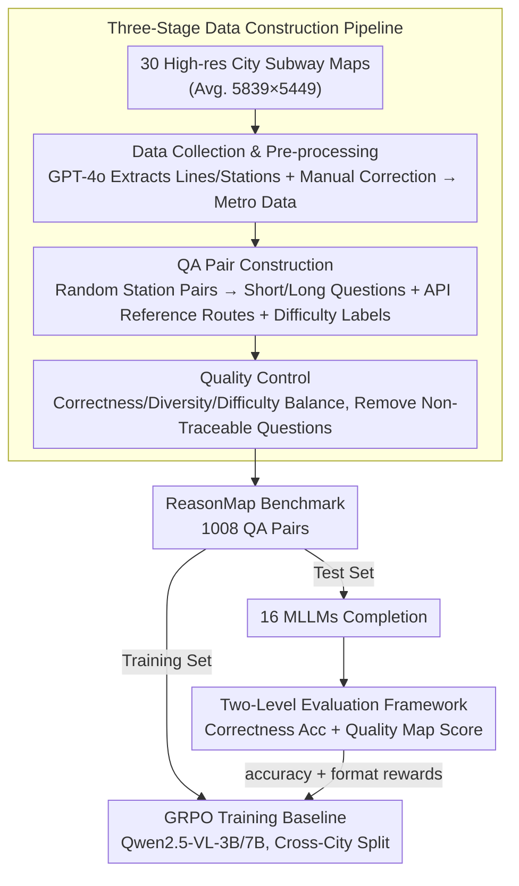

# ReasonMap: Towards Fine-Grained Visual Reasoning from Transit Maps

**Conference**: CVPR2026  
**arXiv**: [2505.18675](https://arxiv.org/abs/2505.18675)  
**Code**: [fscdc/ReasonMap](https://fscdc.github.io/ReasonMap)  
**Area**: Multimodal VLM  
**Keywords**: Multimodal Reasoning, Visual Reasoning, Spatial Reasoning, Transit Maps, Benchmark, RLHF, GRPO

## TL;DR

Ours proposes the ReasonMap benchmark, which utilizes high-resolution transit maps from 30 cities to construct 1,008 QA pairs. Through a two-level evaluation framework (correctness + quality), the fine-grained visual reasoning capabilities of 16 MLLMs are systematically evaluated. The study reveals that among open-source models, base models outperform reasoning models, whereas the opposite is true for closed-source models.

## Background & Motivation

**Insufficient MLLM Visual Reasoning Evaluation**: Existing multimodal reasoning benchmarks (MathVQA, MMMU, MathVerse) primarily evaluate symbolic/mathematical reasoning where the role of visual understanding is limited, lacking a joint evaluation of fine-grained visual comprehension and spatial reasoning.

**Coarse Granularity of Existing Benchmarks**: Benchmarks like VisuLogic and VisualPuzzles focus on fine-grained perception but do not involve spatial planning. CityBench and MapBench involve spatial reasoning but lack sufficient granularity and often rely on external tools (Map APIs) to complete tasks, bypassing genuine visual reasoning.

**Maps as Ideal Test Carriers**: Transit maps, as structured and information-dense visual products, naturally demand precise spatial interpretation capabilities, making them highly suitable for evaluating fine-grained visual reasoning.

**Questionable Performance of Reasoning Models**: While reasoning-oriented MLLMs excel in mathematical and logical tasks, their effectiveness in spatial reasoning tasks requiring visual grounding remains without systematic verification.

**Visual Dependency vs. Language Prior**: Existing research suggests that MLLMs may rely on internal knowledge priors rather than truly attending to visual inputs, necessitating verification through visual masking experiments.

**Lack of Training Baselines**: There is a lack of RL training baselines in fine-grained visual reasoning scenarios, hindering subsequent research comparisons and exploration.

## Method

### Overall Architecture

ReasonMap is a benchmark for evaluating fine-grained visual reasoning, using transit/subway maps—structured, information-dense products—as the core medium. The pipeline consists of three stages: first, collecting high-resolution maps from 30 cities and structuring them into unified Metro Data; next, automatically generating short and long QA pairs with reference routes; finally, performing quality control to remove non-visually traceable or erroneous questions. On the evaluation side, a two-level framework (correctness then quality score) is used to assess 16 MLLMs; the metrics of this same framework are adapted into rewards to drive a GRPO reinforcement learning fine-tuning baseline.

### Key Designs

**1. Three-Stage Data Construction Pipeline: Transforming Maps into Traceable, Scorable QA**

To measure genuine visual reasoning, it must be ensured that every question can be visually traced on the map and that the answers are consistent with the visual content. The pipeline is divided into three parts: (a) **Data Collection and Pre-processing**—collecting high-resolution subway maps (average $5,839 \times 5,449$, far exceeding the $<1,000 \times 1,000$ typical of existing datasets) from 30 cities across 13 countries. GPT-4o extracts lines and station names, followed by manual correction into a unified JSON format, with special cases like transfer stations or branch termini labeled separately. (b) **QA Pair Construction**—randomly selecting two stations. Short questions use one fixed template; long questions use two templates (one asking for the number of intermediate stops, one for the specific stops). Reference routes are obtained via Amap (Chinese cities) or Google Maps (other cities) APIs. Question difficulty is categorized by transfers (0 easy / 1 medium / $\ge 2$ hard), and map difficulty by line count (easy/medium/hard). Each map has a 20:15:5 quota for 40 questions total. (c) **Quality Control**—checking for correctness, diversity, and difficulty balance, with erroneous questions corrected or discarded and non-traceable routes removed.

**2. Two-Level Evaluation Framework: Assessing Accuracy and Differentiating via Quality Scores**

Simple accuracy is too coarse to distinguish subtle model differences. ReasonMap layers two levels: **Correctness (Accuracy)** verifies departure/arrival stations $\rightarrow$ existence of line names $\rightarrow$ validity of segment stations $\rightarrow$ consistency of transfer stations between segments. All must pass to be correct. **Quality (Map Score)** compares answers segment-by-segment against the reference. Matching stop1/stop2 grants 1 point, line name 2 points, and segment departure/arrival 1 point each, capped at 10 with bonus points for total correctness. Long questions add intermediate stop count evaluation (num_via_stop_score, absolute error mapped to a 4-point scale) or specific stop evaluation (via_stop_score, average of IoU and exact match truncated to 10 points). Harder samples are assigned higher weights to reflect robustness.

**3. GRPO Training Baseline: Providing an RL Starting Point for Fine-Grained Visual Reasoning**

As this field lacked an RL baseline for comparison, the paper performs reinforcement fine-tuning on Qwen2.5-VL-3B/7B-Instruct using GRPO (Group Relative Policy Optimization). Rewards consist of a binary accuracy reward based on the correctness evaluation and a format reward to encourage parsable output. Training uses AdamW, $lr=1e-6$, KL coefficient $1e-3$, 8 samples per query, global batch size 16, and a cross-city split where training and testing cities are disjoint to test generalization.

## Experiments

### Main Results

| Model | Type | Weighted Acc (Short) | Weighted Acc (Long) | Map Score (S/L) |
|---|---|---|---|---|
| Qwen2.5-VL-72B | Base | 26.65% | 24.22% | 5.09 / 8.80 |
| InternVL3-78B | Base | 25.35% | 19.62% | 4.80 / 7.50 |
| QvQ-72B-Preview | Reasoning | 9.03% | 4.25% | 1.59 / 1.55 |
| Kimi-VL-A3B-Thinking | Reasoning | 5.47% | 5.47% | 2.44 / 3.17 |
| OpenAI o3 | Reasoning | **63.02%** | **59.11%** | **9.53 / 17.96** |
| OpenAI 4o | Base | 41.15% | 42.80% | 6.84 / 13.57 |
| Gemini-2.5-Flash | Reasoning | 46.09% | 29.86% | 7.64 / 9.98 |

### Ablation Study (RL Baseline)

| Model | Short Acc Gain | Long Acc Gain | Map Score Gain (S/L) |
|---|---|---|---|
| Qwen2.5-VL-3B + RL | +2.78% | +2.51% | +1.06 / +2.39 |
| Qwen2.5-VL-7B + RL | +12.94% | +18.92% | +1.51 / +3.78 |

### Key Findings

1. **Open-source base > reasoning, closed-source reasoning > base**: Open-source reasoning models introduce visual confusion through trial-and-error in their thought process (correct then self-negated), while closed-source reasoning models possess stronger visual grounding, allowing them to self-correct within the chain of thought.
2. **Scaling Laws Remain Valid**: Larger models in the same series yield higher accuracy with fewer tokens (Qwen2.5-VL-72B short problem 26.65% vs. 8.68% for 3B).
3. **Visual Masking Experiment**: Most models' performance drops without visual input, with closed-source models seeing a more significant drop (Doubao-415 short Acc dropped 21.61%), indicating effective use of visual information. Qwen2.5-VL-3B remained nearly unchanged, suggesting smaller models rely more on language priors.
4. **RL Fine-tuning is Consistently Effective**: The 7B model Improved short problem Acc from 13.28% to 26.22% and long problems from 7.12% to 26.04% in cross-city settings, while reducing token usage.
5. **Error Type Analysis**: Dominant errors include visual confusion (misidentifying similar-colored lines), formatting errors, hallucinations (repeating correct answers or generating irrelevant content), and rejection. Multiple errors can co-occur in one response.
6. **Significant Variation Across Cities**: Even with comparable map difficulty, performance varies significantly by city, which is closely related to city popularity and station name languages.

## Highlights & Insights

- First high-resolution map benchmark for fine-grained visual reasoning, with resolutions far exceeding existing datasets ($5,839 \times 5,449$ vs. usually $<1,000 \times 1,000$).
- The two-level evaluation framework (Correctness + Quality) is elegantly designed; Map Score distinguishes model differences better than simple Acc.
- Revealed counter-intuitive performance gaps between open/closed-source base/reasoning models and provided explanations via case analysis.
- Semi-automated, scalable data construction pipeline facilitates future city expansion.
- Visual masking experiments verified the necessity of visual grounding.

## Limitations & Future Work

- Data scale is relatively small (1,008 QA pairs, 30 cities), with limited city coverage and language diversity.
- Restricted to subway/transit maps, not addressing more complex map types (e.g., road networks, floor plans).
- Reference routes depend on Google Maps/Amap APIs, which may have coverage bias.
- Evaluation relies on strict format parsing; format errors lead to automatic failure, potentially underestimating the true reasoning of some models.
- RL training baseline only validated on Qwen2.5-VL, not covering more architectures.

## Related Work & Insights

- **Multimodal Reasoning Benchmarks**: MMMU, MathVerse, VisuLogic, VisualPuzzles, VGRP-Bench — focus on mathematical/logical or abstract visual reasoning.
- **Map/Spatial Reasoning**: CityBench, MapBench, MapEval, GeoNav — spatial reasoning but coarse or reliant on external tools.
- **Reasoning MLLMs**: Kimi-VL-Thinking, QvQ, Skywork-R1V (Open Source); OpenAI o3, Gemini-2.5-Flash, Doubao-415 (Closed Source).
- **Reinforcement Fine-tuning**: Successes of GRPO in LLM reasoning are migrated to the multimodal domain.

## Rating

- Novelty: ⭐⭐⭐⭐ — First to focus on fine-grained spatial reasoning evaluation via high-res maps.
- Experimental Thoroughness: ⭐⭐⭐⭐⭐ — Comprehensive 16-model comparison + visual masking + RL baseline + error analysis.
- Writing Quality: ⭐⭐⭐⭐ — Clear structure with rigorous evaluation framework descriptions.
- Value: ⭐⭐⭐⭐ — Provides a critical benchmark for fine-grained visual reasoning with insightful open/closed-source findings.

<!-- RELATED:START -->

## Related Papers

- [\[CVPR 2026\] Chart-FR1: Visual Focus-Driven Fine-Grained Reasoning on Dense Charts](chart-fr1_visual_focus-driven_fine-grained_reasoning_on_dense_charts.md)
- [\[CVPR 2026\] Thinking Beyond Labels: Vocabulary-Free Fine-Grained Recognition using Reasoning-Augmented LMMs](thinking_beyond_labels_vocabulary-free_fine-grained_recognition_using_reasoning-.md)
- [\[CVPR 2026\] HandVQA: Diagnosing and Improving Fine-Grained Spatial Reasoning about Hands in Vision-Language Models](handvqa_diagnosing_and_improving_fine-grained_spatial_reasoning_about_hands_in_v.md)
- [\[ICLR 2026\] VisuRiddles: Fine-Grained Perception is a Primary Bottleneck for Multimodal Large Language Models in Abstract Visual Reasoning](../../ICLR2026/vlm_reasoning/visuriddles_fine-grained_perception_is_a_primary_bottleneck_for_multimodal_large.md)
- [\[NeurIPS 2025\] Unveiling Chain of Step Reasoning for Vision-Language Models with Fine-grained Rewards](../../NeurIPS2025/vlm_reasoning/unveiling_chain_of_step_reasoning_for_visionlanguage_models.md)

<!-- RELATED:END -->
